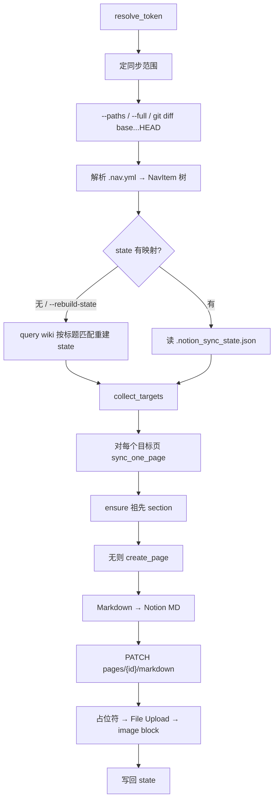

# Notion 同步

将 MkDocs wiki（以 `docs/.nav.yml` 为导航树）同步到 Notion Wiki 数据库 **Notebook**。入口脚本：[`scripts/notion_sync.py`](scripts/notion_sync.py)。

## 目标与边界

| 项 | 做法 |
|---|---|
| 源 | `docs/` + `.nav.yml`（结构以 nav 为准） |
| 目标 | Notion Wiki DB（`data_source` + 标题属性「页面」） |
| 模式 | 默认 **git diff 增量**；`--full` 全量 |
| 删除 | 本地删除只打日志，**不删** Notion 页（防误伤） |
| 日志 | 仅 stdout/stderr，不写仓库内日志文件 |
| 状态 | `.notion_sync_state.json`（gitignore；可用 `NOTION_STATE_PATH` 覆盖） |

默认 Wiki 标识（可用环境变量覆盖）：

- `NOTION_WIKI_DATABASE` — 数据库 / wiki 页面 ID  
- `NOTION_WIKI_DATA_SOURCE` — data source ID  
- `NOTION_TITLE_PROPERTY` — 标题属性名（默认 `页面`）

## 用法

```bash
# 增量（相对 HEAD~1 或 CI 的 GITHUB_EVENT_BEFORE）
just notion-sync
# 或
uv run scripts/notion_sync.py --section obsidian/

# 指定 base / 全量 / 指定文件
just notion-sync --base HEAD~5 --section obsidian/
just notion-sync-full --section obsidian/
uv run scripts/notion_sync.py --paths obsidian/Tools/Git.md

# 干跑、重建映射
uv run scripts/notion_sync.py --dry-run --section obsidian/
uv run scripts/notion_sync.py --rebuild-state --section obsidian/
```

`just update`（`just u`）在提交推送后会调用 `just ns`，把本次变更同步到 Notion。

### Token 解析顺序

不必每次传 `--token`：

1. CLI `--token`  
2. 环境变量 `NOTION_TOKEN` / `NOTION_API_KEY`  
3. wiki 根目录 `.env`（不覆盖已有环境变量）或 `.notion_token`  
4. `~/.config/notion/token`  
5. Cursor `~/.cursor/mcp.json` 中 `notionApi` 的 `NOTION_TOKEN`  

CI 建议用 secret 注入 `NOTION_TOKEN`，并把 `.notion_sync_state.json` 放进 cache，避免每次重建页面映射。

## 端到端流程



## 增量范围（性能）

日常不同步全库，而是：

1. **定 base**：`--base` → `GITHUB_EVENT_BEFORE` / `NOTION_SYNC_BASE` → `HEAD~1`；无效、`full` 或无父提交时走全量。  
2. **`git diff --name-status --find-renames base...HEAD -- docs`**，分类为：
   - `.md` / `.ipynb` → 改动 / 删除  
   - 图片等资源 → `assets_changed`  
   - `.nav.yml` → `nav_changed`（单独变更**不会**自动全量刷页；全量需 `--full`）  
3. **资源变更扩页**：在 nav 列出的 markdown 中查找引用了变更资源的页面，并入待同步集合。  
4. 不在 nav 中的变更文件会 skip。

常规小提交通常只打几页 Notion API，而不是数百页全量。

## 结构映射

- `.nav.yml` → 树：叶子为内容页（`file_rel`），中间节点为 section（无对应文件）。  
- 顶层 **Notebook** 映射为 wiki **数据库本身**；其子页挂在 `data_source_id` 或父 page 下。  
- `state.pages[nav_key] = {id, url}`：nav key（如 `obsidian/Tools/Git.md` 或 `Notebook/工具`）↔ Notion page。  
- 缺祖先时 `ensure_section` **只沿 parent 链创建缺失节点**，不全树重建。  

首次运行或 `--rebuild-state`：拉取 wiki 全部页面，按「同父下标题匹配」对齐 nav。同名页在同一父下时存在对错风险。

## Markdown 转换

源 Markdown 转为 [Notion Enhanced Markdown](https://developers.notion.com/)，再经官方 markdown 端点整页替换：

| 源（MkDocs Material） | Notion 侧 |
|---|---|
| `!!! type` admonition | `<callout>`（含自定义 `review`） |
| `??? type` 折叠块 | `<details>` |
| `=== "tab"` | `###` 小节（Notion 无同款 tabs） |
| `$...$` / `$$...$$` | Notion 行内 / 块公式 |
| wiki 内链 | `<mention-page>`（依赖 state 中的 url） |
| 外链 / 远程图 | 原样 URL |
| HTML 注释 | 剥离 |
| 部分 iframe 视频容器 | `<video>` |

额外处理：去掉 frontmatter；去掉与标题重复的 H1。

- 建页：`POST /v1/pages`，`Notion-Version: 2025-09-03`，parent 为 `data_source_id` 或 `page_id`。  
- 写正文：`PATCH /v1/pages/{id}/markdown`，`Notion-Version: 2026-03-11`，`replace_content` 整页覆盖。  
- 请求带 429 / 网络重试与请求间隔（默认 `--delay 0.35`）。

## 本地图片

外链图片可继续用 URL。**本地图不依赖已部署的 wiki 站点 URL**（避免 404）：

1. 转换时把本地图换成占位段落 `⟦LOCALIMG:n⟧`。  
2. 先写入 markdown。  
3. 扫描页面 block，找到占位 paragraph → `file_uploads` 上传 → `PATCH blocks/.../children` 插入 `image(file_upload)` → 删除占位。  

因此一页 ≈ 1 次 markdown 更新 + 每张图若干 upload / block 调用。可用 `--no-images` 跳过上传。

历史上 markdown 内的 `file-upload://` 无法可靠附着，故采用「占位 + Blocks API」方案。

## 已知取舍

- Material tabs、部分 inline admonition 无法 1:1，只能近似；Notion 无 float 布局，`inline` / `inline end` 会转成普通 callout。  
- rebuild state 时，同父同标题页面可能匹配错误。  
- 本地删除默认不 prune Notion 页面。  
- 全量且含大量本地图时仍然较慢；日常应依赖 git diff 增量。  
- 所有 `index.md` 不同步到 Notion。  
- frontmatter `tags` / `tag` 会写入 Notion multi_select 属性「标签」（可用 `NOTION_TAGS_PROPERTY` 覆盖）。  
  Wiki 对**尚未出现在 schema 中的选项**赋值会静默失败（HTTP 200 但标签仍空），同步时会先把缺失选项合并进 data source，再写页面属性。  

## 兼容性修复（admonition / ipynb）

脚本已处理这些常见失败点：

1. **缩进 / 嵌套 admonition**：支持行首空白（列表或外层块内的 `!!!`），按「标记行缩进 + 4」收集正文，并递归转换内层。  
2. **`!!!example`（无空格）** 与 **`!!! note inline end "标题"`**：放宽 header 解析。  
3. **callout 空行**：嵌套时用缩进的 `<empty-block/>`，避免空行打断 Notion 缩进树。  
4. **`.ipynb`**：按 cell 导出为 Markdown/代码块，不再把原始 JSON 写入 Notion。  
5. **表格对齐行**：GFM 的 `|:-:|` / `|:-|` / `|-:|` / `|---|` 分隔行在推送到 Notion 前会丢弃，避免多出一行对齐元数据。  

含空格的路径请用 `--paths-file`（路径含空格时 `--paths` 会被 shell 拆开）。

## 相关文件

| 路径 | 说明 |
|---|---|
| `scripts/notion_sync.py` | 同步入口（转换 + API + 增量） |
| `docs/.nav.yml` | 导航 / 页面树源 |
| `docs/assets/stylesheets/admonitions.css` | 自定义 `review` admonition |
| `.notion_sync_state.json` | 本地页面映射（勿提交） |
| `.env` / `.notion_token` | 可选本地 token（勿提交） |
| `justfile` | `notion-sync` / `notion-sync-full` / `update` 调用 |
