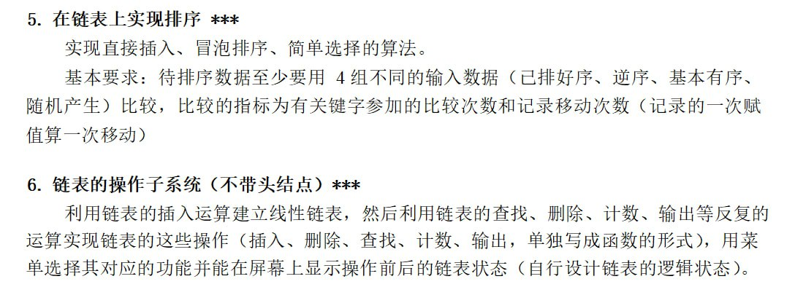
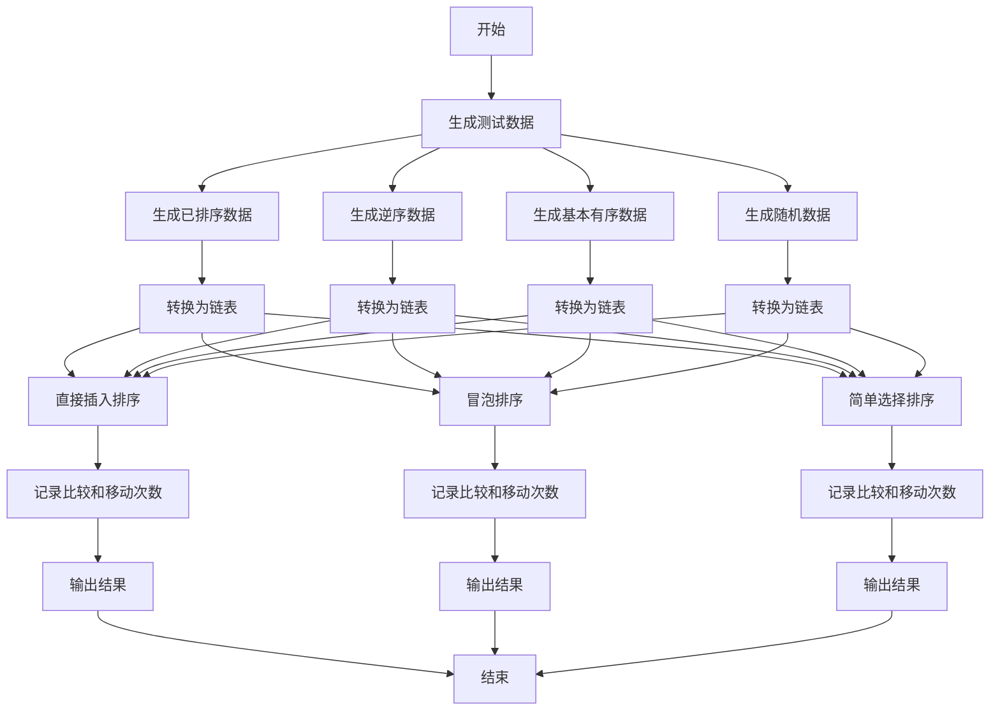
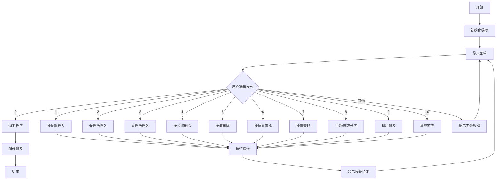

# Curriculum Design of Data Structure

## Overview

This is a curriculum design (also a *Proposition Design*) of the data structure course in Fujian University of Technology, implemented in C language.

It contains two projects:

## How it works

### `sort.c`

### `operation.c`

