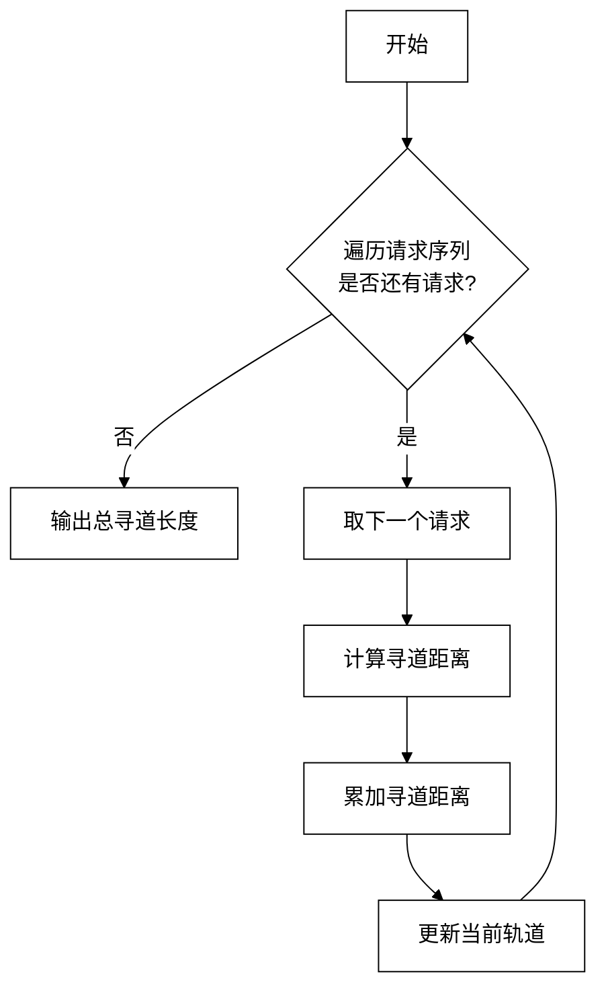

## FCFS 磁盘调度流程

- `fcfs_for_disk` 逐个按照到达顺序处理 `requests`，每次计算 `current_track` 与目标轨道的距离并累计到 `total_seek`，体现了先来先服务策略的无方向偏好特性。  

    通过`for`循环遍历请求访问磁盘的进程列表，通过当前柱面序号与下一个要访问的柱面序号的差的绝对值计算磁头的寻道距离，并累加到总寻道距离中，然后更新当前柱面序号为下一个要访问的柱面序号，直到遍历完所有请求。

- `main` 初始化磁头位置和请求序列，调用调度函数获取总寻道长度，再用 `total_seek / num_requests` 给出平均寻道时间，从整体衡量调度效率。
