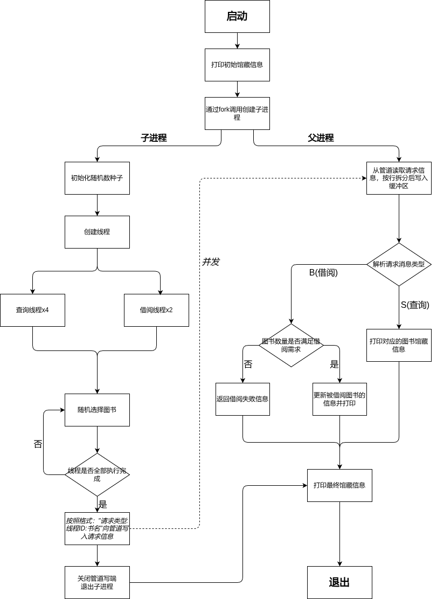
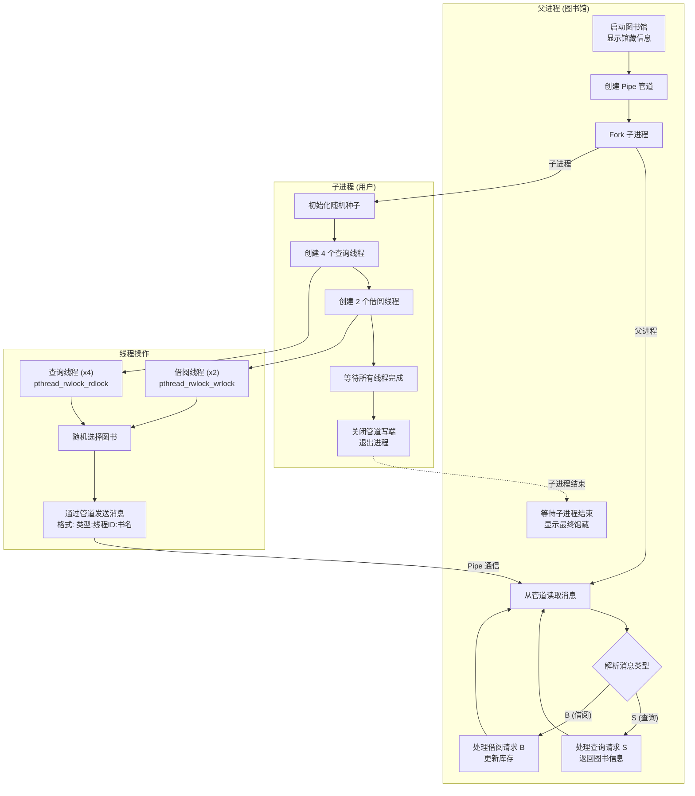

# Library Management System For Curriculum Design

## Overview

It's my OS Curriculum Design (Proposition Design) for the Operating System Course in Fujian University of Technology.

For training my C programming engineering skills, I decide to seperate the source code as a multi-file structure so that more in line with the scene of **production environment**.

For convinent to submit, I also create a copy as a singal file.

## Build and Run

The project can be built use `make`:

```bash
cd wiki/code/misc/os/library
make
./library
```

Or

```bash
make build && make run
```

Use `make clean` to clean the build artifacts:

```bash
make clean
```

For singal file version, you can use `make singal`:

```bash
make singal
./singal
```

## How it Works




