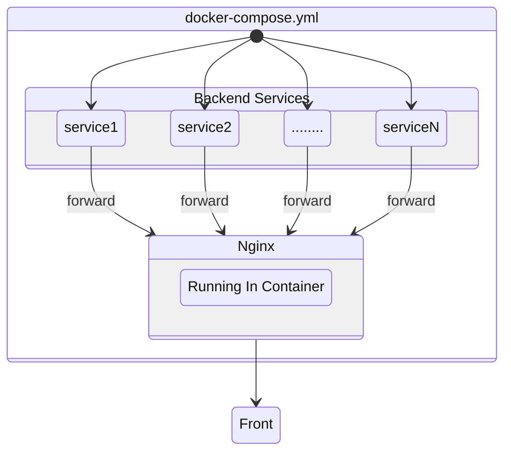
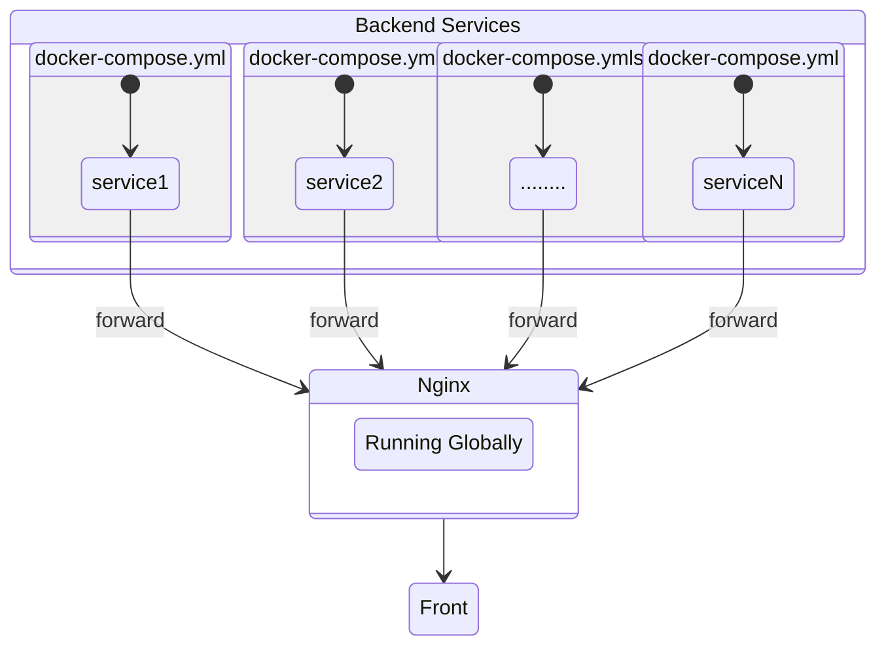

**对今年四月份写的“docker-compose + nginx快速构建个人站点”中提到的构建方式作一下改良，同时根据学到的技能添加一些自定义的玩意，2025暑假期间持续更新**

近期在[spaceship](https://www.spaceship.com/zh/)上订阅了一个新的域名；同时还订阅了一台美国硅谷的VPS用于重构我的个人站点，也可以理解为是要搭第二个个人站点。

做出这个决定的原因，一方面是想精进自己web开发的能力，多点亮一些相关的技能树；另一方面，第一个站点的服务器配置已经被我搅成一坨了——虽然还称不上💩山，但我实在是懒得整理了，干脆直接搞台新的来重构；同时新服务器的连接速度比原来那个快上不少也是一个原因，这样虽然还称不上是“方便管理”，但提供点情绪价值还是有的。

<!-- more -->

## 部署要点 & 杂项

### 部署改良

#### 改良要点

在今年的四月份我曾发布了一篇[文章](https://blog.virtualguard101.xyz/2025/04/26/web-build/)，里面主要提及了 **Docker Compose + Nginx** “一键部署”的部署方式。如果所部署的服务模块基本高度稳定，基本不需要通过暂停服务来处理集成/交付问题，或者服务之间几乎不存在依赖关系或依赖关系十分简单，那么这这种部署方式就不会有什么太大的问题；然而，倘若需要灵活的开发场景，例如需要经常性为站点添加新的服务，或是存在需要通过停止服务来进行配置的服务，同时服务与服务之间的依赖关系错综复杂，使用这样**一体化**的部署方式就需要将所有服务一并停止，这样就不利于高效开发且会降低站点的可访问性。

会降低可访问性很好理解——需要频繁地关闭服务在访问者眼里就是不稳定的表现。对于不利于高效开发的问题我们举一个例子：假设你想部署一个服务，但是这个服务需要调用另一个同样部署在该主机上的某个服务的API。为了添加这个服务，你首先需要把该主机上部署的所有服务先通过`docker compose down`停止运行，然后添加这个服务的配置；在正式部署前，你想要测试一下这个服务的功能如何，结果发现依赖的API无法调用——因为它被停止了；然后你索性就不测试了，直接`docker compose up -d`一键部署，结果配置出了问题——运气好点的话，只有新服务的容器无法运行；运气不好的话，新服务可能执行了一个未定义行为在，或者传入了一个未定义参数到API服务里，结果导致API服务也崩溃了，依赖这个API服务的其他服务也就跟着崩溃了，留下一大堆与看上去新服务毫无关联的报错信息和阅读着如💩山一般报错信息风中凌乱的你......原本只要看一个服务的报错，现在要看好几个，而且其中的依赖关系可能还很复杂！那样的报错信息懂的都懂，根本就不是给人看的。这种情况就会大大增加debug的压力，也就降低了开发效率。

解决这个问题，我们就需要通过把原来高度集中的微服务分散开来配置与部署来解决可能被“一锅端”的问题。针对普通的个人站点，实现的思路也很简单，现成服务的部署工具仍然是Docker + Nginx，但这次我们将二者独立开来。简单来说，旧版的部署方式是**将Nginx的转发服务也一并运行于Docker**，各个由Nginx转发的子服务由Docker部署，**所有的服务均配置于单个`docker-compose.yml`中**，可参考下图理解：



而我们现在的思路则是将不同服务的**部署配置**(这里特指`docker-compose.yml`)分散到各个服务独立的配置路径上进行配置并由Docker部署，最后由运行于全局环境的Nginx进行转发：



理论存在，接下来就是 ~~魔法时间~~ 实际配置了。

#### 部署流程

##### 环境配置

首先是配置环境依赖。对于服务器和域名的配置这里补充一个为服务器添加交换空间的[教程](https://www.digitalocean.com/community/tutorials/how-to-add-swap-space-on-ubuntu-22-04#step-3-creating-a-swap-file)（对于“什么是交换空间”、“交换空间有什么用”，这篇教程描述得足够详尽了），其余部分不再赘述，主要看看两个部署工具以及一些可能需要用到的工具的配置

- Docker

  - 安装
    ```bash
    curl -fsSL https://get.docker.com | bash -s docker
    sudo apt install docker-compose
    ```
  - 配置用户组
    ```bash
    sudo groupadd docker # 若尚不存在 docker 组，则需先创建
    sudo usermod -aG docker $USER
    ```
    配置完用户组后需要重启使配置生效。

- Nginx

  - 从前面的理论方案中我们知道，这次的Nginx不再运行于容器之中，而是运行在全局环境下的，因此我们需要在服务器上安装它：
    ```bash
    sudo apt install nginx
    ```
  - 将Nginx服务设置为开机自启
    ```bash
    sudo systemctl enable nginx
    ```

- certbot（SSL证书申请工具）

  - 安装
    ```bash
    sudo apt install certbot
    ```

- cron（定时任务）

  - 安装
    ```bash
    sudo apt install cron
    ```

##### 目录结构

配置完环境依赖，我们就可以开始为部署做准备了，首当其冲的自然是为不同的分别服务创建独立的配置与数据空间。

在改良理论方案中我们提到，要为每个微服务独立配置一个`docker-compose.yml`以实现不同服务之间的相互独立与互不干扰——这是与旧方案最为本质的区别；但在目录创建与管理上，我们现在所介绍的新方案则与旧方案没有太大的区别。下面是一个针对新方案的web服务目录结构案例（其中包含了两个后端服务）：

```bash
~/webservices
├── service1
│   ├── config
│   │   └── config.json
│   ├── docker-compose.yml
│   ├── fonts
│   └── icons
├── nginx -> /etc/nginx
├── scripts
│   ├── servicesManager.sh
│   └── sslrenew.sh
└── service2
    ├── docker-compose.yml
    └── data
        └── .....
```

对于我们需要部署的后端服务而言，每个微服务的配置仍然分属于各个目录中。与旧方案唯一的不同地方就是各个服务的目录下都多了一个属于它们自己的`docker-compose.yml`，相当于把旧方案中存在与web服务集群根目录的`docker-compose.yml`配置肢解到各个服务独立的目录中。

这里你可能会发现nginx的目录是一个**软链接**，关于这个我们接下来在[Nginx的配置](#Nginx的全局配置)中介绍。

##### Nginx的全局配置

对于各个服务`docker-compose.yml`的配置这里基本没有新的东西可以介绍，其中一个比较明显的区别就是网路环境变成全局的了，所以不用在额外配置`networks`参数。

最主要的区别还是在`nginx.conf`的配置上，因此我们接下来详细介绍。

由于这次的Nginx运行在全局环境下，自然也需要通过编辑全局的配置文件来驱动其执行转发服务。

>在Linux中，Nginx的全局配置`nginx.conf`位于路径`/etc/nginx`下，需要**sudo提权**才可以保存配置，如果使用vscode的远程资源管理器连接的服务器，可能无法直接在窗口上直接使用vscode编辑`nginx.conf`，比较方便且安全的解决方法有两个：一是直接在终端上提权使用vim对目标文件进行编辑 ~~那我还用vscode干什么~~；还有一个就是安装插件[Save as Root in Remote](https://marketplace.visualstudio.com/items?itemName=yy0931.save-as-root)，通过插件提权保存。
>
>同时，如果是使用vscode进行的远程连接，可以在通过在web服务集群的根目录下创建Nginx配置目录(`/etc/nginx`)和日志目录(`/var/log/nginx`)的**软链接**来提高开发效率

事实上，新方案在配置内容上只需要修改几个参数，总体的配置可能比旧方案还更好理解，下面给出一个简单的例子：

假设有一个待转发的服务运行于主机的5000端口上，那么有以下配置模板可供参考（注意需要插入到合理的位置，`nginx.conf`在安装Nginx时通常会自带一些配置；在这里，“合理的位置”**至少**指的是要在`http`模块中）：

```conf
	server {
		listen 80;
		# listen [::]:80;

		server_name  your_domain.here;
		server_tokens off;

		#配置http验证可访问
		location /.well-known/acme-challenge/ {
			root /usr/share/certbot/www;
		}
		#http跳转到https
		location / {
			return 301 https://$host$request_uri;
		}
  }

	#  server {
  #   listen 80;
	#   server_name  your_domain.here;

  #   location / {
  #     proxy_pass http://127.0.0.1:5000;
  #     proxy_set_header Host $host;
  #     proxy_set_header X-Real-IP $remote_addr;
  #     proxy_set_header X-Forwarded-For $proxy_add_x_forwarded_for;
  #     proxy_set_header X-Forwarded-Proto $scheme;
  #   }       
  #   # 强制HTTPS重定向
  #   # return 301 https://$host$request_uri;
  # }

	server {
		listen 443 ssl http2;
		server_name  your_domain.here;

		ssl_certificate /etc/letsencrypt/live/your_domina.here/fullchain.pem;
		ssl_certificate_key /etc/letsencrypt/live/your_domain.here/privkey.pem;

		location / {
			proxy_pass http://127.0.0.1:5000;
			proxy_set_header Host $host;
			proxy_set_header X-Real-IP $remote_addr;
			proxy_set_header X-Forwarded-For $proxy_add_x_forwarded_for;
			proxy_set_header X-Forwarded-Proto $scheme;
		}
  }
```

配置上的原理也很简单，简单理解就是在用户访问运行于`80`/`443`的HTTP/HTTPS服务时，将运行于`5000`端口上的后端服务作一次转发。

>⚠️注意在`docker-compose.yml`中，`port`参数`:`前的端口号才是宿主机的端口号，也就是我们需要写入`nginx.conf`的端口号

##### SSL证书申请

第一次申请的操作和定时任务的配置可以参考[这篇文章](https://kasuie.cc/article/22)

虽然已经运行了Nginx服务，但我们仍然可以通过`standalone`模式获取证书，但这需要先将Nginx服务关闭以释放`80`端口，否则会提示端口被占用而无法申请；申请完证书后再重新启动Nginx即可。当然，也可通过`webroot`模式直接申请。

>⚠️由于使用certbot时需要提权运行，所以在配置定时任务时也需要进行sudo提权：
>```bash
  sudo crontab -e
>```
>否则可能会遇到定时任务无权限运行certbot的尴尬情况

##### 服务管理脚本

当服务数量越来越多，且依赖关系越来越复杂时，每次需要配置一个服务可能就需要频繁地切换目录以及输入一些冗长的命令，这时就可以通过编写自动化脚本来 ~~偷懒~~ 提高效率。

对于逻辑比较简单（比如线性逻辑）且shell命令相对密集的系列操作，我们就可以通过编写shell脚本来解决；而对于逻辑相对复杂或对可扩展性要求较高的系列操作与功能，我们就可以交给python脚本来解决，这样不容易出错。

编写python脚本前，我们需要先安装python：
```bash
sudo apt install python3
sudo apt install pip
```

Ubuntu默认安装python3.10，如果对版本有特殊要求，可以安装一个虚拟环境管理器。这里以[uv](https://docs.astral.sh/uv/)为例：
```bash
curl -LsSf https://astral.sh/uv/install.sh | sh
```

针对我的个人站点，我为其写了一个集成了**服务注册**、**服务管理**以及**服务删除**三个主要操作的脚本集合，并将其作为一个用户自定义包使用。项目地址可见[GitHub](https://github.com/virtualguard101/WebServicesManager)或我的[个人远程仓库](https://gitea.virtualguard101.com/virtualguard101/webscripts)。
