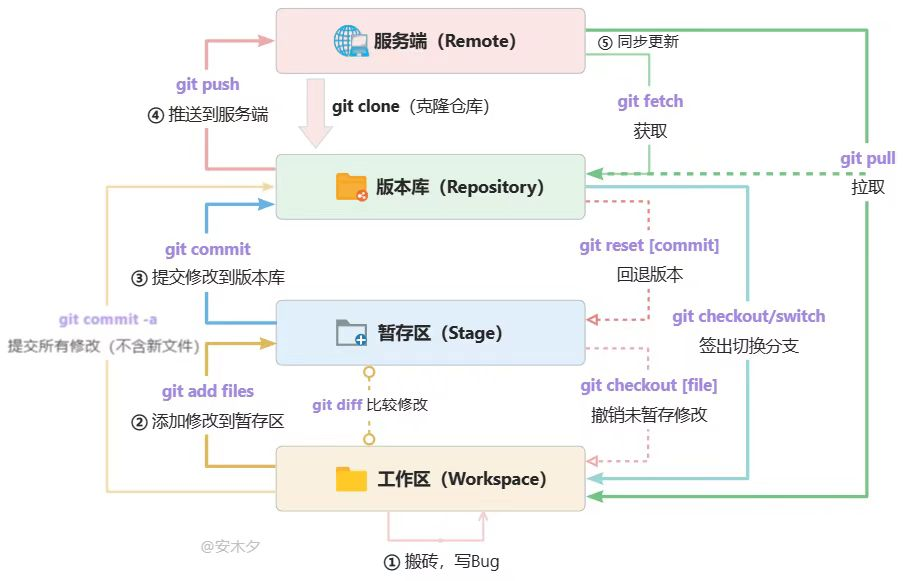

# Git

>如果是深入学习，没有什么是比[官方文档](https://git-scm.com/docs)与[官方教程(Pro Git)](https://git-scm.com/book/zh/v2)更好的参考资料了

## 配置

```bash
# config username
git config --global user.name "<name>"
```
```bash
# config email
git config --global user.email "<email>"
```
```bash
# config syntax highlight
git config --global color.ui auto
```

后续配置，如代理、默认编辑器等参数，或是需要修改其他全局配置，可通过以下命令进入编辑：
```bash
# modify global config
git config --global -e
```

## 基本使用

可参考以下两个内容：

- [Learn Git Branching](https://learngitbranching.js.org/)
>这个教程制作了精美的图形界面，将Git的各种命令通过生动形象的动画展示出来，使人能够更加深入理解不同命令的作用效果。正如进入网页后教程的欢迎辞所言，这是我目前所见过的“最好的Git教程”。

- [版本控制(Git) | Missing-Semester/CN](https://missing-semester-cn.github.io/2020/version-control/)
>除了介绍基础使用与一些有用的配置方案，这个教程还提及了Git的一些底层设计与思想以及一些拓展阅读资源。

基础使用的部分也可简单参考下图：


*图片来源于网络，仅作学习参考*

### 单分支基础版本控制

- 暂存
```bash
git add [files/paths]
```
- 提交（本地仓库）
```bash
git commit -m "[commit message]"
```

!!! note "提交信息标准化"
    关于这部分内容，与**代码格式化**与**代码注释**相同，或许有人会认为这是多此一举，但在较大的独立项目乃至团队开发中，良好的提交信息可以在遇到问题时帮助你快速**重建代码**，从而提高开发效率。

    在提交时，直接执行`git commit`命令以进入提交信息正文（提交信息详细描述）的编辑。

    对于标准化的参考，业内早已达成了一些微妙的共识，可参考文章[How to Write a Git Commit Message](https://cbea.ms/git-commit/)

- 推送（远程仓库，如GitHub、GitLab等）
```bash
git push origin [branch]
```

- 检查更改（工作区与本地仓库的差异）
```bash
git diff [files/paths]
```
没有路径参数则默认比较整个工作区。

### 多分支基础版本控制

#### 创建与切换分支

- 新建分支
```bash
git branch [branch-name] <commit-hash>
```
`<commit-hash>`默认是当前分支的最后一次提交的提交哈希值，指新建分支的起点。
也可通过符号引用（symbolic reference）创建分支：
```bash
git branch [branch-name] HEAD~3
```
这里就指将当前分支的第三个父提交作为新分支的起点

- 切换分支
```bash
git checkout [branch-name]
```

!!! note "`git checkout -b`"
    新建分支时，`git checkout -b`可以同时实现新建与切换：
    ```bash
    git checkout -b [branch-name] <commit-hash/HEAD~3>
    ```

#### 推送分支

- 远程推送
```bash
git push origin [local_branch_name]:[remote_branch_name]
```

- 本地关联远程分支
```bash
git push --set-upstream-to=origin/[remote_branch_name] [local_branch_name]
```
这样后续 push 或 pull 时不需要再指定远程分支，git会自动使用这个上游分支。

- 推送同时本地关联远程分支
```bash
git push -u origin [branch_name]
```
这样表示本地分支与远程分支的名称相同。

#### 删除分支

- 删除本地分支
```bash
git branch -d [branch_name]
```
若分支未合并，git会报错。

- 强制删除本地分支
```bash
git branch -D [branch_name]
```

- 删除远程分支
有两种方法，一种是直接删除：
```bash
git push origin -d [branch_name]
```
还有一种是推送空分支到远程：
```bash
git push origin :[branch_name]

- 删除远程分支后，更新本地分支列表（将远程仓库拉取到本地仓库）
```bash
git fetch -p
# or full name
git fetch --prune
```

#### 分支重命名

- 重命名本地分支
```bash
git branch -m [old_name] [new_name]
```

- 重命名远程分支
直接先删除远程分支：
```bash
git push origin -d [old_name]
```
然后再关联推送本地分支即可：
```bash
git push -u [new_name]
```

#### 合并分支

- 普通合并
```bash
git merge [branch_name]
```
这个命令会将分支`[branch_name]`合并至当前分支，同时保留分支**树状**的提交历史。

- 变基合并
```bash
git rebase [branch_name]
```
这个命令会将当前分支合并至分支`[branch_name]`，并将这次合并记录为`[branch_name]`的一次新的提交。若在版本控制中完全使用`rebase`进行分支合并，则会使提交历史呈**线性**分布，使得整个提交记录更加清晰简洁。

!!! note
    注意二者的区别除去提交历史上的不同还有命令上分支目标参数的区别：
    - `merge`后的分支参数是**被合并的分支**

    - `rebase`后的参数是要**合并到的目标分支**

关于这部分的内容，在[Learn Git Branching](https://learngitbranching.js.org/)中有形象的教程可供参考。

!!! warning
    使用`rebase`可能会改变提交的历史顺序与哈希值，这可能导致一些混淆问题。在团队协同开发中，一般不建议使用`rebase`进行分支合并。

无论使用哪种方法，在分支合并的过程中，若出现**冲突**，都需要用户进行手动合并。关于合并的一些操作会在后文提及。

### 文件操作

#### 自定义Git属性

在项目中，我们还可以自定义**Git属性**。这些属性可以控制 Git 在处理文件时的行为，它们通常定义于项目（Git仓库）的根目录下的`.gitattributes`文件中。

>具体用法可参考[官方教程](https://git-scm.com/book/zh/v2/%E8%87%AA%E5%AE%9A%E4%B9%89-Git-Git-%E5%B1%9E%E6%80%A7)

!!! note "`.gitattributes`模板"
    对于`.gitattribute`文件，[这个仓库](https://github.com/gitattributes/gitattributes)收录了大量的**模板**以供参考。

### 忽略文件

在`.gitignore`中定义你认为在版本控制中需要忽略的文件。通常是一些构建缓存/生成文件，或者是包含存放敏感信息的文件。

>[这个仓库](https://github.com/github/gitignore)收录有大量的`.gitignore`模板可供参考

### 移除/移动文件

要从 Git 中移除某个文件，就必须要从已跟踪文件清单中移除（确切地说，是从暂存区域移除），然后提交。 可以用 `git rm` 命令完成此项工作：
```bash
git rm [file_name]
```
!!! note
    注意其和在工作区直接执行`rm`后再提交至版本控制系统的区别：前者会将删除操作**同时作用于版本控制系统与工作区**，删除操作会被跟踪记录到版本控制系统中；后者反之，删除操作**仅作用于工作区**

除了同时从工作区和版本控制系统移除文件，我们可能还会想在工作区保留某些文件，但希望Git不要再跟踪它们（一个典型的案例就是定义`.gitignore`时忘了将某些文件移入）。

这可以通过在原命令的基础上添加`--cached`参数实现：
```bash
git rm --cached [path/file]
```

类似地，Git也提供了`git mv`命令以**显式跟踪**文件的移动/重命名操作。详情可参考[Pro Git](https://git-scm.com/book/zh/v2/Git-%e5%9f%ba%e7%a1%80-%e8%ae%b0%e5%bd%95%e6%af%8f%e6%ac%a1%e6%9b%b4%e6%96%b0%e5%88%b0%e4%bb%93%e5%ba%93)对此的表述。

## 进阶使用

上文所述，在个人独立项目及普通的版本控制（不一定非是开发环境才可用版本控制系统）基本就已经够用了。接下来，我们学习记录一些进阶的用法。

### 引用

在上文中我们有提到，提交记录在Git程序底层可用**哈希值（SHA-1）**标记，但对于人类而言，记住一串40位的16进制字符不太现实，**引用**便由此而生。

在底层，可简单将引用理解为一个**可变的**，指向提交的**指针**。例如，在使用Git时我们常见到的`master`/`main`就是一个通常**指向主分支最新提交**的一个引用。

#### HEAD

`HEAD` 是指向当前分支最新提交的引用，简单来说，它指向**我们当前所在的位置**。在使用Git时，`HEAD`使我们能够直接以它为参考（即**相对位置**）进行一系列操作。

可通过以下命令查看当前`HEAD`指向的位置：
```bash
cat .git/HEAD
```
这个命令会输出一个提交的**哈希值**（如果你改变了它的默认位置的话）。当然，默认情况下，如上面所说，`HEAD`指向当前分支的最新提交，所以默认的输出一般是这样的：
```bash
ref: refs/heads/main
```
当然，我们也可以改变`HEAD`指向的位置，最常见的例子就是**切换分支**的操作，这通常通过`git checkout`实现。大多数修改提交树的 Git 命令都是从改变 HEAD 的指向开始的。

!!! note
    事实上，对引用的应用已经涉及到[Git内部原理](https://git-scm.com/book/zh/v2/Git-%e5%86%85%e9%83%a8%e5%8e%9f%e7%90%86-Git-%e5%bc%95%e7%94%a8)的内容了，从底层原理自下而上地理解更有利于记忆这部分内容。

#### 相对引用

在实际操作中，我们可以使用诸如`^`、`~{n}`的修饰符结合`HEAD`，使得我们能够轻松地访问`HEAD`的相对位置，这就是**相对引用**。

相对引用有两种形式：

- `^`：被修饰引用的一级父亲提交
    - `^^`：二级父提交（以此类推）

- `~`：被修饰引用的一级父亲提交
    - `~~...(n个~)/~n`：$n$级父提交

这部分内容的简单运用在[Learn Git Branching](https://learngitbranching.js.org/)的高级篇关卡中有极为生动形象的动画演示。

>也可参考[git HEAD / HEAD^ / HEAD~ 的含义](https://segmentfault.com/a/1190000022506884)

```bash
# 当前提交
HEAD = HEAD~0 = HEAD^0

# 主线回溯
HEAD~1 = HEAD^ 主线的上一次提交
HEAD~2 = HEAD^^ 主线的上二次提交
HEAD~3 = HEAD^^^ 主线的上三次提交

# 如果某个节点有其他分支并入
HEAD^1 主线提交（第一个父提交）
HEAD^2 切换到了第2个并入的分支并得到最近一次的提交
HEAD^2~3 切换到了第2个并入的分支并得到最近第 4 次的提交
HEAD^3~2 切换到了第3个并入的分支并得到最近第 3 次的提交

# ^{n} 和 ^ 重复 n 次的区别 
HEAD~1 = HEAD^
HEAD~2 = HEAD^^
HEAD~3 = HEAD^^^
# 切换父级
HEAD^1~3 = HEAD~4 
HEAD^2~3 = HEAD^2^^^
HEAD^3~3 = HEAD^3^^^
```

### 撤销变更

撤销操作有两种方式：`git reset`与`git revert`


*图片来源于网络，仅作学习参考*

前者本质上是对Git引用的一个简单应用（直接把分支引用的指针回退一个版本），后者本质上是创建一个新的提交。

在执行撤销时提交树的操作效果上，这部分内容同样在[Learn Git Branching](https://learngitbranching.js.org/)的高级篇关卡中有极为生动形象的动画演示。下面记录一些使用细节。

#### `git reset`

>参考：[Git Reset and Revert Tutorial for Beginners](https://www.datacamp.com/tutorial/git-reset-revert-tutorial)


*图片来源于网络，仅作学习参考*

!!! warning
    由于`reset`直接操作分支引用的特性，若在本地版本控制使用了它，推送至远程后是不会有任何相关记录的，因此在使用它前必须慎重考虑是否符合当前的应用场景，特别是涉及到会**清除数据**的操作（如硬回退）！
    
    这里引用[Pro Git](https://git-scm.com/book/zh/v2/Git-%e5%9f%ba%e7%a1%80-%e6%92%a4%e6%b6%88%e6%93%8d%e4%bd%9c)的一个忠告：记住，在 Git 中任何 已提交 的东西几乎总是可以恢复的。甚至那些被删除的分支中的提交或使用 --amend 选项覆盖的提交也可以恢复。然而，任何你未提交的东西丢失后很可能再也找不到了。

- 软回退(`--soft`)：仅将分支引用回退至指定版本，暂存区及工作区内容保持不变

    一个简单的应用案例就是假设我们在一次提交中遗漏某些文件，那么就可以通过软回退先撤销提交，将遗漏的文件一同包含至暂存区后再次提交。

- 混合回退(`--mixed`，默认选项)：将分支引用回退至指定版本，同时将暂存区重置为指定版本的**commit状态**，工作区内容保持不变
```bash
# 假设当前状态
# HEAD: commit C
# 暂存区: 有一些修改待提交
# 工作区: 有一些修改

# 执行 reset --mixed
git reset --mixed HEAD~1

# 结果：
# HEAD: 移动到 commit B (HEAD~1)
# 暂存区: 重置为 commit B 的状态
# 工作区: 保持原来的修改不变
```
```bash
# 重置到上一个commit，暂存区变为上一个commit的状态
git reset --mixed HEAD~1

# 重置到特定commit
git reset --mixed <commit-hash>

# 重置到当前commit（相当于清空暂存区）
git reset --mixed HEAD
# 或简写为
git reset HEAD
```
!!! note
    在理解混合回退的实际效果时，有一个前提概念需要理解：commit操作是**复制**文件而不是**移动**文件！工作区、暂存区、版本库三者的存储是相互独立的。
    ```bash
    # Git实际上为每个区域维护独立的对象
    .git/
    ├── objects/     # 版本库对象存储
    ├── index        # 暂存区索引文件
    └── refs/        # 分支引用
    ```
    

    *图片来源于网络，仅作学习参考*
    
    这也就解释了为什么`git reset`可以独立操作各个区域 

- 硬回退(`--hard`)：将分支引用回退至指定版本，同时重置暂存区与工作区的所有内容，**丢弃这些位置的所有更改**

    这是一个相当危险⚠️的操作，其效果直接了当：使`HEAD`回到指定的提交节点，**删除这之后的所有内容**。

!!! note
    由于`reset`操作会直接修改提交历史，在本地执行`reset`操作后，若需推送至远程，需要添加`-f`参数强制推送，否则Git可能会阻止推送并提示*当前分支的最新提交落后于其对应的远程分支*

#### `git revert`

>参考：[Git Reset and Revert Tutorial for Beginners](https://www.datacamp.com/tutorial/git-reset-revert-tutorial)


*图片来源于网络，仅作学习参考*

与`reset`不同，`revert`不会删除任何东西，而是通过**创建一个具有原始提交反向内容的新提交**来反转原始提交引入的更改。这就是一个安全的撤销操作，因为整个过程**没有任何删除操作**，这就意味着在撤销的过程中版本库中有所记录的一切（文件更改、提交历史等）都会完好无损地保存在本地乃至远程服务器上。

关于两个撤销操作的对比，还可参考[这篇文章](https://www.geeksforgeeks.org/git-difference-between-git-revert-checkout-and-reset/)末尾的表格（其中还提及了`checkout`）

包含`checkout`的操作可视化，也可参考下图：


*图片来源于网络，仅作学习参考*

实际开发中，特别是团队协作开发，除非是在本地有比较低级的更改或错误需要撤销，一般建议使用`git revert`以确保信息可控。

## 工程应用


*图片来源于网络，仅作学习参考*

如上图所示，Git在项目开发中的实践应用主要体现在**分支使用**与**冲突合并**上；同时还有**远程仓库**的维护。

!!! tip
    需要注意，对于绝大多数商业项目乃至部分大型开源项目而言，**稳定**地运行与在遇到问题时**能够快速地定位问题**是首要保障。这也是为什么在使用版本控制系统时，对于分支的使用如此频繁的原因。

### 分支同步(`Sync fork`)

>参考：[How to sync your fork with the original repository](https://ljvmiranda921.github.io/notebook/2021/11/12/sync-your-fork/)

一般有两种同步方式：

#### GitHub一键 `Sync fork`

GitHub上的一键`Sync fork`，本质上是一个**合并操作**，即**Merge策略**：
```md
同步前状态：
上游: A ── B ── C ── D ── E (main)

Fork: A ── B ── F ── G (main)

一键Sync后：
A ── B ── F ── G ──────────┐
      \                    \
       └── C ── D ── E ──────┴── M
                              ^
                         merge commit
                     "Merge branch 'main'"
```

这在一些应用场景下会**污染提交记录**。
!!! note "**污染**的本质"
    这里指无意义的merge commit让提交历史变得难以阅读和维护(为方便理解，提交哈希使用单个大写字母替代)：
    ```bash
    * M (HEAD -> main, origin/main) Merge branch 'main' of upstream
    |\  
    | * E upstream: Add security patch
    | * D upstream: New API endpoint  
    | * C upstream: Fix critical bug
    * | G Your commit: Fix validation
    * | F Your commit: Add dashboard
    |/  
    * B Add user authentication
    * A Initial commit
    ```
    这里`M`就是一个无意义的merge commit。在实际的开发环境中，假如需要频繁进行同步操作，这样的merge commit就会严重影响代码审计（即违背前文提到的“首要保障”的第二条）：
    ```bash
    * F1G2H3I Merge branch 'main' of https://github.com/original/original into main
    |\  
    | * E4R5T6Y upstream: Update dependencies
    * | D7U8I9O Your commit: Refactor user service
    * | C3V4B5N Your commit: Add unit tests
    |\  
    * | A8S9D0F Merge branch 'main' of https://github.com/original/original into main
    |\|  
    | * Z1X2C3V upstream: Performance improvements
    | * Y4U5I6O upstream: Fix memory leak
    * | P7L8K9J Your commit: Implement caching
    * | M4N5B6V Your commit: Update UI components
    |\  
    * | Q9W8E7R Merge branch 'main' of https://github.com/original/original into main
    |\|  
    | * T6Y7U8I upstream: Security update
    | * R3E4W5Q upstream: Add logging
    * | A1S2D3F Your commit: Database optimization
    * | G6H7J8K Your commit: Add error handling
    |/  
    * L9P0O1I Add user authentication
    * M3K4J5H Initial commit
    ```

#### 手动 `rebase`

为解决前者的问题，我们可以使用`rebase`进行同步：

1. 添加上游仓库为远程源（起名为 `fork`）
```bash
git remote add fork https://github.com/com/original/original.git
```

2. 获取远程源的更新
```bash
git fetch fork
```

3. 切换到目标分支
```bash
git checkout [branch_name]
```

4. 将上游更改rebase到当前分支
```bash
git rebase fork/main
```

5. 强制推送到自己的fork
```bash
git push origin +[branch_name]
# Or -f/--force
git push origin -f [branch_name]
```

这就不会产生无意义的merge commit，同时由于`rebase`的特性，rebase的目标分支（当前分支）的提交记录就会呈**线性**分布，对比前者更加清晰简洁：
```bash
手动 rebase:
A ── B ── C ── D ── E ── F' ── G' (线性历史)
                          ^     ^
                     重写的提交 重写的提交

详细记录(git log --oneline):
G' (HEAD -> main, origin/main) Your commit: Fix validation
F' Your commit: Add dashboard
E upstream: Add security patch
D upstream: New API endpoint
C upstream: Fix critical bug
B Add user authentication
A Initial commit
```

### 清理提交记录

#### 压缩合并(`Squash Merge`)
>参考：
>
>1. [How can I merge multiple commits onto another branch as a single squashed commit? | stackoverflow](https://stackoverflow.com/questions/5308816/how-can-i-merge-multiple-commits-onto-another-branch-as-a-single-squashed-commit)
>
>2. [Git merge squash | Graphite](https://graphite.dev/guides/git-merge-squash)

实际开发中，部分提交可能只是用于临时修复一些较小的错误或进行微调，无形之中增加了提交历史的复杂度（违背“首要保障”中的第二条）。

对于这种情况，我们可以使用**压缩合并**来清理冗余的提交记录：
```bash
# Change into the target branch
git checkout main

# Merge the branch with Squash
git merge --squash [branch_name]    # except branch 'main'
```

使用`Squash Merge`时，Git不会自动创建合并提交，需要自己手动创建：
```bash
git commit -m "[Merge message]"
```
#### 交互式`rebase`(`rebase -i`)

>参考：[Beginner’s Guide to Interactive Rebasing](https://hackernoon.com/beginners-guide-to-interactive-rebasing-346a3f9c3a6d)

仔细阅读[压缩合并](#压缩合并Squash-Merge)的[参考1](https://stackoverflow.com/questions/5308816/how-can-i-merge-multiple-commits-onto-another-branch-as-a-single-squashed-commit)，可以发现其中还提到了一种将多个commit合并为一个的方法——`git rebase -i`（交互式变基）

交互式变基的操作更为复杂，但自由度极高，**可以直接对提交历史进行重新排列、编辑、删除或进行合并提交操作**，同时，它可以直接在需要清理的目标分支上进行操作（单分支操作），不需要进行跨分支操作。

使用一下命令进行**交互式变基**操作：
```bash
git rebase -i [commit-hash]

# Or use reference
git rebase -i HEAD~{n}
```
这会使默认编辑器打开一个文件，内容大致如下：
```bash
pick [commit-hash1] [commit-message2]
pick [commit-hash2] [commit-message2]
pick [commit-hash3] [commit-message3]
                   .
                   .
                   .
```
可根据文件中的提示对各个提交前的参数进行修改，例如将`pick`改为`drop`就是删除对应的提交。

保存并关闭文件后，变基会自动执行。

### 冲突合并
>参考：
>
>1. [Git冲突合并 | Stalo's Wiki](https://note.stalomeow.com/p/git/#%E5%90%88%E5%B9%B6%E5%86%B2%E7%AA%81)
>
>2. [How do I resolve merge conflicts in a Git repository? | stackoverflow](https://stackoverflow.com/questions/161813/how-do-i-resolve-merge-conflicts-in-a-git-repository)
>
>3. [Git mergetool generates unwanted .orig files | stackoverflow](https://stackoverflow.com/questions/1251681/git-mergetool-generates-unwanted-orig-files)

冲突合并可以说是团队协同开发中最常见的操作之一了。发生冲突时，一般可遵循`冲突检测` > `配置diff工具` > `解决冲突` > `继续合并`三步操作解决冲突：

1. 检测冲突
```bash
git status
```
这个命令在冲突发生时会提示冲突出现在哪些文件中

2. 配置合并工具
命令行可选择`vimdiff`进行合并，配置如下：
```bash
git config merge.tool vimdiff
git config merge.conflictstyle diff3
git config mergetool.prompt false
```
也可选择`vscode`作为合并工具：
```bash
git config --global merge.tool vscode
git config --global diff.tool vscode

# Windows Command Prompt setting
git config --global mergetool.vscode.cmd 'code --wait --merge $REMOTE $LOCAL $BASE $MERGED'
git config --global difftool.vscode.cmd 'code --wait --diff $LOCAL $REMOTE'
```
`--global`参数表示全局设置

3. 启动工具解决冲突
```bash
git mergetool
```
解决冲突后，默认情况下会将发生冲突的原始文档保存到`.orig`文件中，可通过配置关闭这个功能：
```bash
git config --global mergetool.keepBackup false
```

4. 完成合并
```bash
git merge --continue
```
若要取消合并，则把参数替换为`--abort`：
```bash
git merge --abort
```

### 常用工作流

<div class="responsive-video-container">
    <iframe src="https://player.bilibili.com/player.html?aid=561005338&bvid=BV19e4y1q7JJ&cid=846391446&p=1&autoplay=0" 
    scrolling="no" 
    border="0" 
    frameborder="no" 
    framespacing="0" 
    allowfullscreen="true"> 
    </iframe>
</div>

## 杂项/Git扩展

### LFS

>官网：[Git Large File Storage](https://git-lfs.com/)

Git LFS (Large File Storage) 是 Git 的一个扩展，用于处理大文件的版本控制。它将大文件存储在远程服务器上，而在 Git 仓库中只保存指向这些文件的指针。

- 根据官网提示安装后，使用以下命令初始化：
```bash
git lfs install
```

- 使用以下命令追踪大文件：
```bash
git lfs track "[file/*.file_extension]"
```

- 查看跟踪状态：
```bash
git lfs track
```

- 确保`.gitattributes`被追踪：
```bash
git add .gitattributes
```

- 随后即可正常使用Git进行提交与推送：
```bash
git add .
git commit -m "[commit message]"
git push origin [branch]
```

- 通过以下命令获取使用文档：
```bash
# Overview
git lfs help

# Detail
git lfs help <command>
git lfs <command> -h
```
