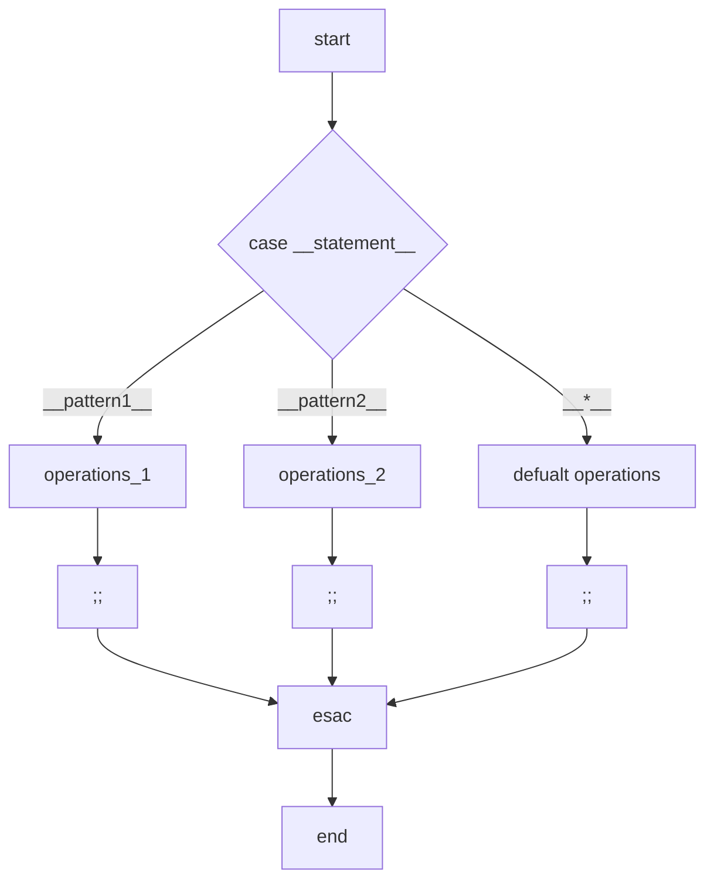

# Shell Scripting

>[The Shell Scripting Tutorial](https://www.shellscript.sh/)

!!! note
    从定义角度来看，`shell`其实应该算是一种**解释型编程语言**，之所以将其放在`tools`而不是`programming language`则是因 shell 在实际应用上作为辅助工具的使用几乎占据了其所有的应用场景；介于其糟糕的接口以及极差的代码复用性，网络上的部分观点甚至都不被认为 shell 是一个真正意义上的编程语言。对于 shell 与普通编程语言的对比，可参考[Shell scripting vs programming language | stackoverflow](https://stackoverflow.com/questions/4955686/shell-scripting-vs-programming-language)

## shebang

shebang（或 hashbang），指脚本文件开头的特殊**注释**行，用于**指定执行该脚本的解释器**：
```sh
#!/path/to/interpreter
```
语法构造上，第一个字符为`#`(hash)，第二个字符为`!`(bang)，故称为 "shebang" 或 "hashbang"。

!!! note
    注意`#!`后是解释器的**绝对路径**；`shebang`是 Unix 和类 Unix 的系统特性，在其他系统中通常不受支持或需要工具辅助支持。关于`shebang`的详细信息还可参考[Shebang (Unix) | Wikipedia](https://en.wikipedia.org/wiki/Shebang_(Unix))


## `echo` && `read`

在 shell 中，`echo`用于将文本信息输出到终端上：
```sh
echo [options] [params]
```

!!! tip
    注意下面二者的区别：
    ```sh
    # echo without double/single quote
    echo Hello World

    # echo with quote
    echo "Hello World"
    ```
    后者的`echo`将`Hello World`视为**一个**文本参数，前者的`echo`则将其视为**两个**文本参数；在前者中，无论`Hello`与`World`间存在多少个空格或是`tab`，最终在解释器眼里都是一样的操作，执行结果也就一致。

`read`则用于交互地从用户读取数据：
```sh
#!/bin/sh
echo "What's your name?"
read USER
echo "Hello, $USER"
```
同样注意引号；而这里的文本信息中还包含了特殊字符`'`，需要使用双引号。

!!! note
    在执行脚本时，输入变量的过程中则不需要再为右值添加双引号或其他转义字符，`read`会自动完成这一操作

## 变量

### 类型安全


*Source of the Image: [Stop writing shell scripts](https://samgrayson.me/essays/stop-writing-shell-scripts/)*

图片的源文章很有意思，强烈建议参考阅读。

### 赋值

注意赋值时`=`前后不能有空格：
```sh
VAR1="Hello World"

# This may get some wrong
VAR2 = "Hello World"
```
!!! warning
    上面的例子中，shell 解释器会将变量`VAR2`当作是一个名为`VAR2`的**命令**执行；自然地，后面的`=`与文本信息也就成了这个“命令”的参数。当我们尝试使用`echo`输出`VAR2`时，可能会出现如下报错：
    ```bash
    bash: VAR: command not found
    ```

同时，这时的`Hello World`就必须使用双引号引用，否则`World`就会被解释器当作变量赋值操作后需要尝试执行的**命令**。
!!! tip
    并不是所有的字符串变量都需要使用引号，当然，在使用字符串时通过引号引用是一个良好的编程习惯。

最后还需注意在引用时，`"`与`'`的区别，以以下脚本为例：
```bash
var1="Hello, $USER"
var2='Hello, $USER'

echo $var1
echo $var2
```

- 前者允许变量扩展或命令替换，因此第一个`echo`输出的结果会将`$USER`替换为变量`USER`的值

- 后者则保留完整的原始字符串

### 变量作用域

#### 未定义变量

在 shell 脚本中，若尝试访问一个**未定义**的变量：
```sh
USER=virtualguard
echo "Hello, $USOR"   # mis-spelled
```

!!! tip inline end
    可通过在脚本开头添加`set -u`解决这个的问题，这会使shell解释器在遇到未定义变量时报错；
    
    然而 shell 还有一个致命问题就是在遇到错误时默认不会中断，而是继续执行脚本的内容...🙃，这可通过在`set`后添加`-e`参数解决。

shell 解释器并不会报错，而是返回一个**空字符串**：
```bash
./var.sh
Hello, 
```
这也是 shell 最受人诟病的问题之一，因为其难以调试。

#### `export`

在使用交互式 shell（shell会话）时，可直接进行变量赋值：
```bash
NAME=virtualguard
```
但这样的变量设置存在一个问题，当我们想要在当前 shell 会话中通过脚本调用这个变量时，shell解释器并不会“设置”这个变量：
```sh
#!/bin/sh
set -u

echo "hello, $NAME"
NAME=vg
echo "hello, $NAME"
```
```bash
./test.sh
./test.sh: 行 4: NAME: 未绑定的变量
```
这是因为在执行一个shell脚本时，系统会启动一个新的shell进程来完成这一操作，这是前文中提到的**shebang**的作用效果，即**独立指定运行脚本的解释器**，从而**隔离**了脚本与当前shell会话（父进程）的环境；一旦脚本退出，对应的环境就会销毁。这也就解释了为什么shebang可以设置为任何与脚本内容对应的解释器。

!!! note inline end
    注意在设置变量（如使用`export`）时不需要在变量前添加`$`，但在获取变量值时则需要添加。

    若需要将变量名用于拼接，可使用`{}`将变量名包裹起来，注意引号：
    ```sh
    read APP
    echo "Create ${APP}.conf for config"
    touch "${APP}.conf"
    ```

熟悉 Linux 的话应该知道可使用`export`命令在当前 shell 会话设置环境变量来解决这个问题，使得变量能够传递给子进程：
```bash
export NAME
NAME=virtualguard

# Or for one step
export VAR=virtualguard
./test.sh
hello, virtualguard
hello, vg
```

!!! info
    还有两种方法：
    ```bash
    # Set the variable at the same line with executed command
    NAME=virtualguard ./test.sh  #  valid only on this command

    # Execute in current shell
    source ./test.sh  # or . ./test.sh
    ```

### 特殊变量（预设变量）

#### `$0...$9` && `$#` && `$@/$*`（参数管理）

简单来说，`$n`用于**返回当前命令的第$n$个参数**；**`$#`用于返回当前命令后传入的参数数量**；**`$@`/`$*`用于返回当前命令后传入的所有参数**。下面看一个简单的例子，有以下脚本：
```sh
#!/bin/sh
echo "This command which named $0 has called $# params just now"
echo "The first param is $1"
echo "The second one is $2"
echo "All params are $@"
```
执行这个脚本，并添加参数，得到如下结果：
```bash
./var.sh
This command which named ./var.sh has called 0 params just now
The first param is
The second one is
All params are

./var.sh "hello world"
This command which named ./var.sh has called 1 params just now
The first param is hello world
The second one is
All params are hello world

./var.sh hello world
This command which named ./var.sh has called 2 params just now
The first param is hello
The second one is world
All params are hello world
```

!!! note "`$@` vs `$*`"
    二者在参数不带引号时的效果是相同的，区别主要体现在参数被双引号包裹时：**前者会将每个参数保持为单独的实体，保留原始参数的完整性**；**后者会将所有参数合并为一个字符串，参数之间用第一个IFS(内部字段分隔符)字符分隔，默认是空格**。可参考[What is the difference between $@ and $* in shell scripts? | stackoverflow](https://stackoverflow.com/questions/2761723/what-is-the-difference-between-and-in-shell-scripts)

另外，假设我们想要使一个命令（脚本）能够传入$9$个以上的参数，可以使用`shift`命令将位置参数左移$n$位（未添加参数默认**逐个**移动：
```sh
while [[ "$#" -gt "0" ]]
do
    echo "\$1 is $1"
    shift #[n]
done
```
执行`shift`后，`$#`（参数数量）会相应减少。

#### `$?` && `$!` && `$$`（流程控制/错误检查）

`$?`用于获取最近一次命令、函数或脚本的退出状态码（exit status），通常应用于**错误检查**与**流程控制**上。

```sh
/path/to/some/command

if [[ "$?" -ne "0" ]]; then
    echo "Failure with code $?!"
else
    echo "Success! Exit with $?"
fi
```
正常情况下，执行这个脚本会返回如下信息：
```bash
./process.sh
# some operations
Success! Exit with 1
```

`$$`与`$!`用于指代进程编号

`$$`用于指代当前命令或脚本（shell 进程）的[PID](https://zh.wikipedia.org/wiki/%E8%BF%9B%E7%A8%8BID)，常用于创建**临时文件**：
```sh
TEMP_FILE="/tmp/script.$$"
touch $TEMP_FILE
```

`$!`则用于指代最近一个放入后台执行的命令的PID。

#### `$IFS`

`$IFS`（Internal Field Separator，内部字段分隔符）是 Shell 中用于确定单词边界的重要环境变量。实际应用中用于定义 shell 如何识别字段分隔符，在处理文本数据、解析输入和输出时扮演着关键角色。

`$IFS`默认为一下三个值：

- `SPACE`（空格）

- `TAB`/`'\t'`（制表符）

- `NEWLINE`/`'\n'`（换行符）

通常情况下，我们只在脚本中**临时修改**`$IFS`的值：
```sh
#!/bin/bash

# 原始 IFS 的备份
OLD_IFS=$IFS

# 将 IFS 设置为冒号，用于处理 /etc/passwd
IFS=":"
while read username password uid gid fullname homedir shell; do
    echo "用户: $username, UID: $uid, 主目录: $homedir"
done < /etc/passwd

# 恢复原来的 IFS
IFS=$OLD_IFS
```


## 转义字符

在 shell 中，部分字符具有特殊意义，如 `"` 被 shell 解释器用于定义字符串边界，会影响 shell 对文本参数的解释；`$`会使得后面包含于特殊参数列表的参数被解释等。

但在某些场景我们可能希望不希望这些字符被 shell 解释，而是直接在终端上输出它们；若尝试直接在命令或脚本中拼接它们，例如：
```bash
echo "hello, " world! ""
```

!!! note inline end
    `world`两端与`"`间是否存在空格是有区别的，前者 shell 认为这段信息有三个参数，而后者则只有一个参数，可通过`ls`命令验证这一点：
    ```bash
    ls "hello, " world! ""
    ls: 无法访问 'hello, ': 没有那个文件或目录
    ls: 无法访问 'world!': 没有那个文件或目录
    ls: 无法访问 '': 没有那个文件或目录

    ls "hello "world""
    ls: 无法访问 'hello world': 没有那个文件或目录
    ```

解释器则会将上面的文本信息解释为以下三个参数：

1. `"hello, "`

2. `world!`

3. `""`

然后输出：
```bash
hello,  world!
```
这显然不是预期的结果。

使用`\`对这类符号进行**转义**操作：
```bash
echo "hello, \"world\""
hello, "world
```

!!! note
    大部分特殊字符(e.g. `*`, `'`, etc)在`"`的包裹下不会被 shell 解释，而是直接输出：
    ```bash
    echo *
    build.py docs LICENSE mkdocs.yml overrides README.md requirements.txt scripts

    echo "*"
    *
    ```
    常用的，且被`"`包裹仍会被 shell 解释的特殊字符有 `"`、`$`、`\`。想要输出它们就需要使用转义字符


## 循环控制语句

### `for`循环

语法如下：
```sh
for __var__ in __var_list__
do
    # .....
done
```
**e.g.**

!!! note inline end
    这里的`*`就是**通配符**，表示当前路径下的所有文件和文件夹；如果对其使用转义字符(`\*`)，则会直接输出`*`本身
    ```bash
    ./test.sh
    Looping ... i is set to hello
    Looping ... i is set to 1
    Looping ... i is set to *
    Looping ... i is set to 2
    Looping ... i is set to goodbye
    ```

```sh
#!/bin/sh
set -ue

for i in 1 * goodbye
do
    echo "Looping ... i is $i"
done
```
```bash
./test.sh
Looping ... i is set to 1
Looping ... i is set to test.sh
Looping ... i is set to goodbye
```

### `while`循环

语法如下：
```sh
while [ __condition__ ]
do
    # .....
done
```

**e.g.**

- 

!!! tip inline end
    `:`表示死循环，在 shell 中还有以下方法表示死循环(表达式为“真”):

    - 使用`true`
    ```sh
    while true
    do
        # .....
    done
    ```

    - 使用数值 1(注意[ ])
    ```sh
    while [ 1 ]
    do
        # .....
    done
    ```

    - 使用字符串(注意[ ])
    ```sh
    while [ "true" ]
    do
        # .....
    done
    ```

```sh
#!/bin/sh
set -ue

while :
do
    echo "You're welcome to leave some message here, type \"^C\" to quit"
    read INPUT
    echo "You typed $INPUT"
done
```
```bash
./test.sh
You're welcome to leave some message here, type "^C" to quit
hello
You typed hello
You're welcome to leave some message here, type "^C" to quit
5
You typed 5
You're welcome to leave some message here, type "^C" to quit
bye
You typed bye
You're welcome to leave some message here, type "^C" to quit
^C
```

- 

```sh
#!/bin/sh
set -ue

while read input_text 
do
    case $input_text in
        hello)      echo English    ;;
        howdy)      echo American   ;;
        你好)       echo Chinese    ;;
        *)          echo "Unknown Language: $input_text"    ;;
    esac
done < test.txt
```
!!! tip inline end
    这个例子用于从文件中读取信息并进行匹配。其中使用了`case`语句，它的用法类似于 C 中的`switch...case...`语句，后文我们会再介绍。

假设有`test.txt`：
```txt
hello
你好
howdy
hola
```
则：
```bash
./test.sh
English
Chinese
American
Unknown Language: hola
```

## 测试(`test`) && 分支结构语句

### `test`/`[]`与`if`

在 shell 中，测试命令`test`/`[`用于评估表达式的值。在 `if`与`while` 的条件语句中最为常用。下面是 shell 中`if`的语法：

!!! note inline end
    `then`也可以与`if`语句放在不同的行中，放在同一行就必须像这样使用`;`分隔二者，以示二者不处于同一行；与其具有相反作用的操作符是`\`：
    ```bash
    [ "$FILE" -nt "/etc/passwd" ] && \
        echo "$FILE is newer than /etc/passwd"
    ```

```sh
if [ __condition__ ]; then
    # .....
elif [ __another_condition__ ]
    # .....
else
    # .....
fi
```

特别注意，`[`与`test`等效，通常都是 shell 的**内置命令**，因此其中需要评估的表达式`__condition__`是作为这个命令的**参数**传入，因此需要在`[`(`]`)与`__condition__`之间添加**空格**；

同时，表达式`__condition__`中也需要适时添加空格，以示同一表达式的不同参数。下面简单举一个例子：

!!! note inline end
    在使用测试命令进行行字符串比较时，使用`=`进行比较（部分 shell 也接受`==`）；整数比较（ shell 默认不支持浮点数计算）则需要使用`-eq`，`-ne`等参数；

    数值比较的参数就是符号描述的英文简写：如等于(equal)就是`-eq`、大于(greater than)就是`-gt`、小于等于(less or equal than)就是`-le`等；或也可使用现代 shell 的**算术扩展（`(())`）**进行表达式的计算评估，可直接使用C的算术操作符构造表达式，详情参考[Bash Reference Manual](https://www.gnu.org/software/bash/manual/bash.html#Shell-Arithmetic)或[Unix & Linux StackExchange](https://unix.stackexchange.com/questions/306111/what-is-the-difference-between-the-bash-operators-vs-vs-vs)
    
有如下`if`语句：
```sh
if [$foo = "bar" ]
```
可以看出，`$foo`与`[`间没有括号。在 shell 眼里，这段命令就会被解释为`if test$foo = "bar" ]`，即一个没有闭合的测试语句。

正确的写法应当是`if [ $foo = "bar" ]`。注意到`$foo`与`=`、`=`与`"bar"`等不同参数间也需要留有空格，这是由于需要测试命令将它们视作不同的参数以进行表达式计算，否则`test`命令会将它们视作一个整体（一个参数），无法进行表达式评估。

>简单理解就是**命令与参数之间、参数与参数之间需要具有空格**

!!! tip
    现代 shell (bash, zsh, ksh, etc.)中，支持使用**扩展`test`命令（`[[]]`）**进行表达式评估计算；但需要注意`[[]]`的本质不是命令，而是一个**特殊语法结构**！
    
    关于`[[]]`的更多信息受篇幅限制这里不多作记录，可参考[The difference between `[]` and `[[]]` | reddit](https://www.reddit.com/r/bash/comments/1e1h41q/the_difference_between_and/)和[What is the difference between the Bash operators `[[` vs `[` vs `(` vs `((`? | Unix & Linux StackExchange](https://unix.stackexchange.com/questions/306111/what-is-the-difference-between-the-bash-operators-vs-vs-vs)。简单来说，`[[]]`更容易被正确使用。

### `case`

除`if...elif...else`外另一个分支结构语句，类似与C中的`switch...case...`。语法如下：
```sh
case __statement__ in
    __pattern1__)
                # operations_1...
                ;;
    __pattern2__)
                # operations_2...
                ;;
    *)
                # defualt operations...
                ;;
esac
```
其分支结构的可视化如下：


## 反引号(`)

使用反引号在 **shell 脚本中**抓取**外部命令**的返回信息：
```sh
HTML_FILES=`find / -name "*.html" -print`
echo "$HTML_FILES" | grep "/index.html$"
echo "$HTML_FILES" | grep "/contents.html$"
```

主要观察第一行命令：

- 使用 `find` 命令从根目录 `/` 开始搜索 

- `-name "*.html"` 匹配所有以 `.html` 结尾的文件

- `-print` 输出找到的文件路径

- **反引号**(`)执行命令并将结果存储到 ``HTML_FILES`` 变量中

<!-- [ ] shell advanced: Function, Hints & Tips -->
<!-- ## 函数 -->
