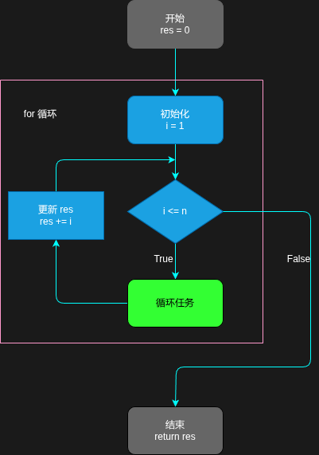
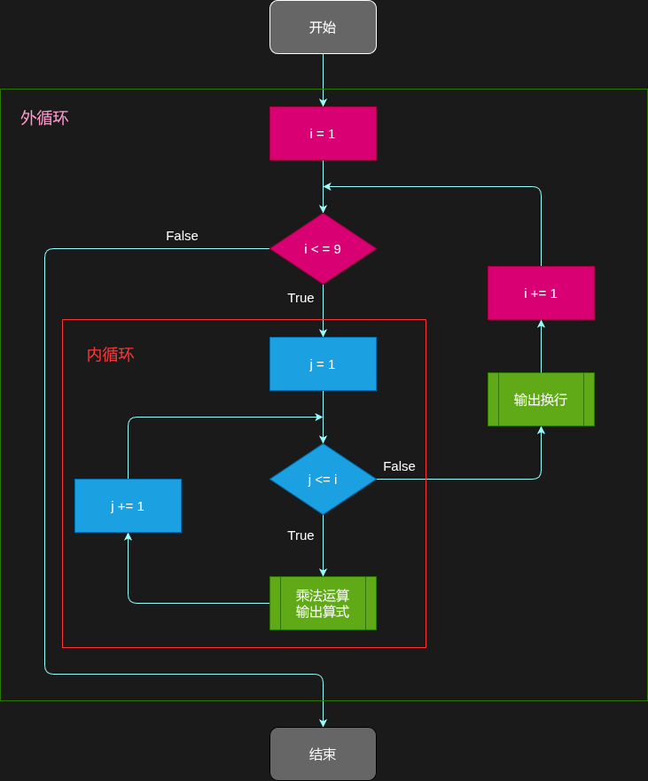
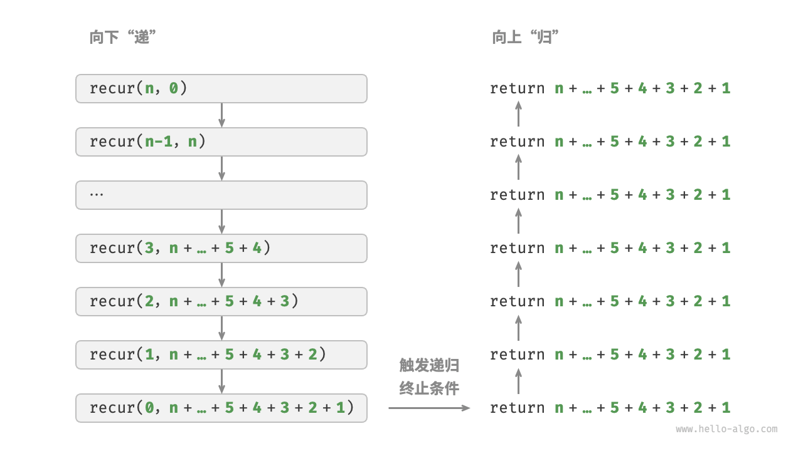

# 迭代与递归

>[迭代与递归 | Hello 算法](https://www.hello-algo.com/chapter_computational_complexity/iteration_and_recursion/){target="_blank"}
>
>[递归函数 | Composing Programs 中译版](https://composingprograms.netlify.app/1/7){target="_blank"}

在算法中，重复执行某个任务在实现某些功能时是非常常见的，通常可通过**迭代**或**递归**两种方式来实现这些重复的任务。

## 迭代

**迭代（*iteration*）**是一种重复执行某个特定任务的**控制结构**。

在迭代中，程序会在满足一定条件时**重复**执行某段代码以**更新某种状态**（这个状态本质上是一个或一系列变量的值或者某个/些**可迭代对象**的状态），直至该条件不再满足。

!!! info "可迭代对象"
    可迭代对象（*Iteratable Object*）是能够一次返回其中一个成员的对象，通常使用 `for` 循环来完成此操作，如字符串、列表、元组、集合、字典等等之类的对象都属于可迭代对象。简单来理解，任何可以循环遍历的对象都是可迭代对象。

    可迭代对象的应用几乎遍布所有高级编程语言，尤其是现代编程语言。可参考以下资料理解其概念与应用：
    
    - [Iterable object（可迭代对象）| JavaScript.INFO](https://zh.javascript.info/iterable){target="_blank"}
    - [迭代协议 | MDN Web Docs](https://developer.mozilla.org/zh-CN/docs/Web/JavaScript/Reference/Iteration_protocols){target="_blank"}
    - [隐式序列 | Composing Programs 中译版](https://composingprograms.netlify.app/4/2){target="_blank"}
    - [What exactly does "iterable" mean in Python? Why isn't my object which implements `__getitem__()` an iterable? | stackoverflow](https://stackoverflow.com/questions/32799980/what-exactly-does-iterable-mean-in-python-why-isnt-my-object-which-implement){target="_blank"}

迭代**重复**操作的本质使得**循环控制结构**成为实现其最合适的方式与形式。

### `for`循环

`for`循环是最常见的迭代形式，可迭代对象的遍历通常就可通过`for`循环完成。

!!! tip
    `for`循环适合 ==在预先知道迭代次数== 的程序中使用。

以下面的求和程序为例：

```python
def sum(n: int) -> int:
    """Sum from 1 to n"""
    res = 0
    # iteration with for loop
    for i in range(1, n + 1):
        res += i
    return res
```
??? success "可视化运行"
    <iframe width="800" height="500" frameborder="0" src="https://pythontutor.com/iframe-embed.html#code=def%20sum%28n%3A%20int%29%20-%3E%20int%3A%0A%20%20%20%20%22%22%22Sum%20from%201%20to%20n%22%22%22%0A%20%20%20%20res%20%3D%200%0A%20%20%20%20%23%20iteration%20with%20for%20loop%0A%20%20%20%20for%20i%20in%20range%281,%20n%20%2B%201%29%3A%0A%20%20%20%20%20%20%20%20res%20%2B%3D%20i%0A%20%20%20%20return%20res%0A%0Aif%20__name__%20%3D%3D%20%22__main__%22%3A%0A%20%20%20%20x%20%3D%205%0A%20%20%20%20sum%20%3D%20sum%28x%29%0A%20%20%20%20print%28sum%29&codeDivHeight=400&codeDivWidth=350&cumulative=false&curInstr=0&heapPrimitives=nevernest&origin=opt-frontend.js&py=311&rawInputLstJSON=%5B%5D&textReferences=false"> </iframe>

对于该程序而言，迭代的应用在于不断**更新**`res`的过程，以下是描述该过程的算法流程图：



### `while`循环

`while`循环与`for`循环的一个主要区别就是前者无法用于直接操作可迭代对象，但它仍然可以用于实现迭代。

还是以前面的求和函数为例，使用`while`循环实现则有：

```py
def sum(n: int) -> int:
    """Sum from 1 to n"""
    res = 0
    i = 1
    while i <= n:
        res += i
        i += 1
    return res
```
??? success "可视化运行"
    <iframe width="800" height="500" frameborder="0" src="https://pythontutor.com/iframe-embed.html#code=def%20sum%28n%3A%20int%29%20-%3E%20int%3A%0A%20%20%20%20%22%22%22Sum%20from%201%20to%20n%22%22%22%0A%20%20%20%20res%20%3D%200%0A%20%20%20%20i%20%3D%201%0A%20%20%20%20while%20i%20%3C%3D%20n%3A%0A%20%20%20%20%20%20%20%20res%20%2B%3D%20i%0A%20%20%20%20%20%20%20%20i%20%2B%3D%201%0A%20%20%20%20return%20res%0A%0Aif%20__name__%20%3D%3D%20%22__main__%22%3A%0A%20%20%20%20x%20%3D%205%0A%20%20%20%20sum%20%3D%20sum%28x%29%0A%20%20%20%20print%28sum%29&codeDivHeight=400&codeDivWidth=350&cumulative=false&curInstr=0&heapPrimitives=nevernest&origin=opt-frontend.js&py=311&rawInputLstJSON=%5B%5D&textReferences=false"> </iframe>

虽然在使用`while`循环操作可迭代对象需要更加复杂的代码，但麻烦的同时也赋予了`while`循环更高的自由度，使得其能够实现一些逻辑更加复杂的迭代。例如需要同时对两个变量进行迭代：

```py
def sum_with_product(n: int) -> int:
    """renew i twice once loop"""
    res = 0
    i = 1
    while i <= n:
        res += i
        i += 1
        i *= 2
    return res
```
??? success "可视化运行"
    <iframe width="800" height="500" frameborder="0" src="https://pythontutor.com/iframe-embed.html#code=def%20sum_with_product%28n%3A%20int%29%20-%3E%20int%3A%0A%20%20%20%20%22%22%22renew%20i%20twice%20once%20loop%22%22%22%0A%20%20%20%20res%20%3D%200%0A%20%20%20%20i%20%3D%201%0A%20%20%20%20while%20i%20%3C%3D%20n%3A%0A%20%20%20%20%20%20%20%20res%20%2B%3D%20i%0A%20%20%20%20%20%20%20%20i%20%2B%3D%201%0A%20%20%20%20%20%20%20%20i%20*%3D%202%0A%20%20%20%20return%20res%0A%0Aif%20__name__%20%3D%3D%20%22__main__%22%3A%0A%20%20%20%20x%20%3D%2010%0A%20%20%20%20sum%20%3D%20sum_with_product%28x%29%0A%20%20%20%20print%28sum%29&codeDivHeight=400&codeDivWidth=350&cumulative=false&curInstr=0&heapPrimitives=nevernest&origin=opt-frontend.js&py=311&rawInputLstJSON=%5B%5D&textReferences=false"> </iframe>

### 嵌套循环

在一些复杂场景中，可在一个循环结构中嵌套另一个循环结构来满足特定的迭代需求。最简单且经典的例子莫过于输出一个乘法口诀表：

```py
def multiplication_table() -> None:
    for i in range(1, 10):
        for j in range(1, i+1):
            print(f"{i} * {j} = {i*j}", end='\t')
        print('\n')
```
??? success "可视化运行"
    <iframe width="800" height="500" frameborder="0" src="https://pythontutor.com/iframe-embed.html#code=def%20multiplication_table%28%29%20-%3E%20None%3A%0A%20%20%20%20for%20i%20in%20range%281,%2010%29%3A%0A%20%20%20%20%20%20%20%20for%20j%20in%20range%281,%20i%2B1%29%3A%0A%20%20%20%20%20%20%20%20%20%20%20%20print%28f%22%7Bi%7D%20*%20%7Bj%7D%20%3D%20%7Bi*j%7D%22,%20end%3D'%5Ct'%29%0A%20%20%20%20%20%20%20%20print%28'%5Cn'%29%0A%0Aif%20__name__%20%3D%3D%20%22__main__%22%3A%0A%20%20%20%20multiplication_table%28%29&codeDivHeight=400&codeDivWidth=350&cumulative=false&curInstr=0&heapPrimitives=nevernest&origin=opt-frontend.js&py=311&rawInputLstJSON=%5B%5D&textReferences=false"> </iframe>

算法流程图：



!!! warning
    在使用循环嵌套时，每增加一层嵌套就会使得迭代操作的数量“提升一个维度”，同时减低代码的可读性，因此应尽量避免使用过深的嵌套。

## 递归

**递归（*recursion*）**是一种**算法策略**，通常通过函数间接或直接**调用自身**来实现。

顾名思义，递归的过程可分为两个部分：

1. **递**：==在触发**终止条件**前==，通过不断深入调用自身逻辑**简化**传入参数。
2. **归**：==在触发**终止条件**后==，程序从最深层的调用栈**逐层**释放内存空间并执行返回操作返回。

如果缺乏编程经验与计算机底层理论的知识积累，可能难以理解上面的描述。还是以在学习迭代过程中的求和算法为例，这次我们采用递归形式实现：

```py
def sum_with_recur(n: int) -> int:
    """Sum from 1 to n with recursive."""
    if n == 1:
        return 1
    return n + sum_with_recur(n - 1)
```
??? success "可视化运行"
    <iframe width="800" height="500" frameborder="0" src="https://pythontutor.com/iframe-embed.html#code=def%20sum_with_recur%28n%3A%20int%29%20-%3E%20int%3A%0A%20%20%20%20%22%22%22Sum%20from%201%20to%20n%20with%20recursive.%22%22%22%0A%20%20%20%20if%20n%20%3D%3D%201%3A%0A%20%20%20%20%20%20%20%20return%201%0A%20%20%20%20return%20n%20%2B%20sum_with_recur%28n%20-%201%29%0A%0Aif%20__name__%20%3D%3D%20%22__main__%22%3A%0A%20%20%20%20sum%20%3D%20sum_with_recur%285%29%0A%20%20%20%20print%28sum%29&codeDivHeight=400&codeDivWidth=350&cumulative=false&curInstr=0&heapPrimitives=nevernest&origin=opt-frontend.js&py=311&rawInputLstJSON=%5B%5D&textReferences=false"> </iframe>

    [全屏查看>>>](https://pythontutor.com/render.html#code=def%20sum_with_recur%28n%3A%20int%29%20-%3E%20int%3A%0A%20%20%20%20%22%22%22Sum%20from%201%20to%20n%20with%20recursive.%22%22%22%0A%20%20%20%20if%20n%20%3D%3D%201%3A%0A%20%20%20%20%20%20%20%20return%201%0A%20%20%20%20return%20n%20%2B%20sum_with_recur%28n%20-%201%29%0A%0Aif%20__name__%20%3D%3D%20%22__main__%22%3A%0A%20%20%20%20sum%20%3D%20sum_with_recur%285%29%0A%20%20%20%20print%28sum%29&cumulative=false&curInstr=0&heapPrimitives=nevernest&mode=display&origin=opt-frontend.js&py=311&rawInputLstJSON=%5B%5D&textReferences=false){target="_blank"}

像上面这样，函数在每次递归中**只调用自身一次**，使得整个递归调用链呈线性结构的递归形式，我们称之**线性递归（*Linear Recursion*）**，是最容易理解的递归形式。

可参考下图理解线性递归求和的过程：


*图片来源：[调用栈 | Hello 算法](https://www.hello-algo.com/chapter_computational_complexity/iteration_and_recursion/#1)*

除了线性递归，还有如下常见的递归形式：

### 尾递归

**尾递归（*Tail Recursion*）**是指递归调用是函数的最后一步操作，且递归调用的结果直接作为函数的返回值，没有额外的计算的递归形式。

尾递归可以被编译器优化为迭代形式（尾递归优化, TRO/TCO），从而减少栈空间的使用，避免栈溢出[^1]。

还是以求和函数为例，下面是它的尾递归版本：

```py
def tail_recur(n: int, res: int) -> int:
    """Sum from 0 to n and add with res with tail recursion"""
    if n == 0:
        return res
    return tail_recur(n - 1, res + n)
```
??? success "可视化运行"
    <iframe width="800" height="500" frameborder="0" src="https://pythontutor.com/iframe-embed.html#code=def%20tail_recur%28n%3A%20int,%20res%3A%20int%29%20-%3E%20int%3A%0A%20%20%20%20%22%22%22Sum%20from%20res%20to%20n%20with%20tail%20recursion%22%22%22%0A%20%20%20%20if%20n%20%3D%3D%200%3A%0A%20%20%20%20%20%20%20%20return%20res%0A%20%20%20%20return%20tail_recur%28n%20-%201,%20res%20%2B%20n%29%0A%0Aif%20__name__%20%3D%3D%20%22__main__%22%3A%0A%20%20%20%20sum%20%3D%20tail_recur%285,%200%29%0A%20%20%20%20print%28sum%29&codeDivHeight=400&codeDivWidth=350&cumulative=false&curInstr=0&heapPrimitives=nevernest&origin=opt-frontend.js&py=311&rawInputLstJSON=%5B%5D&textReferences=false"> </iframe>
    
    [全屏查看>>>](https://pythontutor.com/render.html#code=def%20tail_recur%28n%3A%20int,%20res%3A%20int%29%20-%3E%20int%3A%0A%20%20%20%20%22%22%22Sum%20from%20res%20to%20n%20with%20tail%20recursion%22%22%22%0A%20%20%20%20if%20n%20%3D%3D%200%3A%0A%20%20%20%20%20%20%20%20return%20res%0A%20%20%20%20return%20tail_recur%28n%20-%201,%20res%20%2B%20n%29%0A%0Aif%20__name__%20%3D%3D%20%22__main__%22%3A%0A%20%20%20%20sum%20%3D%20tail_recur%285,%200%29%0A%20%20%20%20print%28sum%29&cumulative=false&curInstr=0&heapPrimitives=nevernest&mode=display&origin=opt-frontend.js&py=311&rawInputLstJSON=%5B%5D&textReferences=false)

在上面的例子中，尾递归与线性递归的区别在于二者的求和执行点有所不同：

- 线性递归的加法操作在触发终止条件后，即在“归”的过程中**逐步**执行。
- 尾递归的加法操作则在触发终止条件前，即在“递”的过程中**逐步**执行。

可参考下图理解尾递归求和的过程：


*图片来源：[尾递归 | Hello 算法](https://www.hello-algo.com/chapter_computational_complexity/iteration_and_recursion/#2)*

### 互递归

>[互递归 | composingprograms 中译版](https://composingprograms.netlify.app/1/7#_1-7-2-%E4%BA%92%E9%80%92%E5%BD%92)

**互递归（*Mutual Recursion*）**是指两个或多个函数通过相互调用形成递归循环。例如，函数 A 调用函数 B，函数 B 又调用函数 A。

互递归常用于处理复杂的逻辑关系或状态转换，==逻辑上类似于尾递归==，但涉及多个函数。

以一个判断整数奇偶性的程序为例，在定义整数奇偶性时，考虑以下思路：
- 如果一个整数比偶数大 $1$，那么它就是奇数
- 同理，如果一个整数比奇数大 $1$，那么它就是偶数
- $0$ 是偶数

显然，前两个陈述可以形成一个判断的调用循环；而第三个陈述就可以作为一个基准条件（递归终止条件）。根据这个思路，我们就可以有以下实现：
```py
def is_even(n: int) -> bool:
    """Judge whether an integer is an even by Mutual Recursion."""
    if n == 0:
        return True
    return is_odd(n - 1)

def is_odd(n: int) -> bool:
    """Judge whether an integer is an odd by Mutual Recursion."""
    if n == 0:
        return False
    return is_even(n - 1)
```
??? success "可视化运行"
    <iframe width="800" height="500" frameborder="0" src="https://pythontutor.com/iframe-embed.html#code=def%20is_even%28n%3A%20int%29%20-%3E%20bool%3A%0A%20%20%20%20if%20n%20%3D%3D%200%3A%0A%20%20%20%20%20%20%20%20return%20True%0A%20%20%20%20return%20is_odd%28n%20-%201%29%0A%0Adef%20is_odd%28n%3A%20int%29%20-%3E%20bool%3A%0A%20%20%20%20if%20n%20%3D%3D%200%3A%0A%20%20%20%20%20%20%20%20return%20False%0A%20%20%20%20return%20is_even%28n%20-%201%29%0A%0Aif%20__name__%20%3D%3D%20%22__main__%22%3A%0A%20%20%20%20n%20%3D%205%0A%20%20%20%20print%28f%22Is%20it%20%7Bn%7D%20an%20odd%3F%20%7Bis_odd%28n%29%7D%22%29&codeDivHeight=400&codeDivWidth=350&cumulative=false&curInstr=0&heapPrimitives=nevernest&origin=opt-frontend.js&py=311&rawInputLstJSON=%5B%5D&textReferences=false"> </iframe>

    [全屏查看>>>](https://pythontutor.com/render.html#code=def%20is_even%28n%3A%20int%29%20-%3E%20bool%3A%0A%20%20%20%20if%20n%20%3D%3D%200%3A%0A%20%20%20%20%20%20%20%20return%20True%0A%20%20%20%20return%20is_odd%28n%20-%201%29%0A%0Adef%20is_odd%28n%3A%20int%29%20-%3E%20bool%3A%0A%20%20%20%20if%20n%20%3D%3D%200%3A%0A%20%20%20%20%20%20%20%20return%20False%0A%20%20%20%20return%20is_even%28n%20-%201%29%0A%0Aif%20__name__%20%3D%3D%20%22__main__%22%3A%0A%20%20%20%20n%20%3D%205%0A%20%20%20%20print%28f%22Is%20it%20%7Bn%7D%20an%20odd%3F%20%7Bis_odd%28n%29%7D%22%29&cumulative=false&curInstr=0&heapPrimitives=nevernest&mode=display&origin=opt-frontend.js&py=311&rawInputLstJSON=%5B%5D&textReferences=false)

也可以将两个函数合并为一个：
```py
def is_even(n: int) -> bool:
    if n == 0:
        return True
    else:
        if (n - 1) == 0:
            return False
        else:
            return is_even((n - 1) - 1)
```
??? success "可视化运行"
    <iframe width="800" height="500" frameborder="0" src="https://pythontutor.com/iframe-embed.html#code=def%20is_even%28n%3A%20int%29%20-%3E%20bool%3A%0A%20%20%20%20if%20n%20%3D%3D%200%3A%0A%20%20%20%20%20%20%20%20return%20True%0A%20%20%20%20else%3A%0A%20%20%20%20%20%20%20%20if%20%28n%20-%201%29%20%3D%3D%200%3A%0A%20%20%20%20%20%20%20%20%20%20%20%20return%20False%0A%20%20%20%20%20%20%20%20else%3A%0A%20%20%20%20%20%20%20%20%20%20%20%20return%20is_even%28%28n%20-%201%29%20-%201%29%0A%0Aif%20__name__%20%3D%3D%20%22__main__%22%3A%0A%20%20%20%20n%20%3D%205%0A%20%20%20%20print%28f%22Is%20it%20%7Bn%7D%20an%20odd%3F%20%7Bis_even%28n%29%7D%22%29&codeDivHeight=400&codeDivWidth=350&cumulative=false&curInstr=0&heapPrimitives=nevernest&origin=opt-frontend.js&py=311&rawInputLstJSON=%5B%5D&textReferences=false"> </iframe>

    [全屏查看>>>](https://pythontutor.com/render.html#code=def%20is_even%28n%3A%20int%29%20-%3E%20bool%3A%0A%20%20%20%20if%20n%20%3D%3D%200%3A%0A%20%20%20%20%20%20%20%20return%20True%0A%20%20%20%20else%3A%0A%20%20%20%20%20%20%20%20if%20%28n%20-%201%29%20%3D%3D%200%3A%0A%20%20%20%20%20%20%20%20%20%20%20%20return%20False%0A%20%20%20%20%20%20%20%20else%3A%0A%20%20%20%20%20%20%20%20%20%20%20%20return%20is_even%28%28n%20-%201%29%20-%201%29%0A%0Aif%20__name__%20%3D%3D%20%22__main__%22%3A%0A%20%20%20%20n%20%3D%205%0A%20%20%20%20print%28f%22Is%20it%20%7Bn%7D%20an%20odd%3F%20%7Bis_even%28n%29%7D%22%29&cumulative=false&curInstr=0&heapPrimitives=nevernest&mode=display&origin=opt-frontend.js&py=311&rawInputLstJSON=%5B%5D&textReferences=false)

!!! review
    回顾前文所介绍的，这个合并版本就相当于将这个程序的递归形式由**互递归**转化为了**尾递归**。之所以将其认定为尾递归，是因为其执行判断操作的时机**在触发递归终止条件前**。

### 树递归

**树递归（*Tree Recursion*）**是指一个函数在递归过程中调用自身多次（通常两次或更多），形如树状的分支结构。每次递归产生多个子问题，形似树的分叉。

最经典的树递归案例莫过于**斐波那契数列**：
```py
def fibonaci(n: int) -> int:
    """Fibonaci with recursion"""
    if n == 1:
        return 0
    if n == 2:
        return 1
    return fibonaci(n - 2) + fibonaci(n - 1)
```
??? success "可视化运行"
    <iframe width="800" height="500" frameborder="0" src="https://pythontutor.com/iframe-embed.html#code=def%20fibonaci%28n%3A%20int%29%20-%3E%20int%3A%0A%20%20%20%20if%20n%20%3D%3D%201%3A%0A%20%20%20%20%20%20%20%20return%200%0A%20%20%20%20if%20n%20%3D%3D%202%3A%0A%20%20%20%20%20%20%20%20return%201%0A%20%20%20%20return%20fibonaci%28n%20-%202%29%20%2B%20fibonaci%28n%20-%201%29%0A%0Aif%20__name__%20%3D%3D%20%22__main__%22%3A%0A%20%20%20%20fib%20%3D%20fibonaci%285%29%0A%20%20%20%20print%28fib%29&codeDivHeight=400&codeDivWidth=350&cumulative=false&curInstr=0&heapPrimitives=nevernest&origin=opt-frontend.js&py=311&rawInputLstJSON=%5B%5D&textReferences=false"> </iframe>

    [全屏查看>>>](https://pythontutor.com/render.html#code=def%20fibonaci%28n%3A%20int%29%20-%3E%20int%3A%0A%20%20%20%20if%20n%20%3D%3D%201%3A%0A%20%20%20%20%20%20%20%20return%200%0A%20%20%20%20if%20n%20%3D%3D%202%3A%0A%20%20%20%20%20%20%20%20return%201%0A%20%20%20%20return%20fibonaci%28n%20-%202%29%20%2B%20fibonaci%28n%20-%201%29%0A%0Aif%20__name__%20%3D%3D%20%22__main__%22%3A%0A%20%20%20%20fib%20%3D%20fibonaci%285%29%0A%20%20%20%20print%28fib%29&cumulative=false&curInstr=0&heapPrimitives=nevernest&mode=display&origin=opt-frontend.js&py=311&rawInputLstJSON=%5B%5D&textReferences=false)

可结合下图理解调用过程：


*图片来源：[递归树 | Hello 算法](https://www.hello-algo.com/chapter_computational_complexity/iteration_and_recursion/#3_1)*

由于树递归的调用栈呈现出一种形似树枝的分叉结构，故其天然地适合用于解决**分治问题**，例如在数据结构中，树递归在构建[递归对象](https://composingprograms.netlify.app/2/9)时就十分常见。

## 递归调用栈

函数的调用在内存中需要划分一定的栈帧空间，在函数调用结束并返回后这些空间会被系统释放。递归调用在系统层面的本质就是函数在调用过程中持续在调用栈帧上为“新”的函数调用分配内存空间。

以前面的线性递归求和程序为例，我们可以通过显式调用语言封装好的栈（或者自己手搓一个）来将递归问题转化为一个实际的迭代问题：
```py
def sum_in_stack(n: int) -> int:
    stack = []
    res = 0
    # 递
    for i in range(n, 0, -1):
    # 反向 range，以实现堆栈的 FILO 特性
        stack.append(i) # 入栈
    # 归
    while stack:
        # 出栈
        res += stack.pop()
    return res
```
??? success "可视化运行"
    <iframe width="800" height="500" frameborder="0" src="https://pythontutor.com/iframe-embed.html#code=def%20sum_in_stack%28n%3A%20int%29%20-%3E%20int%3A%0A%20%20%20%20stack%20%3D%20%5B%5D%0A%20%20%20%20res%20%3D%200%0A%20%20%20%20%23%20%E9%80%92%0A%20%20%20%20for%20i%20in%20range%28n,%200,%20-1%29%3A%0A%20%20%20%20%23%20%E5%8F%8D%E5%90%91%20range%EF%BC%8C%E4%BB%A5%E5%AE%9E%E7%8E%B0%E5%A0%86%E6%A0%88%E7%9A%84%20FILO%20%E7%89%B9%E6%80%A7%0A%20%20%20%20%20%20%20%20stack.append%28i%29%20%23%20%E5%85%A5%E6%A0%88%0A%20%20%20%20%23%20%E5%BD%92%0A%20%20%20%20while%20stack%3A%0A%20%20%20%20%20%20%20%20%23%20%E5%87%BA%E6%A0%88%0A%20%20%20%20%20%20%20%20res%20%2B%3D%20stack.pop%28%29%0A%20%20%20%20return%20res%0A%0Aif%20__name__%20%3D%3D%20%22__main__%22%3A%0A%20%20%20%20sum%20%3D%20sum_in_stack%285%29%0A%20%20%20%20print%28sum%29&codeDivHeight=400&codeDivWidth=350&cumulative=false&curInstr=0&heapPrimitives=nevernest&origin=opt-frontend.js&py=311&rawInputLstJSON=%5B%5D&textReferences=false"> </iframe>

    [全屏查看>>>](https://pythontutor.com/render.html#code=def%20sum_in_stack%28n%3A%20int%29%20-%3E%20int%3A%0A%20%20%20%20stack%20%3D%20%5B%5D%0A%20%20%20%20res%20%3D%200%0A%20%20%20%20%23%20%E9%80%92%0A%20%20%20%20for%20i%20in%20range%28n,%200,%20-1%29%3A%0A%20%20%20%20%23%20%E5%8F%8D%E5%90%91%20range%EF%BC%8C%E4%BB%A5%E5%AE%9E%E7%8E%B0%E5%A0%86%E6%A0%88%E7%9A%84%20FILO%20%E7%89%B9%E6%80%A7%0A%20%20%20%20%20%20%20%20stack.append%28i%29%20%23%20%E5%85%A5%E6%A0%88%0A%20%20%20%20%23%20%E5%BD%92%0A%20%20%20%20while%20stack%3A%0A%20%20%20%20%20%20%20%20%23%20%E5%87%BA%E6%A0%88%0A%20%20%20%20%20%20%20%20res%20%2B%3D%20stack.pop%28%29%0A%20%20%20%20return%20res%0A%0Aif%20__name__%20%3D%3D%20%22__main__%22%3A%0A%20%20%20%20sum%20%3D%20sum_in_stack%285%29%0A%20%20%20%20print%28sum%29&cumulative=false&curInstr=0&heapPrimitives=nevernest&mode=display&origin=opt-frontend.js&py=311&rawInputLstJSON=%5B%5D&textReferences=false)


[^1]: [你的递归调用是如何被优化的？TRO 尾递归优化！| Bilibili](https://www.bilibili.com/video/BV1Pb421Y7uP/?spm_id_from=333.337.search-card.all.click&vd_source=bf4f387b9668a681bfdcd3b4b0a3b4ee)