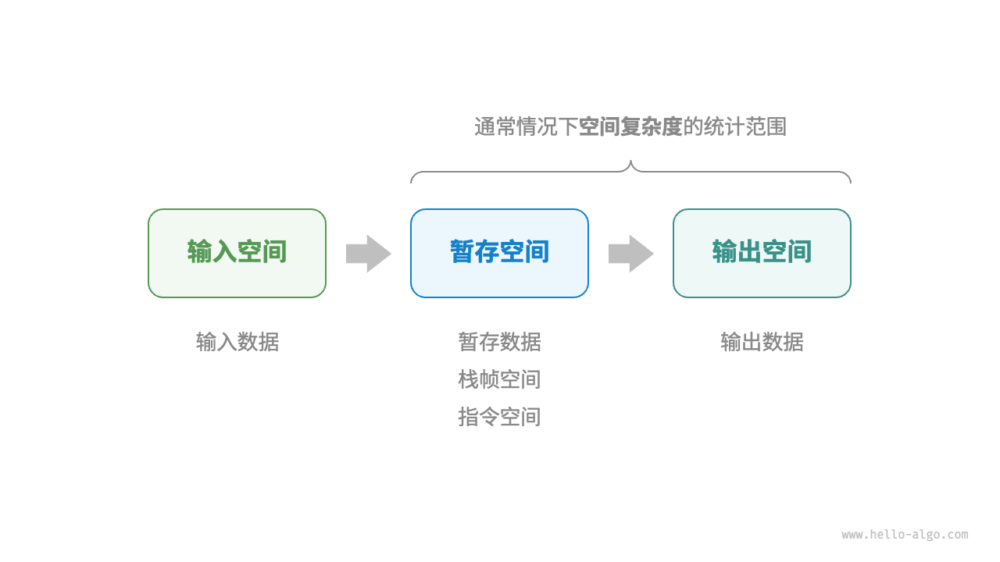

# 算法空间复杂度

>[大话数据结构【溢彩加强版】](https://zh.z-library.sk/book/21866019/61284b/%E5%A4%A7%E8%AF%9D%E6%95%B0%E6%8D%AE%E7%BB%93%E6%9E%84%E6%BA%A2%E5%BD%A9%E5%8A%A0%E5%BC%BA%E7%89%88.html){target="_blank"}
>
>[空间复杂度 | Hello 算法](https://www.hello-algo.com/chapter_computational_complexity/space_complexity/){target="_blank"}


**空间复杂度（*space complexity*）**用于衡量算法占用内存空间随着数据量变大时的增长趋势。这个概念与时间复杂度非常类似，只需将“运行时间”替换为“占用内存空间”。

## 部分定义

算法的空间复杂度通过计算算法所需的储存空间得到，计算公式记作：

$$
S(n) = O(f(n))
$$

其中 $n$ 为问题规模，$f(n)$ 为语句关于 $n$ 所占存储空间的函数。

### 算法相关空间

一般情况下，一个程序在机器上执行时，除了需要存储程序本身的指令、参数、变量和输入数据外，还需要存储对数据操作的存储单元。

一个算法在运行过程中通常需要使用以下内存空间：

*图片来源：[算法相关空间 | Hello 算法](https://www.hello-algo.com/chapter_computational_complexity/space_complexity/#241)*

其中，暂存空间中还可划分的三个部分的定义如下[^1]：

- **暂存数据**：用于保存算法运行过程中的各种常量、变量、对象等。

- ==**栈帧空间**==：用于保存调用函数的上下文数据。系统在每次调用函数时都会在栈顶部创建一个栈帧，函数返回后，栈帧空间会被**释放**。

- **指令空间**：用于保存编译后的程序指令，在实际统计中通常忽略不计。

!!! tip "输入空间"
    若输入数据所占空间只取决于问题本身，和算法无关，这样只需分析该算法在实现时所需的辅助单元即可，即**无需统计输入空间对整体空间复杂度的影响**。

以下方代码为例，其中的注释展示了程序中各个单元所对应的存储空间：
```py
class Node:
    """链表类"""
    def __init__(self, x: int):
        self.val: int = x              # 节点值
        self.next: Node | None = None  # 指向下一节点的引用

def function() -> int:
    """函数"""
    # 执行某些操作...
    return 0

def algorithm(n) -> int:  # 输入数据
    A = 0                 # 暂存数据（常量，一般用大写字母表示）
    b = 0                 # 暂存数据（变量）
    node = Node(0)        # 暂存数据（对象）
    c = function()        # 栈帧空间（调用函数）
    return A + b + c      # 输出数据
```

### 推算方法

> [推算方法 | Hello 算法](https://www.hello-algo.com/chapter_computational_complexity/space_complexity/#242)

空间复杂度的推算方法与时间复杂度大致相同，只需将统计对象从“操作数量”转为“使用空间大小”。

而与时间复杂度不同的是，我们通常只关注最差空间复杂度。这是因为内存空间是一项硬性要求，我们必须确保在所有输入数据下都有足够的内存空间预留。

==计算递归函数的空间复杂度时，需要注意统计栈帧空间。==

!!! tip
    假设有两个实现相同功能的程序，一个使用**递归**，一个使用**迭代**，且时间复杂度相同；则递归版本的空间复杂度（$\geqslant O(\log n)$，有尾递归优化时可达 $O(1)$）在大多数情况下要比迭代的空间复杂度（基本为 $O(1)$）高阶。

    以[迭代与递归](https://wiki.virtualguard101.com/notes/dsa/anal/iter_and_recu/)中贯穿大半个文章的求和程序为例，无论是迭代还是线性/尾递归还是迭代的版本，几者的时间复杂度都是 $O(n)$；
    
    但递归在空间复杂度上还需计算函数递归调用时消耗的栈帧空间（这里递归版本均为 $O(n)$，==Python 不支持尾递归优化==）；
    
    **而迭代版本执行时所需的辅助空间相对于输入数据量而言是个常数，故其为 ==原地工作==，即算法空间复杂度为 $O(1)$**。

### 常见类型

> [常见类型 | Hello 算法](https://www.hello-algo.com/chapter_computational_complexity/space_complexity/#243)

## 时间复杂度与空间复杂度的权衡

实际应用中，往往很难做到同时优化算法的时间复杂度与空间复杂度，二者通常**此消彼长**。

通常情况下，时间会比空间更加宝贵，因此“以时间换空间”的策略会更加常用一些。


[^1]: [算法相关空间 | Hello 算法](https://www.hello-algo.com/chapter_computational_complexity/space_complexity/#241)