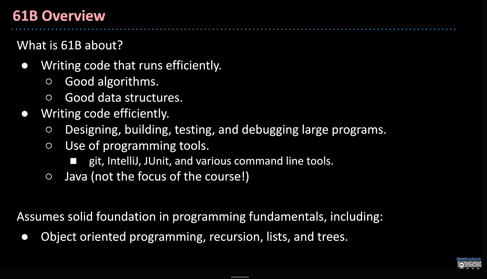

# UCB CS61B(Spring 2021) 学习要点

[CS61B: Data Structures and Algorithms-课程简介 | csdiy](https://csdiy.wiki/%E6%95%B0%E6%8D%AE%E7%BB%93%E6%9E%84%E4%B8%8E%E7%AE%97%E6%B3%95/CS61B/)

*图片来源: [cs61b lec1 2021 intro(slide) | UCB CS 61B Data Structures, Spring 2021](https://docs.google.com/presentation/d/1cMb1ojgb5_g5GMPCKLwOrCZeB-tYd86eOy6ALrrt7zQ/edit?slide=id.g395d4eef0_06#slide=id.g395d4eef0_06)*

!!! info
    CS61 系列的第二门课程，注重数据结构与算法的设计，同时让学生有机会接触上千行的工程代码，通过 Java 初步领会软件工程的思想。

    课程主要分为三个部分:

    1. **Java 入门(*Programming Intensive Introduction to Java*)**

    2. **数据结构(*Data Structures*)**

    3. **算法与软件工程(*Algorithms and Software Engineering*)**

!!! tip
    与[设计模式](https://zh.z-library.sk/book/25052620/9ba3f8/%E5%A4%A7%E8%AF%9D%E8%AE%BE%E8%AE%A1%E6%A8%A1%E5%BC%8Fjava%E6%BA%A2%E5%BD%A9%E5%8A%A0%E5%BC%BA%E7%89%88.html)并行食用体验更佳，可进一步提升对软件工程思想的理解与应用能力。

## 课程资源

- [课程主页(Spring 2021) | CS 61B Data Structures, Spring 2021](https://sp21.datastructur.es/index.html)

- [课程讲义 | Hug61B(Old)](https://joshhug.gitbooks.io/hug61b/content/chap1/chap11.html)

- [课程讲义 | CS61B Textbook(New)](https://cs61b-2.gitbook.io/cs61b-textbook/1.-introduction)

<!-- 

    🚧前方施工中🚧

 -->
