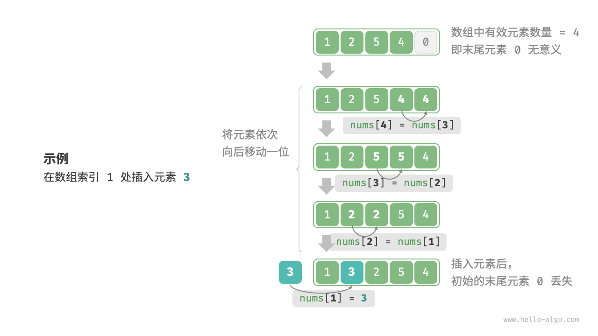

# 顺序表

## 定义

顺序表（*Sequence List*），即**线性表的顺序存储结构**，用一组地址**连续的存储单元**依次存储线性表中的数据元素，从而使得逻辑上相邻的两个元素在物理位置上也相邻，==通常基于**数组**实现==。


*图片来源：[数组 | Hello 算法](https://www.hello-algo.com/chapter_array_and_linkedlist/array/)*

!!! important "数组 vs 顺序表"
    **数组（*Array*）**：

    - 更倾向于一个**具象且底层**的概念，==是物理存储结构==，几乎是每一个高级编程语言中**原生**的数据结构（包括底层的 C）

    - 各个编程语言的封装有所差异，概念上往往**只关注储存和索引**

    **顺序表（*Sequence List*）**：

    - 偏**抽象**一些，==是**抽象数据类型/逻辑结构**==

    - **在数据结构中**是一个通用的概念，通常封装一些基本操作（如动态扩容、插入、删除等）

    ==顺序表在本质上可看作是数组，其“顺序存储”的特性在编程语言中通常基于数组实现==，故二者的数据结构特征基本相同：如连续存储、随机访问（时间复杂度为 $O(1)$）等；因此二者在大多数情况下都可理解为同一个东西。

!!! tip
    - 数据结构首先是[**抽象数据类型（*ADT, Abstract Data Type*）**](https://www.geeksforgeeks.org/dsa/abstract-data-types/){target="_blank"}：定义元素组织、操作集合与复杂度；其实现依语言选取（数组/链表/哈希/树等），同一 ADT 可有多种实现与权衡。

    

    - 编程语言与数据结构中的某些概念之间具有一些微妙的关系。无论是上面提到的顺序表还是后面的各种线性表（如栈、队列等），其在数据结构中的概念都是**抽象的逻辑结构**，在实际应用中都需要基于不同编程语言中对应的封装来实现，理解二者之间的区别与联系对于进一步理解数据结构的抽象概念是学习过程中可能会遭遇到的重难点。

## 常用操作

*由于顺序表的实现基于数组，且在形式上没有更加复杂的结构，若无特殊说明，下文中提到的"数组"基本就是指代"顺序表"。*

### 初始化

数组的初始化分为**无初始值**与**给定初始值**两种方式。在未指定初始值的情况下，大多数编程语言会将数组元素的值初始化为 $0$。

### 访问元素

数组元素的存储基于连续的内存空间，这意味着寻址会非常容易——只需记录数组中的首个元素的地址，其余元素的地址均可通过它们与首元素的**地址偏移量**得出，这个偏移量就是数组的**元素索引**。

连续的物理空间存储（这里特指数组，只有数组具有“连续物理空间”这个概念，但这不妨碍数组能够实现顺序表的逻辑结构）使得数组的访问效率极高，==能够在 $O(1)$ 时间内**随机访问**其中的任一元素==：

=== "Python"
    ```py
    def array_access(nums: list[int]) -> int:
        """随机访问元素"""
        random_index = random.randint(0, len(nums) - 1)
        random_num = nums[random_index]
        return random_num
    ```
=== "C++"
    ```cpp
    /** 
    * @brief 随机访问数组元素
    * @param nums 数组
    * @param size 数组大小
    * @return 随机访问的元素
    */
    int array_random_access(int *nums, int size) {
      int random_index = rand() % size;
      int res = nums[random_index];
      return res;
    }
    ```

### 插入元素

由于数组元素储存的连续性，元素与元素之间没有可以用于存放数据的余地，因此，==想要在数组中插入一个元素，就需要将该元素后的所有元素都**向后移动一位**，然后再重新分配元素索引==：


*图片来源：[数组-插入元素 | Hello 算法](https://www.hello-algo.com/chapter_array_and_linkedlist/array/#3)*

=== "Python"
    ```py
    def array_insert(nums: list[int], num: int, index: int) -> None:
        """将 num 插入 nums 的 index 处
        """
        for i in range(len(nums) - 1, index, -1):
            # 从右往左向后移动数组元素，搬运区间 [index + 1, len(nums) - 1]
            nums[i] = nums[i - 1]
        nums[index] = num
    ```
=== "C++"
    ```cpp
    /**
    * @brief 将 num 插入 nums 的 index 处
    * @param nums 静态数组
    * @param size 数组大小
    * @param num 插入的元素
    * @param index 插入的位置
    */
    void static_array_insert(int *nums, int size, int num, int index) {
        if (index < 0 || index > size) {
            throw std::out_of_range("Index out of range");
        }
        for (int i = size - 1; i > index; i--) {
            nums[i] = nums[i - 1];
        }
        nums[index] = num;
    }
    ```

有一点需要注意的是，==在定长数组中==，这样的不加修饰的插入算法会导致最后一个元素在插入后**溢出**，从而丢失数据，解决的方法是在移动元素前先对原数组执行**扩容操作**：
=== "Python"
    ```py
    def array_insert_improve(nums: list[int], num: int, index: int) -> None:
        """将 num 插入 nums 的 index 处，插入前执行扩容操作"""
        if index < 0 or index > len(nums):
            raise IndexError("Index out of range")
        nums.append(0)  # 先扩一位
        for i in range(len(nums) - 1, index, -1):
            # 从右往左向后移动数组元素，搬运区间 [index + 1, len(nums) - 1]
            nums[i] = nums[i - 1]
        nums[index] = num
    ```
=== "C++"
    ```cpp
    /**
    * @brief 将 num 插入 nums 的 index 处
    * @param nums 动态数组
    * @param num 插入的元素
    * @param index 插入的位置
    */
    void array_insert(std::vector<int> &nums, int num, int index) {
        if (index < 0 || index > nums.size()) {
            throw std::out_of_range("Index out of range");
        }
        nums.push_back(0);
        for (int i = nums.size() - 1; i > index; i--) {
            nums.at(i) = nums.at(i - 1);
        }
        nums.at(index) = num;
    }
    ```

??? success "可视化运行"
    <iframe width="800" height="500" frameborder="0" src="https://pythontutor.com/iframe-embed.html#code=def%20array_insert_improve%28nums%3A%20list%5Bint%5D,%20num%3A%20int,%20index%3A%20int%29%20-%3E%20None%3A%0A%20%20%20%20%22%22%22%E5%B0%86%20num%20%E6%8F%92%E5%85%A5%20nums%20%E7%9A%84%20index%20%E5%A4%84%EF%BC%8C%E6%8F%92%E5%85%A5%E5%89%8D%E6%89%A7%E8%A1%8C%E6%89%A9%E5%AE%B9%E6%93%8D%E4%BD%9C%22%22%22%0A%20%20%20%20if%20index%20%3C%200%20or%20index%20%3E%20len%28nums%29%3A%0A%20%20%20%20%20%20%20%20raise%20IndexError%28%22Index%20out%20of%20range%22%29%0A%20%20%20%20nums.append%280%29%20%20%23%20%E5%85%88%E6%89%A9%E4%B8%80%E4%BD%8D%0A%20%20%20%20for%20i%20in%20range%28len%28nums%29%20-%201,%20index,%20-1%29%3A%0A%20%20%20%20%20%20%20%20%23%20%E4%BB%8E%E5%8F%B3%E5%BE%80%E5%B7%A6%E5%90%91%E5%90%8E%E7%A7%BB%E5%8A%A8%E6%95%B0%E7%BB%84%E5%85%83%E7%B4%A0%EF%BC%8C%E6%90%AC%E8%BF%90%E5%8C%BA%E9%97%B4%20%5Bindex%20%2B%201,%20len%28nums%29%20-%201%5D%0A%20%20%20%20%20%20%20%20nums%5Bi%5D%20%3D%20nums%5Bi%20-%201%5D%0A%20%20%20%20nums%5Bindex%5D%20%3D%20num%0A%0Aif%20__name__%20%3D%3D%20%22__main__%22%3A%0A%20%20%20%20arr%20%3D%20%5B1,%202,%204,%205%5D%0A%20%20%20%20array_insert_improve%28arr,%203,%202%29&codeDivHeight=400&codeDivWidth=350&cumulative=false&curInstr=0&heapPrimitives=nevernest&origin=opt-frontend.js&py=311&rawInputLstJSON=%5B%5D&textReferences=false"> </iframe>

    [全屏查看>>>](https://pythontutor.com/render.html#code=def%20array_insert_improve%28nums%3A%20list%5Bint%5D,%20num%3A%20int,%20index%3A%20int%29%20-%3E%20None%3A%0A%20%20%20%20%22%22%22%E5%B0%86%20num%20%E6%8F%92%E5%85%A5%20nums%20%E7%9A%84%20index%20%E5%A4%84%EF%BC%8C%E6%8F%92%E5%85%A5%E5%89%8D%E6%89%A7%E8%A1%8C%E6%89%A9%E5%AE%B9%E6%93%8D%E4%BD%9C%22%22%22%0A%20%20%20%20if%20index%20%3C%200%20or%20index%20%3E%20len%28nums%29%3A%0A%20%20%20%20%20%20%20%20raise%20IndexError%28%22Index%20out%20of%20range%22%29%0A%20%20%20%20nums.append%280%29%20%20%23%20%E5%85%88%E6%89%A9%E4%B8%80%E4%BD%8D%0A%20%20%20%20for%20i%20in%20range%28len%28nums%29%20-%201,%20index,%20-1%29%3A%0A%20%20%20%20%20%20%20%20%23%20%E4%BB%8E%E5%8F%B3%E5%BE%80%E5%B7%A6%E5%90%91%E5%90%8E%E7%A7%BB%E5%8A%A8%E6%95%B0%E7%BB%84%E5%85%83%E7%B4%A0%EF%BC%8C%E6%90%AC%E8%BF%90%E5%8C%BA%E9%97%B4%20%5Bindex%20%2B%201,%20len%28nums%29%20-%201%5D%0A%20%20%20%20%20%20%20%20nums%5Bi%5D%20%3D%20nums%5Bi%20-%201%5D%0A%20%20%20%20nums%5Bindex%5D%20%3D%20num%0A%0Aif%20__name__%20%3D%3D%20%22__main__%22%3A%0A%20%20%20%20arr%20%3D%20%5B1,%202,%204,%205%5D%0A%20%20%20%20array_insert_improve%28arr,%203,%202%29&cumulative=false&curInstr=0&heapPrimitives=nevernest&mode=display&origin=opt-frontend.js&py=311&rawInputLstJSON=%5B%5D&textReferences=false)

### 删除元素

与插入同理，删除元素就需要将待删除元素后的所有元素都**向前移动一位**：

*图片来源：[数组-删除元素 | Hello 算法](https://www.hello-algo.com/chapter_array_and_linkedlist/array/#4)*

=== "Python"
    ```py
    def array_remove(nums: list[int], index: int) -> None:
        """删除 nums 中 索引为 index 的元素（元素左移覆盖待删除元素）"""
        for i in range(index, len(nums) - 1):
            # 从左往右移动数组元素，搬运区间为 [index + 1, len(nums)]
            nums[i] = nums[i + 1]
    ```
=== "C++"
    ```cpp
    /**
    * @brief 删除 nums 的 index 处的元素
    * @param nums 静态数组
    * @param size 数组大小
    * @param index 删除的位置
    */
    void static_array_remove(int *nums, int size, int index) {
        if (index < 0 || index > size) {
            throw std::out_of_range("Index out of range");
        }
        for (int i = index; i < size - 1; i++) {
            nums[i] = nums[i + 1];
        }
        // 填充哨兵值
        nums[size - 1] = 0;
    }
    ```

同样的，这段原始算法在不加以修饰的情况下有一个比较明显的问题，就是由于数组长度并未缩短，删除操作后会导致最后一个元素的冗余。解决方法也很简单——直接移除最后一个元素即可：

!!! note
    若在“定长数组”模型中，通常保留长度不变并只左移，尾部可填充哨兵值。
=== "Python"
    ```py
    def array_remove_improve(nums: list[int], index: int) -> None:
        """删除 nums 中 索引为 index 的元素"""
        if index < 0 or index >= len(nums):
            raise IndexError("Index out of range")
        for i in range(index, len(nums) - 1):
            # 从左往右移动数组元素，搬运区间为 [index + 1, len(nums)]
            nums[i] = nums[i + 1]
        nums.pop()
    ```
=== "C++"
    ```cpp
    /**
    * @brief 删除 nums 的 index 处的元素
    * @param nums 动态数组
    * @param index 删除的位置
    */
    void array_remove(std::vector<int> &nums, int index) {
        if (index < 0 || index > nums.size()) {
            throw std::out_of_range("Index out of range");
        }
        for (int i = index; i < nums.size() - 1; i++) {
            nums.at(i) = nums.at(i + 1);
        }
        // 移除最后一个元素
        nums.pop_back();
    }
    ```
??? success "可视化运行"
    <iframe width="800" height="500" frameborder="0" src="https://pythontutor.com/iframe-embed.html#code=def%20array_remove_improve%28nums%3A%20list%5Bint%5D,%20index%3A%20int%29%20-%3E%20None%3A%0A%20%20%20%20%22%22%22%E5%88%A0%E9%99%A4%20nums%20%E4%B8%AD%20%E7%B4%A2%E5%BC%95%E4%B8%BA%20index%20%E7%9A%84%E5%85%83%E7%B4%A0%22%22%22%0A%20%20%20%20if%20index%20%3C%200%20or%20index%20%3E%3D%20len%28nums%29%3A%0A%20%20%20%20%20%20%20%20raise%20IndexError%28%22Index%20out%20of%20range%22%29%0A%20%20%20%20for%20i%20in%20range%28index,%20len%28nums%29%20-%201%29%3A%0A%20%20%20%20%20%20%20%20%23%20%E4%BB%8E%E5%B7%A6%E5%BE%80%E5%8F%B3%E7%A7%BB%E5%8A%A8%E6%95%B0%E7%BB%84%E5%85%83%E7%B4%A0%EF%BC%8C%E6%90%AC%E8%BF%90%E5%8C%BA%E9%97%B4%E4%B8%BA%20%5Bindex%20%2B%201,%20len%28nums%29%5D%0A%20%20%20%20%20%20%20%20nums%5Bi%5D%20%3D%20nums%5Bi%20%2B%201%5D%0A%20%20%20%20nums.pop%28%29%0A%0Aif%20__name__%20%3D%3D%20%22__main__%22%3A%0A%20%20%20%20arr%20%3D%20%5B1,%202,%203,%204,%205%5D%0A%20%20%20%20array_remove_improve%28arr,%202%29&codeDivHeight=400&codeDivWidth=350&cumulative=false&curInstr=0&heapPrimitives=nevernest&origin=opt-frontend.js&py=311&rawInputLstJSON=%5B%5D&textReferences=false"> </iframe>

    [全屏查看>>>](https://pythontutor.com/render.html#code=def%20array_remove_improve%28nums%3A%20list%5Bint%5D,%20index%3A%20int%29%20-%3E%20None%3A%0A%20%20%20%20%22%22%22%E5%88%A0%E9%99%A4%20nums%20%E4%B8%AD%20%E7%B4%A2%E5%BC%95%E4%B8%BA%20index%20%E7%9A%84%E5%85%83%E7%B4%A0%22%22%22%0A%20%20%20%20if%20index%20%3C%200%20or%20index%20%3E%3D%20len%28nums%29%3A%0A%20%20%20%20%20%20%20%20raise%20IndexError%28%22Index%20out%20of%20range%22%29%0A%20%20%20%20for%20i%20in%20range%28index,%20len%28nums%29%20-%201%29%3A%0A%20%20%20%20%20%20%20%20%23%20%E4%BB%8E%E5%B7%A6%E5%BE%80%E5%8F%B3%E7%A7%BB%E5%8A%A8%E6%95%B0%E7%BB%84%E5%85%83%E7%B4%A0%EF%BC%8C%E6%90%AC%E8%BF%90%E5%8C%BA%E9%97%B4%E4%B8%BA%20%5Bindex%20%2B%201,%20len%28nums%29%5D%0A%20%20%20%20%20%20%20%20nums%5Bi%5D%20%3D%20nums%5Bi%20%2B%201%5D%0A%20%20%20%20nums.pop%28%29%0A%0Aif%20__name__%20%3D%3D%20%22__main__%22%3A%0A%20%20%20%20arr%20%3D%20%5B1,%202,%203,%204,%205%5D%0A%20%20%20%20array_remove_improve%28arr,%202%29&cumulative=false&curInstr=0&heapPrimitives=nevernest&mode=display&origin=opt-frontend.js&py=311&rawInputLstJSON=%5B%5D&textReferences=false)

### 遍历

顺序表的的遍历通常通过**循环结构**实现。根据不同编程语言的封装，通常有**索引遍历**与**对象迭代遍历（直接遍历）**两种方式：

=== "Python"
    ```py
    def traversal_index(nums: list[int]) -> int:
        """通过索引遍历数组元素，并求和"""
        count = 0
        for i in range(len(nums)):
            count += nums[i]
        return count

    def traversal_object(nums: list[int]) -> int:
        """直接对可迭代封装进行迭代遍历，并求和"""
        count = 0
        for num in nums:
            count += num
        return count

    def traversal_enumerate(nums: list[int]) -> list[int]:
        """同时遍历数据索引与元素，并数组元素求和"""
        count = 0
        sum = 0
        for i, num in enumerate(nums):
            count += nums[i]
            sum += num
        return [count, sum]
    ```
=== "C++"
    ```cpp
    /**
     * @brief 通过索引遍历数组元素，并求和
     */
    int traversal_index(vector<int> &nums, size) {
        int count = 0
        for (int i = 0; i < size; i++) {
            count += nums[i];
        }
        return count;
    }
    ```

### 查找元素

在数组中查找元素需要遍历数组元素，在遍历过程中匹配待查找元素，若匹配则返回对应索引，即**线性查找**：
=== "Python"
    ```py
    def linear_search(nums: list[int], target: int):
        for i in range(len(nums)):
            if nums[i] == target:
                return i
        raise ValueError("Target not Found")
    ```
=== "C++"
    ```cpp
    /**
    * @brief 静态数组线性查找，根据元素查找索引
    * @param nums 静态数组
    * @param size 数组大小
    * @param target 目标元素
    * @return 目标元素的索引
    */
    int static_linear_search(int *nums, int size, int target) {
        int length = static_array_length(nums, size);
        for (int i = 0; i < length; i++) {
            if (nums[i] == target) {
            return i;
            }
        }
        return -1;
    }

    /**
    * @brief 动态数组线性查找，根据元素查找索引
    * @param nums 动态数组
    * @param target 目标元素
    * @return 目标元素的索引
    */
    int linear_search(std::vector<int> &nums, int target) {
        for (int i = 0; i < nums.size(); i++) {
            if (nums.at(i) == target) {
            return i;
            }
        }
        return -1;
    }
    ```
线性查找的时间复杂度为 $O(n - i)$，最坏情况下为 $O(n)$，即始终为匹配到待查找元素。

### 扩容

为保证程序安全性，避免溢出问题，绝大多数编程语言封装的数组无法直接进行任意扩容，即长度不可变。

基于这种“定长数组”模型而实现的顺序表，想要实现扩容，就只能新建一个更大的数组，然后将原数组的元素逐一复制过去：
=== "Python"
    ```py
    def array_extend(nums: list[int], enlarge: int) -> list[int]:
        """将 nums 的长度扩展 enlarge 个单位
        """
        # 初始化目标数组
        res = [0] * (len(nums) + enlarge)
        for i in range (len(nums)):
            # 复制原数组元素
            res[i] = nums[i]
        return res
    ```
=== "C++"
    ```cpp
    /**
    * @brief 扩展静态数组
    * @param nums 静态数组
    * @param size 数组大小
    * @param enlarge 扩展的单位
    * @return 扩展后的数组
    */
    void static_array_extend(int *nums, int size, int enlarge) {
        int new_size = size + enlarge;
        int *new_nums = new int[new_size];
        for (int i = 0; i < size; i++) {
            new_nums[i] = nums[i];
        }
        delete[] nums;
        nums = new_nums;
    }

    /**
    * @brief 扩展动态数组
    * @param nums 动态数组
    * @param enlarge 扩展的单位
    * @return 扩展后的数组
    */
    void array_extend(std::vector<int> &nums, int enlarge) {
        nums.resize(nums.size() + enlarge);
    }
    ```

整个扩展过程的操作时间主要消耗在逐一复制数组元素过程上，相当于遍历原有数组，时间复制为 $O(n)$。

## 顺序表的优缺点

### 优点

- **空间效率高**：元素存储在**连续的内存空间**，且无需考虑因为表示表中元素之间的逻辑关系而**产生额外的结构开销**

- **支持随机访问**：可在 $O(1)$ 时间内访问表中的任意元素

### 缺点

- **插入与删除效率低**：执行插入或删除元素操作时需要大批量移动表中元素，时间复杂度为 $O(n)$

- **定长数组模型约束**：当线性表长度变化较大时，难以确定存储空间的容量；若需扩容，开销很大

- **空间利用率不高**：

    - 静态分配（基于定长数组）时大小可能会超过实际需求，造成**内部内存碎片化**

    - 动态扩容（基于动态数组）时，编程语言的扩容策略会导致一些空间浪费，形成**外部内存碎片**

!!! tip
    - 空间效率 $\not =$ 空间利用率

    - **内部内存碎片**：指分配的内存块中未被使用的部分。上面指的是在基于数组初始化一个顺序表时分配了固定大小的空间但未完全利用

    - **外部内存碎片**：指内存中存在多个小的、不连续的空闲内存块，无法分配给较大的连续内存需求。上面指当（基于动态数组的）顺序表容量不足时在重新分配一块更大的连续内存，将原有元素复制到新内存，然后释放旧内存的过程中形成的小的、不连续的空闲内存块
