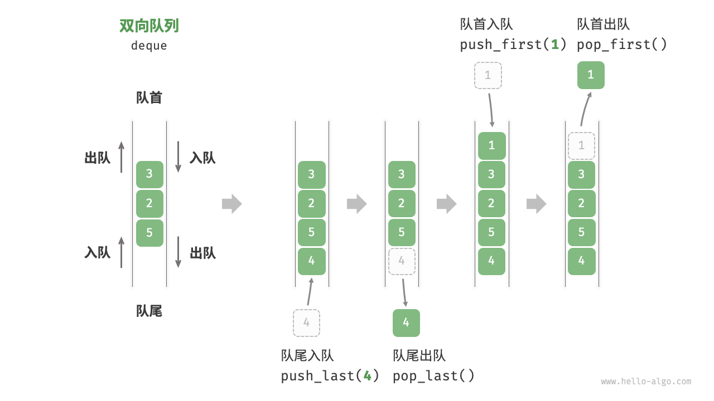

# 双端队列

> [双向队列 | Hello算法](https://www.hello-algo.com/chapter_stack_and_queue/deque/)


## 定义

相较于普通队列，**双端队列（*Double-ended Queue*）**不再将删除和插入操作**分别**限制在表的头尾，==而是允许表的两端均可执行插入与删除操作==，看起来就像是将两个相反方向上的队列结合成了一个。


*图片来源：[双端队列 | Hello算法](https://www.hello-algo.com/chapter_stack_and_queue/deque/)*

## 实现

与普通队列一样，双端队列也可以基于**顺序存储结构**与**链式存储结构**两种方式实现；

### 顺序存储结构


基于数组的实现，只需在[循环队列](queue.md)的基础上在头尾分别添加插入与删除操作即可：

=== "Python"

    ```py
    class SqDeque:
        """基于**环形数组**实现的双向队列

        Attributes:
            _data (Any): 队列主体
            _front (int): 队首指针
            _rear: (int): 队尾指针
            _capacity (int): 队列最大容量
        """
        def __init__(self, capacity: int):
            self._data: List[Any] = [None] * capacity
            self._front: int = 0
            self._rear: int = 0
            self._capacity: int = capacity

        def length(self) -> int:
            """获取队列长度
            """
            return (self._rear - self._front + self._capacity) % self._capacity

        def is_empty(self) -> bool:
            """判断队列是否为空
            """
            return self._front == self._rear

        def is_full(self) -> bool:
            """判断队列是否处于队列满状态
            """
            return (self._rear + 1) % self._capacity == self._front

        def push_first(self, data: Any) -> None:
            """从队首插入元素

            Args:
                data (Any): 待插入元素
            """
            if self.is_full():
                raise IndexError("The queue is full")
            self._front = (self._front - 1 + self._capacity) % self._capacity
            self._data[self._front] = data

        def push_last(self, data: Any) -> None:
            """从队尾插入元素

            Args:
                data (Any): 待插入元素
            """
            if self.is_full():
                raise IndexError("The queue is full")
            self._data[self._rear] = data
            self._rear = (self._rear + 1) % self._capacity

        def pop_first(self) -> Any:
            """从队首删除元素
            """
            if self.is_empty():
                raise IndexError("The queue is empty")
            data = self._data[self._front]
            self._front = (self._front + 1) % self._capacity
            return data

        def pop_last(self) -> Any:
            """从队尾删除元素
            """
            if self.is_empty():
                raise IndexError("The queue is empty")
            self._rear = (self._rear - 1 + self._capacity) % self._capacity
            data = self._data[self._rear]
            return data

        def peek_first(self) -> Any:
            """查看队首元素但不删除
            """
            if self.is_empty():
                raise IndexError("The queue is empty")
            return self._data[self._front]

        def peek_last(self) -> Any:
            """查看队尾元素但不删除
            """
            if self.is_empty():
                raise IndexError("The queue is empty")
            return self._data[self._rear - 1]
    ```


### 链式存储结构

链式存储结构则需要基于[双向链表](double_linked.md)实现：


=== "Python"

    ```py
    class DoubleLinkedNode:
        """双向链表节点类

        Attributes:
            object (Any | None = None): 节点数据域
            prev ('DoubleLinkedNode' | None = None): 节点前驱指针域，指向前一个节点
            next ('DoubleLinkedNode' | None = None): 节点后驱指针域，指向后一个节点
        """
        def __init__(self, obj: Optional[Any] = None):
            self.object = obj
            self.prev: 'DoubleLinkedNode' | None = None
            self.next: 'DoubleLinkedNode' | None = None

    class LinkedDeque:
        """基于双向链表实现的双端队列
        
        Attribute:
            _front ('DoubleLinkedNode'): 队首指针
            _rear ('DoubleLinkedNode'): 队尾指针
        """
        def __init__(self):
            self._front: DoubleLinkedNode | None = None
            self._rear: DoubleLinkedNode | None = None

        def length(self) -> int:
            """获取队列长度
            """
            cur = self._front
            length = 0
            while cur:
                length += 1
                cur = cur.next
            return length

        def is_empty(self) -> bool:
            """判断队列是否为空
            """
            return self._front is None

        def push_first(self, data: Any) -> None:
            """从队首插入元素

            Args:
                data (Any): 待插入元素
            """
            node = DoubleLinkedNode(data)
            if self._front is None:
                self._front = node
                self._rear = node
            else:
                node.next = self._front
                self._front.prev = node
                self._front = node

        def push_last(self, data: Any) -> None:
            """从队尾插入元素

            Args:
                data (Any): 待插入元素
            """
            node = DoubleLinkedNode(data)
            if self._rear is None:
                self._front = node
                self._rear = node
            else:
                node.prev = self._rear
                self._rear.next = node
                self._rear = node

        def pop_first(self) -> Any:
            """从队首删除元素
            """
            if self.is_empty():
                raise IndexError("The queue is empty")
            data = self._front.object
            self._front = self._front.next
            if self._front is not None:
                self._front.prev = None
            else:
                self._rear = None  # 队列变空
            return data

        def pop_last(self) -> Any:
            """从队尾删除元素
            """
            if self.is_empty():
                raise IndexError("The queue is empty")
            data = self._rear.object
            self._rear = self._rear.prev
            if self._rear is not None:
                self._rear.next = None
            else:
                self._front = None  # 队列变空
            return data

        def peek_first(self) -> Any:
            """查看队首元素但不删除
            """
            if self.is_empty():
                raise IndexError("The queue is empty")
            return self._front.object

        def peek_last(self) -> Any:
            """查看队尾元素但不删除
            """
            if self.is_empty():
                raise IndexError("The queue is empty")
            return self._rear.object
    ```

### 实现对比

二者的实现对比基本与普通队列的两种实现形式一致，即后者相对较为灵活，而前者则更加节省空间。

## 应用

双端队列的引入使得队列的插入与删除操作更加灵活，可以快速实现队列两端的元素访问与删除。

!!! tip
    由于双端队列两端均可插入与删除元素，因此它还可以用于实现栈，即双端队列作为栈使用时，仅使用一端进行插入与删除操作。

<!-- <div style="text-align: center">
    🚧前方施工中🚧
</div> -->
