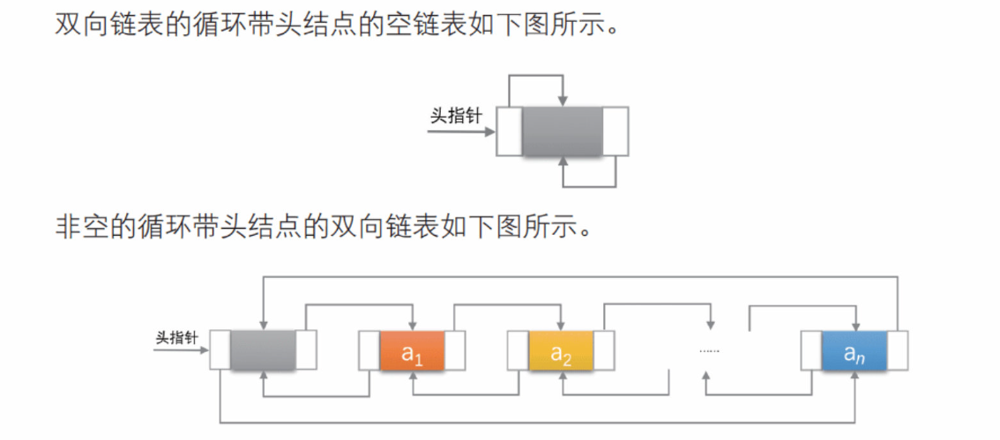
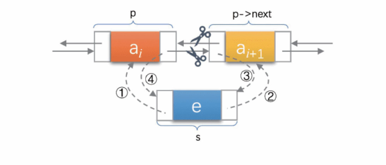
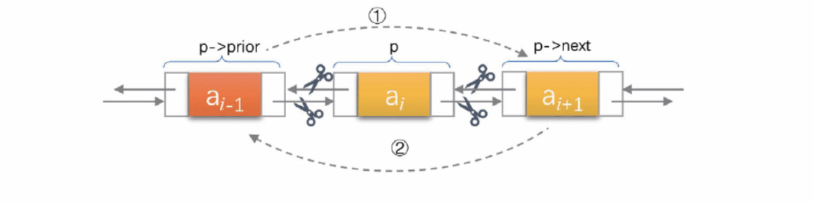

# 双向链表

> [大话数据结构【溢彩加强版】](https://zh.z-library.sk/book/24248731/7da759/%E5%A4%A7%E8%AF%9D%E6%95%B0%E6%8D%AE%E7%BB%93%E6%9E%84%E6%BA%A2%E5%BD%A9%E5%8A%A0%E5%BC%BA%E7%89%88.html)
<!-- >
> [DLLists | CS61B Textbook](https://cs61b-2.gitbook.io/cs61b-textbook/5.-dllists) -->

## 定义

**双向链表（*double linked list*）**的本质是在[单链表](linked-list.md)的每个节点中再设置一个指向其**前驱节点**的指针域。



```py
from typing import Optional, Any

class DoubleLinkedNode:
    """双向链表节点类

    Attributes:
        object (Any | None = None): 节点数据域
        prev ('DoubleLinkedNode' | None = None): 节点前驱指针域，指向前一个节点
        next ('DoubleLinkedNode' | None = None): 节点后驱指针域，指向后一个节点
    """
    def __init__(self, obj: Optional[Any] = None):
        self.object = obj
        self.prev: 'DoubleLinkedNode' | None = None
        self.next: 'DoubleLinkedNode' | None = None
```

## 常用操作

本质上，双向链表由单链表扩展而来，因此有很大一部分操作与之相同，这些操作**只需涉及一个方向的指针即可**。

主要的区别体现在**插入**与**删除**操作上，这两个操作就需要涉及到两个指针的改变。

### 插入

双向链表插入操作的实现并没有比单链表复杂多少，本质上只是多了一个反向的指针需要处理。

需要注意的是处理指针时指针的连接顺序不要弄错了，这种问题在初学过程中比较容易出现。



可参考上图标注的顺序逐步实现节点的插入:
```py
def insert(self, node: 'DoubleLinkedNode') -> None:
    """在自身后插入一个节点

    Args:
        node ('DoubleLinkedNode'): 待插入节点
    """
    node.prev = self
    if self.next:
        node.next = self.next
        self.next.prev = node
    else:
        node.next = None
    self.next = node
```

### 删除

同理，删除操作也需分别改变待删除节点前后节点的指针:



```py
def remove(self):
    """将自身从当前双向链表中剔除
    """
    self.prev.next = self.next
    self.next.prev = self.prev
```


<!-- <div style="text-align: center">
    🚧前方施工中🚧
</div> -->
