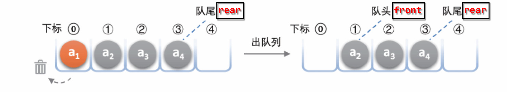
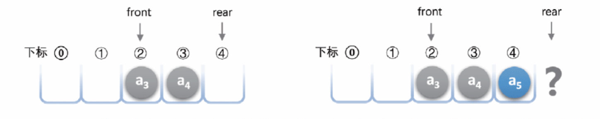

# 队列

## 定义

与栈类似，**队列（*queue*）**也是一种限定插入与删除操作的**线性表**，但与栈不同的是，==其插入和删除操作被分别限制在表的两端==。其特点是**先进先出（FIFO）**，==插入操作被限制在队尾，而删除操作被限制在队头==。

*图片来源: [队列 | Hello算法](https://www.hello-algo.com/chapter_stack_and_queue/queue/)*

## 队列的实现

与栈同理，队列也可以基于**顺序存储结构**与**链式存储结构**两种方式实现。

### 顺序存储结构

在顺序存储结构中，我们可以使得队列的队首对应数组的第一个元素，即下标为 $0$ 的元素，删除操作就在该位置上进行。但这会导致出队效率较低，因为每次出队后都需要将后面的元素向前移动一位，时间复杂度为 $O(n)$。

队尾对应数组的最后一个元素，插入操作只需在该元素后追加元素，无需移动任何元素，时间复杂度为 $O(1)$。

#### 出队优化与假溢出

针对出队效率低的问题，我们可以通过指针来定义队首与队尾，从而避免每次出队后都需要将后面的元素向前移动；简单来说，队首不一定对应数组的第一个元素:

!!! tip "出队优化[^1]"

    实现上，我们可以使用一个变量 `front` 指向队首元素的索引，并维护一个变量 `size` 用于记录队列长度。定义 `rear` = `front` + `size` ，这个公式计算出的 `rear` 指向队尾元素之后的下一个位置。

    基于此设计，数组中包含元素的有效区间为 **[`front`, `rear` - 1]**，此时:

    - 入队操作：将输入元素赋值给 `rear` 索引处，并将 `size` 增加 1 。

    - 出队操作：只需将 `front` 增加 1，`size` 减少 1 。

    

但是仅仅是这样的优化在不断进行入队与出队的过程中可能会遇到所谓的**假溢出**（*false overflow*）问题。

!!! note "假溢出[^2]"
    在顺序存储结构中，假溢出是指队列虽然还有空闲空间，但由于队首元素指针已经出队，导致无法再进行入队操作:

    

    将队列比作一辆公交车，假溢出现象就可比作是车的前面有位置，但后排位置却是满的；然而没有人会因为后排没位置了就选择等下班公交。

#### 循环队列

解决假溢出的方法也不难：后面满了，就从再前面开始，也就是**头尾相接的循环**。==队列的这种头尾相接的**顺序存储结构**称为**循环队列（*circular queue*）**==。

在循环队列中，我们可以使用取模运算来实现队列的循环。当 `rear` 指针到达数组末尾时，如果还有空闲空间，就将其移动到数组开头。

    🚧前方施工中🚧

[^1]: [队列-基于数组的实现 | Hello算法](https://www.hello-algo.com/chapter_stack_and_queue/queue/#2)

[^2]: [循环队列 | 大话数据结构【溢彩加强版】](https://zh.z-library.sk/book/24248731/7da759/%E5%A4%A7%E8%AF%9D%E6%95%B0%E6%8D%AE%E7%BB%93%E6%9E%84%E6%BA%A2%E5%BD%A9%E5%8A%A0%E5%BC%BA%E7%89%88.html)