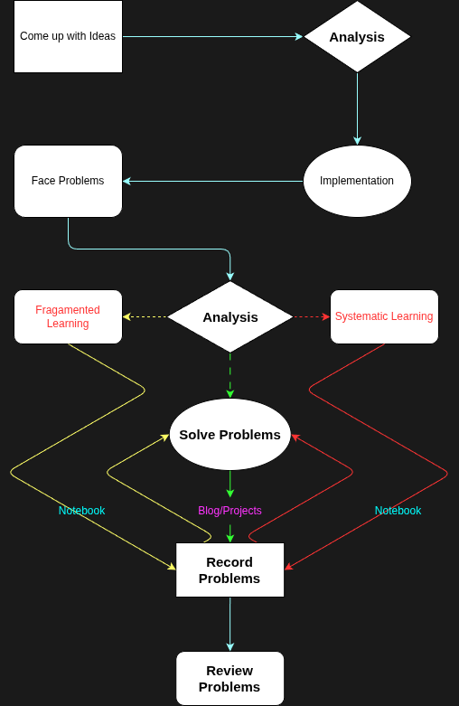

# Notebook

<!--  -->

*Image source: [Course Guides | UC berkeley EECS](https://hkn.eecs.berkeley.edu/courseguides){target="_blank"}*

<!-- 

  

    <em>
    Image source: <a href="https://hkn.eecs.berkeley.edu/courseguides" target="_blank">Course Guides | UC berkeley EECS</a>
    </em>
  

 -->

=== "English"
    **The only things researchers should abied by are debates and dialectics. Only by questioning everything at all times can one avoid falling into prejudice.**  

=== "中文"
    **学者应当遵循之物， 唯有知论与证辩。只有时刻保持对一切的质疑，才能避免陷入偏见。**

## Recent Notes 

=== "English"

=== "中文"

<!-- recent_notes_start -->
<ul>
<li>
<a href="Misc/resources/academy/">学术资源</a>2025-09-12
</li>
<li>
<a href="language/java/class-object/">类与对象</a>2025-09-12
</li>
<li>
<a href="dsa/cs61b/">UCB CS61B(Spring 2021) 学习要点</a>2025-09-12
</li>
<li>
<a href="language/java/">Java 入门要点</a>2025-09-12
</li>
<li>
<a href="dsa/ds/linear/deque/">双端队列</a>2025-09-10
</li>
<li>
<a href="dsa/">笔记说明 & 简要导入</a>2025-09-09
</li>
<li>
<a href="dsa/ds/linear/double_linked/">双向链表</a>2025-09-07
</li>
<li>
<a href="dsa/ds/linear/linked-list/">单链表</a>2025-09-06
</li>
<li>
<a href="tools/git/">Git</a>2025-08-31
</li>
<li>
<a href="dsa/ds/linear/queue/">队列</a>2025-08-30
</li>
</ul>
<!-- recent_notes_end -->

## About Me

=== "English"

    - An undergraduate student at Fujian University of Technology, majoring in Smart Transportation in the first year of undergraduate studies, transfer to the major of Cybersecurity since Sepetember 2025, expected to graduate in 2028.

    - Currently exploring basic theory of Computer Science, ~~also engage in some meaningless tricks~~.

    - Contact information and other sites are available on my [Homepage](https://virtualguard101.com/).

=== "中文"

    - 福建理工大学本科生，大一智慧交通专业，2025年9月起转入网络空间安全专业，预计 2028 年毕业。

    - 当前处于计算机基础理论学习阶段，~~偶尔整点毫无意义的花活~~。

    - 联系方式及其他站点参见[我的主页](https://virtualguard101.com/)。

## Why and How do I use the WIKI

=== "English"

    It is well known that combining theory with practice is essential for efficiently absorbing knowledge during the learning process. The field of computer science encompasses an extremely vast knowledge system and places great emphasis on practical application skills. 
    
    In this context, a learning approach that is both rational and tailored to one's personal circumstances serves as the fundamental condition for efficient CS learning. This personal WIKI was born under such circumstances—it serves as a platform for documenting updates in my computer science learning journey, sharing insights, and showcasing learning outcomes. Throughout my self-study journey in CS, it has played a pivotal role in supporting my learning, thinking, and practical application.

    The image below illustrates my general workflow using this WIKI, for reference only. The process may be adjusted according to actual circumstances during application.

    

    Feel free to share your thoughts in the comments, I'd greatly appreciate any valuable insights.

=== "中文"

    众所周知，在学习的过程中理论实践相结合才能高效地吸收所学的知识；计算机领域的知识体系极其庞大，且高度注重实际运用能力，在这样的背景下，合理且契合个人实际情况的学习方式就是高效学习CS的基本条件。这个个人 WIKI 正是在这样的背景下诞生的，它作为一个记录计算机科学学习历程更新、分享见解及展示学习成果的平台，在我的CS自学历程中作为一个举足轻重的角色助力我的学习、思考以及实践。

    下图是我利用这个 WIKI 的通用流程，仅供参考。应用过程中，流程会随实际情况做出调整。

    

    欢迎在评论区留下你的见解，如果它有价值，我将感激不尽。

## Learning Outcomes

=== "English"

    - [SpaceCaculator | CS61A](https://github.com/virtualguard101/space-calculator): A calculator for solid geometry implement by python.

    - [3BodySimulator | Build a C++ Project](https://github.com/virtualguard101/3BodySimulator): The visualization simulation of three-body motion implemented using C++ & Python

=== "中文"

    - [SpaceCaculator | CS61A](https://github.com/virtualguard101/space-calculator)：基于Python实现的简易立体几何计算器

    - [3BodySimulator | Build a C++ Project](https://github.com/virtualguard101/3BodySimulator)：使用 C++ & Python 实现的三体运动可视化模拟

*GIF source: [Hello Apple by Meritt Thomas](https://dribbble.com/shots/17347386-Hello-Apple){target="_blank"}*
