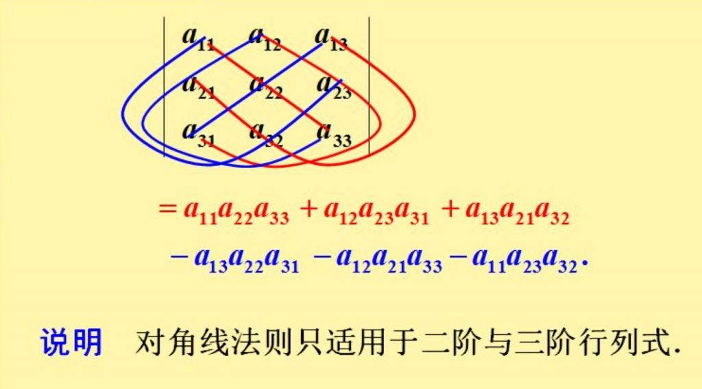

# 行列式

## 二阶三阶行列式

二阶、三阶行列式可直接展开运算，基本不需要技巧。

### 二阶行列式

$$
\begin{vmatrix}
a & b \\
c & d
\end{vmatrix} = ad - bc
$$

### 三阶行列式

$$
\begin{vmatrix}
a_{11} & a_{12} & a_{13} \\
a_{21} & a_{22} & a_{23} \\
a_{31} & a_{32} & a_{33}
\end{vmatrix} = a_{11}a_{22}a_{33} + a_{12}a_{23}a_{31} + a_{13}a_{21}a_{32} - a_{13}a_{22}a_{31} - a_{11}a_{23}a_{32} - a_{12}a_{21}a_{33}
$$

或逐层展开【按行（列）展开】:

$$
\begin{vmatrix}
a_{11} & a_{12} & a_{13} \\
a_{21} & a_{22} & a_{23} \\
a_{31} & a_{32} & a_{33}
\end{vmatrix} = a_{11} \begin{vmatrix}
    a_{22} & a_{23} \\
    a_{32} & a_{33}
\end{vmatrix} + a_{12} \begin{vmatrix}
    a_{21} & a_{23} \\
    a_{31} & a_{33}
\end{vmatrix} + a_{13} \begin{vmatrix}
    a_{21} & a_{22} \\
    a_{31} & a_{32}
\end{vmatrix}
$$

    <iframe src="https://www.youtube.com/embed/xjr57oO6rHg" 
    scrolling="no" 
    border="0" 
    frameborder="no" 
    framespacing="0" 
    allowfullscreen="true"> 
    </iframe>

==逐层展开的方式适用于任意 $n$ 阶行列式==:

$$
D = a_{i1}A_{i1} + a_{i2}A_{i2} + \cdots + a_{in}A_{in}
$$

其中 $A_{ij}$ 为元素 $a_{ij}$ 的**代数余子式**, 即 

$$
A_{ij} = (-1)^{i + j} \begin{vmatrix}
    a_{11} & \cdots & a_{1,j-1} & a_{1,j+1} & \cdots & a_{1n} \\
    \vdots & \ddots & \vdots & \vdots & \ddots & \vdots \\
    a_{i-1,1} & \cdots & a_{i-1,j-1} & a_{i-1,j+1} & \cdots & a_{i-1,n} \\
    a_{i+1,1} & \cdots & a_{i+1,j-1} & a_{i+1,j+1} & \cdots & a_{i+1,n} \\
    \vdots & \ddots & \vdots & \vdots & \ddots & \vdots \\
    a_{n1} & \cdots & a_{n,j-1} & a_{n,j+1} & \cdots & a_{nn}
\end{vmatrix}
$$

### 利用行列式解线性方程组

假设有线性方程组:

$$
\begin{cases}
a_1x + b_1y = c_1 \\
a_2x + b_2y = c_2
\end{cases}
$$

使用[**克拉默法则**](#克拉默法则)，当系数行列式 $D \neq 0$ 时，方程组的解为：

$$x = \frac{D_x}{D}, \quad y = \frac{D_y}{D}$$

其中：

- $D = \begin{vmatrix} a_1 & b_1 \\ a_2 & b_2 \end{vmatrix} = a_1b_2 - a_2b_1$

- $D_x = \begin{vmatrix} c_1 & b_1 \\ c_2 & b_2 \end{vmatrix} = c_1b_2 - c_2b_1$

- $D_y = \begin{vmatrix} a_1 & c_1 \\ a_2 & c_2 \end{vmatrix} = a_1c_2 - a_2c_1$

!!! example
    求解方程组：

    $$
    \begin{cases}
    2x + 3y = 7 \\
    4x - y = 1
    \end{cases}
    $$

    计算行列式：

    $$D = \begin{vmatrix} 2 & 3 \\ 4 & -1 \end{vmatrix} = 2 \times (-1) - 3 \times 4 = -2 - 12 = -14$$

    $$D_x = \begin{vmatrix} 7 & 3 \\ 1 & -1 \end{vmatrix} = 7 \times (-1) - 3 \times 1 = -7 - 3 = -10$$

    $$D_y = \begin{vmatrix} 2 & 7 \\ 4 & 1 \end{vmatrix} = 2 \times 1 - 7 \times 4 = 2 - 28 = -26$$

    因此解为：

    $$x = \frac{D_x}{D} = \frac{-10}{-14} = \frac{5}{7}, \quad y = \frac{D_y}{D} = \frac{-26}{-14} = \frac{13}{7}$$

<!-- !!! tip "推广"
    当线性方程组为 $n$ 元时，各个元素的解只需将分子的 $n$ 阶行列式的对应列替换为对应行等号右侧的常数即可。

    例如，有 $n$ 元线性方程组:

    $$
    \begin{cases}
    a_{11}x_1 + a_{12}x_2 + \cdots + a_{1n}x_n = b_1 \\
    a_{21}x_1 + a_{22}x_2 + \cdots + a_{2n}x_n = b_2 \\
    \quad \quad \quad \quad \quad \quad \quad \vdots \\
    a_{n1}x_1 + a_{n2}x_2 + \cdots + a_{nn}x_n = b_n \\
    \end{cases}
    $$

    则有

     $$
     x_i = \frac{D_i}{D}, \quad i = 1, 2, \ldots, n
     $$
     
     其中：
     - $D = \begin{vmatrix} a_{11} & a_{12} & \cdots & a_{1n} \\ a_{21} & a_{22} & \cdots & a_{2n} \\ \vdots & \vdots & \ddots & \vdots \\ a_{n1} & a_{n2} & \cdots & a_{nn} \end{vmatrix}$ 为系数行列式
     
     - $D_i$ 是将 $D$ 中第 $i$ 列替换为常数项 $\begin{pmatrix} b_1 \\ b_2 \\ \vdots \\ b_n \end{pmatrix}$ 后得到的行列式

        即 $D_i = \begin{vmatrix} a_{11} & \cdots & a_{1,i-1} & b_1 & a_{1,i+1} & \cdots & a_{1n} \\ a_{21} & \cdots & a_{2,i-1} & b_2 & a_{2,i+1} & \cdots & a_{2n} \\ \vdots & \ddots & \vdots & \vdots & \vdots & \ddots & \vdots \\ a_{n1} & \cdots & a_{n,i-1} & b_n & a_{n,i+1} & \cdots & a_{nn} \end{vmatrix}$
-->

## 排列与逆序数

简单来说，全排列就是 $n$ 个自然数排成的一行的排列，简称 **$n$ 元排列**；

逆序数就是一个排列中对每个元素进行检查，**各个元素后**分别有多少个元素小于这个元素，最后求和得出的数值，例如：

!!! example
    现有排列 $32514$，则有:

    - $3$ 后面有 2 个比其小的数字（$2$、$1$）

    - $2$ 后面有 1 个比其小的数字（$1$）

    - $5$ 后面有 2 个比其小的数字（$2$）
    
    - $1$ 后面没有比其小的数字
    
    故其逆序数就是

    $$
    t = \sum_{i = 1}^{5}t_i = 2 + 1 + 2 + 0 = 5
    $$

    另外不止这一种数法，“倒着数”也是可以的——可参考[同济版线性代数课本](https://zh.z-library.sk/book/26867606/56cbdc/%E7%BA%BF%E6%80%A7%E4%BB%A3%E6%95%B0-%E7%AC%AC%E4%B8%83%E7%89%88.html)上的数法，本质上都是一样的。

- 设有排序 $p_1 p_2 \cdots p_n$，则其逆序数记作

    $$
    t(p_1 p_2 \cdots p_n)
    $$

    - 逆序数为奇数的排列称为**奇排列**

    - 逆序数为偶数的排列称为**偶排列**

- 设有 $n$ 个自然数，则其**全排列**为这 $n$ 个自然数所有排列可能的**集合**，记作 $S_{n}$

## $n$ 阶行列式

### 定义与一般展开

$$
D = 
\begin{vmatrix}
    a_{11} & a_{12} & \cdots & a_{1n} \\ 
    a_{21} & a_{22} & \cdots & a_{2n} \\ 
    \vdots & \vdots & \ddots & \vdots \\ 
    a_{n1} & a_{n2} & \cdots & a_{nn} 
\end{vmatrix}
$$

简记作 $det(a_{ij})$

从全排列的定义中我们不难得出，$n$ 阶行列式的展开式有 $n!$ 项，其展开如下:

$$
\sum_{p_1 p_2 \cdots p_n \in S_{n}} (-1)^{t(p_1 p_2 \cdots p_n)}a_{1p_1}a_{2p_2} \cdots a_{np_{n}}
$$

==各项的符号取决于对应行（列）展开的列（行）号排列的**奇偶性**==。

### ⭐性质

- **性质1**：行列式与它的转置行列式相等

- **性质2**：对调行列式的某两行（列），行列式的值变号

    这个不难理解，排列中的元素对调，必然会影响排列的奇偶性

    - ==**推论**：若行列式有两行（列）完全相同，则该行列式的值为 $0$==

        对调完全相同的这两行，由性质2得 $D = -D$，即 $D = 0$。

- **性质3**：行列式某一行（列）同系数可外提，类似四则运算的分配率（其实本质上就是乘法分配率）

    $$
    \begin{vmatrix}
        a_{11} & a_{12} & \cdots & a_{1n} \\ 
        \vdots & \vdots & \ddots & \vdots \\
        ka_{i1} & ka_{i2} & \cdots & ka_{in} \\ 
        \vdots & \vdots & \ddots & \vdots \\ 
        a_{n1} & a_{n2} & \cdots & a_{nn} 
    \end{vmatrix} = k
    \begin{vmatrix}
        a_{11} & a_{12} & \cdots & a_{1n} \\ 
        \vdots & \vdots & \ddots & \vdots \\
        a_{i1} & a_{i2} & \cdots & a_{in} \\ 
        \vdots & \vdots & \ddots & \vdots \\ 
        a_{n1} & a_{n2} & \cdots & a_{nn} 
    \end{vmatrix}
    $$

    !!! warning
        注意这里是有一行（列）中有完全一样的系数就可以外提一次，例如有以下行列式:
        
        $$
        \begin{vmatrix}
            ka_{11} & ka_{12} & \cdots & ka_{1n} \\ 
            \vdots & \vdots & \ddots & \vdots \\
            ka_{i1} & ka_{i2} & \cdots & ka_{in} \\ 
            \vdots & \vdots & \ddots & \vdots \\ 
            ka_{n1} & ka_{n2} & \cdots & ka_{nn} 
        \end{vmatrix} = k^n
        \begin{vmatrix}
            a_{11} & a_{12} & \cdots & a_{1n} \\ 
            \vdots & \vdots & \ddots & \vdots \\
            a_{i1} & a_{i2} & \cdots & a_{in} \\ 
            \vdots & \vdots & \ddots & \vdots \\ 
            a_{n1} & a_{n2} & \cdots & a_{nn} 
        \end{vmatrix}
        $$

    - ==**推论**：行列式中如果有两行（列）成比例，则行列式的值为 $0$==

        把比例系数提出去，再利用性质2的推论即可证明

- **性质4**：若行列式的某一行（列）的元素都是两数之和，则该行列式等于下列两个行列式之和:

    $$
    \begin{vmatrix}
        a_{11} & a_{12} & \cdots & a_{1n} \\ 
        \vdots & \vdots & \ddots & \vdots \\
        a_{i1} + a_{i1}^{'} & a_{i2} + a_{i2}^{'} & \cdots & a_{in} + a_{in}^{'} \\ 
        \vdots & \vdots & \ddots & \vdots \\ 
        a_{n1} & a_{n2} & \cdots & a_{nn} 
    \end{vmatrix} =
    \begin{vmatrix}
        a_{11} & a_{12} & \cdots & a_{1n} \\ 
        \vdots & \vdots & \ddots & \vdots \\
        a_{i1} & a_{i2} & \cdots & a_{in} \\ 
        \vdots & \vdots & \ddots & \vdots \\ 
        a_{n1} & a_{n2} & \cdots & a_{nn} 
    \end{vmatrix} +
    \begin{vmatrix}
        a_{11} & a_{12} & \cdots & a_{1n} \\ 
        \vdots & \vdots & \ddots & \vdots \\
        a_{i1}^{'} & a_{i2}^{'} & \cdots & a_{in}^{'} \\ 
        \vdots & \vdots & \ddots & \vdots \\ 
        a_{n1} & a_{n2} & \cdots & a_{nn} 
    \end{vmatrix}
    $$

    !!! tip "推论"
        ==若 $n$ 阶行列式的每个元素都表示成两数之和，则它可被分解为 $2^n$ 个行列式==。如二阶行列式:

        $$
        \begin{vmatrix}
        a + x & b + y \\
        c + z & d + w
        \end{vmatrix} =
        \begin{vmatrix}
        a & b + y \\
        c & d + w
        \end{vmatrix} + 
        \begin{vmatrix}
        x & b + y \\
        z & d + w
        \end{vmatrix} =
        \begin{vmatrix}
        a & b \\
        c & d
        \end{vmatrix} +
        \begin{vmatrix}
        a & y \\
        c & w
        \end{vmatrix} +
        \begin{vmatrix}
        x & b \\
        z & d
        \end{vmatrix} +
        \begin{vmatrix}
        x & b \\
        z & d
        \end{vmatrix}
        $$

- ==**性质5**：把行列式的某一行（列）的各元素乘同一数然后加到另一行（列）对应的元素上去==

    例如将第 $i$ 行乘上 $k$ 加到第 $j$ 行上，记作 $r_i + kr_i$:
    
    $$
    \begin{vmatrix}
        a_{11} & a_{12} & \cdots & a_{1n} \\ 
        \vdots & \vdots & \ddots & \vdots \\
        a_{i1} & a_{i2} & \cdots & a_{in} \\ 
        \vdots & \vdots & \ddots & \vdots \\ 
        a_{j1} & a_{j2} & \cdots & a_{jn} \\
        \vdots & \vdots & \ddots & \vdots \\ 
        a_{n1} & a_{n2} & \cdots & a_{nn} 
    \end{vmatrix} \overset{r_i + kr_i}{=}
    \begin{vmatrix}
        a_{11} & a_{12} & \cdots & a_{1n} \\ 
        \vdots & \vdots & \ddots & \vdots \\
        a_{i1} & a_{i2} & \cdots & a_{in} \\ 
        \vdots & \vdots & \ddots & \vdots \\ 
        a_{j1} + ka_{i1} & a_{j2} + ka_{i2} & \cdots & a_{jn} + ka_{in} \\
        \vdots & \vdots & \ddots & \vdots \\ 
        a_{n1} & a_{n2} & \cdots & a_{nn} 
    \end{vmatrix} (i \not ={j})
    $$

剩下的就是计算了（做题）。性质在计算上的应用还是蛮广泛的（~~考试爱考~~）。
 
<!-- ### 计算 -->

## 克拉默法则

### 使用前提

- 方程个数 = 未知量个数

- 系数行列式 $D \not ={0}$

### 定义

对于 $n$ 元线性方程组：

$$
\begin{cases}
a_{11}x_1 + a_{12}x_2 + \cdots + a_{1n}x_n = b_1 \\
a_{21}x_1 + a_{22}x_2 + \cdots + a_{2n}x_n = b_2 \\
\quad \quad \quad \quad \quad \quad \quad \vdots \\
a_{n1}x_1 + a_{n2}x_2 + \cdots + a_{nn}x_n = b_n
\end{cases}
$$

设系数行列式为：

$$D = \begin{vmatrix}
a_{11} & a_{12} & \cdots & a_{1n} \\
a_{21} & a_{22} & \cdots & a_{2n} \\
\vdots & \vdots & \ddots & \vdots \\
a_{n1} & a_{n2} & \cdots & a_{nn}
\end{vmatrix}$$

将 $D$ 中第 $j$ 列用常数项 $b_1, b_2, \ldots, b_n$ 替换，得到行列式 $D_j$：

$$D_j = \begin{vmatrix}
a_{11} & \cdots & a_{1,j-1} & b_1 & a_{1,j+1} & \cdots & a_{1n} \\
a_{21} & \cdots & a_{2,j-1} & b_2 & a_{2,j+1} & \cdots & a_{2n} \\
\vdots & \ddots & \vdots & \vdots & \vdots & \ddots & \vdots \\
a_{n1} & \cdots & a_{n,j-1} & b_n & a_{n,j+1} & \cdots & a_{nn}
\end{vmatrix}$$

==在满足前提的条件下，则方程组有唯一解==：

$$x_j = \frac{D_j}{D}, \quad j = 1, 2, \ldots, n$$

### 推论

对于齐次线性方程组（未知量个数等于方程个数且方程无常数项）:

$$
\begin{cases}
a_{11}x_1 + a_{12}x_2 + \cdots + a_{1n}x_n = 0 \\
a_{21}x_1 + a_{22}x_2 + \cdots + a_{2n}x_n = 0 \\
\quad \quad \quad \quad \quad \quad \quad \vdots \\
a_{n1}x_1 + a_{n2}x_2 + \cdots + a_{nn}x_n = 0 
\end{cases}
$$

- ==若其系数行列式 $D \neq 0$，则该方程组**只有零解**（唯一解）==

这是一个充要条件，即：

$$
\text{若此齐次线性方程组只有零解} \Longleftrightarrow D \neq 0
$$

- ==若其系数行列式 $D = 0$，则该方程组有**非零解**（无穷多解）==

$$
\text{若此齐次线性方程组有非零解} \Longleftrightarrow D = 0
$$
