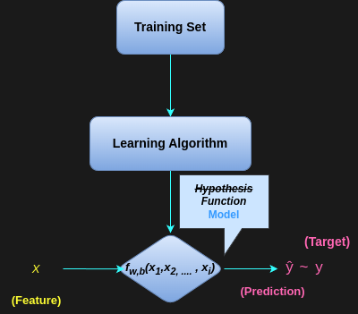

# 回归模型概述

> [Machine Learning | Coursera](https://www.coursera.org/specializations/machine-learning-introduction)

## 训练集

**训练集（*training set*）**是用来训练模型的数据集，通常用于拟合模型参数。

在回归中，模型需要学习一组参数，使得模型能够拟合训练集中的数据。

!!! example
    再次以前一章节中的回归算法的例子为例，令年份为 $x$，应届毕业生就业率为 $y$，则训练集可能为：

    | 年份 x | 应届毕业生就业率 y/%|
    |:------:|:------------------:|
    | 2007 | 82             |
    | 2008 | 70             |
    | 2009 | 75             |
    | 2010 | 77             |
    | 2011 | 78             |
    | 2012 | 77             |
    | 2013 | 79             |
    | 2014 | 80             |
    | 2015 | 83             |
    | 2016 | 84             |
    | 2017 | 85             |
    | 2018 | 88             |
    | 2019 | 90             |
    | 2020 | 75             |
    | 2021 | 80             |
    | 2022 | 78             |
    | 2023 | 76             |
    | 2024 | 77             |

    其中 $(x^{(i)}, y^{(i)})$ 表示第 $i$ 个训练样本。

    本质上就是一连串的数据映射关系，同时包含了：
    
    - 特征（输入变量 $x^{(i)}$）

    - 标签/目标（输出变量 $y^{(i)}$）

    - 数据质量要求（是否存在异常值、缺失值等）

    - 数据分布特征（是否符合某种分布）

    !!! warning
        - 严格意义上，这个例子或许并不能算是回归模型，因为通常意义上，“就业率”关于时间的函数并不是一个**连续函数**，这里为了方便理解，我们暂且将就业率看作一个随时间**连续变化的量。

        - 真实的训练集通常比这个要大得多，这里只是为了方便理解。

## 回归算法工作原理概述

!!! abstract
    简单来说，在[**回归**](super-unsuper-learning.md#回归算法)中，训练模型就是使用回归算法从训练数据中**学习提炼**一个**函数**（历史上也称为**假设**），通过最小化损失函数来优化模型参数，使得模型能够**准确预测**新的输入数据，==即让**预测值**（$\hat{y}$）尽可能接近**实际值**（$y$）==。
