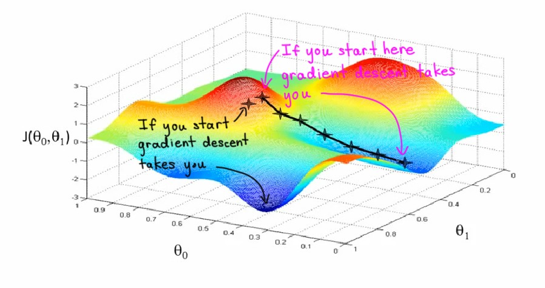

# 梯度下降

## 定义概述

在前面的学习中，我们知道训练模型的目标是找到尽可能低的成本函数值对应的模型函数参数。

在前面的线性回归模型中，参数数量与模型复杂度在机器学习领域中算是最简单的模型之一了，他们的成本函数也相对简单，比如房价预测模型的成本函数曲线/曲面，是一个凸型成本曲面，==只有一个极小值，并且就对应该成本函数的最小值==。但对于相对复杂的模型函数，就有更加复杂的成本函数，而且就算是最简单的线性回归模型，也不是只有均方误差函数一种成本函数可以用......

然后，你可能就会看到类似下图的成本函数:

这是一个在训练神经网络模型时可能会用到的成本函数。首先，它包含不止一个极小值，其次，我们也不知道哪个极小值才是最小成本值.....

显然，我们急切地需要一个高效且通用的方法来找到最小的 $J(\theta)$，为此，**梯度下降算法（*Gradient Descent Algorithm*）**应运而生。

!!! example "梯度下降的通俗解释"
    打个比方，假设我们站在一座山的山顶，梯度下降算法要做的，就是帮助我们找到一条能够快速通向山谷的路径。
    
    具体要怎么实现呢？试想如果我们要朝某个方向迈出微小的一步，且希望以最快速度下山到达这些山谷之一，我们该选择哪个方向迈出这一步？
    
    抛开其他问题不谈，我们显然应该选择一个坡度最陡峭的方位，==在数学上，这个方位上函数的增长方向就是一个**向量**，通过对多元函数的各个变量求偏导获取，被称为**梯度（*Gradient*）**==：

    $$
    \nabla f = (\frac{\partial f}{\partial x_1}, \frac{\partial f}{\partial x_2}, ..., \frac{\partial f}{\partial x_n})
    $$

    !!! warning "梯度方向与负梯度方向"
        这里有一个容易混淆的地方：数学上，梯度方向是指函数值**增长**最快的方向，即“上山方向”；而我们下山的方向事实是上一个**负梯度方向**，即函数值**减少**最快的方向，与对应的梯度方向相反。

    继续刚才的问题，在迈出第一步后，我们下一步要做的就是重复刚刚的动作，环顾四周，继续寻找“最快的下山方向”，以此类推，直到你发现自己位于某个山谷的底部，在数学上就是一个极小值点。

## 实现算法

采用重复执行的方式不断更新参数的值，直至 $J(\theta)$ 收敛至某个极小值:

$$
w = w - \alpha\frac{\partial J(w, b)}{\partial w}
$$

$$
b = b - \alpha\frac{\partial J(w, b)}{\partial b}
$$

!!! warning
    - 注意这里的 $=$ 是**赋值符号**，而不是**相等断言**

    - 注意 $w$ 和 $b$ 的更新是**同时进行**的，也就是说下面的这种执行顺序是错误的:

        !!! failure
            1.

            $$
            w_{tmp} = w - \alpha\frac{\partial J(w, b)}{\partial w}
            $$

            ⚠️2.

            $$
            w = w_{tmp}
            $$

            3.

            $$ 
            b_{tmp} = b - \alpha\frac{\partial J(w, b)}{\partial b}
            $$

            4.

            $$
            b = b_{tmp}
            $$

        因为这样在执行第三步时，$b_tmp$ 的值需要用到 $w$ 来计算 $J(w, b)$ 的值，而这时的 $w$ 已经被更新了

这里 $\alpha$ 是**学习率（*Learning Rate*）**，简单理解就是用来控制“下山过程中的某一步**一次性走多远**”的指标，后面会详细介绍。
