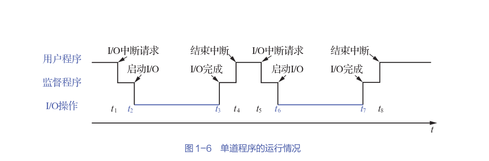
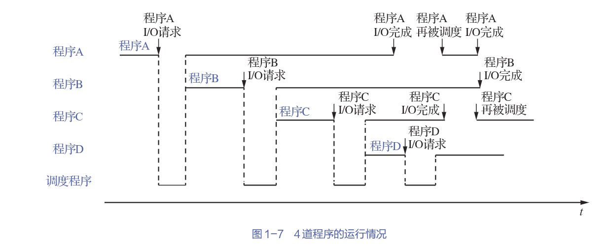

# 操作系统发展历程

## 批处理系统

- What: 一种将多个作业（程序）收集成批次，然后一次性提交给计算机处理的系统

- Why: 提高计算机资源利用率，减少人工干预，实现作业的自动化处理

- How: 用户将程序和数据提交给操作员，操作员将多个作业组成批次，系统按顺序执行

早期的IBM 1401系统，用户提交穿孔卡片，系统批量处理

### 单道批处理系统

系统只能将输入的这一批作业按照顺序依次进行处理，==内存中始终只保持一道作业==。

- 自动性: 脱机输入后，无需人工干预，系统自动完成作业的处理

- 顺序性: 作业按提交顺序依次调入内存处理

- 单道性: 内存中始终只保持一道作业

### 多道批处理系统

引入多道批处理技术后，内存中可基于某种算法同时装入多道作业，==作业在管理程序的控制下穿插地运行，共享系统中的各种软/硬件资源==。

对比单道批处理系统的一个显著改进就是当某道程序因I/O操作而暂停执行时，CPU可以转而运行内存中其他作业，通过**中断**实现。

- 多道: 内存中可同时装入多个相互独立的程序

- 宏观上并行，微观上串行: 内存中的多道程序轮流占用CPU，交替运行，在宏观上形成一种这些程序在并行运行的效果

## 分时系统

分时系统基于**分时技术（Time Sharing）**，将CPU时间分成很短的时间片，每个程序轮流占用一个时间片。若某个作业在时间片内没能完成，则该作业被中断，CPU转而运行下一个作业，等到下一轮再继续执行该作业。

分时操作系统是指多个用户通过终端共享一台计算机，可以同时与主机进行交互而互不干扰。

由于计算机速度很快，时间片轮转的速度也很快，给每个用户的感觉就像是自己独占计算机。

- 同时性（多路性）: 指允许多个终端用户同时使用一台计算机

- 交互性: 用户通过终端与主机进行交互，用户可以实时地控制自己的作业，并及时得到系统的响应

- 独立性: 多个用户间的交互互不干扰，每个用户感觉独占计算机

- 及时性: 用户提交作业后，系统能够及时处理，并及时返回结果

## 实时系统

实时操作系统为能在某个特定时间范围内完成某些紧急任务而不需要时间片排队而诞生。

### 软实时系统

能够接受偶尔违反时间规定且不会引起任何永久性损失的系统，称为软实时系统。

典型的软实时系统有订票系统、银行管理系统等。

### 硬实时系统

必须满足某个特定动作绝对地在规定的时刻或规定的时间范围内发生的系统，称为硬实时系统。

如飞控系统、武器控制系统等。

## 网络操作系统与分布式计算机系统

## 个人计算机操作系统
