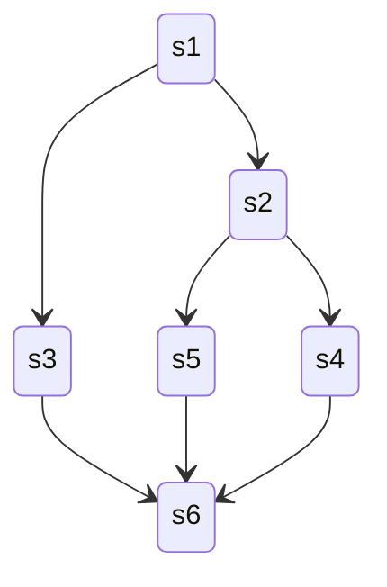

# 同步与互斥

> [进程与线程](2-process.md)

## 部分概念

### 操作系统中的资源类型

#### 可重用性资源

顾名思义，就是可供用户重复多次使用的资源。

- 一次只能分配给一个进程，不允许多个进程共享

- 进程在使用该资源时，需要先申请并获得该资源，使用完毕后释放该资源

- 单元数目相对固定，进程在运行期间既不能创建也不能删除

#### 可消耗性资源

临时性资源，由进程动态创建和消耗（进程通信间的消息、信号量等）。

- 单元数目不固定，可以按需要随时创建，使用完毕后自动释放

#### 可抢占资源

某进程在获得这类资源后，该进程可以再被其他进程或系统抢占（如处理机、主存等）。

#### 不可抢占资源

当系统把这类资源分配给某进程后，就不能再强行收回，只能在进程用完后自行释放（如磁带、打印机等）。

#### ⭐临界资源

**临界资源（*Critical Resource*）**是指在操作系统中，多个进程需要通过**互斥**访问方法访问的、**不可抢占**的资源。

### 访问临界资源

每个进程中访问临界资源的那段代码称为**临界区**。临界资源的访问大致可分为四个步骤:

1. 进入区: 检查是否可以进入临界区

2. 临界区: 访问临界资源的代码，也成为**临界段**

3. 退出区: 释放临界资源，将正在访问临界区的标志清除

4. 剩余区: 代码的其余部分

```cpp
while (true) {
  entry section;     // 进入区
  critical section;  // 临界区
  exit section;      // 退出区
  remainder section; // 剩余区
}
```

### 同步

**同步（*Synchronization*）**也称为**直接约束关系**，是指为完成某种任务而建立的两个或多个进程，因为需要协调它们的工作次序并等待它们相互通信、等待消息等所产生的制约关系。

同步的本质是**资源访问的排队机制**，源于进程之间的相互合作。

- 核心要素

    - 共享资源：收银机（临界资源）

    - 访问控制：排队规则（同步原语）

    - 互斥访问：同一时刻只有一个人能用收银机

        !!! tip
            同步需要基于[互斥](#互斥)实现。

    - 顺序保证：先到先得（happens-before）

!!! example
    - 没有同步：
        ```
        10:00 - 你：我要一杯珍珠奶茶
        10:00 - 小明：我要一杯柠檬茶  
        10:00 - 小红：我要一杯抹茶拿铁
        店员：？？？你们同时说话我听不清！
        ```
        结果：订单混乱，可能做错或漏做（不可重现）

    - 有同步：
        ```
        10:00 - 你：我要一杯珍珠奶茶（获得"收银机锁"）
        10:01 - 店员：好的，15元（你释放锁）
        10:01 - 小明：我要一杯柠檬茶（获得"收银机锁"）
        10:02 - 店员：好的，12元（小明释放锁）
        10:02 - 小红：我要一杯抹茶拿铁（获得"收银机锁"）
        ```
        结果：每个人都能清楚下单，不会混乱

    ```cpp
    // 收银机 = 共享变量
    int cash_register = 0;  // 收银机状态
    std::mutex line_mutex;  // 排队规则

    void buy_drink(string customer, string drink) {
        std::lock_guard<std::mutex> lock(line_mutex);  // 排队等待
        
        // 临界区：使用收银机
        cout << customer << "In Processing" << drink << endl;
        cash_register++;  // 更新收银机状态
        
        // 自动释放锁，下一个人可以排队
    }
    ```

### 互斥

**互斥（Mutex）**是另外一个同步机制，也称为**间接约束关系**，用于确保同一时间只有一个线程能够访问共享资源。

互斥用于多线程环境下的竞态条件问题，通过"锁定-访问-解锁"的模式保证临界区代码的原子性执行。

!!! info "竞态条件问题"
    **竞态条件（*Race Condition*）**问题是指在多线程环境下，由于多个线程同时访问共享资源，导致程序运行结果不确定的问题。

    ```py
    # 危险的代码示例
    counter = 0

    def increment():
        global counter
        temp = counter    # 读取当前值
        temp += 1         # 计算新值
        counter = temp    # 写入新值

    # 如果两个线程同时执行，可能出现：
    # 线程A: 读取counter=0，计算temp=1
    # 线程B: 读取counter=0，计算temp=1  
    # 线程A: 写入counter=1
    # 线程B: 写入counter=1
    # 结果：期望counter=2，实际counter=1 ❌
    ```

### 同步与互斥的区别

!!! abstract

    |  | 同步 (**Synchronization**) | 互斥 (**Mutex**) |
    | :-: | :-: | :-: |
    | 主要目的 | 协调顺序执行 | 防止竞态条件 |
    | 排队性质 | 主动协调 | 被动响应 |
    | 等待条件 | 特定条件满足 | 资源（锁）释放 |
    | 通知机制 | 手动（信号量等） | 自动（锁释放） |
    | 复杂度 | 相对复杂 | 相对简单 |

二者的本质都可以抽象成一个**资源访问的排队机制**。但在解决的核心问题与解决方式上有所不同：

- 同步

    - 核心问题: ==协调多个进程/线程的执行顺序==，保证它们按照一定的规则有序执行

    - 解决方式是通过**同步原语**（如信号量、条件变量等），==让线程按照特定顺序或条件执行==

    ```py
    # 同步：协调生产者和消费者的执行顺序
    import threading

    buffer = []
    mutex = threading.Lock()
    not_empty = threading.Condition(mutex)
    not_full = threading.Condition(mutex)

    def producer():
        with not_full:  # 同步：等待缓冲区有空间
            while len(buffer) >= 10:
                not_full.wait()
            buffer.append("item")
            not_empty.notify()  # 通知消费者

    def consumer():
        with not_empty:  # 同步：等待缓冲区有数据
            while len(buffer) == 0:
                not_empty.wait()
            item = buffer.pop()
        not_full.notify()  # 通知生产者
    ```

- 互斥

    - 核心问题: ==防止多个线程同时访问共享资源==

    - 解决方式: 通过互斥锁（Mutex），==确保同一时间只有一个线程访问共享资源==

    ```py
    # 互斥：确保只有一个线程能修改共享变量
    counter = 0
    mutex = threading.Lock()

    def increment():
        with mutex:  # 互斥：一次只能有一个线程
            global counter
            counter += 1
    ```

- 前者的目的是**协调执行顺序，实现逻辑**，后者则是**避免冲突，确保安全**


## 临界区互斥访问的实现方法

实现临界区互斥访问必须要满足以下四个原则：

1. **空闲让进**: 临界区空闲时，可以允许一个请求进入临界区的进程立即进入临界区

2. **忙则等待**: 当临界区被占用时，其他试图进入临界区的进程必须等待

3. **有限等待**: 对请求进入临界区的进程，应保证能在有限时间内进入临界区

4. **让权等待**: 当进程不能进入临界区时，应立即释放处理器，防止进程忙等待
   
这里注意第四点并非必须遵守，但原则上应该遵循以提高CPU利用率。

### 软件实现

#### 单标志法

!!! abstract

    | 评价标准 | 单标志法 | 说明 |
    | :-: | :-: | :-: |
    | 空闲让进 | ❌ | 空闲时其他进程可能无法进入 |
    | 忙则等待 | ✅ | 当临界区被占用时，其他试图进入临界区的进程必须等待 |
    | 有限等待 | ❌ | 因违反"空闲让进"原则，无法保证等待时间有限 |
    | 让权等待 | ❌ | 使用忙等待，浪费CPU资源 |

- 使用一个全局标志变量 `turn`，表示当前允许进入临界区的进程编号

- 每个进程在进入临界区前检查 `turn` 是否等于自己的进程号

- 只有 `turn` 等于自己进程号的进程才能进入临界区

```cpp
// 全局变量
int turn = 0;  // 0表示进程0可以进入，1表示进程1可以进入

// 进程0的代码
void process0() {
    while (true) {
        // 进入区：检查是否可以进入
        while (turn != 0) {
            // 忙等待，直到轮到自己
        }
        
        // 临界区
        critical_section();
        
        // 退出区：让给另一个进程
        turn = 1;
        
        // 剩余区
        remainder_section();
    }
}

// 进程1的代码
void process1() {
    while (true) {
        // 进入区：检查是否可以进入
        while (turn != 1) {
            // 忙等待，直到轮到自己
        }
        
        // 临界区
        critical_section();
        
        // 退出区：让给另一个进程
        turn = 0;
        
        // 剩余区
        remainder_section();
    }
}
```

该算法实现简单且可以实现每次只用一个进程进入临界区，但两个进程必须**交替**进入临界区。

- **违反"空闲让进"原则**: 若某个进程不再进入临界区，则另一个进程则永远无法进入临界区

- **违反"有限等待"原则**: 进程必须严格按照交替顺序进入，无法保证公平性

#### 双标志先检查法

!!! abstract
    | 评价标准 | 双标志先检查法 | 说明 |
    | :-: | :-: | :-: |
    | 空闲让进 | ✅ | 空闲时其他进程可以进入 |
    | 忙则等待 | ❌ | 进程可能同时进入临界区 |
    | 有限等待 | ❌ | 可能形成死锁 |
    | 让权等待 | ❌ | 使用忙等待，浪费CPU资源 |

- 为每个进程设置一个布尔标志位 `flag[i]`，表示进程i是否想进入临界区

- 进程在进入临界区前，**先检查**其他进程的标志位 `flag[j]`，**后设置**自己的标志位 `flag[i] = true`

```cpp
// 全局变量
bool flag[2] = {false, false};  // 标志数组，表示进程是否想进入临界区

// 进程0的代码
void process0() {
    while (true) {
        // 进入区：先检查其他进程是否想进入
        while (flag[1]) {
            // 如果进程1想进入，等待
        }
        
        // 然后才设置自己的标志
        flag[0] = true;
        
        // 临界区
        critical_section();
        
        // 退出区：清除自己的标志
        flag[0] = false;
        
        // 剩余区
        remainder_section();
    }
}

// 进程1的代码
void process1() {
    while (true) {
        // 进入区：先检查其他进程是否想进入
        while (flag[0]) {
            // 如果进程0想进入，等待
        }
        
        // 然后才设置自己的标志
        flag[1] = true;
        
        // 临界区
        critical_section();
        
        // 退出区：清除自己的标志
        flag[1] = false;
        
        // 剩余区
        remainder_section();
    }
}
```

该算法虽然先检查再设置，但仍然存在严重问题：

- **违反"忙则等待"原则**: 在设置与检查之间的时间节点可能发生进程切换，导致两个进程都检查通过，最终使两个进程同时进入临界区

    原因在于*检查与赋值*两个操作不是一气呵成的，给了**进程切换**的机会。
    
    ```cpp
    // 危险的执行序列
    // 时间点1：进程0检查 flag[1] = false（此时进程1还未设置flag[1]）
    // 时间点2：进程1检查 flag[0] = false（此时进程0还未设置flag[0]）
    // 时间点3：进程0设置 flag[0] = true，进入临界区
    // 时间点4：进程1设置 flag[1] = true，进入临界区
    // 结果：两个进程同时进入临界区！❌
    
    void process0() {
        while (flag[1]) {      // 时间点1：检查时flag[1]还是false
            // 不等待，继续执行
        }
        flag[0] = true;        // 时间点3
        critical_section();
    }
    
    void process1() {
        while (flag[0]) {      // 时间点2：检查时flag[0]还是false
            // 不等待，继续执行
        }
        flag[1] = true;        // 时间点4
        critical_section();
    }
    ```


#### 双标志后检查法

!!! abstract
    | 评价标准 | 双标志后检查法 | 说明 |
    | :-: | :-: | :-: |
    | 空闲让进 | ❌ | 可能两个进程同时检查都无法进入 |
    | 忙则等待 | ✅ | 解决了先检查法的竞态问题 |
    | 有限等待 | ❌ | 因违反"空闲让进"原则，无法保证等待时间有限 |
    | 让权等待 | ❌ | 使用忙等待，浪费CPU资源 |

- 与先检查法相反，进程**先设置**自己的标志位 `flag[i] = true`，**后检查**其他进程的标志位 `flag[j]`

- 只有当其他进程都不想进入临界区时，当前进程才能进入临界区

```cpp
// 全局变量
bool flag[2] = {false, false};  // 标志数组，表示进程是否想进入临界区

// 进程0的代码
void process0() {
    while (true) {
        // 进入区：先设置自己的标志
        flag[0] = true;
        
        // 检查其他进程是否也想进入
        while (flag[1]) {
            // 如果进程1也想进入，等待
        }
        
        // 临界区
        critical_section();
        
        // 退出区：清除自己的标志
        flag[0] = false;
        
        // 剩余区
        remainder_section();
    }
}

// 进程1的代码
void process1() {
    while (true) {
        // 进入区：先设置自己的标志
        flag[1] = true;
        
        // 检查其他进程是否也想进入
        while (flag[0]) {
            // 如果进程0也想进入，等待
        }
        
        // 临界区
        critical_section();
        
        // 退出区：清除自己的标志
        flag[1] = false;
        
        // 剩余区
        remainder_section();
    }
}
```

- **违反"忙则等待"原则**: 尝试通过调整操作顺序来解决先检查法的问题，但可能两个进程在检查时双方都已经设置了自己的标志表明想进入临界区，最终导致两个进程都陷入等待


    ```cpp
    // 危险的执行序列
    // 时间点1：进程0设置 flag[0] = true
    // 时间点2：进程1设置 flag[1] = true  
    // 时间点3：进程0检查 flag[1] = true，发现进程1想进入临界区，等待
    // 时间点4：进程1检查 flag[0] = true，发现进程0也想进入临界区，等待
    // 结果：两个进程都认为对方想进入临界区，结果谁也进不了！❌

    void process0() {
        flag[0] = true;        // 时间点1
        while (flag[1]) {      // 时间点3，检查发现进程1想进入临界区，等待
            // 等待
        }
        critical_section();
    }

    void process1() {
        flag[1] = true;        // 时间点2
        while (flag[0]) {      // 时间点4，检查发现进程0也想进入临界区，也陷入等待
            // 等待
        }
        critical_section();
    }
    ```

#### Peterson 算法

!!! abstract
    | 评价标准 | Peterson 算法 | 说明 |
    | :-: | :-: | :-: |
    | 空闲让进 | ✅ | 利用单标志法的轮转机制解决了“饥饿”问题 |
    | 忙则等待 | ✅ | 利用双标志后检查法的标志数组解决了互斥访问问题 |
    | 有限等待 | ✅ | 单标志法的轮转机制保证了有限等待 |
    | 让权等待 | ❌ | 使用忙等待，浪费CPU资源 |

Peterson 算法结合了单标志法和双标志后检查法的思想，利用 `flag[i]` 来解决互斥访问问题，而利用 `turn` 来解决“饥饿”问题。

- 意愿标志：`flag[i]` 表示进程i是否想进入临界区

- 轮转机制：`turn` 表示当前轮到谁进入

```cpp
// 全局变量
bool flag[2] = {false, false};  // 标志数组，表示进程是否想进入临界区
int turn = 0;                   // 轮转变量，0表示进程0可以进入，1表示进程1可以进入

// 进程0的代码
void process0() {
    while (true) {
        // 进入区
        flag[0] = true;          // 1. 声明自己想进入
        turn = 1;                // 2. 主动让给进程1
        
        // 3. 等待条件：进程1不想进入 或 轮到自己
        while (flag[1] && turn == 1) {
            // 忙等待
        }
        
        // 临界区
        critical_section();
        
        // 退出区
        flag[0] = false;
        
        // 剩余区
        remainder_section();
    }
}

// 进程1的代码
void process1() {
    while (true) {
        // 进入区
        flag[1] = true;          // 1. 声明自己想进入
        turn = 0;                // 2. 主动让给进程0
        
        // 3. 等待条件：进程0不想进入 或 轮到自己
        while (flag[0] && turn == 0) {
            // 忙等待
        }
        
        // 临界区
        critical_section();
        
        // 退出区
        flag[1] = false;
        
        // 剩余区
        remainder_section();
    }
}
```

在Peterson 算法中，等待条件 `while (flag[j] && turn == i)` 检查的含义如下:

- `flag[j] = false`: 对方不想进入 → 可进入

- `turn == i`: 轮到当前进程 → 可进入

因此就同时解决了单标志法中的"空闲让进"问题和双标志后检查法中的"忙则等待"问题，覆盖了以下两种情况:

- 进程0想进入，进程1不想进入

    进程0设置 `flag[0] = true`，`turn = 1`

    进程0检查：`flag[1] = false`，不等待，直接进入临界区

- 两个进程都想进入（竞争）

    进程0设置 `flag[0] = true`，`turn = 1`

    进程1设置 `flag[1] = true`，`turn = 0`（覆盖 `turn`）

    进程0检查：`flag[1] = true && turn == 1` → 等待

    进程1检查：`flag[0] = true && turn == 0` → 可进入

    结果：进程1进入，进程0等待

最后设置 `turn` 的一方会让对方有更高的优先级，避免同时进入。

从四大原则的角度来看，Peterson 算法唯一的缺点就是依然未遵守"让权等待"原则。


### 硬件实现

!!! abstract
    硬件实现中，主要靠**单个**硬件**原子性指令**来保证软件实现难以实现的操作原子性，从而实现互斥。

使用硬件指令实现互斥的优点:

- 实现简单，不需要复杂的软件逻辑且容易验证其正确性

- 适用于任意数量的进程，支持多处理器系统

- 支持系统中存在多个临界区，只需给每个临界区设置自己的锁变量

缺点:

- 由于等待的进程会占用CPU循环执行指令，因此不能满足"让权等待"原则

- 无法保证公平性，因为等待的进程会占用CPU循环执行指令，因此不能保证等待时间有限，可能出现"饥饿"现象

#### 中断屏蔽

**中断屏蔽（*Interrupt Disabling*）**是指进入临界区前关闭中断，退出后恢复，保证临界区代码不被中断打断，从而实现临界区代码原子执行的互斥方法。

由于CPU只在发生中断时引起进程切换，因此当一个进程正在执行临界区代码时屏蔽中断是保证互斥最简单的方法。

```cpp
// 伪代码示例，实际由硬件逻辑实现，这里仅作描述性展示
void process_critical_section() {
    disable_interrupts();  // 进入区：关闭中断
    
    // 临界区：这段代码不会被其他进程打断
    shared_resource++;
    critical_operation();
    
    enable_interrupts();  // 退出区：恢复中断
}
```

但这个方法也存在一些问题:

- 限制了CPU交替执行程序的能力，系统效率会明显降低

- 将关中断权限交给用户是个很不明智的做法，若一个进程在关中断后不再开中断，系统很有可能因此终止

- 在多核处理器系统中，在一个CPU上屏蔽中断，无法保证其他CPU不会执行相同的临界区代码

因此这个方法的适用场景比较有限:

- 单处理器系统上的短临界区

- 内核代码中的关键操作

- 必须保证原子性的硬件访问

#### TS 指令

TS 指令全称**Test-and-Set**指令，是一种**原子操作**，用于读取内存地址的值并将其设置为新值。

```cpp
// 伪代码示例，实际由硬件逻辑实现，这里仅作描述性展示
bool test_and_set(bool *lock) {
    bool old = *lock;   // old 用于存放锁的旧值
    *lock = !old;       // 无论之前是否已加锁，都将锁设置为新值
    return old;         // 返回锁的旧值
}
```

进程在进入临界区前循环调用 TS，直到返回旧值为 false（成功获得锁）；退出临界区时释放锁（将锁变量设为 false）。

在前面的[软件实现](#双标志先检查法)中，“检查”和“设置”分为两步，中间可能发生进程切换，导致多进程同时通过检查而违反互斥。TS 指令则**用硬件原子性将检查与设置合并为一条指令**，消除竞态窗口，保证互斥。

??? example "Linux 内核[自旋锁](#互斥锁)"
    典型的自旋锁实现:

    ```cpp
    bool lock = false;  // 共享锁变量

    void process() {
        // 进入区：自旋等待，直到获得锁
        while (test_and_set(&lock)) {  // 加锁并检查
            // 忙等待：lock 为 true 时，其他进程持有锁
            // CPU 空转，但检查操作很快
        }
        
        // 临界区：只有获得锁的进程能进入
        critical_section();
        
        // 退出区：释放锁
        lock = false;
        
        // 剩余区
        remainder_section();
    }
    ```

    Linux 内核中的自旋锁（spinlock）在多核环境下保护关键数据结构，使用类似 TS 的原子指令实现自旋锁。短临界区中，自旋等待优于睡眠（避免唤醒开销）

    ```cpp
    // Linux 内核风格的简化版本
    typedef struct {
        volatile int locked;  // 锁状态
    } spinlock_t;

    void spin_lock(spinlock_t *lock) {
        while (__sync_lock_test_and_set(&lock->locked, 1)) {
            // 自旋等待
            while (lock->locked) {
                cpu_relax();  // 让 CPU 稍作休息，减少功耗
            }
        }
    }

    void spin_unlock(spinlock_t *lock) {
        __sync_lock_release(&lock->locked);  // 释放锁
    }
    ```

相比较中断屏蔽，由于“锁”是共享的，这种方法适用于多核处理器系统。

但这个方法也有一个缺点: 暂时无法进入临界区的进程会占用CPU循环执行TS指令，因此不能满足"让权等待"原则。

#### Swap 指令

顾名思义，Swap指令的功能就是交换两个内存地址的值。

```cpp
// 伪代码示例，实际由硬件逻辑实现，这里仅作描述性展示
void swap(bool *a, bool *b) {
    bool temp = *a;
    *a = *b;
    *b = temp;
}
```

从逻辑上来看，Swap指令与TS指令实现互斥的方法并没有太大区别，都是先记录当前临界区是否已加锁，再将锁变量设为`true`，最后检查之前是否有其他进程对临界区加锁，若加锁则等待，若未加锁则跳出循环进入临界区:

```cpp
bool key = true;

void process() {
    // 进入区
    while (key != false) {
        // 忙等待
        swap(&lock, &key);
    }

    // 临界区
    critical_section();

    // 退出区
    lock = false;
}
```


## 互斥锁

理解了上面实现方法中[硬件实现](#硬件实现)的概念，也就不难理解互斥锁的概念了。

**互斥锁（*Mutex Lock*）**是一种基于硬件指令实现的互斥机制，其本质是一个共享的布尔变量，用于表示临界区是否被占用。

一个进程在进入临界区时调用 `acquire()` 函数，以获得锁；退出临界区时调用 `release()` 函数，以释放锁。

互斥锁中包含一个共享的布尔变量 `available`，用于表示锁是否可用。若可用，则调用 `acquire()` 函数获得锁，且锁不再可用。当进程试图获取不可用的锁时，会被阻塞，直到锁被释放:

```cpp
typedef struct {
    volatile bool available;  // true = 可用, false = 不可用
} spinlock_t;

// 获取锁
void acquire(spinlock_t *lock) {
    // 检查锁是否可用，如果不可用则忙等待
    while (!lock->available) {
        // 忙等待
    }
    // 退出循环 = 成功获得锁，原子地设置为不可用
    // 在实际硬件实现中，从检查到设置必须是原子操作（如 TS 指令）
    lock->available = false;
}

// 释放锁
void release(spinlock_t *lock) {
    // 原子地将 available 设置为 true（释放锁）
    // 实际实现中需要使用硬件原子指令（如 __sync_lock_release）
    lock->available = true;
}

// 使用示例
spinlock_t my_lock = {true};  // 初始化为可用

void thread_function() {
    acquire(&my_lock);  // 获取锁
    
    // 临界区：安全地访问共享资源
    critical_section();
    
    release(&my_lock);  // 释放锁
}
```

!!! warning
    在实际实现中，`acquire()` 和 `release()` 函数必须是**原子操作**（通过硬件指令如 TS 指令、`__sync_lock_test_and_set` 等实现），否则无法保证互斥性。互斥锁通常通过硬件机制实现。

这种实现方式实现的锁也叫**自旋锁（*Spin Lock*）**，当有一个进程在临界区内时，其他进程在进入临界区前必须连续循环调用 `acquire()` 函数，直到获得锁。类似的还有前面提到[单标志法](#单标志法)、[TS指令](#TS-指令)和[Swap指令](#Swap-指令)实现的锁。

自旋锁的缺点就是前面提到的**忙等待问题**，因此其通常用于多处理器系统，一个线程可以在一个处理器上自旋等待而不会影响其他处理器上的线程。

自旋锁的优点是进程在等待锁期间没有上下文切换，没有额外开销，若上锁时间较短，则等待代价不高。


## 信号量

**信号量（*Semaphore*）**是操作系统中一种用于进程同步与互斥的**特殊变量**，只能通过P（等待`wait()`）与V（释放`signal()`）操作访问。

信号量分为整型与记录型。

### 整型信号量

整型信号量用于表示一个共享资源的可用数量，通常用字母 S 表示。

针对整型信号量的操作只有三种: 初始化、P操作、V操作。

```cpp
void wait(S) {   // 相当于进入区
    while (S <= 0) {
            // 若资源不足等待
    }
    S--;    // 若资源充足，则占用一个资源
}

void signal(S) {   // 相当于退出区
    S++;      // 使用完毕，释放一个资源
}
```

### 记录型信号量

从上面的伪代码不难看出，整型信号量的`wait()`操作使用的是忙等待，而记录型信号量机制则是一种不存在忙等待现象的进程同步机制。

除了需要需要一个用于表示资源数量的整型变量外，记录型信号量还包含一个进程链表，用于记录因资源不足而阻塞的进程:

```cpp
typedef struct {
    int value;
    struct process *list;
} semaphore_t;
```

相应的 P 与 V 操作如下:

```cpp
void wait(semaphore_t *sem) {   // 相当于申请资源
    sem->value--;
    if (sem->value < 0) {
        add_to_queue(sem->list, current_process);   // 将当前进程加入该资源的等待队列
        block(sem->list);   // 调用 block 原语进行自我阻塞
    }
}

void signal(semaphore_t *sem) {   // 相当于释放资源
    sem->value++;
    if (sem->value <= 0) {
        remove_from_queue(pop(sem->list));   // 从等待队列中移除第一个进程
        wakeup(pop(sem->list));   // 调用 wakeup 原语唤醒等待队列中的第一个进程
    }
}
```

### 利用信号量实现进程互斥

```cpp
semaphore_t mutex = {1}; // 初始化为 1，表示资源可用

void process0() {
    wait(&mutex);       // 准备访问临界资源，加锁
    critical_section();
    signal(&mutex);     // 访问完毕，释放锁
}

void process1() {
    wait(&mutex);       // 准备访问临界资源，加锁
    critical_section(); // 临界区
    signal(&mutex);     // 访问完毕，释放锁
}
```

- 针对不同的临界资源，需要创建不同的信号量

- P操作与V操作需要成对出现

### 利用信号量实现进程同步

```cpp
semaphore_t S = {0}; // 初始化为 0

void process0() {
    critical_section0();
    signal(&S);
}

void process1() {
    wait(&S);
    critical_section1();
}
```

### 利用信号量实现前驱关系



==每对前驱关系本质上都是一个[同步问题](#利用信号量实现进程同步)==，因此需要为每对前驱关系设置一个信号量，初值为0。

```cpp
semaphore_t S12 = 0;
semaphore_t S13 = 0;
semaphore_t S24 = 0;
semaphore_t S25 = 0;
semaphore_t S36 = 0;
semaphore_t S56 = 0;
semaphore_t S46 = 0;

void process1() {
    critical_section1();
    signal(&S12);
    signal(&S13);
}

void process2() {
    wait(&S12);
    critical_section2();
    signal(&S24);
    signal(&S25);
}

void process3() {
    wait(&S13);
    critical_section3();
    signal(&S36);
}

void process4() {
    wait(&S24);
    critical_section4();
    signal(&S46);
}

void process5() {
    wait(&S25);
    critical_section5();
    signal(&S56);
}

void process6() {
    wait(&S36);
    wait(&S46);
    wait(&S56);
    critical_section6();
}
```

## 经典同步问题

### 生产者-消费者问题

生产者与消费者共享一个初始为空，大小为 n 的缓冲区，生产者可以向缓冲区中添加元素，消费者可以从缓冲区中取出元素。

只有缓冲区不满时，生产者才能向缓冲区中添加元素；只有缓冲区不空时，消费者才能从缓冲区中取出元素，否则必须等待。

缓冲区是临界资源，各进程必须互斥访问。

- 针对生产者与消费者，只有在生产者生产后消费者才可以消费，因此这二者的关系是同步关系，需要使用信号量实现进程同步。

- 针对缓冲区，生产者与消费者对其的访问需要互斥地进行，因此需要使用信号量实现进程互斥。

```cpp
semaphore_t empty = n;  // 空闲缓冲区数量
semaphore_t full = 0;   // 满缓冲区数量
semaphore_t mutex = 1;  // 临界区互斥信号量

void producer() {
    while (true) {
        // 生产一个产品
        wait(&empty);       // 等待空闲缓冲区
        wait(&mutex);       // 进入临界区
        put_into_buffer();  // 将产品添加到缓冲区
        signal(&mutex);     // 退出临界区，释放临界区互斥信号量
        signal(&full);      // 增加满缓冲区数量
    }
}

void consumer() {
    while (true) {
        wait(&full);        // 等待满缓冲区
        wait(&mutex);       // 进入临界区
        get_from_buffer();  // 从缓冲区中取出产品
        signal(&mutex);     // 退出临界区，释放临界区互斥信号量
        signal(&empty);     // 增加空闲缓冲区数量
    }
}
```

??? exmaple "多生产者-消费者问题"

### 读者-写者问题

### 哲学家进餐问题

## 管程
