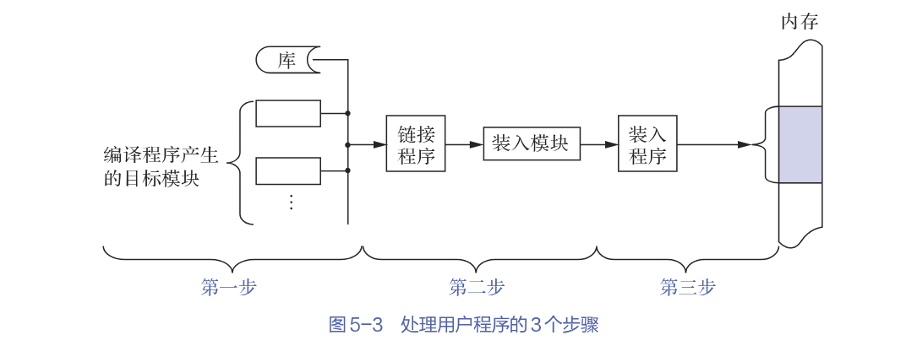

# 内存管理概述

## 内存管理主要功能

- 内存空间的分配与回收

- 地址转换

- 内存空间的扩充

- 内存共享

- 存储保护

## 内存管理基本要求

### 逻辑地址与物理地址

- 逻辑地址

    程序编译后，各个模块都从 0 开始编址，这个地址称为该模块的**逻辑地址**，也称为**相对地址**。针对x86系统，逻辑地址范围为 $0 \sim 2^{32} - 1$，即 $0 \sim 4GB$。进程在运行过程中，其本身看到与使用的内存地址就是逻辑地址。

- 物理地址

    内存中物理单元的集合，地址转换的最终结果。CPU在运行程序时，执行指令和访问数据，最后都要通过物理地址从主存中存取。

操作系统通过**内存管理部件（*MMU*）**将进程使用的逻辑地址转换为物理地址。

### 程序的链接与装入

创建一个进程需要先将一个程序和运行所需的数据装入内存中。将用户源程序转变为可在内存中执行的程序，需要经过以下几个步骤：

- 编译: 由编译程序将源代码编译成若干个目标模块

- 链接: 由链接程序将编译后形成的一组目标模块，以及它们所需要的库函数链接在一起，形成一个完整的装入模块

    当链接程序将各个模块链接成一个完整的可执行程序时，链接程序顺序依次按各个模块的相对地址构成统一的从0号单元开始编址的**逻辑地址空间**。

- 装入: 由装入程序将装入模块装入内存运行

    当装入程序将可执行代码装入内存时，必须通过地址转换将逻辑地址转换为物理地址，这个过程称为**地址重定位**。

### 链接方式

### 装入方式
