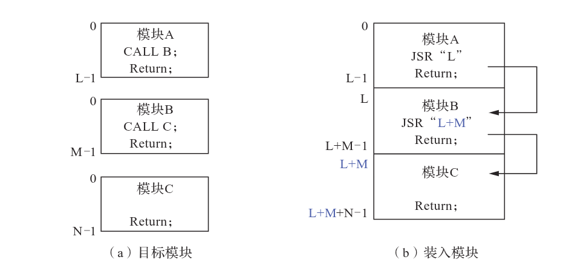
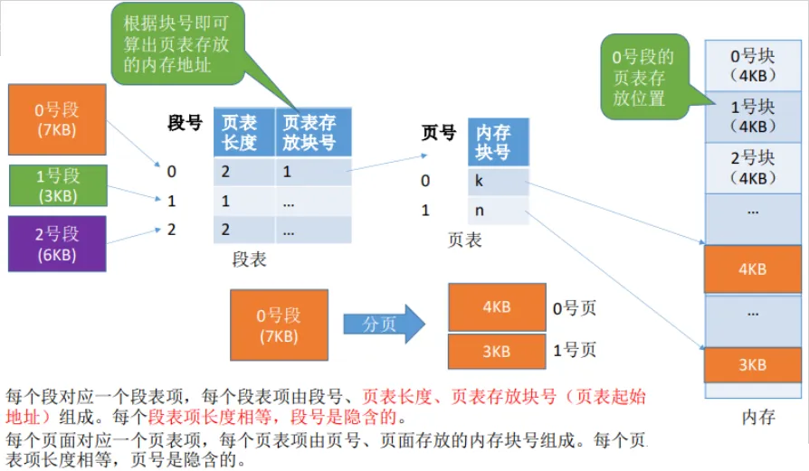

# 内存管理概述

## 内存管理主要功能

- 内存空间的分配与回收

- 地址转换

- 内存空间的扩充

- 内存共享

- 存储保护

## 内存管理基本概念

### 逻辑地址与物理地址

- 逻辑地址

    程序编译后，各个模块都从 0 开始编址，这个地址称为该模块的**逻辑地址**，也称为**相对地址**。针对x86系统，逻辑地址范围为 $0 \sim 2^{32} - 1$，即 $0 \sim 4GB$。进程在运行过程中，其本身看到与使用的内存地址就是逻辑地址。

- 物理地址

    内存中物理单元的集合，地址转换的最终结果。CPU在运行程序时，执行指令和访问数据，最后都要通过物理地址从主存中存取。

操作系统通过[**内存管理部件（*MMU*）**](https://zh.wikipedia.org/wiki/%E5%86%85%E5%AD%98%E7%AE%A1%E7%90%86%E5%8D%95%E5%85%83)将进程使用的逻辑地址转换为物理地址。

### 程序的链接与装入

创建一个进程需要先将一个程序和运行所需的数据装入内存中。将用户源程序转变为可在内存中执行的程序，需要经过以下几个步骤：


- 编译: 由编译程序将源代码编译成若干个目标模块

- 链接: 由链接程序将编译后形成的一组目标模块，以及它们所需要的库函数链接在一起，形成一个完整的装入模块

    当链接程序将各个模块链接成一个完整的可执行程序时，链接程序顺序依次按各个模块的相对地址构成统一的从0号单元开始编址的**逻辑地址空间**。

- 装入: 由装入程序将装入模块装入内存运行

    当装入程序将可执行代码装入内存时，必须通过地址转换将逻辑地址转换为物理地址，这个过程称为**地址重定位**。

### 链接方式

- 静态链接

    在程序运行前，先将各个目标模块及它们所需的库函数链接成一个完整的装入模块，以后不再拆开的连接方式。

    

    将几个目标模块装配成一个装入模块，需要解决两个问题:

    - **修改相对地址**: 每个目标模块的相对地址都是从0开始的

    - **变换外部调用符号**: 将每个模块中所用的外部调用符号也都变换为相对地址

- 装入时动态链接

    将编译后的一组模块装入内存时，采用**边装入边链接**的链接方式。

- 运行时动态链接

    在程序执行中需要访问到目标模块时，才对目标模块进行链接。

### 装入方式


- 绝对装入

    

    该方式仅适用于单道程序环境。程序中的逻辑地址与物理地址完全一致，不需要进行地址转换。

- 可重定位装入（静态重定位）

    

    该方式可用于多道程序环境。由于在装入时会发生地址转换，因此程序可以装入主存的任何位置。

    但是，这种装入方式是**一次完成**的。当一个作业装入内存时，必须分配其要求分配的所有空间；作业一旦进入内存，在运行期间就不能再移动，也不能再申请内存空间。

- 动态运行时装入（动态重定位）

    

    该方式允许一个作业在内存中移动，从而便于实现**可重入**。使用该方式装入时，不会立即将相对地址转换为绝对地址，最终的物理地址在**程序运行时**才会确定。

??? tip "静态可重定位 vs 动态可重定位[^1]"
    - 在静态重定位中，地址转换发生在装载时：当程序装载到内存中时，store指令对应的地址已经转变成了物理地址

    

    - 在动态重定位中，地址转换发生在运行时：当程序装载到内存中时，store指令对应的地址仍然是逻辑地址，当真正运行该条指令时，会通过硬件MMU（内存管理单元）将逻辑地址转换为物理地址

    

    在后者中，实现地址转换的硬件设施就是[前面](#逻辑地址与物理地址)提到的**MMU**。

### 进程的内存映像


上图主要展示的是一个进程内存映像的**用户空间**，一般包括以下要素:

- 代码段 (*text*): 程序的二进制代码。代码段是只读的，可被多个进程共享

- 数据段 (*data*): 程序运行时加工处理的对象，包括全局变量与静态变量

- 堆 (*heap*): 动态分配的内存空间，用于存储程序运行时动态分配的变量

- 栈 (*stack*): 用来实现函数调用与局部变量的存储

完整的进程地址空间与内核地址空间的结构可以参考下图[^2]:


内核空间通常对用户是不可见的。在学习进程时提到的[进程控制块 (PBC)](2-process.md#进程控制块)就是存储在内核空间中。

### 内存保护

- 设置一对**上、下限寄存器**，存放进程的上下限地址，**用于检查访问地址是否越界**

- 采用**基址寄存器（重定位寄存器）**与**限长寄存器（界地址寄存器）**进行越界检查

    - 重定位寄存器: 存放进程的起始地址

    - 界地址寄存器: 存放进程的最大逻辑地址

    二者的区别在于前者用于“加”，逻辑地址“加”上重定位寄存器得到物理地址；后者用于“比”，通过比较界地址寄存器与逻辑地址的值判断是否越界

### 内存共享

### 内存分配与回收

## 连续分配管理方式

顾名思义，连续分配的管理方式就是在内存空间中为用户程序分配一个连续的内存空间。

### 单一连续分配

在单一连续分配方式中，内存被分为**系统区**和**用户区**两部分。系统区通常位于低地址部分，用于存放操作系统内核，仅供操作系统使用；用户区位于高地址部分，仅存放一道用户程序，即用户程序**独占**整个用户空间。

这种方式的优点是简单、无外部碎片，不需要进行内存保护；缺点也很明显，只能用于单用户、单任务系统，且会产生内部碎片，**内存利用率极低**。

### 固定分区分配

固定分区分配将用户空间划分为若干个固定大小的分区，每个分区只装入一个作业，是最简单的一种多道程序存储管理方式。

当有空闲分区时，系统会从就绪队列中选取大小合适的作业装入空闲分区，并修改分区表中的状态。当作业完成时，系统会回收作业占用的分区，并将其放回空闲分区链表中。

划分分区的方法有两种:

- 分区大小相等: 所有分区的大小都保持一致。程序太小会浪费空间，太大又无法装入，**缺乏灵活性**

    !!! tip "内部碎片"
        使用固定分区分配方式时，由于分区大小固定，且程序大小小于分区大小时也需要占用整个分区，这样就会造成分区内部的空间浪费，这就是所谓的**内部碎片**。

- 分区大小不等: 划分多个不同大小的分区，可根据作业大小选择合适的分区

操作系统通过**分区使用表**来记录每个分区的使用情况。分区使用表的结构一般如下:

| 分区号 | 分区起始地址 | 分区大小 | 分区状态 |
|:------:|:------------:|:--------:|:--------:|
| 0      | 0x0            | 100      | 已使用   |
| 1      | 0x100          | 100      | 已使用   |
| 2      | 0x200          | 100      | 已使用   |
| 3      | 0x300          | 100      | 已使用   |
| 4      | 0x400          | 100      | 未使用   |

### 动态分区分配

动态分区分配不预先划分内存空间，而是在进程装入内存时，根据进程的大小动态地进行分配，在此方式中，系统中分区的大小和数量是可变的，故其也叫**可变分区分配**。


然而，从上图中不难看出，该方式在初态的分配效率确实高，但随着时间的推移，主存中的各个程序之间会产生越来越多的小内存块，这些小内存块被称为**外部碎片**。与[固定分区分配](#固定分区分配)的内部碎片的区别在于，**外部碎片存在于所有分区的外部**，是未被分配或已经回收的内存空间。

??? tip "紧凑技术"
    外部碎片可通过**紧凑技术**克服。紧凑技术通过将所有进程移动到内存的低端，从而消除外部碎片。但紧凑操作需要动态重定位寄存器的支持，且相对费时。


## 基本分页存储管理

>[3.3操作系统（基本地址变换机构 快表 两级页表 分段 段页式） | 阿里云开发者社区](https://developer.aliyun.com/article/1047094)

固定分区分配会产生内部碎片，动态分区分配会产生外部碎片，这两者对内存的利用率都不高。为了提高内存的利用率，我们希望内存的使用能够尽可能避免碎片的产生。

为此，我们引入**分页思想**: 将物理内存和进程的虚拟地址空间划分为固定大小的页（通常4KB）。每个进程的地址空间被分成多个页，物理内存也被分成相同大小的页框。通过页表建立虚拟页到物理页框的映射，实现地址转换。==操作系统以页框为单位为各个进程分配内存==。

### 分页存储基本概念

分页存储把内存和地址空间都切成固定大小的“块”:

- **虚拟页（Page）**: 进程逻辑地址空间的固定大小单元

- **物理页框（Frame）**: 物理内存的固定大小单元

- **页表（Page Table）**: 记录虚拟页到物理页框的**映射关系**

    

#### 页面和页面大小

逻辑地址中的每个页面都有一个编号，称为**页号**，从 $0$ 开始，物理内存的每个页框同理。这样在进程申请内存空间后就能形成页号与页框号的映射关系。

#### 地址结构


以x86系统为例，每个逻辑地址的结构如下:

| $31 \sim 12$ 位 | $11 \sim 0$ 位 |
|:---------:|:---------:|
| 页号 $P$      | 页内偏移量 $W$ |

分为两个部分:

- 前一部分为页号 $P$，用于索引页面在页表中的位置。共有 $20$位，即最多允许 $2^{20}$ 个页面。

- 后一部分为页内偏移量 $W$，用于索引页面内的数据。共有 $12$位，即每页大小为 $2^{12}B = 4KB$。

### 地址转换

#### 基本地址变换


1. 根据逻辑地址计算出页号 $P = A / L$、地址偏移量 $W = A \% L$

2. 判断页号是否越界，若页号 $P \geq$ 页表长度 $M$，则产生越界中断，否则继续执行

3. 在页表中查询页号对应的页表项，确定页面存放的物理块号

    页号 $P$ 对应的页表项地址 $=$ 页表起始项地址 $F +$ 页号 $P \times$ 页表项长度，取出该页表项内容 $b$，即物理块号

4. 计算物理地址 $E = bL + W$，用物理地址访问内存

    !!! note
        - 物理地址 = 页面在内存中的起始地址 + 页内偏移量

        - 页面在内存中的起始地址 = 块号 $\times$ 块大小（页框大小）

以上地址变换的过程**由硬件自动完成**。

```cpp
// 简化的页表项结构
struct page_table_entry {
    int frame_number;    // 物理页框号
    int present;         // 页是否在内存中
    int rw;             // 读写权限
    // ... 其他控制位
};

// 地址转换函数（简化版）
uint32_t translate_address(uint32_t virtual_addr, 
                          struct page_table_entry* page_table) {
    // 假设页大小为4KB (2^12)
    uint32_t page_number = virtual_addr >> 12;      // 提取页号
    uint32_t page_offset = virtual_addr & 0xFFF;    // 提取页内偏移
    
    // 检查页是否在内存中
    if (!page_table[page_number].present) {
        // 触发缺页中断
        handle_page_fault(page_number);
    }
    
    // 获取物理页框号
    uint32_t frame_number = page_table[page_number].frame_number;
    
    // 计算物理地址
    uint32_t physical_addr = (frame_number << 12) | page_offset;
    
    return physical_addr;
}
```

!!! tip "分页管理方式的主要问题"
    - 每次访存操作都需要进行地址转换，因此**地址转换的过程必须要快**，否则会导致访问效率降低

    - 每个进程都需要引入一个页表，用于存储映射，因此**页表不能太大**，否则会导致内存利用率会降低

#### 具有快表的地址变换


通过基本地址转换机构，存取一个数据或指令至少需要两次访存操作:

1. 访问页表，确定所存取的数据或指令的物理地址

2. 根据该物理地址访问主存，存取数据或指令

同时，这些数据与指令都存储在**内存**中，这样显然是低效的。

为了提高地址转换的效率，引入**快表（*Translation Lookaside Buffer*，TLB）**，也叫**相联存储器**，是一种具有并行查找能力的**高速缓存**，用于存储最近访问的页表项。相对的，主存中的页表就称为**慢表**。

使用快表的地址变换步骤如下:

1. CPU 给出逻辑地址后，由硬件进行地址转换，**将页号与快表中的所有页号进行比较**

2. 若找到匹配的页号，说明快表中存有页表项副本，则可直接取出物理块号并计算物理地址，这样就只需要**一次访存**就能完成数据存取

3. 若未匹配到页号，则继续访问慢表，并按照基本变换进行物理地址计算

快表满时，会按照一定的算法进行替换。

一般情况下，快表的命中率可达到 $90\%$ 以上，其有效性基于著名的[局部性原理](3-virtual-mem.md#局部性原理)。

### 两级页表


页表的本质也是内存中的一个个分区，将页表本身也进行分页，也就形成了**多级页表**。

这里我们讨论两级页表。

!!! tip "单级页表的问题"
    以x86系统为例，假设页大小4KB，则:
    
    - 页内偏移为 $\log_2 4KB = 12$ 位

    - 页号部分为 $32 - 12 = 20$ 位，即每个进程中的页表项数可达 $2^{20}$ 个

    这意味着每个进程仅页表就需要占用 $2^{20} \times 4KB = 4MB$ 的**连续**内存空间，这显然是不合理的。

解决上述问题的要点也不难理解:

- 对于页表占用的**连续**内存空间的问题，采用**离散分配**的方式，用一张索引表来记录各个页表的存放位置

- 针对页表占用内存过多的问题，在进程运行时，只将当前需要的页表项调入内存，其余部分驻留外存，需要时才调入（虚拟内存思想）

这时就不难发现，其实上面的思路与前面刚刚引入分页机制时的[思路](#地址结构)一模一样: 在两级页表中，外层页表（页目录）存储内层页表的物理地址，内层页表存储实际页面的物理地址。

??? example
    场景：一个文本编辑器进程，实际只使用前2MB内存（512个页面）

    - 使用单级页表:

        - 页表大小：1,048,576 页 × 4 字节 = 4MB

        - 内存占用：4MB（必须连续）

        - 实际使用：512 页 × 4 字节 = 2KB

        - 浪费率：99.95%

    - 使用两级页表:

        - 页目录表：1,024 项 × 4 字节 = 4KB（固定）

        - 内层页表：1 个（因为512页都在第一个内层页表中）

            大小 = 1,024 项 × 4 字节 = 4KB

        - 总占用：4KB + 4KB = 8KB

        - 节省：4MB → 8KB，减少 99.8%

#### 两级页表的地址变换

- **地址转换流程**：

    ```
       逻辑地址 → [页目录号][页号][页内偏移]
                ↓
         查找页目录表
                ↓
         找到内层页表地址
                ↓
         查找内层页表
                ↓
         找到物理页框号
                ↓
         物理地址 = 物理页框号 × 页大小 + 页内偏移
    ```

- **逻辑地址结构分解**：

    ```
    逻辑地址结构：
    [页目录号(10位)][页号(10位)][页内偏移(12位)]
        ↓              ↓            ↓
    外层查找       内层查找      直接使用
        ↓              ↓
    页目录表        页表
    (存储内层页表地址) (存储物理页框号)
    ```

```cpp
// 两级页表地址转换
uint32_t translate_address(uint32_t logical_addr, 
                           page_directory_t* pgd) {
    // 1. 提取页目录号和页号
    uint32_t dir_index = (logical_addr >> 22) & 0x3FF;  // 高10位
    uint32_t page_index = (logical_addr >> 12) & 0x3FF; // 中10位
    uint32_t offset = logical_addr & 0xFFF;             // 低12位
    
    // 2. 查找页目录表
    page_table_t* inner_table = pgd->entries[dir_index].page_table;
    if (!inner_table) {
        // 内层页表不存在，触发缺页异常
        return PAGE_FAULT;
    }
    
    // 3. 查找内层页表
    uint32_t frame_num = inner_table->entries[page_index].frame_num;
    
    // 4. 计算物理地址
    uint32_t physical_addr = (frame_num << 12) | offset;
    return physical_addr;
}
```

## 基本分段存储管理

>[3.3操作系统（基本地址变换机构 快表 两级页表 分段 段页式） | 阿里云开发者社区](https://developer.aliyun.com/article/1047094)

分页管理方式是从计算机角度考虑设计的，其主要目的是为**提高内存利用率**，==**通过硬件机制实现地址转换**==，对用户完全透明；分段管理则考虑到了用户和程序员，**比分页更容易实现信息的共享和保护**。

**分段存储（*Segmentation*）**把程序按逻辑单位切成独立的段，每段有自己的**段名**（在低级语言中，程序员使用段名来编程）。每段从 $0$ 开始编址，并采用**段号**和**段内偏移量**的方式进行寻址。

```assembly
MOV  AX, segment_selector_code   ; 选择代码段
MOV  DS, segment_selector_data   ; 数据段寄存器装载数据段选择子
MOV  ES, segment_selector_shared ; 执行共享库调用
CALL ES:[offset_in_shared]       ; 段内偏移跳转
```

### 段表


### 地址变换机构


### 与分页存储管理的区别

- 页是信息的**物理单位**，段是信息的**逻辑单位**

- 页的大小固定且由系统决定，段的长度不固定，取决于用户程序

- 在分页管理中，只需给出一个记忆符即可表示一个地址，因此其地址空间是**一维**的；而在分段管理中，一定要显式给出段号与段内偏移才能标识一个地址，故其地址空间是**二维**的

## 段页式管理

>[操作系统——段式存储管理、段页式存储管理 | cnblogs@王陵](https://www.cnblogs.com/wkfvawl/p/11733057.html#%E4%BA%8C%E3%80%81%E6%AE%B5%E9%A1%B5%E5%BC%8F%E5%AD%98%E5%82%A8%E7%AE%A1%E7%90%86)

| 内存管理方式 | 优点 | 缺点 |
|:-:|:-|:-|
| 分页管理 | - 消除外部碎片，物理内存利用率高<br>- 支持按需调页，便于虚拟存储实现<br>- 页大小固定，硬件实现简单 | - 可能产生内部碎片<br>- 页表可能很大，需要多级页表或 TLB 缓解<br>- 不保留程序逻辑结构，代码/数据被打散 |
| 分段管理 | - 与程序逻辑单位一致，便于共享和独立保护<br>- 访问时可进行段界限与权限检查，安全性高<br>- 适合模块化开发，易于按段加载或卸载 | - 段长不等，仍可能出现外部碎片<br>- 段表开销与管理复杂度较大<br>- 段换入换出需要连续空间，效率受限 |

分页管理能有效提高内存利用率，分段管理能反映程序的逻辑结构并利于共享和保护，将二者结合便形成了**段页式管理**:



### 地址结构

在段页式系统中，进程的逻辑地址由三个部分组成:

| 段号 $S$ | 页号 $P$ | 页内偏移量 $W$ |
|:--------:|:--------:|:--------:|

其中，段号 $S$ 用于索引段表，页号 $P$ 用于索引页表，页内偏移量 $W$ 用于索引页面内的数据。

### 地址转换机构


## 总结

!!! abstract
    无论是分页式管理、分段式管理还是段页式管理，只需掌握以下三个要点:

    - 逻辑地址结构

    - 页（段）表项结构

    - 寻址过程


[^1]: [内存管理 | KingOfDark](https://2017zhangyuxuan.github.io/2022/06/11/2022-06/2022-06-11%20%E3%80%90%E6%93%8D%E4%BD%9C%E7%B3%BB%E7%BB%9F%E3%80%91%E8%99%9A%E6%8B%9F%E5%86%85%E5%AD%98/#%E9%87%8D%E8%A6%81%E6%A6%82%E5%BF%B5)

[^2]: [Linux 内存分析——进程和物理结构角度 | Tomoku's blog](https://tomoku-dm.github.io/2019/04/13/1-memory-process-physical/)