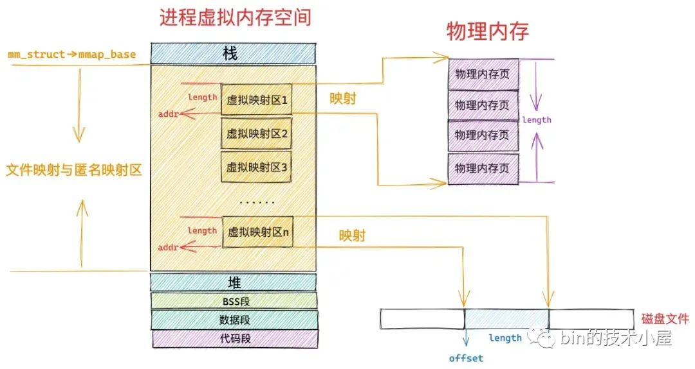

# 虚拟内存管理

## 传统内存管理方式的特征

- 一次性：作业中的所有信息都被装入内存后才能开始运行

- 驻留性：作业一旦驻留内存后，就会一直驻留在内存中直到作业运行结束，其任何部分都不会被换出

显然，这样的管理方式会造成大量实际并没用或暂时没用的程序或数据驻留内存，造成大量内存空间浪费。

## 局部性原理

>[局部性原理 | 腾讯云开发者社区](https://cloud.tencent.com/developer/article/1777697)

!!! quote
    广义上来看，地球、生命、万事万物都是局部性的产物，因为这些都是宇宙中熵分布布局、局部的熵低导致的，如果宇宙中处处熵一致，有的只有一片混沌。

**局部性**是一个常见的计算机术语，是指处理器在访问某些数据时短时间内存在重复访问，某些数据或者位置访问的概率极大，大多数时间只访问局部的数据。**其本质其实就是概率的不均等**。

局部性可分为两种类型:

- **时间局部性（*Temporal locality*）**: 如果某个信息这次被访问，那它有可能在不久的未来被多次访问。时间局部性是空间局部性访问地址一样时的一种特殊情况。

- **空间局部性（*Spatial locality*）**: 如果某个信息这次被访问，那它附近的信息也有可能被访问。从程序执行的角度来看，大部分情况下代码都是顺序执行，数据也是顺序访问的。

其他类型的局部性大多都可以看作是这两者的特例。

### 页面置换算法的局部性原理[^1]

- 从时间局部性来看，程序中的某条指令一旦被执行，不久之后很可能再次被执行，数据访问同理。原因是程序中存在大量的**循环操作**。

- 从空间局部性来看，一旦程序访问了某个存储单元，不久之后，其附近的存储单元也将被访问，即**程序在一段时间内所访问的地址，可能集中在一定的范围之内**。这是因为程序顺序执行时，指令通常是顺序存放、顺序执行的，数据也一般是以向量、数组、表等形式簇聚存储的。

## 虚拟内存概述

- 基于[局部性原理](#局部性原理)，在程序装入时，仅需将程序当前需要用到的少数页面（或段）装入内存，便可让程序开始执行。

- 在程序执行过程中，当所访问的信息不在内存时，由操作系统负责将所需信息从外存调入内存，然后继续执行程序，这个过程就是**请求调页（段）**。

- 当内存空间不足时，由操作系统负责将内存中暂时用不到的信息换出到外存，这个过程就是**页面（段）置换**。

基于上面三个实现逻辑，我们就得到了一个看上去比实际物理内存大得多的存储器，称为**虚拟存储器**。

??? tip "浏览器的省内存模式"
    上面的描述可以结合现代浏览器的“省内存模式”进行理解:

    

    一个运行中的浏览器标签只把活跃页面留在RAM，后台标签数据暂存在磁盘；你切回时操作系统再把缺页内容调入。

### 虚拟内存的特性

- 多次性: 无需**一次性**将程序的所有页面都装入内存，而是允许在程序执行过程中分多次将页面调入内存。

- **对换性**: 作业在运行时无需一直驻留在内存中，而是允许在运行过程中将某些页面换出到外存对换区，以便腾出空间来装入其他页面。

- **虚拟性**: 从逻辑上扩充了内存的容量，使用户所看到的内存容量远大于实际的物理内存容量。这是虚拟内存最显著且重要的特征。

### 虚拟内存的实现

虚拟内存的实现一般有如下三种方式:

- 请求分页存储管理

- 请求分段存储管理

- 请求段页式存储管理

与内存管理方式中的三个[现代内存管理模型](3-memory-management.md#现代内存管理方式)一一对应，但都为支持虚拟存储器而增加了一些新的机制。

同时，无论使用哪一种虚拟内存实现方式，都需要硬件支持:

- 一定容量的内存和外存

- 页表机制（或段表机制）

- **中断机构**

- 地址变换机构

## 请求分页存储管理

>[请求分页存储管理方式 | 知乎@该用户已注册](https://zhuanlan.zhihu.com/p/530601684)

### 页表机制

相比较[基本分页系统](3-memory-management.md#基本分页存储管理)，在请求分页中，为实现**请求调页功能**，操作系统需要知道每个页面是否已经调入内存，如果已经调入，则需要知道该页面在内存中的位置；如果未调入，则需要知道该页面在外存中的位置。

同时，为了实现**页面置换功能**，操作系统需要根据某种指标来决定将哪个页面换出内存，对于要换出的页面，还需要知道其是否被修改过，以决定是否需要写回外存。

针对上述两个需求，请求页表项添加了四个字段:

- **状态位 $P$**: 用于表示页面是否已经调入内存，供程序访问时参考。

- **访问字段 $A$**: 用于记录页面一段时间内被访问的次数，或本页已有多长时间未被访问，供置换算法选择换出页面时参考。

- **修改位 $M$**: 用于表示页面是否被修改过，以决定换出时是否需要写回外存。

- **外存地址**: 用于记录页面在外存中的位置，通常是物理块号，供调入页面时使用。

| 页号 | 物理块号 | 状态位 $P$ | 访问字段 $A$ | 修改位 $M$ | 外存地址 |
|:---:|:---:|:---:|:---:|:---:|:---:|

### 缺页中断机构

在请求分页系统中，当要访问的页面不在内存时，便会产生一次缺页中断，请求操作系统的缺页中断处理程序处理。此时缺页的进程会进入[阻塞状态](2-process.md#三种基本状态)，放入阻塞队列；调页完成后，进程会从阻塞状态变为[就绪状态](2-process.md#三种基本状态)，并插入就绪队列等待调度。

缺页中段与一般中断有两个明显区别:

- 在指令执行期间而非一条指令执行完后产生和处理中断信号，属于[内部异常](1-os-run-env.md#中断与异常)

- 一条指令在执行期间，可能产生多次缺页中断

### 地址变换机构

在基本分页系统的基础上增加了**中断产生/处理**与**页面置换**，流程描述如下:

1. 先检索快表，若命中，则从对应表项取出该页的物理块号，并修改页表项中的访问位 $P$，以供置换算法换出页面时参考。对于写指令，还需将修改位 $M$ 置 1。

2. 若快表检索未命中，则需要从页表中找到该页的物理块号，并将其放入快表中。

3. 若在页表中也未找到，则需要进行**缺页中断处理**，请求系统将该页从外存换入内存，更新页表、快表，并获得物理块号。

4. 利用上面获取的物理块号拼接页内地址形成物理地址，使用该地址访存。

## 页框分配

### 驻留集大小

前面我们提到，对于分页式的虚拟内存，在进程准备执行时，不需要也不可能一个进程的所有页装入主存。因此，操作系统需要决定读取多少页，即决定给特定进程分配多少页框。

给一个进程分配的页框的集合就是这个进程的**驻留集**。

#### 驻留集大小对系统的影响

- 驻留集越小，驻留在内存中的进程就越多，可以提高多道程序的并发度。但由于分配给每个进程的页框数量有限，会导致缺页率较高，CPU需要耗费大量时间来处理缺页

- 驻留集越大，当分配给进程的页框超过某个数量时，再为进程增加页框对缺页率改善是不明显的，反而会浪费内存空间，还会导致多道程序并发度降低

### 内存分配策略

1. 固定分配局部置换

    为每个进程分配固定数量的页框，在进程运行过程中，不再增加或减少页框数量。

2. 可变分配全局置换

    先为每个进程分配一定数量的页框，在进程运行期间根据实际情况增加或减少页框数量。

3. 可变分配局部置换

    先为每个进程分配一定数量的页框，当进程发生缺页时，只允许从该进程在内存的页面中选出一页换出，因此不会影响其他进程的运行。

!!! tip "局部置换与全局置换的概念"
    - 所谓**局部置换**，是指若进程在运行中发生缺页，则只能从分配给该进程的页框中选出一页换出，然后再将所缺页面调入，以保证分配给该进程的内存空间不变。

    - 所谓**全局置换**，是指若进程在运行中发生缺页，则系统从空闲物理块队列中选出一块分配给该进程，并将所缺页面调入

    - 全局置换意味着一个进程拥有的物理块数量必然会变化，因此不可能与固定分配方式兼容。

### 物理块调入算法

1. 平均分配算法

    将系统中所有空闲物理块平均分配给各个进程

2. 按比例分配算法

    根据进程的大小按比例分配物理块

3. 优先权分配算法

    为重要和紧迫的进程分配较多的物理块

### 调入页面的时机

1. 预调页策略

2. 请求调页策略

### 从何处调入页面

### 如何调入页面

## 页面置换算法

>[一文看懂页面置换算法 | 知乎@极致Linux内核](https://zhuanlan.zhihu.com/p/553372876)
>
>[内存页面置换算法 | 小林coding](https://www.xiaolincoding.com/os/5_schedule/schedule.html#%E5%86%85%E5%AD%98%E9%A1%B5%E9%9D%A2%E7%BD%AE%E6%8D%A2%E7%AE%97%E6%B3%95)

在进程运行的过程中，若需要访问的页面不再内存中，则需要从外存调入；若此时内存此时已满，就需要依照某种规则选择一个页面从内存中换出。这个描述如何选择换出页面的规则就是**页面置换算法**。

评价一个页面置换算法的标准通常是进程运行过程中的**缺页率**。页面的换入换出需要占用磁盘I/O，因此好的页面置换算法应当追求更低的缺页率；但同时，页面置换算法本身也需要占用系统资源，因此还需权衡**算法本身的复杂度**。

### 最佳置换算法

**最佳（OPT）置换算法**选择淘汰的页面是以后永不使用的页面，或是在最长时间内不再被访问的页面，以便获得最低的缺页率。

然而，人们目前无法预测进程在内存的若干页面哪个是未来最长时间内不再被访问的，因此这是一种理想情况下的置换算法，又称**理想置换算法**，现实中无法实现，但可以作为评价其他置换算法的基准。

### 先进先出置换算法

**先进先出（FIFO）置换算法**选择淘汰的页面是最早进入内存的页面。

该算法实现简单，将内存中的页面根据调入的先后顺序排成一个队列，需要换出时选择队头的页面。

但该算法的局限性也是显而易见的，其**违背了局部性原理**，与进程实际运行的规律相违背，因为先进入内存的页面也有可能经常被访问，因此性能较差。

!!! warning "Belady异常"
    若采用FIFO算法，会出现当为进程分配的物理块增多，缺页次数却不降反增的异常现象，称为**Belady异常**。

    这是由于FIFO算法的置换特征与进程访问内存的动态特征是矛盾的，与置换算法的目标是不一致的（既替换较少使用的页面），因此，被它替换出去的页面并不一定是进程不会访问的。

    Belady异常只有在FIFO算法中会出现，[LRU](#最近最久未使用置换算法)与[OPT](#最佳置换算法)永远不会出现。

### 最近最久未使用置换算法

**最近最久未使用（LRU）置换算法**选择淘汰的页面是最近一段时间内最久未被访问的页面。其核心思想是，过去一段时间内未被访问过的页面，在最近的将来被访问的可能性也很低。

LRU算法的性能最接近OPT算法，但实现起来开销较大，需要寄存器和栈的硬件支持。

### 时钟置换算法

时钟页面置换算法跟 LRU 近似，又是对 FIFO 的一种改进。

该算法的思路是，把所有的页面都保存在一个类似钟面的「环形链表」中，一个表针指向最老的页面。

当发生缺页中断时，算法首先检查表针指向的页面：

- 如果它的访问位位是 0 就淘汰该页面，并把新的页面插入这个位置，然后把表针前移一个位置

- 如果访问位是 1 就清除访问位，并把表针前移一个位置，重复这个过程直到找到了一个访问位为 0 的页面为止

## 抖动和工作集

### 抖动

在页面置换的过程中，一种最糟糕的情况是，刚刚换出的页面马上又要换回内存，反之亦然，这种频繁的页面调度行为称为**抖动**或**颠簸**。

#### 抖动的描述与处理措施

系统发生抖动的根本原因是，分配给每个进程的物理块太少，不能满足进程正常运行的基本需求，致使每个进程在运行时频繁出现缺页，必须请求系统调页。

这时，进程对磁盘的访问时间急剧攀升，造成每个进程大量时间都花费在等待磁盘I/O（用于页面的换入换出）上，而几乎不能再去做任何有效的工作，进而发生CPU利用率急剧下降并趋于零的情况。

抖动的发生与进程分配物理块的多少（[驻留集](#驻留集大小对系统的影响)）有关，因此引入进程**工作集**的概念:

### 工作集

>[工作集 | Microsoft Learn](https://learn.microsoft.com/zh-cn/windows/win32/memory/working-set)

工作集是指某段时间间隔内，进程要访问的页面的集合。

一般来说，工作集 $W$ 可由时间 $t$ 和工作集窗口尺寸 $\delta$ 来确定。

工作集反应了进程接下来一段时间内很有可能频繁访问的页面集合，因此，**驻留集大小不能小于工作集大小**，否则进程在运行过程中会频繁换页。

## 页框回收

>[Linux内存管理-页面回收 | 知乎@极致Linux内核](https://zhuanlan.zhihu.com/p/599682403)

## 内存映射文件

>[Linux进程间通信【共享内存】 | 腾讯云开发者社区](https://cloud.tencent.com/developer/article/2299197)

在学习进程管理时，我们知道进程可通过共享内存来进行[通信](2-process.md#进程通信)。

实际上，很多时候，**共享内存**是通过映射相同文件到通信进程的虚拟地址空间来实现的。当多个进程映射到同一个文件时，若其中的一个程序在共享内存上完成了一个写操作，其他进程在映射到这个文件的虚拟地址空间上进行读操作时，就能立刻看到写操作的结果。

**内存映射文件（Memory-Mapped File）**是操作系统向应用程序提供的一个**系统调用**，与虚拟内存有点类似，在磁盘文件与进程虚拟地址空间之间建立一个映射关系，使得应用程序可以用访问内存的方式访问磁盘文件；同时方便多个进程共享同一个磁盘文件，提高文件的读写效率。

[^1]: 《2026年操作系统考研复习指导》（王道论坛[编著]）P214