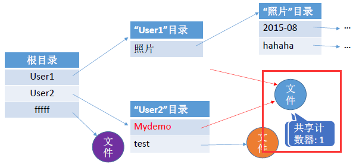

# 目录

## 基本概念

[FCB](4-file-sys-overview.md#文件控制块)的有序集合称为**文件目录**，一个FCB就是一个文件目录项。

## 目录操作

- 搜索: 使用文件时，需要先找到文件的FCB，即找到文件目录项

- 创建文件: 创建一个新文件时，需要在目录中增加一个目录项

- 删除文件: 与创建文件同理

- 创建目录: 在树型目录结构中，用户可创建自己的用户文件目录，并可再创建子目录

- 删除目录

    - 不删除非空目录: 删除时要先删除目录下的所有文件，并递归地删除子目录

    - 可删除非空目录: 目录中的文件和子目录同时被删除

- 移动目录: 将文件或子目录在不同的父目录间移动，文件路径会随之改变

- 显示目录: 请求显示目录中的所有文件和子目录

- 修改目录: 修改目录的名称、属性等，需要改变相应的目录项

## 目录结构

>[文件目录-重学操作系统之文件管理 | 稀土掘金@蛙哇](https://juejin.cn/post/7043687172951506980#heading-9)

### 单级目录

整个系统中只建立一张目录表，每个文件占用一个目录项。

- **建立一个新文件时**，必须先检索所有目录项，以确保**文件名唯一**，然后在该目录表中增加一个目录项，将新文件的属性信息填入其中

- **访问一个文件时**，先按文件名在该目录中找到相应的FCB，经合法性检查后执行相应的[访问操作](4-file-sys-overview.md#访问类型)

- **删除一个文件时**，先在该目录中找到相应的FCB，回收文件占用的存储空间，然后清除该目录项

单级目录实现了“按名存取”，但是文件名不能重复、查找速度慢、不便于文件共享等。这些问题导致单击目录**不适合用于多用户系统**。

### 两级目录

为克服单级目录存在的问题，可在单级目录的基础上增加一个目录表，将整个目录分为**主文件目录（Master File Directory, MFD）**和**用户文件目录（User File Directory, UFD）**两级。
，并清除该目录项

其中:

- **主文件目录项**记录用户名及相应用户文件目录所在的存储位置。

- **用户文件目录项**记录该用户所有文件的FCB。

两级目录提高了检索的速度。当一个用户欲对其文件进行访问时，只需搜索该用户对应的UFD即可，解决了不同用户文件的“重名”问题还一定程度上保证了文件的安全性（可在不同用户目录上实现**访问限制**）。

但两级目录缺乏灵活性，**无法对文件进行分类**。

### 树型目录

[Linux系统目录](https://www.cnblogs.com/jxhd1/p/6715826.html)原型就是典型的树型目录结构。

### 有向无环图目录

## 目录实现

### 线性列表

### 哈希表

## 文件共享

### 基于索引节点的链接（硬链接）

### 基于符号链接的共享（软链接）
