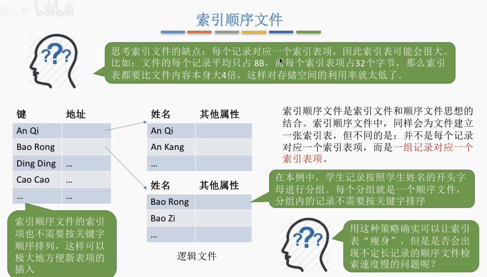

# 文件系统概述

>[文件系统接口 | rCore-Tutorial-Book-v3 3.6.0-alpha.1 文档](https://rcore-os.cn/rCore-Tutorial-Book-v3/chapter6/1fs-interface.html)

## 文件的基本概念

**文件（File）**是以硬盘为载体的存储在计算机上的**信息集合**，可以是文本、图片、音频、视频、程序等。在Linux系统中，就有“万物皆文件”的理念。

在系统运行时，**计算机以进程为单位进行资源的调度和分配**；而**在用户的输入/输出中，则以文件为单位进行数据的传输**。

简单来说，前面我们所学的概念，绝大多数是面向系统的，而**文件系统**则是面向用户的。

当用户将文件用于程序的输入/输出时，还希望可以访问、修改和保存文件等，实现对文件的**管理**，这就需要操作系统一个管理系统实现这些，这就是**文件系统（File System）**的由来。

### 文件的定义

从自底向上的定义方式结构化地定义文件:

1. 数据项: 文件系统最低级的数据组织形式，可分为以下两种类型:

    - 基本数据项: 用于描述一个对象的某种属性的一个值，是数据中的最小逻辑单位

    - 组合数据项: 顾名思义，由多个基本数据项组合而成

2. 记录: 一组相关数据项的**集合**，**用于描述一个对象在某些方面的属性**

3. 文件: 由创建者所定义的、具有文件名的一组相关元素的集合，分为**有结构文件**和**无结构文件**两种:

    - 有结构文件: 由若干记录组成的数据序列

    - 无结构文件: 被视为**字符流**的文件，如二进制文件或字符文件

事实上，关于文件并没有严格的定义。在操作系统中，文件可以由任何形式的数据或程序组织而成，如数字、字符、二进制代码等，甚至是硬件设备（如移动硬盘、U盘等）。理论上，只要是计算机系统能够识别的数据流，都可以被组织成文件（这就不难理解为什么在 Linux 中“万物皆文件”的理念了）。

### 文件的属性

- 名称

- 类型

- 创建者

- 所有者

- 位置

- 大小

- 保护

- 操作时间戳

    - 创建时间

    - 最后一次修改时间

    - 最后一次访问时间

### 文件的分类

- 按性质和用途分类

    - 系统文件

    - 用户文件

    - 库文件

- 按文件中数据的形式分类

    - 源文件

    - 目标文件

    - 可执行文件

- 按存取控制属性分类

    - 可执行文件

    - 只读文件

    - 可读/写文件

- 按组织形式和处理方式分类

    - 普通文件

    - 目录文件

    - 特殊文件

## 文件控制块和索引节点

FCB或索引节点相当于图书馆中书籍的索书号，我们可在图书管理系统上查询到书籍的索书号，从而找到书籍实际存放的物理位置。

### 文件控制块

和进程一样，为了方便管理，引入一个**在磁盘中连续存储的数据结构**来存储控制文件所需的各种信息，即**文件控制块（File Control Block，FCB）**。

- 一个典型的文件控制块实现:

    | 文件名 |
    |:-----:|
    | 文件类型 |
    | 文件权限 |
    | 文件大小 |
    | 文件数据块指针 |

从抽象的角度来看，一个FCB主要包含以下信息:

- 基本信息: 文件名、文件的物理位置、文件的物理结构/逻辑结构等

- 存取控制信息: 文件所有者/核准用户/一般用户的存取权限

- 使用信息: 文件的建立时间、修改时间等

### 索引节点

前文提到的管理方式通常使用*文件名*作为文件检索的**唯一标识**，在这种方式下，查找目录需要连续不断地将磁盘中的用于存放目录的盘块调入内存进行逐一比较，直至找到为止。

在索引文件的过程中，我们仅用到了文件名，当且仅当文件名匹配时，才需要从存放该文件的目录项中读出文件的物理地址。文件的其他描述信息在这个过程中并没有用到，不需要调入内存。因此，可以采用**文件名和文件描述信息分离**的方式，使文件描述信息单独形成一个称为**索引节点**的数据结构，简称 $i$ 节点。

在这种模型中，文件目录中的每个目录项仅由文件名和相应的索引节点（或索引节点指针）构成:

| 文件名 | 索引节点编号/指针 |
|:-----:|:-----:|
| 文件名1 | ... |
| 文件名2 | ... |
| ... | ... |

#### 磁盘索引节点

存放在磁盘上的索引节点，称为**磁盘索引节点（Disk Index Node，DIN）**，主要包含以下信息:

- 文件主标识符: 拥有该文件的用户 ID

- 文件类型: 文件的类型，如普通文件、目录文件、特殊文件等

- 文件存取权限: 各类用户对该文件的存取权限

- 文件物理地址: 每个索引节点中包含13个地址项（iaddr(0) ~ iaddr(12)），以直接或间接的方式给出数据文件所在盘块的编号

- 文件长度: 文件的大小，以字节为单位

- 文件链接计数: 该文件系统中指向该文件的文件名数目

- 文件存取时间: 文件的最近访问时间、创建时间、索引节点最近被修改的时间

#### 内存索引节点

文件被打开时，要将磁盘索引节点复制到内存的索引节点**内存索引节点（Memory Index Node，MIN）**上。

MIN在DIN的基础上新增以下信息:

- 索引节点号: 用于标识内存索引节点

- 状态: 指示节点是否上[锁](2-sync-mutex.md#互斥锁)或被修改

- 访问计数: 记录该节点被进程访问的次数

- 逻辑设备号: 文件所属文件系统的逻辑设备号

- 链接指针: 设置分别指向空闲链表和散列队列的指针

## 文件操作

文件属于**抽象数据类型**。

操作系统提供了一系列**系统调用**来实现对文件的创建、删除、读、写、打开和关闭等操作。

### 基本操作

- 创建文件

    创建文件需要两个必要步骤:

    - 为新文件分配外存空间

    - 在目录中增加一条目录项，记录新文件名和外存地址等信息

- 删除文件

    - 根据文件名查找目录

    - 删除制定文件对应的目录项和文件控制块

    - 回收该文件占有的存储空间（包括磁盘空间、内存缓冲区）

- 读文件

    - 根据文件名查找目录

    - 从目录中读出文件的物理地址

    - 目录项中有个用于对文件进行读操作的指针

- 写文件

    - 大体步骤与读操作同理

    - 每当发生写操作时，更新写指针
    
### 文件的打开与关闭

>[打开和关闭一个文件到底是什么意思？ | Reddit](https://www.reddit.com/r/learnprogramming/comments/xspcqx/what_does_it_really_mean_to_open_and_close_a_file/?tl=zh-hans)
>
>[操作系统原理与源码实例讲解：文件的打开与关闭 | 知乎@程序员光剑](https://zhuanlan.zhihu.com/p/671045308)


#### 打开的过程

#### 关闭的过程

### 文件的逻辑结构

>[文件的逻辑结构 | 从 01 开始](https://www.peterjxl.com/ComputerOS/cskaoyan/file-logical-structure/#%E6%97%A0%E7%BB%93%E6%9E%84%E6%96%87%E4%BB%B6)

#### 无结构文件

由字符流组成的文件，也称为**流式文件**。

#### 有结构文件

有一个以上的[记录](#文件的定义)组成的文件，也称为**记录式文件**。分为定长记录和变长记录两种:


- 定长记录: 每个记录的长度相同

- 变长记录: 每个记录的长度不一定相同

按组织形式进行分类，有结构文件可分为:

- 顺序文件

    

    - 串结构

    - 顺序结构

- 索引文件

    

- 索引顺序文件

    

- 直接文件或**散列文件**[^1]

    

### 文件的物理结构

>[文件的物理结构（上） | 从 01 开始](https://www.peterjxl.com/ComputerOS/cskaoyan/file-physical-structure-1/#%E6%96%87%E4%BB%B6%E5%9D%97%E3%80%81%E7%A3%81%E7%9B%98%E5%9D%97)
>
>[文件的物理结构（下） | 从 01 开始](https://www.peterjxl.com/ComputerOS/cskaoyan/file-physical-structure-2/#%E5%A4%9A%E7%BA%A7%E7%B4%A2%E5%BC%95)

#### 连续分配


#### 链接分配

##### 隐式链接


##### 显式链接


#### 索引分配

##### 单级索引


##### 多级索引


##### 混合索引


### 文件保护

#### 访问类型

- 读

- 写

- 执行

- 添加

- 删除

- 列表清单

在Linux系统中，访问类型可以通过列出命令（`ls -l`）查看:

```bash
$ ls -l
总计 416
drwxr-xr-x 1 virtualguard virtualguard     12 11月 9日 17:04 code
drwxr-xr-x 1 virtualguard virtualguard    112 11月 6日 19:59 docs
drwxr-xr-x 1 virtualguard virtualguard     86 10月19日 13:47 list
drwxr-xr-x 1 virtualguard virtualguard     96 10月18日 16:34 overrides
drwxr-xr-x 1 virtualguard virtualguard    206 11月 3日 00:26 scripts
drwxr-xr-x 1 virtualguard virtualguard    360 10月30日 21:46 site
drwxr-xr-x 1 virtualguard virtualguard    172 10月13日 21:03 templates
drwxr-xr-x 1 virtualguard virtualguard    130 11月 6日 21:11 trash
-rw-r--r-- 1 virtualguard virtualguard    218 11月 3日 00:28 deploy_config.yml
-rw-r--r-- 1 virtualguard virtualguard    105 11月 3日 00:27 justfile
-rw-r--r-- 1 virtualguard virtualguard  19346  6月27日 12:09 LICENSE
-rw-r--r-- 1 virtualguard virtualguard   6979 11月 9日 14:25 mkdocs.yml
-rw-r--r-- 1 virtualguard virtualguard    752 11月 5日 19:40 pyproject.toml
-rw-r--r-- 1 virtualguard virtualguard    901  7月 2日 14:40 README.md
-rw-r--r-- 1 virtualguard virtualguard   2862 11月12日 20:28 requirements.txt
-rw-r--r-- 1 virtualguard virtualguard 374349 11月 5日 19:40 uv.lock
```

前面的`drwxr-xr-x`就是访问类型。其中:

- `d`表示目录
- `r`表示读
- `w`表示写
- `x`表示执行
- `-`表示没有权限

共有三组`rwx`，分别表示下面提到的三个用户类型。

#### 访问控制

精简的访问控制列表可采用以下三种用户类型:

- **文件所有者**: 创建文件的用户

- **组用户**: 一组需要**共享**文件且具有类似访问权限的用户

- **其他用户**: 系统内的其他用户


[^1]: [计算机科学导论：第十三章 文件结构 | 知乎@编程高手进阶之路](https://zhuanlan.zhihu.com/p/390316587)
