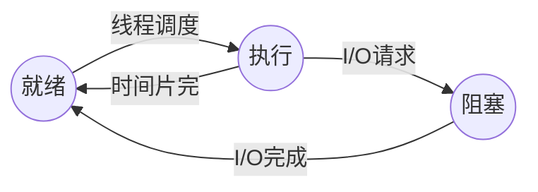

# 程序与进程

> [程序和进程-操作系统原理 (2025 春季学期) | Yanyan's wiki](https://jyywiki.cn/OS/2025/lect5.md)
>
> [操作系统简易模型](os-model.md)

## 程序与进程的关系

    
程序是状态机的<strong>静态描述</strong>

- 程序描述了所有可能的程序状态

- 程序 (动态) 运行起来，就成了进程 (进行中的程序)

## 进程

### 基本状态与转换

#### 三种基本状态

- **就绪（*ready*）状态**

- **执行（*running*）状态**

- **阻塞（*block*）状态**

#### 创建状态和终止状态
