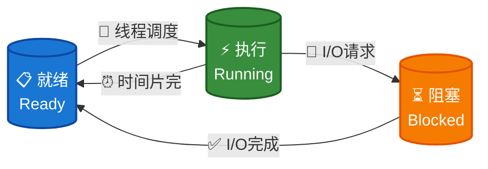
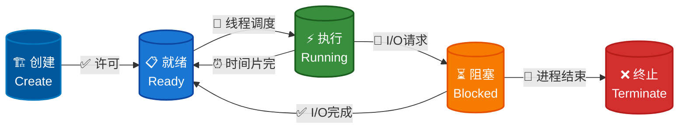
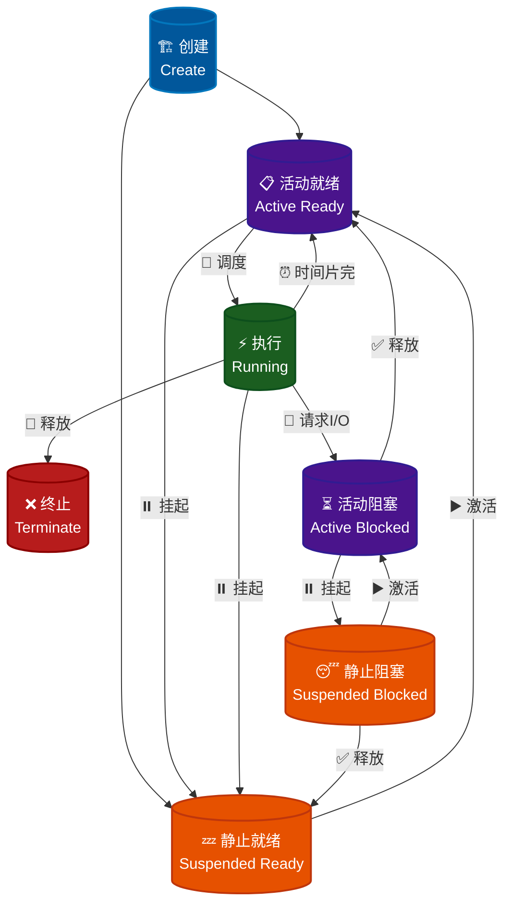

# 程序与进程

> [操作系统简易模型](intro/os-model.md)


## 程序与进程的关系[^1]

<div class="text-center-container" style="text-align: center;">
    <p>程序是状态机的<strong>静态描述</strong></p>
</div>

- 程序描述了所有可能的程序状态

- 程序 (动态) 运行起来，就成了进程 (进行中的程序)

## 进程

### 操作系统视角下的进程

进程作为操作系统分配资源与进行调度的基本**独立**单位，必须对其加以描述使得操作系统能够识别并加以管理。

在操作系统中，使用一种被称为**PCB**（*Process Control Block*, 进程控制块）的数据结构来描述进程。

### 基本状态与转换

#### 三种基本状态

- **就绪（*ready*）状态**

    - 进程已经具备运行条件（已分配到除CPU以外的所有必要资源），等待 CPU 资源的分配

    - 操作系统会将就绪进程按照一定的调度算法插入到就绪队列中，等待调度

- **执行（*running*）状态**

    - 进程已分配到CPU资源，正在运行

    - 单处理机系统中，同一时间段内只有一个进程处于执行状态

    - 多处理机系统中，多个进程可同时处于执行状态

- **阻塞（*block*）状态**

    - 进程在执行过程中由于发生事件（如 I/O 请求, 申请缓冲区失败等）而暂时无法继续执行，需要等待事件完成

    - 操作系统会根据阻塞原因的不同，将进程插入到不同的阻塞队列中



#### 创建状态和终止状态

- **创建（*create*）状态**

    进程的创建相对复杂，需要注册进程控制块，设置进程的初始状态，并为其分配资源:

    - 进程申请空白 PCB，并向 PCB 中填写必要信息 (进程标识符, 进程状态 (处理机上下文), 进程优先级, 进程程序计数器, 进程内存地址空间等)

    - 为进程分配所需资源 (内存, 文件, 设备等)

    - 将进程插入就绪队列，等待调度

- **终止（*terminate*）状态**

    进程的终止相对简单，只需经历两个步骤:

    - 其他进程或OS提取相关信息

    - 将 PCB 空间返还给操作系统 (系统删除该进程)



#### 挂起操作

##### 什么是挂起操作

**挂起（*suspend*）操作**是操作系统中允许系统将进程从内存中移除，释放其占用的内存资源，同时保持进程的状态信息，以便后续能够恢复执行。

结合前面提到的进程描述（操作系统视角下的进程）具体来说，挂起是将进程从内存中移除，但保留其PCB和状态信息，使其进入挂起状态的操作。

与挂起操作对应的操作是**激活（*active*）操作**，即将挂起状态的进程重新加载到内存中，恢复其执行状态。

可以结合以下代码理解挂起和激活操作的具体操作流程:

```py
# 伪代码示例
def suspend_process(pid):
    # 1. 保存进程状态到磁盘
    save_process_state(pid, "disk:/suspended/")
    
    # 2. 释放内存空间
    release_memory(pid)
    
    # 3. 更新进程状态
    update_process_state(pid, SUSPENDED)
    
    # 4. 从就绪队列移除
    remove_from_ready_queue(pid)

def active_process(pid):
    # 1. 从磁盘恢复状态
    restore_process_state(pid, "disk:/suspended/")
    
    # 2. 重新分配内存
    allocate_memory(pid)
    
    # 3. 恢复到就绪状态
    update_process_state(pid, READY)
    
    # 4. 重新加入调度队列
    add_to_ready_queue(pid)
```

##### 为什么需要挂起操作

以下是几种典型的场景:

1. 系统或用户用于暂停进程的执行，以便系统提取信息或用户在出现问题时进行排查

2. 调节系统负载，在资源不足时将某些不重要的进程挂起，以保证关键进程的运行

3. 父进程用于协调各子进程间的活动

!!! abstract
    可以简单概括成：**进程调试**、**负载调节**、**资源优化**、**内存管理**等

##### 引入挂起操作后进程的状态转换

在引入挂起和激活后，进程的状态转换变得更加复杂，与二者相关状态转换如下:

1. 活动就绪 → 静止就绪

2. 活动阻塞 → 静止阻塞

3. 静止就绪 → 活动就绪

4. 静止阻塞 → 活动阻塞

关键在于**活动**与**静止**上，从挂起操作与激活操作的定义不难得出二者是如何转换的。



## 进程控制


[^1]: [程序和进程-操作系统原理 (2025 春季学期) | Yanyan's wiki](https://jyywiki.cn/OS/2025/lect5.md)