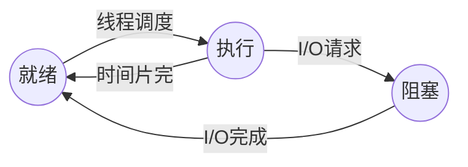
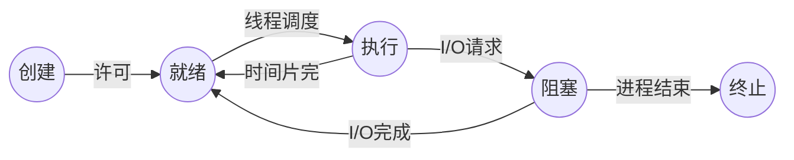

# 程序与进程

> [操作系统简易模型](intro/os-model.md)

## 程序与进程的关系[^1]

    
程序是状态机的<strong>静态描述</strong>

- 程序描述了所有可能的程序状态

- 程序 (动态) 运行起来，就成了进程 (进行中的程序)

## 进程

### 操作系统视角下的进程

进程作为操作系统分配资源与进行调度的基本**独立**单位，必须对其加以描述使得操作系统能够识别并加以管理。

在操作系统中，使用一种被称为**PCB**（*Process Control Block*, 进程控制块）的数据结构来描述进程。

### 基本状态与转换

#### 三种基本状态

- **就绪（*ready*）状态**

    - 进程已经具备运行条件（已分配到除CPU以外的所有必要资源），等待 CPU 资源的分配

    - 操作系统会将就绪进程按照一定的调度算法插入到就绪队列中，等待调度

- **执行（*running*）状态**

    - 进程已分配到CPU资源，正在运行

    - 单处理机系统中，同一时间段内只有一个进程处于执行状态

    - 多处理机系统中，多个进程可同时处于执行状态

- **阻塞（*block*）状态**

    - 进程在执行过程中由于发生事件（如 I/O 请求, 申请缓冲区失败等）而暂时无法继续执行，需要等待事件完成

    - 操作系统会根据阻塞原因的不同，将进程插入到不同的阻塞队列中

#### 创建状态和终止状态

- **创建（*create*）状态**

    进程的创建相对复杂，需要注册进程控制块，设置进程的初始状态，并为其分配资源:

    - 进程申请空白 PCB，并向 PCB 中填写必要信息 (进程标识符, 进程状态, 进程优先级, 进程程序计数器, 进程内存地址空间等)

    - 为进程分配所需资源 (内存, 文件, 设备等)

    - 将进程插入就绪队列，等待调度

- **终止（*terminate*）状态**

    进程的终止相对简单，只需经历两个步骤:

    - 其他进程或OS提取相关信息

    - 将 PCB 空间返还给操作系统 (系统删除该进程)

[^1]: [程序和进程-操作系统原理 (2025 春季学期) | Yanyan's wiki](https://jyywiki.cn/OS/2025/lect5.md)