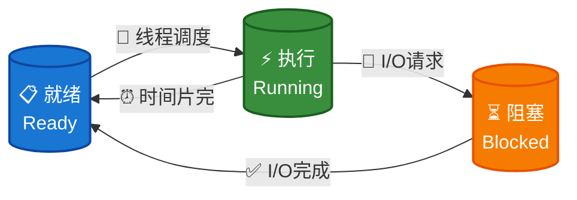
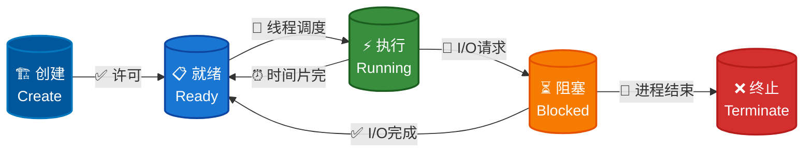
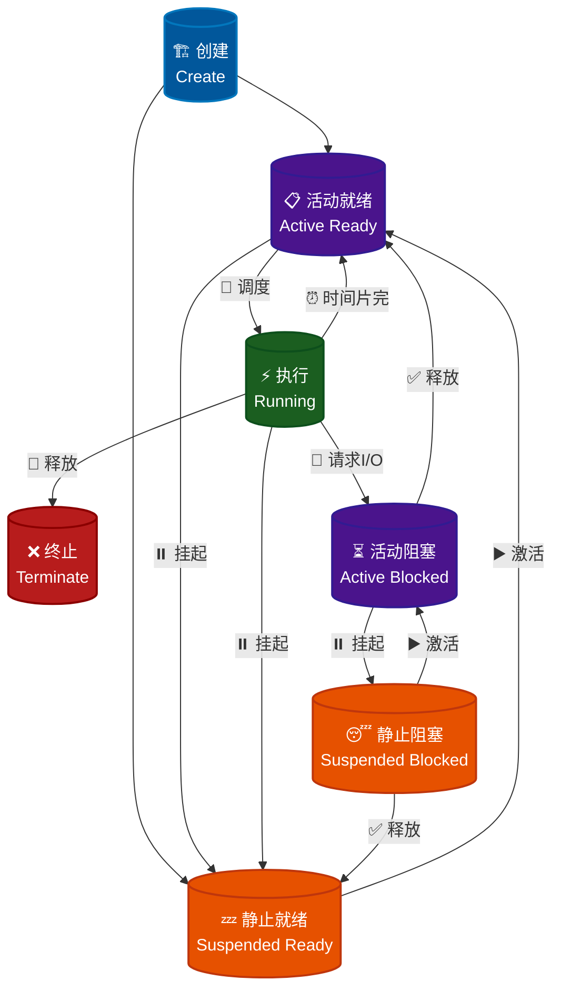

# 进程的描述与控制

> [操作系统简易模型](intro/os-model.md)


## 程序与进程的关系[^1]

<div class="text-center-container" style="text-align: center;">
    <p>程序是状态机的<strong>静态描述</strong></p>
</div>

- 程序描述了所有可能的程序状态

- 程序 (动态) 运行起来，就成了进程 (进行中的程序)

## 进程的描述

### 操作系统视角下的进程

进程作为操作系统分配资源与进行调度的基本**独立**单位，必须对其加以描述使得操作系统能够识别并加以管理。

在操作系统中，使用一种被称为**PCB**（*Process Control Block*, 进程控制块）的数据结构来描述进程。

### 基本状态与转换

#### 三种基本状态

- **就绪（*ready*）状态**

    - 进程已经具备运行条件（已分配到除CPU以外的所有必要资源），等待 CPU 资源的分配

    - 操作系统会将就绪进程按照一定的调度算法插入到就绪队列中，等待调度

- **执行（*running*）状态**

    - 进程已分配到CPU资源，正在运行

    - 单处理机系统中，同一时间段内只有一个进程处于执行状态

    - 多处理机系统中，多个进程可同时处于执行状态

- **阻塞（*block*）状态**

    - 进程在执行过程中由于发生事件（如 I/O 请求, 申请缓冲区失败等）而暂时无法继续执行，需要等待事件完成

    - 操作系统会根据阻塞原因的不同，将进程插入到不同的阻塞队列中



#### 创建状态和终止状态

- **创建（*create*）状态**

    进程的创建相对复杂，需要注册进程控制块，设置进程的初始状态，并为其分配资源:

    - 进程申请空白 PCB

    - 为进程分配所需资源 (内存, 文件, 设备等)

    - 初始化 PCB, 向 PCB 中填写必要信息 (进程标识符, 进程状态 (处理机上下文), 进程优先级, 进程程序计数器, 进程内存地址空间等)

    - 将进程插入就绪队列，等待调度

    在操作系统中，有以下几种场景会触发进程创建:

    1. 用户登录

    2. 作业调度

    3. 提供服务

    4. 应用请求

- **终止（*terminate*）状态**

    - 进程的终止相对简单，简单概括只需经历两个步骤:

        - 其他进程或OS提取相关信息

        - 将 PCB 空间返还给操作系统 (系统删除该进程)

    在操作系统中，有以下几种场景会引起进程终止:

    1. 正常终止

    2. 异常终止

    3. 外界干预



#### 挂起操作

##### 什么是挂起操作

**挂起（*suspend*）操作**是操作系统中允许系统将进程从内存中移除，释放其占用的内存资源，同时保持进程的状态信息，以便后续能够恢复执行。

结合前面提到的进程描述（操作系统视角下的进程）具体来说，挂起是将进程从内存中移除，但保留其PCB和状态信息，使其进入挂起状态的操作。

与挂起操作对应的操作是**激活（*active*）操作**，即将挂起状态的进程重新加载到内存中，恢复其执行状态。

可以结合以下代码理解挂起和激活操作的具体操作流程:

```py
# 伪代码示例
def suspend_process(pid):
    # 1. 保存进程状态到磁盘
    save_process_state(pid, "disk:/suspended/")
    
    # 2. 释放内存空间
    release_memory(pid)
    
    # 3. 更新进程状态
    update_process_state(pid, SUSPENDED)
    
    # 4. 从就绪队列移除
    remove_from_ready_queue(pid)

def active_process(pid):
    # 1. 从磁盘恢复状态
    restore_process_state(pid, "disk:/suspended/")
    
    # 2. 重新分配内存
    allocate_memory(pid)
    
    # 3. 恢复到就绪状态
    update_process_state(pid, READY)
    
    # 4. 重新加入调度队列
    add_to_ready_queue(pid)
```

##### 为什么需要挂起操作

以下是几种典型的场景:

1. 系统或用户用于暂停进程的执行，以便系统提取信息或用户在出现问题时进行排查

2. 调节系统负载，在资源不足时将某些不重要的进程挂起，以保证关键进程的运行

3. 父进程用于协调各子进程间的活动

!!! abstract
    可以简单概括成：**进程调试**、**负载调节**、**资源优化**、**内存管理**等

##### 引入挂起操作后进程的状态转换

在引入挂起和激活后，进程的状态转换变得更加复杂，与二者相关状态转换如下:

1. 活动就绪 → 静止就绪

2. 活动阻塞 → 静止阻塞

3. 静止就绪 → 活动就绪

4. 静止阻塞 → 活动阻塞

关键在于**活动**与**静止**上，从挂起操作与激活操作的定义不难得出二者是如何转换的。



## 进程控制

### 进程控制块

操作系统中，**进程控制块 (*Process Control Block*, PCB)** 是操作系统管理进程的核心**数据结构**，用于记录进程的各种信息，是操作系统进行进程管理、调度和控制的基础。

#### 什么是进程控制块

从概念不难看出，PCB 的本质是一个包含了一系列数据的**数据结构**，用于描述进程的状态和属性，存储在操作系统的**内核空间**。其一般包含以下信息:

- 进程标识信息：进程ID、父进程ID、用户ID等

- 处理器状态信息：寄存器内容、程序计数器、状态字等

- 进程控制信息：进程状态、优先级、调度参数等

- 资源使用信息：内存分配、打开文件、I/O设备等

一个 PCB 的典型实现如下:

```cpp
 typedef struct {
    int pid;                    // 进程ID
    int ppid;                   // 父进程ID
    int state;                  // 进程状态
    int priority;               // 优先级
    int program_counter;        // 程序计数器
    int registers[16];          // 寄存器组
    int memory_base;            // 内存基址
    int memory_limit;           // 内存限制
    struct file *open_files;    // 打开的文件
    // ... 更多字段
} PCB;
```

#### 为什么需要进程控制块

早期的计算机系统只能运行一个程序，无法实现多任务处理；程序独占整个系统，资源利用率低。为了实现多任务并发处理，操作系统必须引入一种机制来统一调度进程，故进程控制块作为存储进程基本信息的数据结构被引入了操作系统的进程控制体系中。

系统在进行进程调度时，往往需要频繁地同步进程的各种状态信息。如下面的的伪代码，展示了使用 PCB 保存进程的关键信息以便于后续的进程切换:

```cpp
// 进程切换伪代码
void context_switch(PCB *old_pcb, PCB *new_pcb) {
    // 保存当前进程状态到old_pcb
    old_pcb->registers = current_registers;
    old_pcb->program_counter = current_pc;
    
    // 从new_pcb恢复目标进程状态
    current_registers = new_pcb->registers;
    current_pc = new_pcb->program_counter;
    
    // 更新当前进程指针
    current_process = new_pcb;
}
```


### 原语 (Primitive)

#### 什么是原语

**原语（*Primitive*）**是操作系统中最基本、不可分割的操作单元，是构建更复杂系统功能的基础。

原语的特性:

- 原子性：不可分割，要么全部执行，要么全部不执行

- 不可中断性：执行过程中不能被其他操作打断

- 不可分割性：是最小的操作单位

#### 为什么需要原语

在多进程/多线程环境中，如果没有原语保护，会出现：

- 竞态条件：多个进程同时访问共享资源

- 数据不一致：部分更新导致的数据错误

- 死锁问题：进程间相互等待

#### 应用场景

- 进程同步：确保进程按正确顺序执行

- 互斥访问：保证共享资源的独占使用

- 进程通信：实现进程间安全的数据交换


## 进程通信


[^1]: [程序和进程-操作系统原理 (2025 春季学期) | Yanyan's wiki](https://jyywiki.cn/OS/2025/lect5.md)