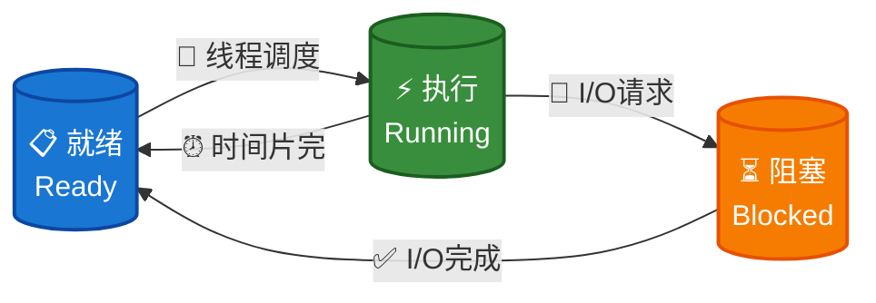
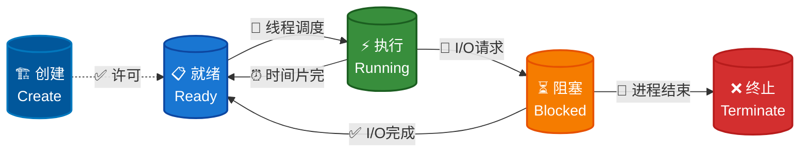
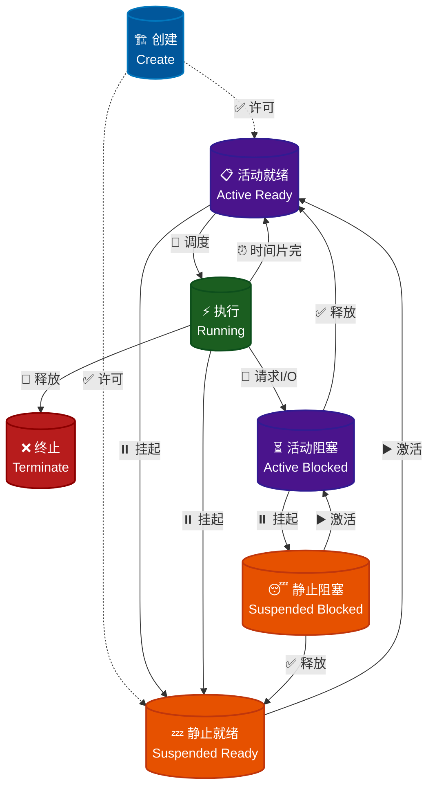
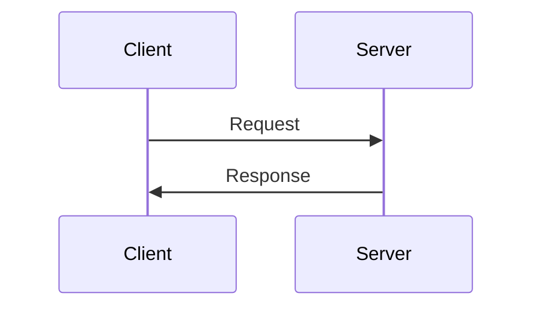
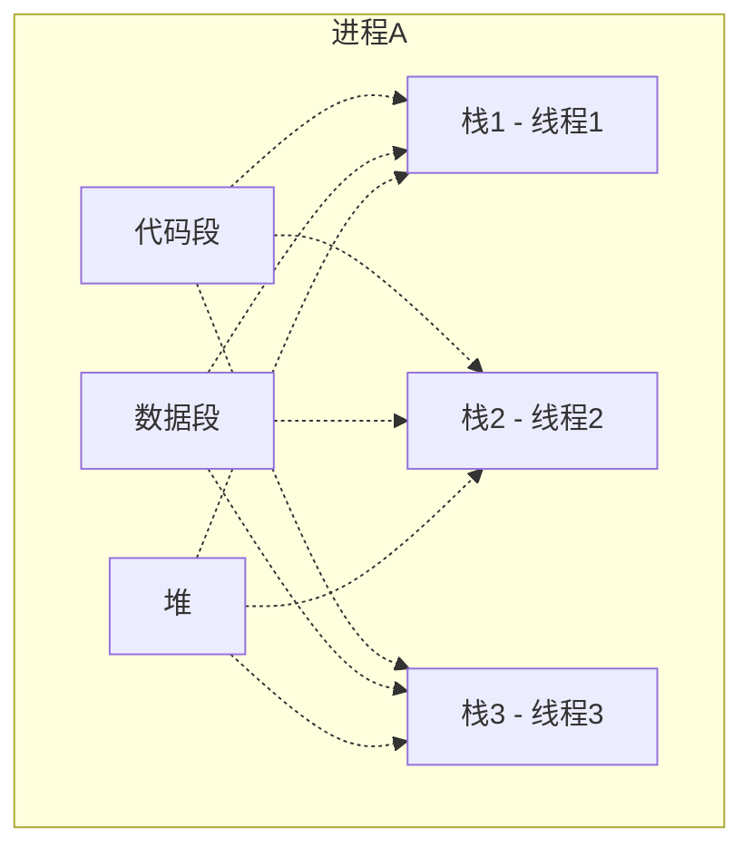

# 进程的描述与控制

> [操作系统简易模型](intro/os-model.md)


## 程序与进程的关系[^2]

<div class="text-center-container" style="text-align: center;">
    <p>程序是状态机的<strong>静态描述</strong></p>
</div>

- 程序描述了所有可能的程序状态

- 程序 (动态) 运行起来，就成了进程 (进行中的程序)

## 进程的描述

> 以下为校内课程笔记

### 操作系统视角下的进程

进程作为操作系统分配资源与进行调度的基本**独立**单位，必须对其加以描述使得操作系统能够识别并加以管理。

在操作系统中，使用一种被称为**PCB**（*Process Control Block*, 进程控制块）的数据结构来描述进程。

### 基本状态与转换

#### 三种基本状态

- **就绪（*ready*）状态**

    - 进程已经具备运行条件（已分配到除CPU以外的所有必要资源），等待 CPU 资源的分配

    - 操作系统会将就绪进程按照一定的调度算法插入到就绪队列中，等待调度

- **执行（*running*）状态**

    - 进程已分配到CPU资源，正在运行

    - 单处理机系统中，同一时间段内只有一个进程处于执行状态

    - 多处理机系统中，多个进程可同时处于执行状态

- **阻塞（*block*）状态**

    - 进程在执行过程中由于发生事件（如 I/O 请求, 申请缓冲区失败等）而暂时无法继续执行，需要等待事件完成

    - 操作系统会根据阻塞原因的不同，将进程插入到不同的阻塞队列中



#### 创建状态和终止状态

- **创建（*create*）状态**

    进程的创建相对复杂，需要注册进程控制块，设置进程的初始状态，并为其分配资源:

    - 进程申请空白 PCB

    - 为进程分配所需资源 (内存, 文件, 设备等)

    - 初始化 PCB, 向 PCB 中填写必要信息 (进程标识符, 进程状态 (处理机上下文), 进程优先级, 进程程序计数器, 进程内存地址空间等)

    - 将进程插入就绪队列，等待调度

    在操作系统中，有以下几种场景会触发进程创建:

    1. 用户登录

    2. 作业调度

    3. 提供服务

    4. 应用请求

- **终止（*terminate*）状态**

    - 进程的终止相对简单，简单概括只需经历两个步骤:

        - 其他进程或OS提取相关信息

        - 将 PCB 空间返还给操作系统 (系统删除该进程)

    在操作系统中，有以下几种场景会引起进程终止:

    1. 正常终止

    2. 异常终止

    3. 外界干预



#### 挂起操作

##### 什么是挂起操作

**挂起（*suspend*）操作**是操作系统中允许系统将进程从内存中移除，释放其占用的内存资源，同时保持进程的状态信息，以便后续能够恢复执行。

结合前面提到的进程描述（操作系统视角下的进程）具体来说，挂起是将进程从内存中移除，但保留其PCB和状态信息，使其进入挂起状态的操作。

与挂起操作对应的操作是**激活（*active*）操作**，即将挂起状态的进程重新加载到内存中，恢复其执行状态。

可以结合以下代码理解挂起和激活操作的具体操作流程:

```py
# 伪代码示例
def suspend_process(pid):
    # 1. 保存进程状态到磁盘
    save_process_state(pid, "disk:/suspended/")
    
    # 2. 释放内存空间
    release_memory(pid)
    
    # 3. 更新进程状态
    update_process_state(pid, SUSPENDED)
    
    # 4. 从就绪队列移除
    remove_from_ready_queue(pid)

def active_process(pid):
    # 1. 从磁盘恢复状态
    restore_process_state(pid, "disk:/suspended/")
    
    # 2. 重新分配内存
    allocate_memory(pid)
    
    # 3. 恢复到就绪状态
    update_process_state(pid, READY)
    
    # 4. 重新加入调度队列
    add_to_ready_queue(pid)
```

##### 为什么需要挂起操作

以下是几种典型的场景:

1. 系统或用户用于暂停进程的执行，以便系统提取信息或用户在出现问题时进行排查

2. 调节系统负载，在资源不足时将某些不重要的进程挂起，以保证关键进程的运行

3. 父进程用于协调各子进程间的活动

!!! abstract
    可以简单概括成：**进程调试**、**负载调节**、**资源优化**、**内存管理**等

##### 引入挂起操作后进程的状态转换

在引入挂起和激活后，进程的状态转换变得更加复杂，与二者相关状态转换如下:

1. 活动就绪 → 静止就绪

2. 活动阻塞 → 静止阻塞

3. 静止就绪 → 活动就绪

4. 静止阻塞 → 活动阻塞

关键在于**活动**与**静止**上，从挂起操作与激活操作的定义不难得出二者是如何转换的。



## 进程控制

### 进程控制块

操作系统中，**进程控制块 (*Process Control Block*, PCB)** 是操作系统管理进程的核心**数据结构**，用于记录进程的各种信息，是操作系统进行进程管理、调度和控制的基础。

#### 什么是进程控制块

从概念不难看出，PCB 的本质是一个包含了一系列数据的**数据结构**，用于描述进程的状态和属性，存储在操作系统的**内核空间**。其一般包含以下信息:

- 进程标识信息：进程ID、父进程ID、用户ID等

- 处理器状态信息：寄存器内容、程序计数器、状态字等

- 进程控制信息：进程状态、优先级、调度参数等

- 资源使用信息：内存分配、打开文件、I/O设备等

一个 PCB 的典型实现如下:

```cpp
typedef struct {
    int pid;                    // 进程ID
    int ppid;                   // 父进程ID
    int state;                  // 进程状态
    int priority;               // 优先级
    int program_counter;        // 程序计数器
    int registers[16];          // 寄存器组
    int memory_base;            // 内存基址
    int memory_limit;           // 内存限制
    struct file *open_files;    // 打开的文件
    // ... 更多字段
} PCB;
```

#### 为什么需要进程控制块

早期的计算机系统只能运行一个程序，无法实现多任务处理；程序独占整个系统，资源利用率低。为了实现多任务并发处理，操作系统必须引入一种机制来统一调度进程，故进程控制块作为存储进程基本信息的数据结构被引入了操作系统的进程控制体系中。

系统在进行进程调度时，往往需要频繁地同步进程的各种状态信息。如下面的的伪代码，展示了使用 PCB 保存进程的关键信息以便于后续的进程切换:

```cpp
// 进程切换伪代码
void context_switch(PCB *old_pcb, PCB *new_pcb) {
    // 保存当前进程状态到old_pcb
    old_pcb->registers = current_registers;
    old_pcb->program_counter = current_pc;
    
    // 从new_pcb恢复目标进程状态
    current_registers = new_pcb->registers;
    current_pc = new_pcb->program_counter;
    
    // 更新当前进程指针
    current_process = new_pcb;
}
```


### 原语

#### 什么是原语

<strong>原语（*Primitive*）</strong>是操作系统中最基本、不可分割的操作单元，是构建更复杂系统功能的基础。

原语的特性:

- 原子性：不可分割，要么全部执行，要么全部不执行

- 不可中断性：执行过程中不能被其他操作打断

- 不可分割性：是最小的操作单位

#### 为什么需要原语

在多进程/多线程环境中，如果没有原语保护，会出现：

- 竞态条件：多个进程同时访问共享资源

- 数据不一致：部分更新导致的数据错误

- 死锁问题：进程间相互等待

#### 应用场景

- 进程同步：确保进程按正确顺序执行

- 互斥访问：保证共享资源的独占使用

- 进程通信：实现进程间安全的数据交换


## 进程通信

为了实现并发，进程间需要进行通信，以实现据交换和同步。

进程通信通常有高低级之分，高级通信方式通常提供更高级的抽象，如消息传递、共享内存等，而低级通信方式则提供更底层的抽象，如信号量、管道等。前者使用方便，可以高效地传递大量数据；而后者则需要程序员手动管理同步与互斥，且通信对用户不透明，但可以更精确地控制通信的细节。

### 进程通信的方式

*进程间通信*（*Inter-Process Communication*, IPC）有以下四种常见机制:

| 机制 | 应用场景 | 特点 | 优势 | 劣势 | 典型应用 |
| --- | --- | --- | --- | --- | --- |
| **共享内存** | 大数据量、高性能计算 | 最快、需要与同步机制配合使用 | 速度最快、适合大数据传输 | 需要同步机制、编程复杂 | 数据库、科学计算 |
| **管道通信** | 简单数据流、命令行工具 | 单向、高效、简单 | 简单易用、系统开销小 | 单向通信、有亲缘关系限制 | Shell命令链、进程间数据流 |
| **消息队列** | 结构化消息传递 | 双向、类型化、异步 | 可靠性高、支持优先级 | 系统资源消耗、消息大小限制 | 任务队列、日志系统 |
| **信号量** | 进程同步、资源控制 | 主要用于同步控制 | 简单、高效 | 功能单一、容易死锁 | 临界区保护、资源计数 |
| **客户端-服务器** | 分布式服务、资源共享 | 集中管理、可扩展 | 资源共享、易于管理 | 单点故障、性能瓶颈 | Web应用、数据库服务 | 

#### 共享内存

- 基于共享数据结构的通信方式（低级）

- 基于共享存储区的通信方式（高级）

#### 管道通信

管道通信是进程通信的一种低级的通信方式，通过**内核缓冲区**实现进程间的通信，它允许一个进程的输出直接作为另一个进程的输入，实现数据在进程间的**单向流动**。

##### 什么是管道

<strong>管道（*pipe*）</strong>是用于连接一个读进程与写进程以实现它们之间互相通信的机制。根据实现方式，管道分为两种类型：

- **匿名管道**：内核维护的**缓冲区**，通过文件描述符访问，不创建文件系统中的实体

- **命名管道（FIFO）**：在文件系统中创建的**特殊文件**，可以像普通文件一样访问

管道是一种**半双工**的通信方式，即数据只能在一个方向上流动。

!!! tip "全双工与半双工"

    - **全双工（*Full Duplex*）**：通信双方可以**同时进行双向数据传输**，就像两个人可以同时说话和听对方说话

    - **半双工（*Half Duplex*）**：通信双方不能同时发送和接收数据，必须**轮流进行**，就像对讲机一样

##### 匿名管道与命名管道

| 特性 | 匿名管道 | 命名管道（FIFO） |
|------|----------|----------------|
| 创建方式 | `pipe()` 系统调用 | `mkfifo()` 系统调用 |
| 文件系统实体 | 无 | 有（特殊文件） |
| 进程关系 | 必须有亲缘关系 | 任意进程 |
| 访问方式 | 文件描述符 | 文件名或文件描述符 |
| 生命周期 | 随进程结束 | 手动删除 |

##### 管道的实现原理

管道在内核中维护一个**环形缓冲区**，具有以下特点：

- **单向性**：数据只能向一个方向流动

- **阻塞性**：当缓冲区满时写操作阻塞，空时读操作阻塞

- **原子性**：小于 `PIPE_BUF` 的写操作是原子的

- **缓冲区大小**：通常为 64KB（可配置）

##### 实际应用示例

- 命令行中的管道使用

    ```bash
    # 经典的管道链式操作
    ls -l | grep ".txt" | wc -l
    ```

- 编程中的匿名管道

    ```c
    #include <unistd.h>
    #include <stdio.h>

    int main() {
        int pipefd[2];
        pid_t pid;
        
        // 创建匿名管道
        if (pipe(pipefd) == -1) {
            perror("pipe");
            return 1;
        }
        
        pid = fork();
        if (pid == 0) {
            // 子进程：关闭读端，向写端写入数据
            close(pipefd[0]);
            write(pipefd[1], "Hello from child!", 18);
            close(pipefd[1]);
        } else {
            // 父进程：关闭写端，从读端读取数据
            close(pipefd[1]);
            char buffer[100];
            read(pipefd[0], buffer, sizeof(buffer));
            printf("Parent received: %s\n", buffer);
            close(pipefd[0]);
        }
        
        return 0;
    }
    ```

- 命名管道的使用

    ```bash
    # 创建命名管道
    mkfifo mypipe

    # 进程A写入数据
    echo "Hello from process A" > mypipe &

    # 进程B读取数据
    cat mypipe
    ```

#### 消息队列

消息传递系统，或称为<strong>消息队列（*Message Queue*）</strong>，其最大的特点就是通信消息是**结构化的**，每个消息通常包含:

- 消息头：包含目标进程ID、消息类型、优先级等信息

- 消息体：包含实际的数据内容

```c
#include <sys/msg.h>
#include <stdio.h>
#include <string.h>

struct msgbuf {
    long mtype;       // 消息类型
    char mtext[100];  // 消息内容
};

int main() {
    int msgid;
    struct msgbuf msg;
    
    // 创建消息队列
    msgid = msgget(IPC_PRIVATE, 0666 | IPC_CREAT);
    
    // 发送消息
    msg.mtype = 1;
    strcpy(msg.mtext, "Hello from sender!");
    msgsnd(msgid, &msg, sizeof(msg.mtext), 0);
    
    // 接收消息
    msgrcv(msgid, &msg, sizeof(msg.mtext), 1, 0);
    printf("Received: %s\n", msg.mtext);
    
    // 删除消息队列
    msgctl(msgid, IPC_RMID, NULL);
    
    return 0;
}
```

#### 客户端-服务器系统

<strong>客户端-服务器系统（*Client-Server System*）</strong>在网络系统与分布式系统的应用中十分常见。

简单来说，其将整个系统划分为客户端与服务器两个角色，客户端负责请求服务，服务器负责响应请求:



##### 套接字

一个典型的客户端-服务器系统模型就是<strong>套接字（*socket*）</strong>:


```c
#include <sys/socket.h>
#include <netinet/in.h>
#include <stdio.h>

// 服务器端
int server_socket = socket(AF_INET, SOCK_STREAM, 0);
struct sockaddr_in server_addr;
server_addr.sin_family = AF_INET;
server_addr.sin_port = htons(8080);
server_addr.sin_addr.s_addr = INADDR_ANY;

bind(server_socket, (struct sockaddr*)&server_addr, sizeof(server_addr));
listen(server_socket, 5);

// 客户端
int client_socket = socket(AF_INET, SOCK_STREAM, 0);
struct sockaddr_in client_addr;
client_addr.sin_family = AF_INET;
client_addr.sin_port = htons(8080);
client_addr.sin_addr.s_addr = inet_addr("127.0.0.1");

connect(client_socket, (struct sockaddr*)&client_addr, sizeof(client_addr));

// 发送消息
send(client_socket, "Hello from client!", 18);

// 接收消息
recv(client_socket, buffer, sizeof(buffer), 0);
printf("Received: %s\n", buffer);

// 关闭套接字
close(client_socket);
close(server_socket);
```

#### 应用场景选择与性能对比

- 常见应用场景

    | 需求场景 | 推荐机制 | 理由 |
    |---------|---------|------|
    | **高性能数据传输** | 共享内存 | 速度最快，适合大数据量 |
    | **简单进程间通信** | 管道 | 实现简单，系统开销小 |
    | **可靠的消息传递** | 消息队列 | 支持确认机制，适合关键业务 |
    | **进程同步控制** | 信号量 | 专门用于同步，简单高效 |
    | **分布式服务** | 客户端-服务器 | 架构清晰，易于扩展 |

- 性能对比

    | 机制 | 延迟 | 吞吐量 | 内存使用 | 编程复杂度 |
    |------|------|--------|----------|------------|
    | 共享内存 | 极低 | 极高 | 中等 | 高 |
    | 管道 | 低 | 高 | 低 | 低 |
    | 消息队列 | 中等 | 中等 | 中等 | 中等 |
    | 客户端-服务器 | 高 | 中等 | 低 | 中等 |
    | 信号量 | 极低 | N/A | 极低 | 低 |


## 线程

### 什么是线程

<strong>线程（*thread*）</strong>是CPU调度的基本单位，每个线程拥有独立的执行上下文（程序计数器、寄存器、栈），但共享进程的代码段、数据段、文件描述符等资源。

==可将线程视为为一个**轻量级的进程**==，其目的是为了提高程序的并发性，减少上下文切换的开销，包含两个基本属性:

- 可拥有资源的独立单位

- 可**独立**调度和分派的**基本单位**

三条重要原则:

- 资源共享：同一进程内的线程共享内存空间和系统资源

- 独立执行：每个线程有独立的执行栈和寄存器状态

- 并发调度：操作系统可以独立调度每个线程

以一个需要同时处理多用户请求的Web服务器为例，可为每个请求创建一个线程，所有线程**共享**服务器的代码和数据库连接池:

```py
import threading
import time

def handle_request(request_id):
    print(f"Process {request_id} is handling request")
    time.sleep(1)  # 模拟处理时间
    print(f"Process {request_id} has handled request")

# 创建多个线程处理并发请求
threads = []
for i in range(5):
    thread = threading.Thread(target=handle_request, args=(i,))
    threads.append(thread)
    thread.start()

for thread in threads:
    thread.join()
```

### 为什么需要线程

在出现线程前，操作系统中只有进程概念，每个进程独立运行，资源消耗大，进程间切换开销高，无法实现真正的并发。

出现线程的概念后，一个进程可以包含多个线程，线程间共享资源，切换开销小，实现了真正的并发执行。

### 线程与进程的比较

|   | **进程** (*Process*) | **线程** (*Thread*) |
|---|---|---|
| 定义 | 资源分配的基本单位 | CPU调度的基本单位 |
| 内存空间 | 独立的虚拟地址空间 | 共享进程的内存空间 |
| 创建开销 | 大（需要分配内存、文件描述符等）| 小（只需分配栈空间）|
| 切换开销 | 大（需要切换页表、TLB等）| 小（只需切换寄存器）|
| 通信方式 | IPC（管道、消息队列、共享内存等） | 直接访问共享变量 |
| 资源管理 | 独立管理资源 | 共享进程资源 |
| 故障影响 | 进程崩溃不影响其他进程 | 线程崩溃可能导致整个进程崩溃 |

!!! abstract
    - ==进程是拥有资源的基本单位==，传统进程称为**重型进程 (Heavy-weight Process, HWP)**

    - ==线程是调度和分派的基本单位==，同时又具有传统进程所具有的许多特征，故也称为**轻量级进程 (Light-weight Process, LWP)**

### 线程的描述与控制概述

#### 状态

- 执行态

- 就绪态

- 阻塞态

状态间的转换与进程一样。

#### 内存模型

- 所有线程共享进程的地址空间

- 线程间可以直接访问共享数据

- 需要同步机制防止数据竞争



#### 创建

1. 分配新的TCB（Thread Control Block）

2. 分配栈空间

3. 设置寄存器初始值

4. 加入线程调度队列

#### 通信机制

- 直接访问共享变量

- 互斥锁（Mutex）

- 条件变量（Condition）

- 信号量（Semaphore）

```py
import time
import threading
import multiprocessing

def cpu_intensive_task():
    """CPU密集型任务"""
    result = 0
    for i in range(1000000):
        result += i * i
    return result

# 测试进程创建开销
def test_process_creation():
    start_time = time.time()
    processes = []
    
    for i in range(10):
        p = multiprocessing.Process(target=cpu_intensive_task)
        processes.append(p)
        p.start()
    
    for p in processes:
        p.join()
    
    process_time = time.time() - start_time
    print(f"Process creation and switching time: {process_time:.4f} seconds")

# 测试线程创建开销
def test_thread_creation():
    start_time = time.time()
    threads = []
    
    for i in range(10):
        t = threading.Thread(target=cpu_intensive_task)
        threads.append(t)
        t.start()
    
    for t in threads:
        t.join()
    
    thread_time = time.time() - start_time
    print(f"Thread creation and switching time: {thread_time:.4f} seconds")

# 运行测试
test_process_creation()
test_thread_creation()
```

### 进程的实现

> [Difference between User Level thread and Kernel Level thread | GeeksforGeeks](https://www.geeksforgeeks.org/operating-systems/difference-between-user-level-thread-and-kernel-level-thread/)
>
> [Relationship between User level thread and Kernel level thread | GeeksforGeeks](https://www.geeksforgeeks.org/operating-systems/relationship-between-user-level-thread-and-kernel-level-thread/)
>
> [Kernel Threads and User Threads | IBM Documentation](https://www.ibm.com/docs/kk/aix/7.3.0?topic=processes-kernel-threads-user-threads)

线程的实现有主要有三种方式:

- 内核支持线程（*Kernel Supported Threads, KST*），在实现上**利用系统调用**

- 用户支持线程（*User Level Threads, ULT*），在实现上**借助中间系统**

- 混合线程

#### 内核支持线程

- 优点

    - 在多处理机系统中，内核可同时调度同一进程的多个线程

    - 如一个线程阻塞了，内核可调度其他线程(同一或其他进程)

    - 线程的切换比较快，开销小

    - 内核本身可采用多线程技术，提高执行速度和效率

- 缺点

    - 针对用户线程开销较大

#### 用户级线程

- 优点

    - 线程切换不需要转换到内核空间

    - 调度算法可以是进程专用的

    - 线程的实现与OS平台无关

- 缺点

    - 系统调用的阻塞问题

    - 多线程应用不能利用多处理机进行多重处理的优点

#### 混合线程

由于KST与ULT的连接方式有所差异，从而形成了三种不同的多线程模型：

- 多对一模型

    - 多个用户级线程映射到一个内核线程

    - 多个线程不能并行运行在多个处理器上

    - 线程管理在用户态执行，因此是高效的，但一个线程的阻塞系统调用会导致整个进程的阻塞

    - 用于不支持内核线程的系统中

    - 使用多对一模型的操作系统

        - Solaris Green Threads

        - GNU Portable Threads

- 一对一模型

    - 每个用户级线程映射到一个内核线程

    - 比多对一模型有更好的并发性

    - 允许多个线程并行运行在多个处理器上

    - 创建一个ULT需要创建一个KLT，效率较差

    - 使用一对一模型的操作系统

        - Windows 95/98/NT/XP/2000

        - Linux

        - Solaris 9 and later

        - OS/2

- 多对多模型

    - 多个用户级线程映射为相等或小于数目的内核线程

    - 允许操作系统创建足够多的KLT

    - 使用多对多模型的操作系统

        - Solaris 9 以前的版本

        - 带有ThreadFiber开发包的Windows NT/2000


[^1]: [程序和进程-操作系统原理 (2025 春季学期) | Yanyan's wiki](https://jyywiki.cn/OS/2025/lect5.md)