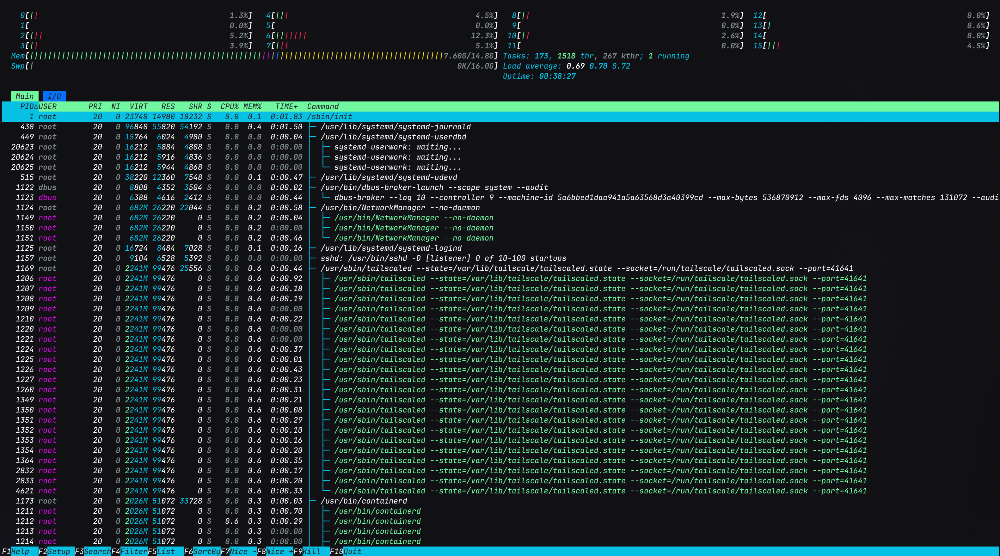
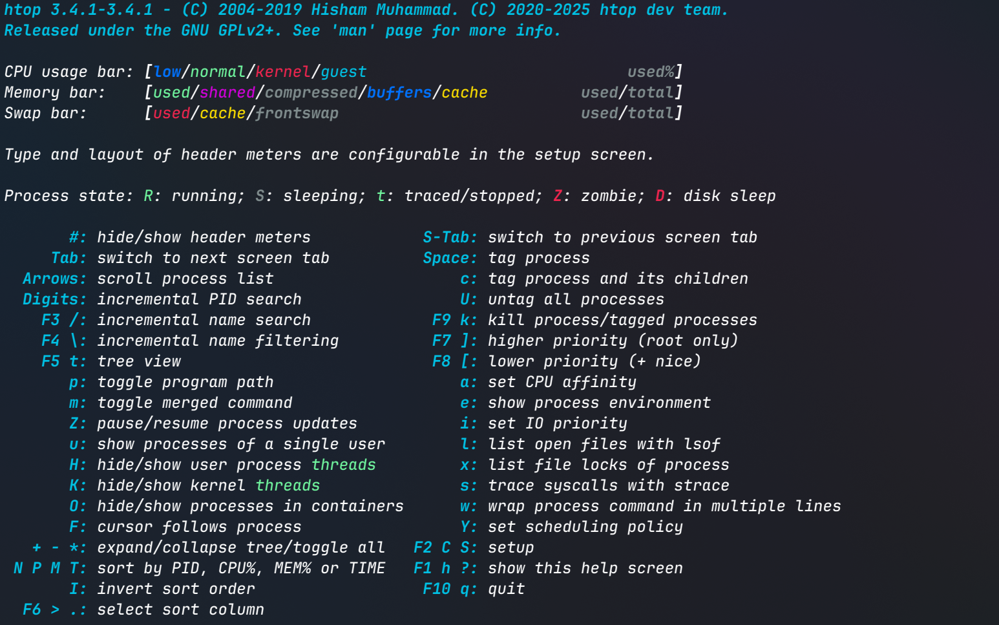

# htop



`htop` 是一个常用的系统监控工具，可以显示系统的进程、CPU、内存等信息。

## 基本使用



- 默认模式（进程列表模式）

    ```bash
    htop
    ```

- 进程树模式

    ```bash
    htop --t
    ```

## 面板术语

- PID (Process ID, 进程ID)

    - 进程在系统中的唯一标识符, 用于区分不同的进程

- USER (User Name, 用户名)

    - 进程所属用户

- PRI (Priority, 优先级)

    - 进程调度优先级, 值越小, 优先级越高; 在Linux中通常取 0~139

    - ==由内核态动态维护，用户无法直接修改==

- NI (Nice Value, Nice值)

    - 用户可调整的进程"友好度"参数, **会影响PRI值的计算**

    - NI值调整权限和范围:

        - **普通用户**: 只能提高NI值（降低优先级），范围 0~19

        - **root用户**: 可以设置负NI值（提高优先级），范围 -20~19

        ```bash
        # 普通用户：启动一个"友好"的进程（NI=10）
        nice -n 10 ./my_program

        # root用户：启动一个"不友好"的进程（NI=-5）
        sudo nice -n -5 ./important_program

        # 修改运行中进程的nice值
        renice -n 5 -p 1234  # 将PID为1234的进程NI值设为5
        sudo renice -n -5 -p 1234  # root用户才能设置负值
        ```
    
    !!! info "Nice值的起源"
        Nice值的概念来自早期的Unix系统（1970年代）。其命名逻辑相当有意思:

        - 当一个进程"nice"（友好）时，它不会抢占太多CPU资源，相反，它会"礼貌地"让其他进程先运行，就像现实中的"nice person"（好人）会谦让一样

        - 高NI值 = 进程很"nice"，愿意让出CPU给其他进程

        - 低NI值 = 进程"不nice"，想要更多CPU时间

        - 负NI值 = 进程"非常不nice"，几乎要"插队"运行

        这种命名方式体现了Unix系统设计者的幽默感😄

- VIRT (Virtual Memory, 虚拟内存)

    - 进程使用的虚拟内存总量, 包括实际使用的内存和交换空间

- RES (Resident Memory, 常驻内存)

    - 进程实际使用的物理内存总量, 只包含实际使用的物理内存 (RAM)

- SHR (Shared Memory, 共享内存)

    - 与其他进程共享的内存部分

- S (Status, 状态)

    - 进程状态, 常见的形式有一下几种:

        - R: Running (运行中)

        - S: Sleeping (休眠)

        - D: Uninterruptible Sleep (不可中断休眠)

        - Z: Zombie (僵尸进程)

- CPU% (CPU使用率)

    - 进程占用的CPU百分比, 最直观的性能指标之一

- MEM% (内存使用率)

    - 进程占用系统总内存的百分比, 与CPU占用率一样为最直观的性能指标之一

- TIME+ (累计CPU时间)

    - 进程占用的CPU时间, 包括用户态和内核态时间

    - 格式为: `[分钟]:[秒].[毫秒]`

- Command (命令)

    - 启动对应进程的命令行
