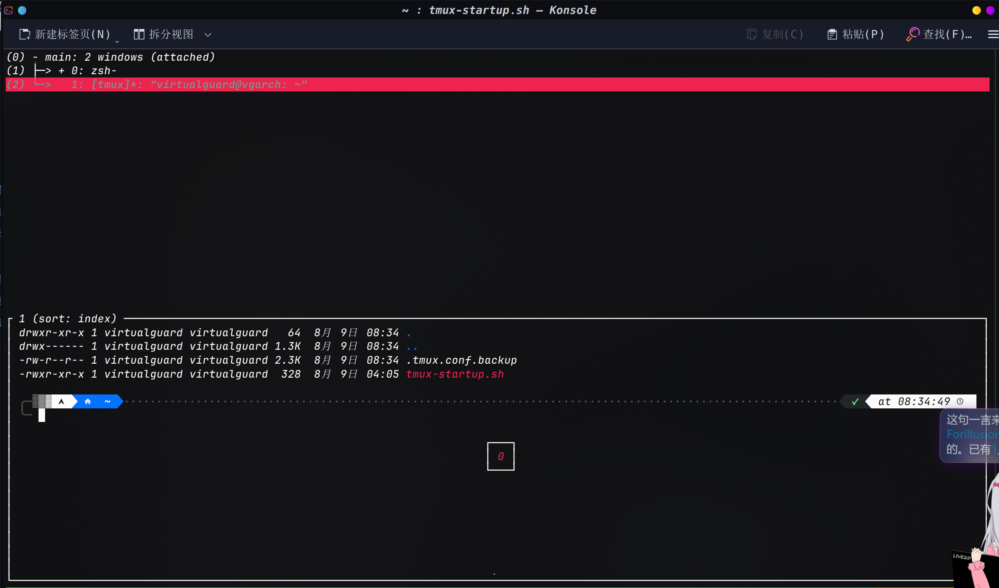
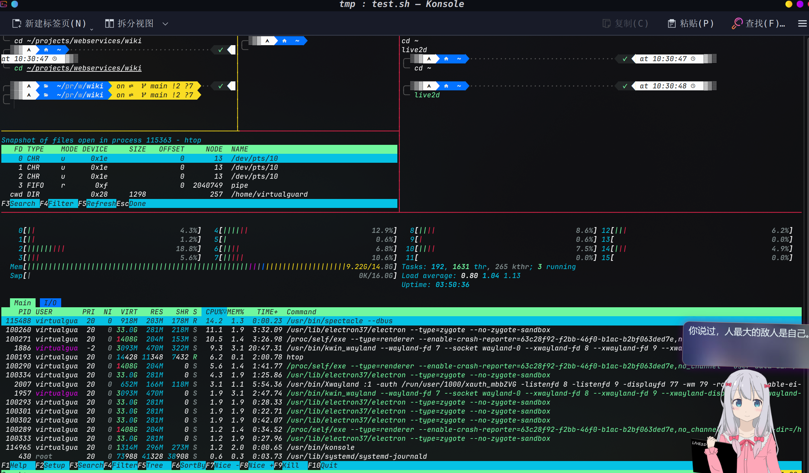

# tmux

>[命令行环境 | MIT missing semester](https://missing-semester-cn.github.io/2020/command-line/){target="_blank"}
>
>[Make tmux Pretty and Usable | Ham Vocke](https://hamvocke.com/blog/a-guide-to-customizing-your-tmux-conf/){target="_blank"}
>
>[tmux | Arch Linux 中文维基](https://wiki.archlinuxcn.org/wiki/Tmux){target="_blank"}


[tmux](https://github.com/tmux/tmux/wiki){target="_blank"} 是终端多路复用器(*terminal multiplexer*)，可在一个屏幕中创建、访问并控制多个终端（或窗口），每个终端或窗口内都可以运行独立的程序。将 tmux 从当前窗口分离（tmux detach）后，tmux 依然可以在后台运行，直到恢复会话（tmux attach）[^1]。

关于 tmux 的详细介绍可参考[维基百科](https://zh.wikipedia.org/wiki/Tmux){target="_blank"}，这里不再赘述。

## 基础概念与使用

tmux 采用 client/server 模型，按照自上而下的层级排列分别是：

- `server`（服务）：tmux 运行的基础服务，以下模块均依赖此服务
- `session`（会话）：一个服务可以包含多个会话
- `window`（窗口）：一个会话可以包含多个窗口
- `panel`（面板）：一个窗口可以包含多个面板

初次理解上述概念可能会混淆，可参考下面的图示理解：





每个图示中下侧所展示的就是不同窗口中含有的**面板**。

初始条件下（未经过任何自定义配置），上面的图示可通过 `<C-b> w` 列出，即列出当前所有**窗口**。

基础使用可参考[命令行环境 | MIT missing semester](https://missing-semester-cn.github.io/2020/command-line/){target="_blank"}和[A Quick and Easy Guide to tmux | Ham Vocke](https://hamvocke.com/blog/a-quick-and-easy-guide-to-tmux/){target="_blank"}。

## 自定义配置

tmux 支持高度自定义，可通过在用户主目录创建名为 `.tmux.conf` 的配置文件来写入用户自定义参数。基础的实用与外观配置可参考[Make tmux Pretty and Usable | Ham Vocke](https://hamvocke.com/blog/a-guide-to-customizing-your-tmux-conf/){target="_blank"}，下面补充一些我的个人配置参考。

### 默认窗口配置

执行 `tmux` 命令时默认开启一个服务并创建一个会话，窗口和面板。如果你希望在启动 `tmux` 时默认进入一个你所希望的布局以及路径，甚至是直接运行某些命令，通常可以通过以下两种方式实现：

- 配置 `.tmux.conf`

    以本文首个图示为例，首先需要明确实现该布局的步骤：

    1. 上下分割，形成两个面板，并调整上下面板比例为 $4 : 6$
    2. 在下面板运行 `htop`
    3. 切换至上面板
    4. 左右分割，形成共三个面板
    5. 在右上面板运行命令 `live2d`
    6. 切换至左上面板，并切换至目标路径

    明确实现步骤后，配置的编写就只需查阅对应的配置文档或参考互联网资源自行修改即可。下面是基于该案例的配置参考：
    ```conf
    # ==================================
    # Automatic Layout on Tmux Start
    # ==================================

    # Create a new session named 'main' if it doesn't exist
    new-session -d -s main -x 150 -y 40

    # Window 0: main-layout

    # Select window 0
    # select-window -t 0

    # Set path and split vertically for the bottom pane
    send-keys 'cd /path/to/you/want' C-m
    split-window -v -p 60 -t 0
    send-keys 'cd ~' C-m
    send-keys 'htop' C-m

    # Go back to the top-left pane (pane 0) and split horizontally for the right 30% pane
    select-pane -t 0
    split-window -h -p 50 -t 0
    send-keys 'cd ~' C-m
    send-keys 'live2d' C-m

    # Select the top-left pane to be the active one on attach
    select-pane -t 0
    ```

    不过有一点需要注意，参考配置经实测在配置完成后执行 `tmux kill-server` 关闭现有 `tmux` 服务（若有）并重新启动它后，会在上面配置的目标效果的基础上在新建一个会话（服务布局形如下图所示），并在用户手动切换窗口前保持 `attach` 于当前会话。

    

    !!! question
        在写这篇笔记时，我对 tmux 的接口还并不熟悉，个人猜测我在配置中写的严格意义上不是所谓的“默认布局”，或许仅仅只是在系统默认布局的基础上**新增**了一个用户自定义会话。

        换而言之，前面提到的目标效果才是一个“在系统默认布局基础上新建的会话”。

- 单命令带参启动/shell脚本启动

    这个方式就比较好理解，就是把配置文件中的用户自定义参数以命令参数的形式传入 `tmux` 程序：
    ```bash
    tmux new-session -d -s main -x 150 -y 40 \; send-keys 'cd /path/to/you/want' C-m \; split-window -v -p 60 -t 0 \; send-keys 'cd ~' C-m \; send-keys 'htop' C-m \; select-pane -t 0 \; split-window -h -p 50 -t 0 \; send-keys 'cd ~' C-m \; send-keys 'live2d' C-m \; select-pane -t 0 \; attach-session -t main
    ```
    由于该命令较为冗长，也可将其写入一个shell脚本执行：
    ```sh
    #!/bin/bash

    tmux new-session -d -s main -x 150 -y 40 \; send-keys 'cd /path/to/you/want' C-m \; split-window -v -p 60 -t 0 \; send-keys 'cd ~' C-m \; send-keys 'htop' C-m \; select-pane -t 0 \; split-window -h -p 50 -t 0 \; send-keys 'cd ~' C-m \; send-keys 'live2d' C-m \; select-pane -t 0 \; attach-session -t main
    ```
    !!! warning
        经实测，形如下方的 tmux 启动形式是不可取的：
        ```sh
        #!/bin/bash

        tmux new-session -s main -d -c /path/to/you/want
        
        # 创建布局
        tmux split-window -v -p 60 -t main:0 -c ~
        tmux send-keys -t main:0.1 'htop' C-m
        
        tmux select-pane -t main:0.0
        tmux split-window -h -p 50 -t main:0.0 -c ~
        tmux send-keys -t main:0.2 'live2d' C-m
        
        tmux select-pane -t main:0.0
        
        # 连接到会话
        tmux attach-session -t main
        ```
        这样的脚本在某些场景下会**嵌套**地调用 `tmux` 命令，运行时有概率会出现如下情景：
        

除了上面两种配置方式，还可以通过 tmux 插件来实现自定义默认布局，个人没有尝试，这里就不再展开。


[^1]: [tmux | Arch Linux 中文维基](https://wiki.archlinuxcn.org/wiki/Tmux){target="_blank"}