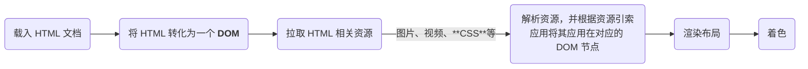

# CSS 要点

## CSS 基本概念 & 基础

CSS(Cascading Style Sheet, 层叠样式表)是一门**样式表语言**，用于选择性地为 HTML 元素添加样式，可简单理解为用来告诉浏览器如何组织网页外观的**规则描述列表**。

### CSS 规则集

在 CSS 中，单个模块的 CSS 规则列表称为该 CSS 的一个**规则集**(*ruleset* or *rule*)。规则集是 CSS 的基本组成单位，其基本结构如下：

```css
selector {
  /* declarations list */
  properties: property value;
  properties: property value;

  /* more declarations... */
}
```

可以看出主要分为四个元素：**选择器(Selector)**、**声明(Declaration)**、**属性(Properties)**、**属性值(Property value)**。

关于各个部分的详细描述可参考[CSS 规则集详解 | MDN Web Docs](https://developer.mozilla.org/zh-CN/docs/Learn_web_development/Getting_started/Your_first_website/Styling_the_content#css_%E8%A7%84%E5%88%99%E9%9B%86%E8%AF%A6%E8%A7%A3)

- 这里简要记录一下**选择器**的分类及其在开发场景下的应用：

    假设这里有一个 HTML 片段：
    ```html
    <h1>Head</h1>
    <div>
      <p>
        Hello!
      </p>
    </div>
    <div class="info">Information</div>
    ```
    现在我们想要使用 CSS 来制定如何修饰其中的元素`Information`，那么可以通过一下 CSS 代码实现：
    ```css
    .info {
      color: red;
      font-family: Arial;
      font-size: 24pt;
    }
    ```
    在这里，选择器`.info`依赖 HTML 的**类(class)**进行元素选择，因此这个选择器就称为**类选择器**。

    同理，如果我们将上面 HTML 中的`class`属性替换为`id`：
    ```html
    <h1>Head</h1>
    <div>
      <p>
        Hello!
      </p>
    </div>
    <div id="info">Information</div>
    ```
    那么对应地，CSS 中的选择器就要替换为**ID选择器**：
    ```css
    #info {
      color: red;
      font-family: Arial;
      font-size: 24pt;
    }
    ```

    !!! info "ID vs Class"
        在 HTML 中，一个元素只能拥有一个 ID，而可以拥有多个类；  
        同时，在一个 HTML 中，每个 ID 都是是独一无二的，而一个相同的类可以同时用于多个元素。这涉及到 CSS 的层级问题，关于这部分内容，可参考[Specificity | HTML Dog](https://www.htmldog.com/guides/css/intermediate/specificity/)

        实际应用中，类的应用要比 ID 频繁得多，因此尽可能在 CSS 中使用类选择器[^1]

    除了**类选择器**和**ID选择器**外，CSS 还支持多个不同类型的选择器，更多信息可参考[不同类型的选择器 | MDN Web Docs](https://developer.mozilla.org/zh-CN/docs/Learn_web_development/Getting_started/Your_first_website/Styling_the_content#%E4%B8%8D%E5%90%8C%E7%B1%BB%E5%9E%8B%E7%9A%84%E9%80%89%E6%8B%A9%E5%99%A8)

### 设计理念 & 运行原理

CSS 的设计理念基于 HTML，因此其布局也是基于所谓的**盒子模型**[^2]。

理解 CSS 的加载原理，首先要先了解浏览器是如何加载网页的。加载过程可以简单分解为以下几个步骤[^3]：


CSS 的加载与解析就处于中间的两个节点。

在学习 HTML 后我们知道，HTML 的本质可简单理解为一个**高度嵌套的模块**；在数据结构中，我们可以很容易地将这种嵌套模型使用**树**的形式抽象出来，以下面的一个 HTML 片段为例：

!!! tip inline end
    DOM（Document Object Model，文档对象模型）是一个编程接口，用于HTML和XML文档。它将文档表示为一个结构化的节点树，允许程序和脚本动态地访问和更新文档的内容、结构和样式。关于 DOM 的详细信息与应用，可参考[DOM 概述 | MDN Web Docs](https://developer.mozilla.org/zh-CN/docs/Web/API/Document_Object_Model/Introduction)

```html
<div class="root-div">
  <p class="text">
    pragraph 1
  </p>
  <p class="span-text">
    CSS: 
    <span>Cascading</span>
    <span>Style</span>
    <span>Sheet</span>
  </p>
</div>
```
将这段 HTML 中的元素关系使用树抽象出来，可以得到以下树状图：
```md
div(.root-div)
├─ p(.text)
│  └── "pragraph 1"
└─ p(.span-text)
   ├── "CSS: "
   ├── span
   │   └── "Cascading"
   ├── span
   │   └── "Style"
   └── span
       └── "Sheet"
```
这就是上面提到的 **DOM（Document Object Model，文档对象模型）**的**树形结构模型**，我们所熟知的操作系统中的**文件系统模型**就是一个与之类似的模型。对这个模型的理解算是将对 HTML、CSS 等Web基本组成元素的本质概念的理解提升至了数据结构的抽象层面。

理解了上面的模型，对于 CSS 是如何加载与解析并应用到对应的 DOM 节点的问题也就迎刃而解了。只需要根据不同规则集的选择器找到对应的 HTML 元素并将规则列表应用到其中即可，这是一个十分高效的过程。

以上面的 HTML 为修饰对象，我们以下面的 CSS 规则集为例：
```css
.text {
  border: 3px solid red
}
.span-text {
  border: 3px solid yellow
}
```

> 实际效果：
><style>
>  .text {
>     border: 3px solid red
>  }
>  .span-text {
>     border: 3px solid yellow
>  }
></style> 
><div class="root-div">
>  <p class="text">
>    pragraph 1
>  </p>
>  <p class="span-text">
>    CSS: 
>    <span>Cascading</span>
>    <span>Style</span>
>    <span>Sheet</span>
>  </p>
></div>

在上面的例子中，浏览器首先以上面提到的方式将 HTML 转化为一个 DOM，其中包含了不带属性和带有不同属性的 HTML 元素节点，随后在载入 CSS 时发现了选择器`.text`和`.span-text`，并将其应用到对应的元素节点上，最终渲染布局、着色后形成我们在实际效果中看到的画面。

!!! tip
    若遇到无法解析的 CSS 规则（原因通常是浏览器版本迭代未能跟上 CSS 或 CSS 代码本身有误），浏览器则会跳过无法解析的部分，转而继续解析其他资源[^4]

## 属性选择器

>[属性选择器 | MDN Web Docs](https://developer.mozilla.org/zh-CN/docs/Learn_web_development/Core/Styling_basics/Attribute_selectors)

## 盒模型

盒模型是 CSS 中一个核心的模型概念，这在前文中也有所提及。

- [盒模型 | MDN Web Docs](https://developer.mozilla.org/zh-CN/docs/Learn_web_development/Core/Styling_basics/Box_model)

## 排版/布局

- [CSS 布局 | MDN Web Docs](https://developer.mozilla.org/zh-CN/docs/Learn_web_development/Core/CSS_layout)


[^1]: [Intro to HTML/CSS | MIT Web Lab](https://docs.google.com/presentation/d/1z7mrIg_M6pn828sbvcJ5XjiK3xpgjC-n1lihA4B-yzM/edit?slide=id.g6cf79318c7_0_26#slide=id.g6cf79318c7_0_26)

[^2]: [CSS：一切皆盒子 | MDN Web Docs](https://developer.mozilla.org/zh-CN/docs/Learn_web_development/Getting_started/Your_first_website/Styling_the_content#css%EF%BC%9A%E4%B8%80%E5%88%87%E7%9A%86%E7%9B%92%E5%AD%90)

[^3]: [CSS 究竟是怎么工作的？ | MDN Web Docs](https://developer.mozilla.org/zh-CN/docs/Learn_web_development/Core/Styling_basics/What_is_CSS#css_%E7%A9%B6%E7%AB%9F%E6%98%AF%E6%80%8E%E4%B9%88%E5%B7%A5%E4%BD%9C%E7%9A%84%EF%BC%9F)

[^4]: [当浏览器遇到无法解析的 CSS 代码会发生什么 | MDN Web Docs](https://developer.mozilla.org/zh-CN/docs/Learn_web_development/Core/Styling_basics/What_is_CSS#%E5%BD%93%E6%B5%8F%E8%A7%88%E5%99%A8%E9%81%87%E5%88%B0%E6%97%A0%E6%B3%95%E8%A7%A3%E6%9E%90%E7%9A%84_css_%E4%BB%A3%E7%A0%81%E4%BC%9A%E5%8F%91%E7%94%9F%E4%BB%80%E4%B9%88)