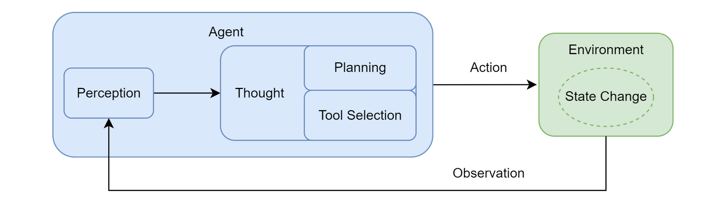

# 智能体概述

## 什么是智能体

人工智能领域，将**智能体**（*Agent*）定义为任何能够通过**传感器**（*Sensors*）感知其所处**环境**（*Environment*），并**自主地**通过**执行器**（*Actuators*）采取**行动**（*Action*）以达成特定目标的实体。

智能体并非与环境隔离，它通过其传感器持续地感知环境状态。摄像头、麦克风、雷达或各类应用**程序编程接口**（*Application Programming Interface*, API）返回的数据流，都是其感知能力的延伸。

获取信息后，智能体需要采取行动来对环境施加影响，通过**执行器**改变环境的状态。执行器可以是物理设备（如机械臂、方向盘）或虚拟工具（如执行一段代码、调用一个服务）。

智能体最显著的特点就是其被赋予了一定程度的**自主性**，并非只是被动响应外部刺激或严格执行预设指令的程序，它能够基于其感知和内部状态进行独立决策，以达成其设计目标。

## 智能体的运行机制

包含**感知**（*Perception*）、**规划**（*Thought*，其中还包含**规划**与**工具选择**两个子环节）和**行动**（*Action*）三个核心环节。

行动并非循环的终点。**智能体的行动会引起环境 (Environment) 的状态变化 (State Change)，环境随即会产生一个新的观察 (Observation) 作为结果反馈**。这个新的观察又会在下一轮循环中被智能体的感知系统捕获，形成一个持续的“感知-思考-行动-观察”的闭环。智能体正是通过不断重复这一**循环**，逐步推进任务，从初始状态向目标状态演进[^1]。

## 智能体设计概述

工程实践中，为确保下层LLM服务能够有效驱动上述运行机制，需要通过**提示词工程**和**结构化定义**来规范其行为，定义一套**交互协议**来规范智能体与外部世界的交互方式。

[^1]: [初识智能体 - 智能体的运行机制 | Hello-Agents](https://datawhalechina.github.io/hello-agents/#/./chapter1/%E7%AC%AC%E4%B8%80%E7%AB%A0%20%E5%88%9D%E8%AF%86%E6%99%BA%E8%83%BD%E4%BD%93?id=_122-%e6%99%ba%e8%83%bd%e4%bd%93%e7%9a%84%e8%bf%90%e8%a1%8c%e6%9c%ba%e5%88%b6)