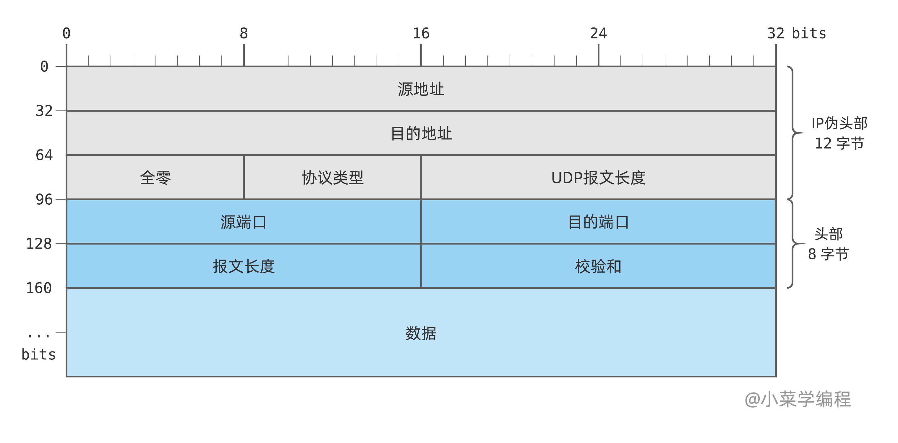
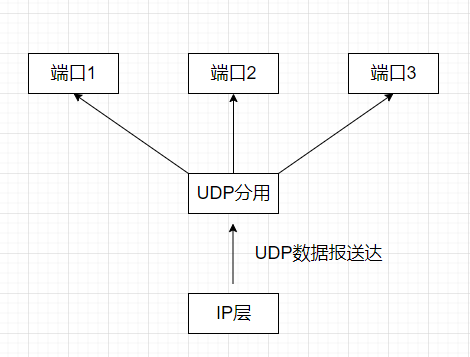
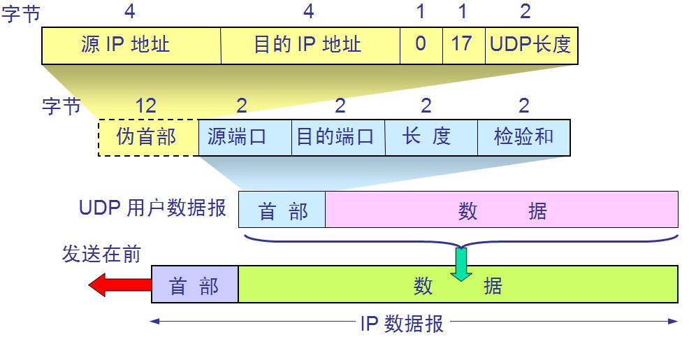

# UDP

## UDP数据报

### UDP概述

UDP仅在IP数据报服务之上增加了**复用/分用**以及**差错检测**功能。若开发者选择使用UDP而非TCP，则应用程序几乎直接与IP进行交互。

#### UDP的特点

- UDP 无需建立连接。因此UDP不会引入建立连接的时延。

- 无连接状态。TCP需要在端系统中维护连接状态，包括接收和发送缓存、拥塞控制参数和序号与确认号的参数；而UDP既不需要维护连接状态，又不跟踪这些参数。因此在某些专用服务器使用UDP时，一般都能支持更多的活跃用户。

- UDP 的首部开销小，只有8个字节，而TCP的首部最小为20个字节。

- UDP 没有拥塞控制，因此网络中的拥塞不会影响UDP的发送速率。某些实时应用要求源主机以稳定的速率发送数据，能容忍一些数据的丢失，但不允许有太大的延迟。

- UDP 支持一对一、一对多、多对一和多对多的交互通信。

UDP常用于**一次性传输较少数据**的网络应用，如DNS、SNMP等，对于这些应用来说，若采用TCP则会带来不小建立和维护连接的开销；UDP也常用于多媒体应用，如IP电话、视频会议、流媒体等，因为这些应用需要实时性，不能容忍TCP拥塞控制带来的延迟。

UDP不保证可靠交付，**但这并不意味着应用程序对数据的要求是不可靠的**。若采用UDP，所有维护可靠性的工作可由用户在应用层完成，开发者可根据需求自由选择可靠机制的实现方式。

**UDP是面向报文的**。发送方的UDP对应用程序交下来的报文，在添加首部后就向下交付IP层。UDP对应用层交下来的报文，既不合并，也不拆分，而是保留这些报文的边界，即一次发送一个完整的报文。在UDP中，**报文是不可分割的**，是UDP数据报处理的最小单位。因此，应用程序必须选择合适大小的报文，若报文太长，则UDP将其交付给IP后，可能导致分片；若报文太短，则会使IP数据报的首部相对过大，二者都会影响IP层的效率。

### UDP的首部格式

UDP的首部十分简单，只有 $8B$，由 $4$ 个字段组成，每个字段都是 $2B$：

| 字段 | 说明 |
|----|----|
| 源端口 | 源端口号，在需要对方回信是选用，不需要时可用全0 |
| 目的端口 | 目的端口号，在终点交付报文时必须使用到 |
| 长度 | 首部 + 数据，单位字节，最小值为8（仅有首部） |
| 校验和 | 可选字段，用于差错检测，不使用时置为0 |



当传输层从IP层收到UDP数据报时，将根据首部中的目的端口，把UDP数据报通过相应的端口交付给上层的应用进程。



若接收方UDP发现收到的报文中的目的端口号不正确（不存在对应于端口号的应用进程），则丢弃该报文，并由ICMP发送“端口不可达”差错报文至源主机。这也是[traceroute](../cs168/Traceroute.md)得以实现的基础原理之一。

## UDP校验

### 伪首部

在计算校验和时，要在UDP数据报之前添加 $12B$ 的伪首部。其格式如下图：



伪首部并不是真正的 UDP 首部，仅在发送方和接收方计算/验证校验和时，临时拼接在 UDP 数据报之前参与运算，不会在网络中传输。

伪首部的作用是将源 IP、目的 IP、协议号、UDP 长度 等信息纳入校验和计算，以便检测 IP 层错送、协议混淆等问题，并保证 UDP 报文的完整性。

伪首部既不向下传递，也不向上交付，仅用于校验和的计算与验证。

### UDP校验和的计算

UDP 校验和采用与 IP 首部校验和相同的 **16 位反码求和**（one's complement sum），检验范围为 **伪首部 + UDP 首部 + 数据**。

#### 发送方计算步骤

1. 根据 IP 首部中的源/目的 IP 地址，以及 UDP 首部中的长度字段，**构造伪首部**。

2. 将 UDP 首部中的 **校验和字段置 0**。

3. 若 UDP 数据部分的字节数为**奇数**，在数据末尾临时 **补 1 个 0 字节**（仅参与计算，不随报文发送）。

4. 将伪首部、UDP 首部、数据按顺序划分为若干 **16 位字**（高位在前）。

5. 对所有 16 位字做 **反码求和**：按二进制加法相加，最高位产生的进位 **回卷** 加到最低位。

6. 将求和结果 **按位取反**，写入校验和字段后发送。

!!! tip "全 0 与全 1"
    若按上述步骤算出的校验和恰好为全 0，则发送时写入 **全 1**（`FFFF`），因为在反码运算中全 0 与全 1 表示同一数值。若发送方**不计算**校验和，则校验和字段保持为 **0**（IPv4 下接收方可跳过检验；IPv6 中 UDP 校验和**必须**计算）。

!!! example "手算示例"
    设某主机向局域网内 DNS 服务器发送一条极短的 UDP 报文，各字段如下：

    | 部分 | 取值（十六进制） |
    |------|------------------|
    | 源 IP | `C0 A8 00 01`（192.168.0.1） |
    | 目的 IP | `C0 A8 00 02`（192.168.0.2） |
    | 协议 | UDP，填 `00 11` |
    | UDP 长度 | `00 0A`（首部 8B + 数据 2B） |
    | 源端口 / 目的端口 | `30 39` / `00 35` |
    | 校验和（计算前） | `00 00` |
    | 数据 | `41 42`（ASCII `"AB"`，偶数字节，无需补 0） |

    - **第 1 步**：按 16 位字划分（高位字节在前）：

        ```
        伪首部：C0A8  0001  C0A8  0002  0000  0011  000A
        UDP：  3039  0035  000A  0000  4142
        ```

    - **第 2 步**：反码求和（进位回卷），逐对相加：

        ```
        C0A8 + 0001 = C0A9
        C0A9 + C0A8 = 18151 → 回卷得 8152
        8152 + 0002 = 8154 → + 0000 = 8154 → + 0011 = 8165 → + 000A = 816F
        816F + 3039 = B1A8 → + 0035 = B1DD → + 000A = B1E7 → + 0000 = B1E7
        B1E7 + 4142 = F329
        ```

    - **第 3 步**：对 `F329` 按位取反 → 校验和为 **`0CD6`**，写入 UDP 首部后发送。

        **接收方验证**：用同样方式求和，但校验和字段填 **`0CD6`**（不再置 0）。

#### 接收方检验

接收方用同样方式构造伪首部，并将收到的 **完整 UDP 数据报**（校验和字段保持原值）与伪首部一起参与反码求和。

- 若最终结果为 **全 1**（`FFFF`），认为无差错；

- 否则认为出错，**丢弃**该 UDP 用户数据报（408 考点：UDP 出错不重传）。

!!! example "手算示例"
    以上面发送方发出的报文为例，192.168.0.2 收到同一 UDP 报文后，从 **IP 首部** 读出源/目的 IP，从 **UDP 首部** 读出长度与校验和，在本地**重新构造伪首部**，再检验。

    | 与发送方的区别 | 说明 |
    |----------------|------|
    | 伪首部 | 字段相同，仍由 IP 地址、协议号 `11`、UDP 长度 `000A` 拼出 |
    | 校验和字段 | **保持收到的 `0CD6`**，不能置 0 |
    | 最后一步 | **不再取反**，只看求和结果是否为 `FFFF` |

    - **第 1 步**：按 16 位字划分（校验和字段为 `0CD6`）：

        ```
        伪首部：C0A8  0001  C0A8  0002  0000  0011  000A
        UDP：  3039  0035  000A  0CD6  4142
        ```

    - **第 2 步**：反码求和（进位回卷）：

        ```
        （伪首部部分与发送方相同，累加至 816F）
        816F + 3039 = B1A8 → + 0035 = B1DD → + 000A = B1E7
        B1E7 + 0CD6 = BEBD → + 4142 = FFFF
        ```

    - **第 3 步**：结果为 **`FFFF`** → 认为无差错，去掉 UDP 首部后把数据 `"AB"` 交付给目的端口对应的应用进程。

        若传输中某比特出错（例如数据变为 `41 43`），求和结果将 **不是 `FFFF`**，接收方 UDP **直接丢弃**该报文。

#### 与 IP 首部校验和的对比

| 对比项 | IP 首部校验和 | UDP 校验和 |
|--------|---------------|------------|
| 检验范围 | 仅 IP 首部 | 伪首部 + UDP 首部 + 数据 |
| 是否传输伪首部 | — | 否，仅本地计算时使用 |
| 出错处理 | 丢弃 IP 数据报 | 丢弃 UDP 用户数据报 |

!!! tip "408 常考"
    - 伪首部中的 **UDP 长度** 与 UDP 首部中的 **长度** 字段取值相同，均为「首部 + 数据」的字节数。

    - 长度在计算校验和**之前**即可由发送方确定，并非「事先不知道长度才需要伪首部」。

    - 伪首部的作用是把 IP 层信息纳入检验，防止 **IP 错送、协议混淆** 等错误。
