# 介质访问控制

> [计算机网络 / 数据链路层 / 介质访问控制 | 计算机考研杂货铺](https://csgraduates.com/computer_network/datalink/mac/)

**介质访问控制**（Medium Access Control，MAC）解决的是[广播信道](数据链路层的功能.md#数据链路层使用的信道)上的核心问题：**多个结点共享同一传输介质，如何协调"谁先发送"**。

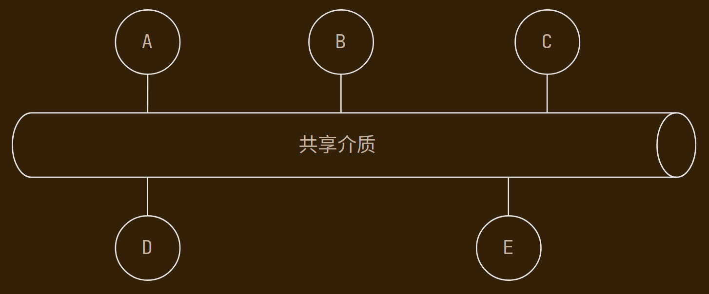

- **点对点信道**：两端独占链路，通常**不需要** MAC

- **广播信道**：多结点共享介质，逻辑上多为总线型拓扑，**必须**实现 MAC

MAC 是数据链路层的一个子层，负责把物理信道上的比特流组织成"谁有权发送"的规则；[组帧](组帧.md)、[差错控制](差错控制.md)等则负责帧的格式与正确性。

408 常把 MAC 协议分为三大类：

| 类型 | 核心思想 | 典型协议/技术 |
|:---:|:---|:---|
| 信道划分 | 把信道静态/动态划分为互不干扰的资源 | TDM、FDM、WDM、CDM |
| 随机访问 | 需要发送时再争用，冲突则退避重传 | ALOHA、CSMA、CSMA/CD、CSMA/CA |
| 轮询访问 | 按规则轮流获得发送权，避免冲突 | 轮询、令牌传递 |

---

## 信道划分介质访问控制

信道划分把共享介质**划分为多个互不干扰的逻辑信道**，各结点只在属于自己的资源上发送，从机制上避免冲突。

### 时分复用

**时分复用**（TDM，Time Division Multiplexing）：将时间划分为等长的**时隙**，每个用户固定占用一个或多个时隙，轮流使用整条信道。

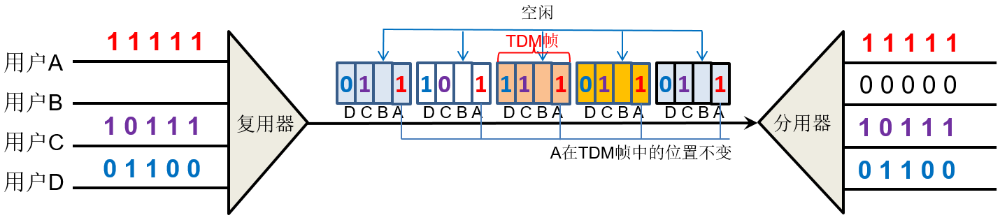

- 优点：实现简单，各用户互不干扰

- 缺点：即使某用户无数据，其时隙也会空闲，**信道利用率低**

#### 统计时分复用

**统计时分复用**（STDM，Statistical TDM）：不固定分配时隙，而是**按需动态分配**——谁有数据就分给谁。

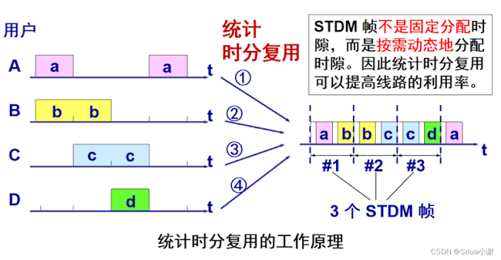

- 需要在帧中携带**地址/标识**，以便接收方区分数据归属

- 适合数据业务（流量具有突发性），利用率通常高于普通 TDM

!!! abstract
    TDM 是"固定座位"，STDM 是"随到随坐"。

### 频分复用

**频分复用**（FDM，Frequency Division Multiplexing）：将信道的**频带**划分为若干子频带，每个用户占用一个子频带，各子频带之间留保护频带以防干扰。

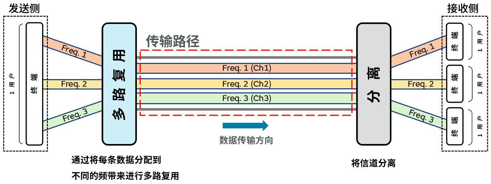

- 典型应用：传统有线电视、早期电话系统

- 各用户**同时**发送，但在不同频率上

### 波分复用

**波分复用**（WDM，Wavelength Division Multiplexing）：本质上是**光域上的 FDM**，在一条光纤中让不同用户/信号使用**不同波长**的光同时传输。

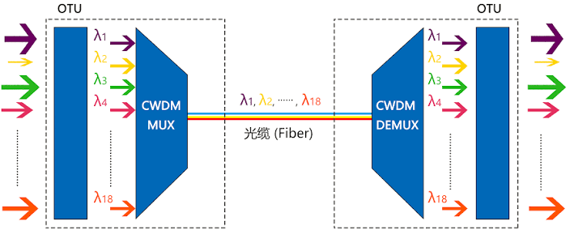

- 常用于**光纤通信**骨干网

- 单模/多模光纤见 [传输介质-光纤](传输介质.md#光纤)

光的波长与频率存在反比关系，因此波分复用本质上其实也是频分复用，只不过是在光域上。

### 码分复用

> [计算机网络 / 数据链路层 / 介质访问控制 - CDM| 计算机考研杂货铺](https://csgraduates.com/computer_network/datalink/mac/#cdm)

**码分复用**（CDM，Code Division Multiplexing）：每个用户分配一个**互不相关（正交）的码片序列**，所有用户**同时、同频**发送，接收方用对应码片解扩还原自己的数据。

- 典型实现：**CDMA**（Code Division Multiple Access）

    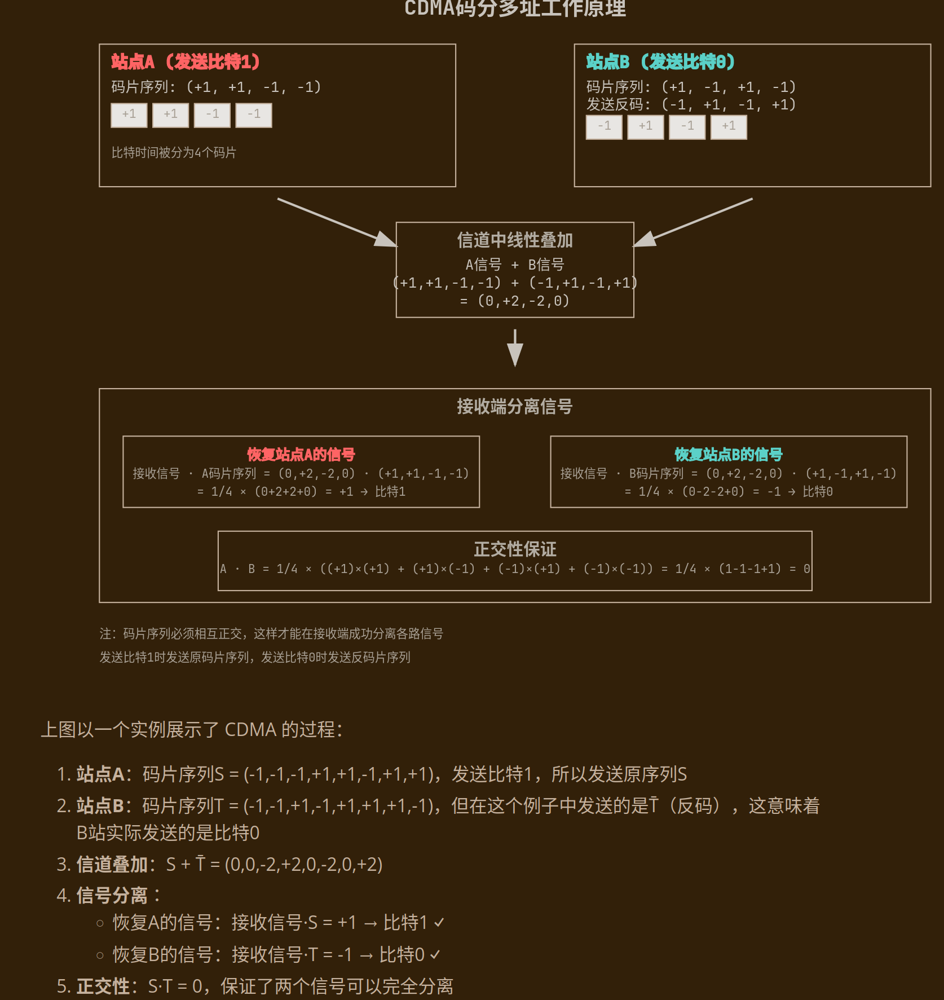

- 优点：抗干扰、保密性好；缺点：码片序列设计复杂

---

## 随机访问介质访问控制

随机访问（争用访问）不预先划分资源：结点**想发就发**，若发生冲突则按规则**退避后重试**。

### ALOHA 协议

ALOHA 是最早的随机访问协议，适用于**广播信道**。

#### 纯 ALOHA 协议

**纯 ALOHA**（Pure ALOHA）是一种简单的**随机接入协议**，允许用户在任意时刻发送数据包，而无需对时间进行任何同步或时隙划分。

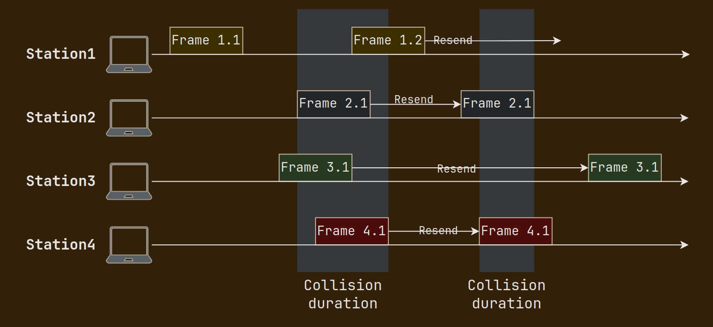

- 工作原理：

    - 用户随时发送数据包

    - 如果数据包成功到达接收端，则传输完成

    - 如果发生冲突（即两个或多个用户同时发送数据包），相关用户需要等待随机的时间后重传

- 冲突窗口：帧的发送时延 $T_0$ 内，任何重叠发送都会冲突

- 最大信道利用率约 **18.4%**（$1/(2e)$）

#### 时隙 ALOHA 协议

**时隙 ALOHA**（Slotted ALOHA）在纯 ALOHA 的基础上引入了**时间同步**，把时间划分为等长**时隙**，帧只能在**时隙起点**发送（时隙长度 = 帧长）。

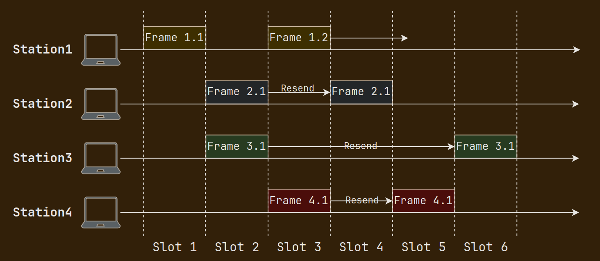

- 工作原理：

    - 时间被划分为等长的时隙

    - 用户在时隙的开始时发送数据包

    - 如果一个时隙内只有一个用户发送数据包，则传输成功

    - 如果多个用户在同一时隙发送数据包，发生冲突，相关用户等待随机时间后重传

- 冲突窗口缩小为 1 个时隙，利用率提高

- 最大信道利用率约 **36.8%**（$1/e$）

### CSMA 协议

> [计算机网络 / 数据链路层 / 介质访问控制 - CSMA| 计算机考研杂货铺](https://csgraduates.com/computer_network/datalink/mac/#csma-协议)

**CSMA**（Carrier Sense Multiple Access，载波侦听多路访问）：发送前先**侦听信道**——若信道忙则暂不发送，若空闲再发送（"先听再说"）。

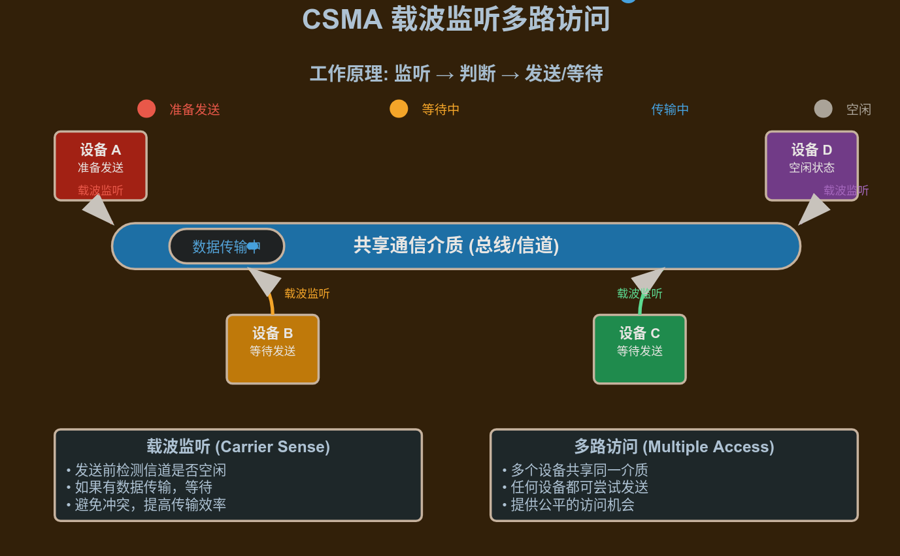

三种 CSMA 变体区别在于"听到空闲后"的行为：

| 协议 | 信道空闲时 | 信道忙时 | 特点 |
|:---:|:---|:---|:---|
| **1-坚持 CSMA** | **立即**发送 | 持续侦听，一旦空闲立即发送 | 利用率最高，但空闲瞬间**冲突概率最大** |
| **非坚持 CSMA** | **立即**发送 | 放弃侦听，**随机等待**一段时间后再侦听 | 冲突少，但延迟较大 |
| **p-坚持 CSMA** | 以概率 $p$ 发送，$1-p$ 推迟到下一时隙 | 持续侦听 | 用于**时隙 CSMA**，是 1-坚持与非坚持的折中 |

### CSMA/CD 协议

**CSMA/CD**（Collision Detection，载波侦听/冲突检测）在 CSMA 基础上增加了**冲突检测**：发送过程中若检测到冲突，**立即停止发送**并发出**冲突强化（Jam）信号**，通知所有结点。**传统以太网**（IEEE 802.3）使用的正是 CSMA/CD 协议。

!!! warning
    CSMA/CD **只适用于有线广播信道**——无线信道中信号衰减大、存在隐藏站，难以可靠检测冲突，因此无线局域网不使用 CSMA/CD。

#### 协议要点

- **工作流程**：

    1. **持续侦听**信道，空闲则发送，这点继承自 **1-坚持 CSMA**。

    2. 发送过程中持续检测冲突

    3. 若冲突：停止发送 → 发 Jam 信号 → **二进制指数退避**后重传

    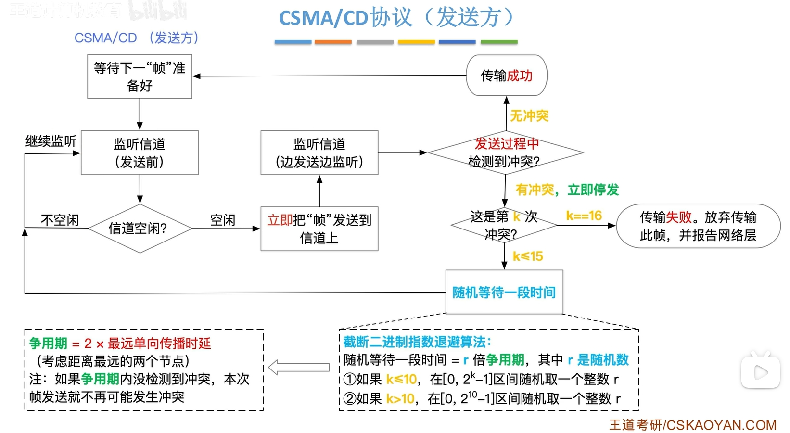

    可简单概括为：**先听后发，边听边发，冲突停发，随机重发**。

!!! info "截断二进制指数退避算法"
    随机等待一段时间 = $r$ 倍[争用期](#争用期)（争用期为一段固定大小的时间，$r$ 为随机数）

    - 第 $k$ 次冲突后，若 $k \leq 10$，从 $\{0, 1, \ldots, 2^k - 1\}$ 中随机选一个时隙数 $r$ 等待再重传；

    - 第 $k$ 次冲突后，若 $k > 10$，在 $\{0, 1, \ldots, 2^{10} - 1\}$ 中随机选一个时隙数 $r$ 等待再重传，即重传时隙数范围不再扩大。

    - 冲突数 $k \ge 16$ 时，重传 16 次仍冲突，则丢弃该帧，并向高层（网络层）报告。

#### 争用期

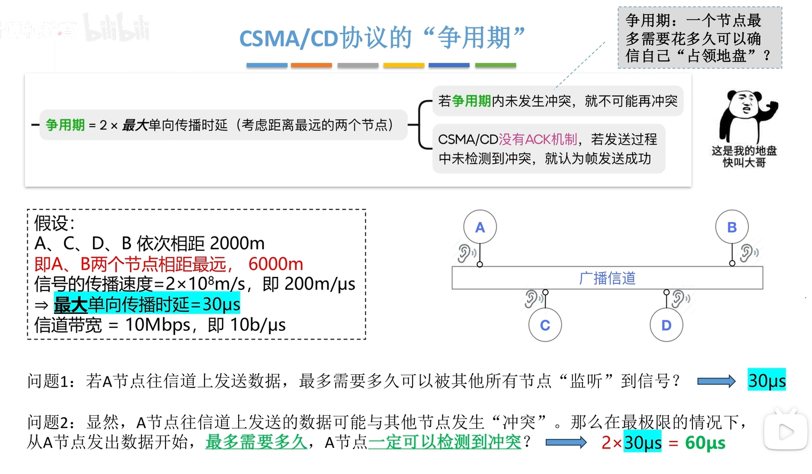

这里的最大单向传播时延和信道占用情景可以结合[时延带宽积](计算机网络概述.md#时延带宽积)理解。

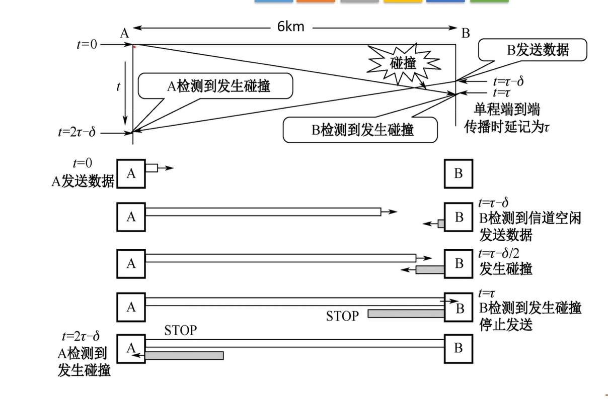

- **争用期内若没有发生冲突，则不可能再发生冲突**。

- CSMA/CD没有ACK机制（确认机制），若发送过程中未检测到冲突，就认为帧发送成功。

#### 最短帧长与最大帧长

##### 最短帧长

发送方必须保证在**整个往返传播时延**内仍在发送，才能检测到可能发生的冲突，因此需要最小帧长限制：

$$
\text{最小帧长} \geq 2 \times \text{传播时延} \times \text{数据传输速率}
$$

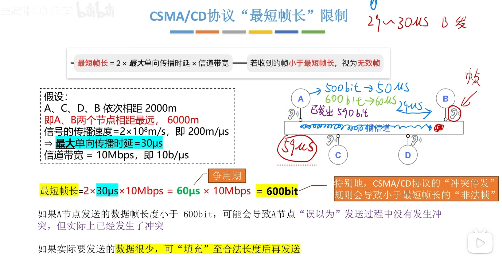

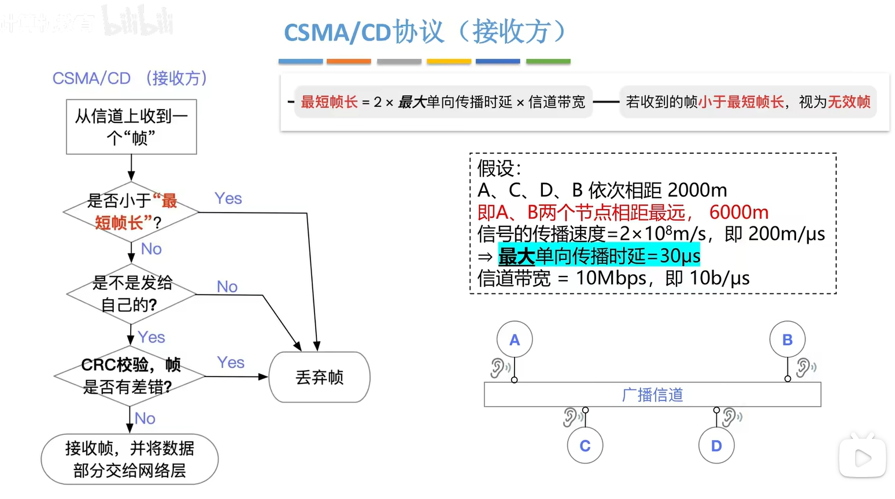

!!! info
    以太网中，规定最短帧长为 $64$ 字节。

##### 最大帧长

规定最大帧长的原因就相对比较好理解，主要是**为了防止某些节点一直占用信道**，导致其他节点无法发送数据（监听信道时一直处于忙状态）。

!!! info
    以太网中，规定最大帧长为 $1518$ 字节。

### CSMA/CA 协议

**CSMA/CA**（Collision Avoidance，载波侦听/冲突避免）用于**无线局域网**（IEEE 802.11 / Wi-Fi）。由于无法可靠做冲突检测，改为**尽量避免冲突**。

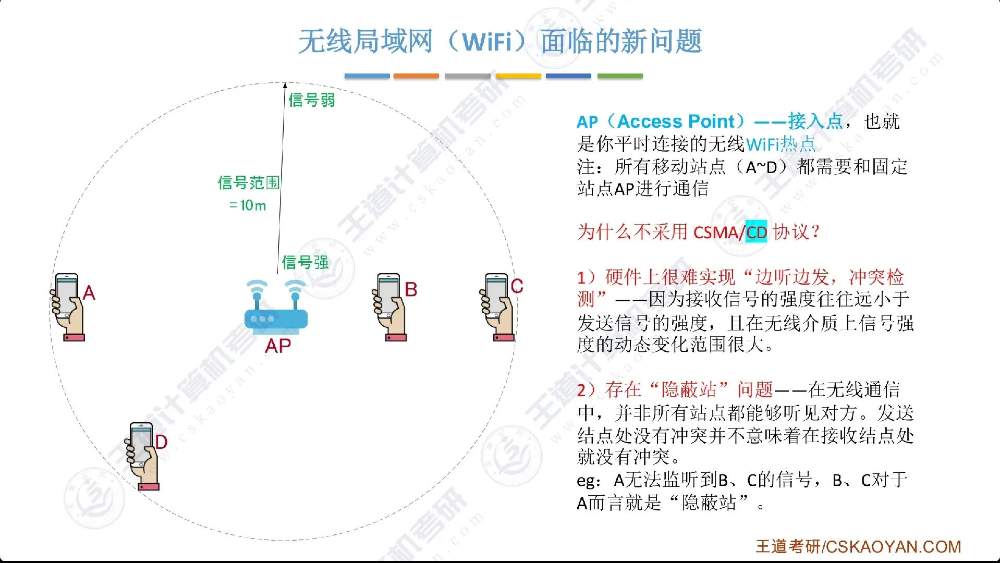

#### 协议要点

##### 工作流程

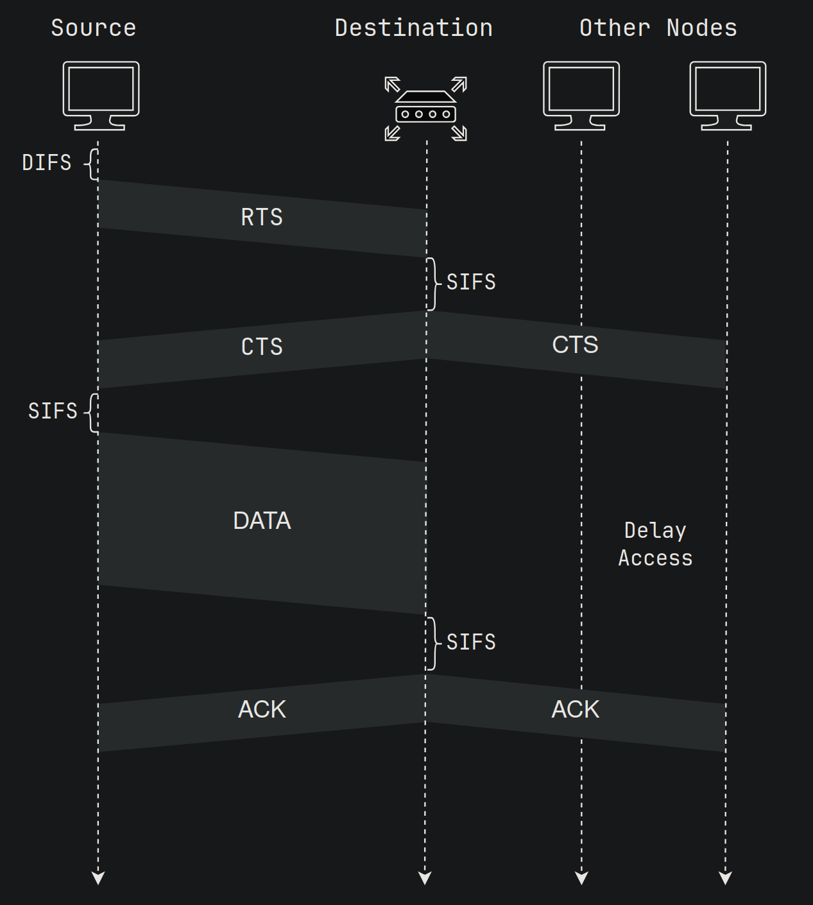

1. 侦听信道（Carrier Sense）

    设备在发送数据前通过物理侦听（检查信道电信号）和虚拟侦听（NAV，网络分配向量，记录信道占用时间）判断信道是否空闲。若信道忙碌，设备进入退避机制，等待随机时间后再次侦听，以降低碰撞风险。

2. 发送请求（RTS，Request to Send）

    若信道空闲超过特定时间（DIFS，分布式帧间间隔），设备可发送 RTS 帧，通知其他设备其传输意图及所需时间。RTS 帧是可选的，主要用于较大数据包或高干扰环境。

3. 清除发送请求（CTS，Clear to Send）

    接收设备在确认信道空闲后（等待 SIFS，短帧间间隔），回复 CTS 帧，确认传输许可并通知附近设备保持沉默。CTS 帧增强了信道保护，减少隐藏节点问题。

4. 数据传输

    发送设备收到 CTS 帧后（等待 SIFS），开始传输数据帧。其他设备通过 NAV 设置避免干扰，确保信道专用于当前传输。

5. 确认帧（ACK，Acknowledgment）

    接收设备成功接收数据后（等待 SIFS），发送 ACK 帧确认。若发送端未收到 ACK（可能因 碰撞 或干扰），启动重传机制，重新执行上述步骤。

##### "随机退避"机制

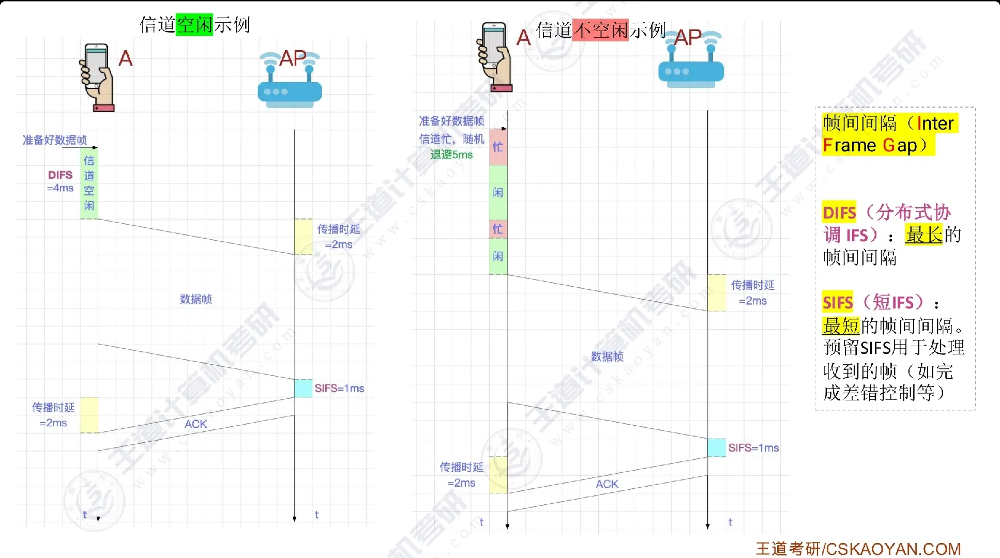

- 用[二进制指数退避算法](#协议要点)确定一段随机退避时间（倒计时）

- 发送方会保持监听信道，**只有信道空闲时才扣除倒计时**，倒计时结束立即发送帧（此时信道必定空闲）

##### 信道预约机制

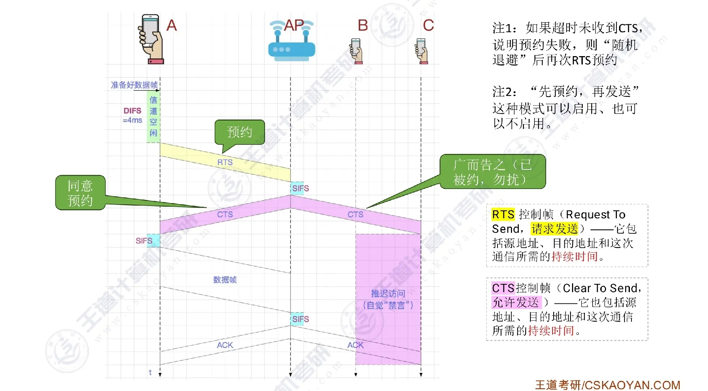

- 发送方广播RTS帧（先听后发，忙则退避）

- AP广播CTS控制帧

- 其他无关节点收到CTS后自觉等待（[虚拟载波监听机制](https://csgraduates.com/computer_network/datalink/mac/#nav)），发送方收到CTS后开始传输数据

- AP收到数据帧后，进行[CRC冗余校验](差错控制.md#CRC-循环冗余校验码)，若无差错就返回ACK帧，否则丢弃数据帧并等待RTS重传

!!! info
    注意发送方及AP在广播RTS和CTS帧时均需要在帧中指明预约时长。

### CSMA/CD vs CSMA/CA

| 对比项 | CSMA/CD | CSMA/CA |
|:---:|:---|:---|
| 适用场景 | 有线以太网 | 无线局域网 |
| 冲突处理 | **检测**到冲突后停止 | **避免**冲突（退避 + ACK） |
| 能否检测冲突 | 能 | 不能（改为确认机制） |
| 典型标准 | IEEE 802.3（以太网） | IEEE 802.11（Wi-Fi） |

---

## 轮询访问控制协议

轮询访问（Controlled Access）不允许多结点同时争用：由**集中控制**或**分布式令牌**决定谁有权发送，从机制上**避免冲突**。

### 轮询协议

**轮询**（Polling）：存在一个**主站**（控制器），按顺序依次询问各从站"是否有数据要发送"。

- 主站发出 Poll 帧 → 从站有数据则回复 Data 帧 → 主站转向下一个从站

- 优点：无冲突，适合从站数量少、流量可预测的场景

- 缺点：主站成为瓶颈；轮询周期带来额外开销

### 令牌传递协议

**令牌传递**（Token Passing）：环网上维护一个特殊的**令牌（Token）**帧，**只有持有令牌的结点**才能发送数据；发送完毕后将令牌传递给下一个结点。

- 典型应用：**IEEE 802.5 令牌环网**

- 优点：各结点机会均等，无冲突，适合负载较重的环网

- 缺点：令牌维护开销；某结点故障可能影响令牌传递（需容错机制）

!!! tip
    IEEE802.5 令牌环的组帧还使用了[违规编码法](组帧.md#违规编码法)做帧定界。令牌环如今已被以太网取代，408 考察要求不高。

---

!!! abstract
    - MAC 只针对**广播信道**；点对点信道通常不需要

    - 三类 MAC：**划分**（无冲突）、**随机**（可能冲突）、**轮询**（无冲突）

    - 纯 ALOHA（$\approx 18\%$）< 时隙 ALOHA（$\approx 37\%$）< CSMA 系列

    - CSMA/CD 用于**有线**以太网；CSMA/CA 用于**无线**局域网——不要混用

    - CSMA/CD 的最小帧长与**传播时延**有关：链路越长，要求帧越长

    - 1-坚持 CSMA 空闲时**立即发**，冲突概率最高；非坚持 CSMA 忙时**随机退避再听**

    - TDM 固定时隙可能浪费；STDM 按需分配，利用率更高
