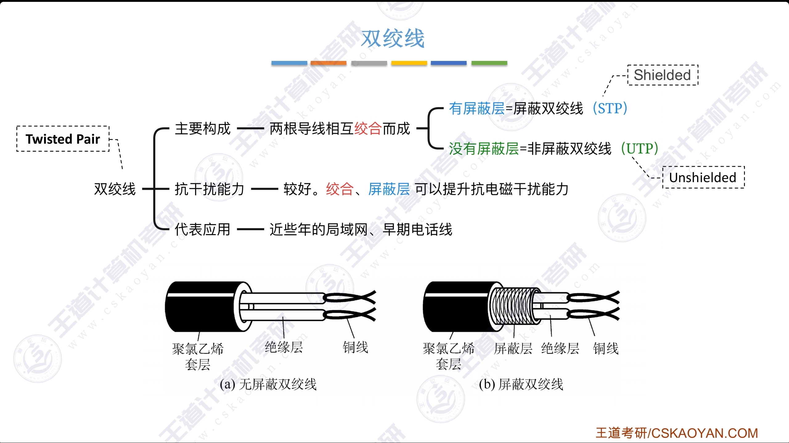
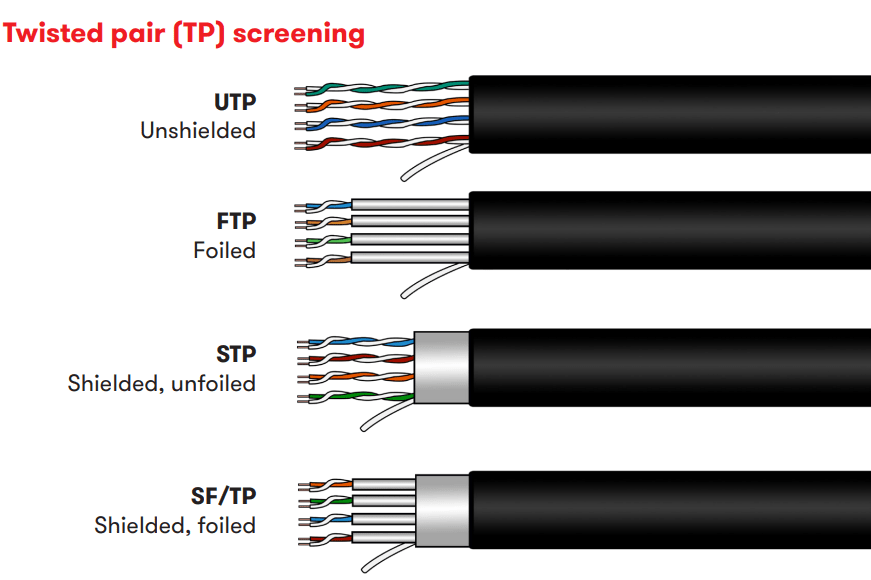
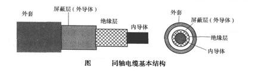
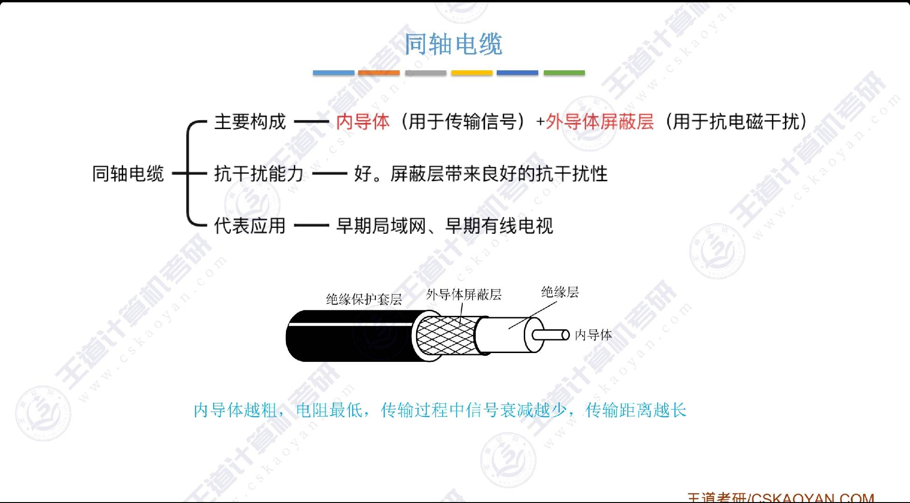
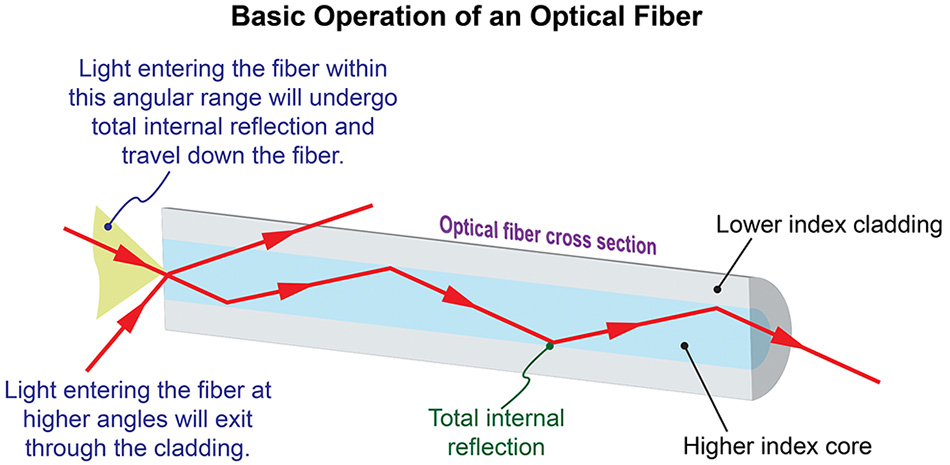
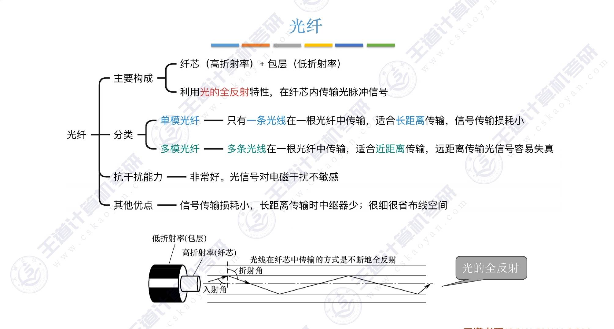
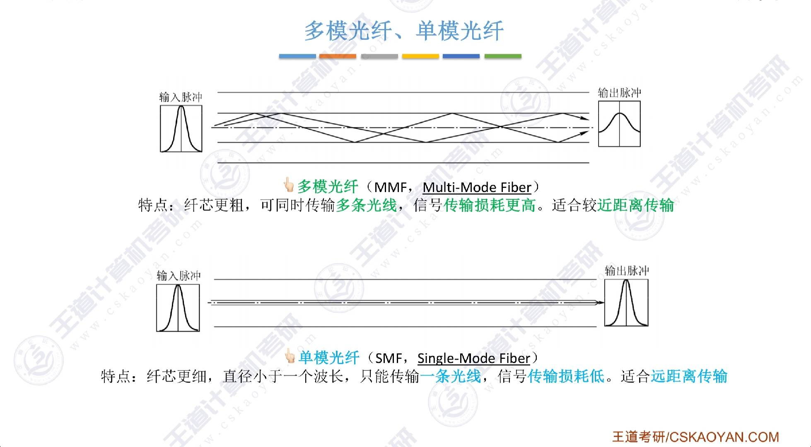
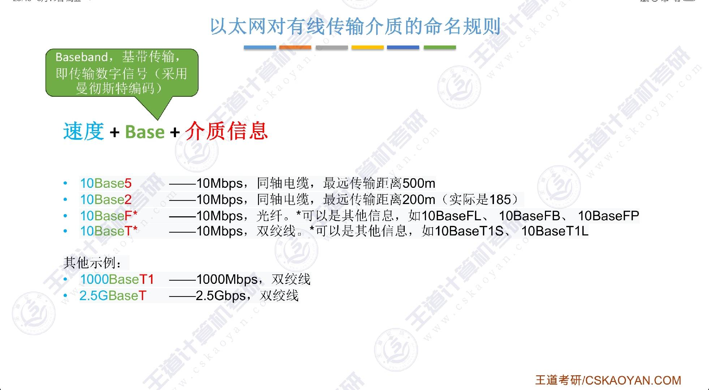
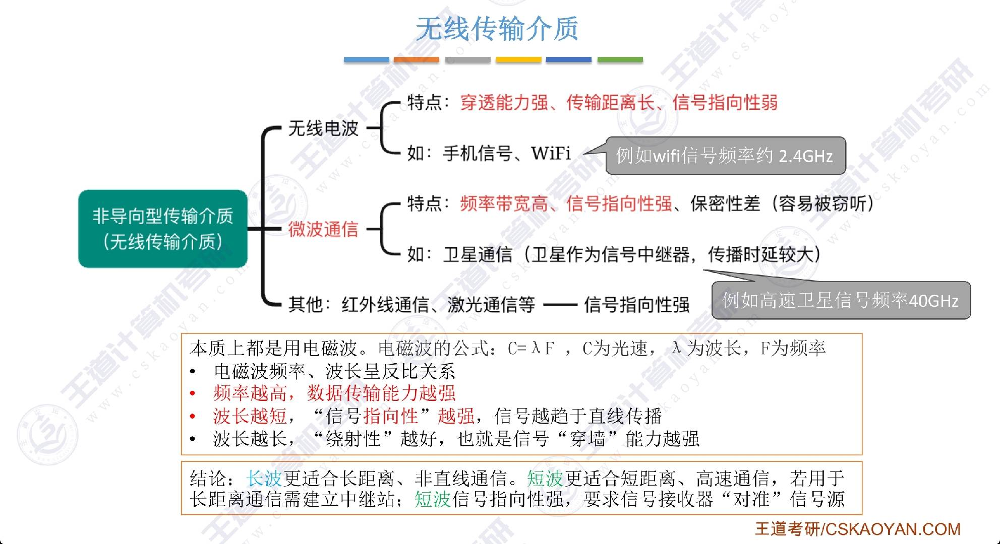

# 传输介质

## 常用传输介质

### 导向型传输介质

#### 双绞线

提升传输能力的方法：

- 提高绞合度

- 增加屏蔽层（*shielded*）

网线类数越高，表示其传输能力越强。

#### 同轴电缆

#### 光纤

##### 单模光纤与多模光纤

- 单模光纤：只传输一种模式的光，传输距离远，传输速率高，但成本高（要将光纤的直径做到只有一个光的波长）。

- 多模光纤：传输多种模式的光，传输距离近，传输速率低，但成本低。

#### 以太网对有线传输介质的命名规则

### 非导向型传输介质

#### 无线传输介质

## 物理接口的特性

- 机械特性：指明接口所用接线器的形状和尺寸、引脚数目和排列、固定和锁定装置等。

- 电气特性：指明在接口电缆的各条线上出现的电压的范围、传输速率和距离限制等。

- 功能特性：指明某条线上出现的某一电平的电压表示何种意义，以及每条线的功能。

- 规程特性（过程特性）：指明对于不同功能的各种可能事件的出现顺序。
