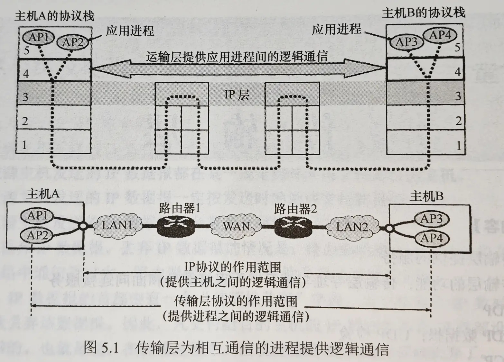

# 传输层提供的服务

## 传输层的功能

[数据链路层](数据链路层的功能.md)提供链路上相邻节点之间的逻辑通信，[网络层](网络层的功能.md)提供主机之间的逻辑通信。传输层位于网络层和应用层之间，**为运行在不同主机上的进程之间提供逻辑通信**。

### 应用进程之间的逻辑通信

从网络层来看，通信双方是两台主机，IP数据报的首部给出了这两台主机的IP地址。但“两台主机之间的通信”实际上是两台主机中应用进程之间的通信，也被称作<strong>[端到端](../cs168/Design%20Principle.md#End-to-End-Principle)的逻辑通信</strong>。

### 复用和分用

- **复用**（Multiplexing）是指发送方不同的应用进程都可以使用同一个传输层协议传送数据。

- **分用**（[Demultiplexing](../cs168/Design%20Principle.md#Demultiplexing), 也叫**解复用**）是指接收方传输层在剥去首部后能够把数据正确交付到目的应用进程。

!!! tip
    网络层也有复用和分用的功能，但网络层的复用是指发送方不同协议的数据都可以被封装成IP数据报发送出去；分用是指接受方的网络层在剥去IP数据报的首部后能够把数据正确交付到目的协议。其实底层思想是相通的。

### 差错检测

传输层会对收到的报文（*包括首部和数据部分*）进行差错检测。

!!! tip "网络层的差错检测"
    在网络层中，IP数据报首部中的检验和字段只检验首部是否出错，不检查数据部分。

- 对于 [TCP（Transmission Control Protocol, 传输控制协议）](TCP.md)，若接收方发现报文段出错，则**要求对方重新发送该报文段**。

- 对于 [UDP（User Datagram Protocol, 用户数据报协议）](UDP.md)，若接收方发现用户数据报出错，则**直接丢弃该UDP用户数据报**。

### 提供面向连接和无连接的传输协议

传输层向高层用户屏蔽了低层网络核心的细节（如网络拓扑、路由协议等），它使应用进程看见的是在两个传输层实体之间好像有一条端到端的逻辑通信信道，这条逻辑通信信道对上层的表现却因传输层协议不同而有很大的差别。

当传输层采用面向连接的TCP时，尽管下面的网络是不可靠的（只提供尽最大努力的服务），但这种逻辑通信信道就相当于一条**全双工**的可靠信道。但当传输层采用无连接的UDP时，这种逻辑通信信道仍然是一条不可靠信道。

## 传输层的寻址与端口

### 端口的作用

**端口**（*Port*）是传输层服务访问点（*Transport Service Access Point, TSAP*）的别称，故名思议，在传输层中用于标识不同的应用进程，类似IP地址在网络层中的作用。

**端口机制是传输层实现复用和分用的关键机制**[^1]。

!!! review
    - 数据链路层中的服务访问点为**帧的“类型”字段**

    - 网络层中的服务访问点为**IP数据报的“协议”字段**

    - 传输层中的服务访问点为**“端口号”字段**

    - 应用层中的服务访问点为<strong>“用户界面”</strong>

!!! warning "硬件端口 vs. 软件端口[^1]"
    上面提到的，在协议栈层间的抽象协议端口是**软件端口**。

    - **硬件端口**是不同硬件设备进行交互的接口

    - **软件端口**是应用层的各种协议进程与传输实体进行层间交互的一种**地址**

### 端口号

**应用进程通过端口号进行标识**，端口号的长度为16位，因此端口号的总数为 $2^{16} = 65536$ 个。

端口号只具有本地意义，即指标识本机应用层中的各进程，不同主机上的相同端口号是没有联系的。

根据端口号的范围可将其分为两类：

- 服务端使用的端口号

    - 熟知端口号（Well-Known Ports）：$0 \sim 1023$，IANA（互联网地址指派机构）将这些端口号指派给了TCP/IP体系中最重要的一些应用层服务。

        一些常见的熟知端口号：

        | 应用程序 | FTP | TELNET | SMTP | DNS | TFTP | HTTP | HTTPS | SNMP | SSH |
        |:--------:|:---:|:------:|:----:|:----:|:----:|:----:|:-----:|:----:|:----:|
        | 端口号   | 21  | 23     | 25   | 53  | 69   | 80   | 443   | 161  | 22  |

    - 登记端口号（Registered Ports）：$1024 \sim 49151$，是由IANA根据需要分配给新应用的。

- 客户端使用的端口号：$1024 \sim 65535$，仅在客户端进程运行时**动态**选择，也被称为<strong>短暂端口号</strong>（*ephemeral port*）。

### 套接字

从上面的学习中我们知道，网络层中使用IP地址来标识和区别不同的主机，而端口号则标识和区别相同主机上的不同的应用进程。

端口号拼接到IP地址就构成了<strong>套接字</strong>（*Socket*），它是网络环境中进程间通信的端点。

$$
Socket = (IP Address:Port)
$$

## 无连接服务与面向连接服务

TCP/IP协议族在IP层之上使用了两个传输协议：一个是面向连接的[传输控制协议（TCP）](TCP.md)，向上提供一条全双工的可靠逻辑信道；一个是无连接的[用户数据报协议（UDP）](UDP.md)，向上提供一条不可靠的逻辑信道。

- TCP提供面向连接的可靠服务，因此在传输数据前必须先建立连接，数据传输结束后要释放连接。TCP不提供广播或多播服务。为实现可靠传输，TCP必须采取各种可靠传输机制（如确认、流量控制、计时器、连接管理等），这会增加许多开销（首部信息、处理器资源等），影响传输效率。因此其适用于可靠性更重要的场合。

- UDP提供无连接的不可靠服务，在传输数据前无需建立连接，无需确认与维护连接，因此可以在网络上以任何可能的路径传输，并尽最大努力交付，即不保证可靠交付，因此传输速度更快，没有复杂的控制机制，适合于实时性要求较高的应用。UDP在IP层上仅提供多路复用和对数据的错误检查，因此UDP首部开销小，只有8个字节，比TCP的20个字节小得多。

下面是一些典型互联网应用所采用的TCP/IP应用层协议和传输层协议：

| 互联网应用 | 应用层协议 | 传输层协议 |
|:----------:|:----------:|:----------:|
| 域名解析 | 域名系统（DNS） | UDP |
| 文件传输 | 简单文件传输（TFTP） | UDP |
| 路由选择 | 路由信息协议（RIP） | UDP |
| IP地址分配 | 动态主机配置协议（DHCP） | UDP |
| 网络管理 | 简单网络管理协议（SNMP） | UDP |
| IP多播 | 多播组管理协议（IGMP） | UDP |
| 安全 | 安全套接字层（SSL） | TCP |
| 电子邮件 | 简单邮件传输协议（SMTP） | TCP |
| 远程终端接入 | 远程终端接入协议（TELNET） | TCP |
| 万维网 | 超文本传输协议（HTTP） | TCP |
| 文件传输 | 文件传输协议（FTP） | TCP |

[^1]: [Demultiplexing - Design Principles](../cs168/Design%20Principle.md#Demultiplexing)