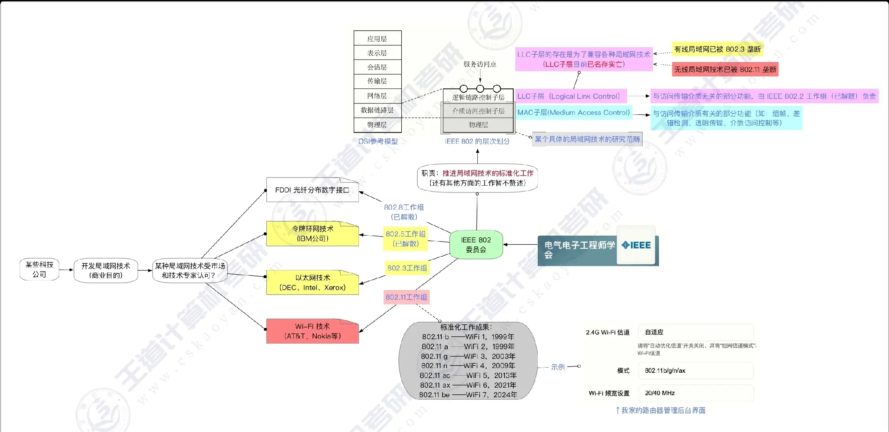
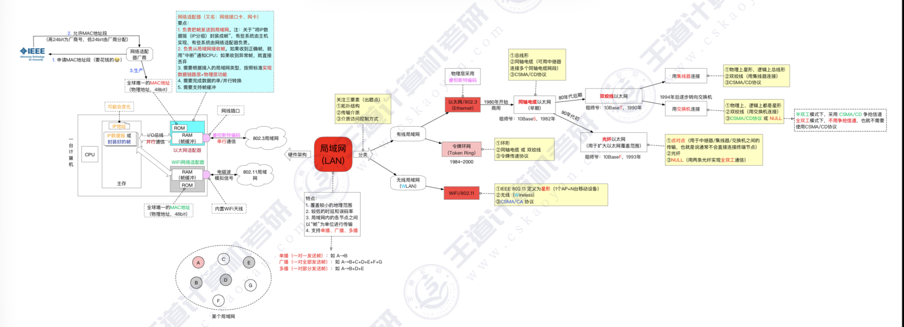
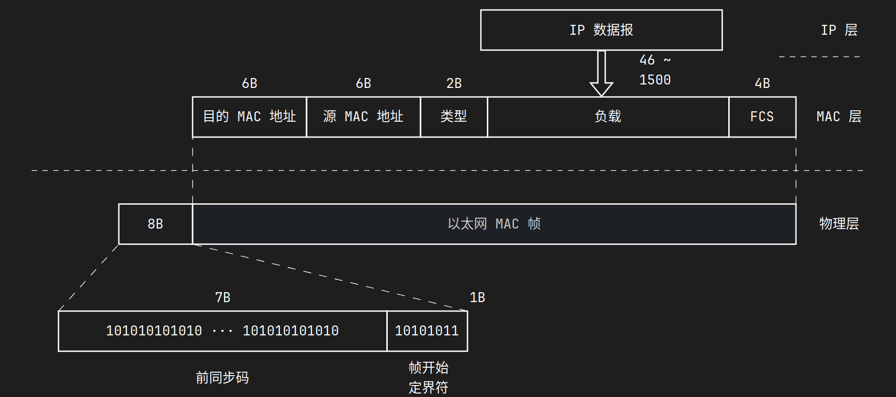
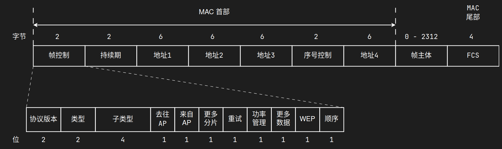
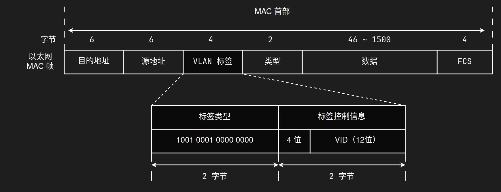
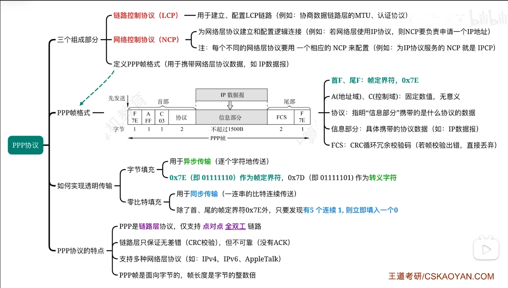
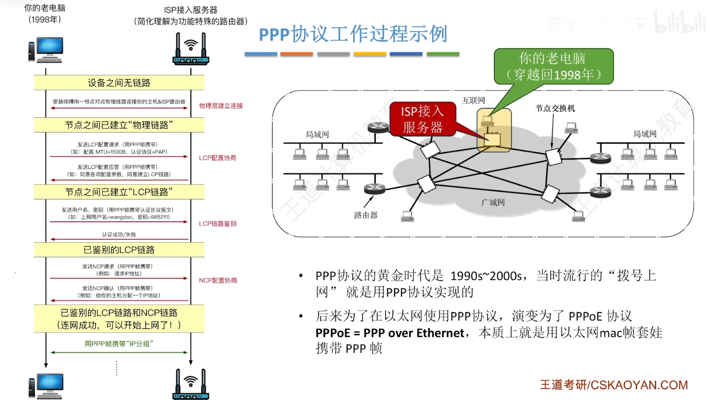

# 局域网和广域网

> [计算机网络 / 数据链路层 / 局域网和广域网 | 计算机考研杂货铺](https://csgraduates.com/computer_network/datalink/lan/)

**局域网**（LAN）和**广域网**（WAN）是按**地理覆盖范围**划分的两类典型网络。二者在拓扑、链路类型、常用协议上差异明显，但都属于[数据链路层](数据链路层的功能.md)需要服务的"网络"场景。

| 对比项 | 局域网（LAN） | 广域网（WAN） |
|:---:|:---|:---|
| 覆盖范围 | 较小（房间、楼宇、园区，通常几 km 内） | 较大（城市、国家、洲际） |
| 典型链路 | [广播信道](数据链路层的功能.md#数据链路层使用的信道)（以太网、Wi-Fi） | 多为**点对点**专线/租用链路 |
| 典型协议 | IEEE 802.3（以太网）、802.11（Wi-Fi） | PPP、HDLC 等 |
| 差错率 | 通常较低 | 相对较高（距离远、设备多） |
| 所有权 | 多为单位自建、自管 | 多由 ISP/运营商提供 |

---

## 局域网

### 局域网的基本概念和体系结构

**局域网**是在有限地理范围内，将若干计算机、外设及通信设备互连起来，实现资源共享和信息传递的计算机网络。

局域网的主要特点：

- **覆盖范围小**，传输时延低，**数据传输速率高**

- 通常由**单一机构**建设、管理和维护

- 多采用**广播信道**（共享介质），需要[介质访问控制](介质访问控制.md)（MAC）

- 可靠性较高，误码率低

#### IEEE 802 参考模型

IEEE 将数据链路层划分为两个子层，与物理层共同构成局域网协议栈：

| 子层 | 标准 | 功能 |
|:---:|:---:|:---|
| **LLC**（逻辑链路控制） | IEEE 802.2 | 向上为网络层提供统一接口（如 SAP），屏蔽下层 MAC 差异 |
| **MAC**（介质访问控制） | 802.3 / 802.11 等 | 负责帧的封装、寻址（MAC 地址）与信道访问 |
| **物理层** | 802.3 / 802.11 等 | 比特传输、编码、物理接口 |

!!! tip
    "以太网帧格式"和"CSMA/CD"属于**MAC 子层**；LLC 了解"存在这一层、负责向上屏蔽差异"即可。

#### 常见 IEEE 802 标准

| 标准 | 名称 | 说明 |
|:---:|:---|:---|
| 802.3 | 以太网 | 有线局域网，最常用 |
| 802.11 | 无线局域网（Wi-Fi） | 无线接入 |
| 802.1Q | VLAN 标记 | 在帧中插入 VLAN 标签 |
| 802.1D | 生成树协议（STP） | 防止交换机环路（了解） |
| 802.5 | 令牌环网 | 环形拓扑，已淘汰 |

---

### 以太网与IEEE 802.3

**以太网**（Ethernet）是目前最广泛使用的**有线局域网**技术，IEEE 802.3 是其标准化版本。传统共享式以太网采用[CSMA/CD](介质访问控制.md#CSMACD-协议)；现代**交换式以太网**中，每个交换机端口构成独立冲突域，全双工模式下不再需要 CSMA/CD。

#### 以太网的传输介质与网卡

以太网可使用多种[传输介质](传输介质.md)：

| 介质 | 典型场景 | 备注 |
|:---:|:---|:---|
| 双绞线 | 10/100/1000BASE-T | 最常见，星型拓扑连交换机 |
| 光纤 | 1000BASE-SX/LX 等 | 骨干、长距离、高速 |
| 同轴电缆 | 早期总线型以太网 | 现已少见 |

**网卡**（NIC，Network Interface Card）是主机接入局域网的接口设备，主要功能：

- 实现数据链路层帧的发送与接收

- 提供唯一的 **MAC 地址**，用于局域网内寻址

- 完成串行/并行转换、编码解码等

以太网命名规则（如 `100BASE-TX`）：**100** = 速率（Mbps），**BASE** = 基带传输，**TX** = 介质类型（双绞线）[^1]。

#### 以太网的MAC地址

**MAC 地址**（物理地址）是数据链路层用于标识网络接口的地址，以太网中为 **48 位（6 字节）**，通常写作 6 组十六进制数，如 `00-1A-2B-3C-4D-5E`。

| 部分 | 位数 | 含义 |
|:---:|:---:|:---|
| 前 24 位 | OUI | 组织唯一标识符，由 IEEE 分配给厂商 |
| 后 24 位 | — | 由厂商自行分配，保证全球唯一 |

**特殊 MAC 地址**：

- **广播地址**：`FF-FF-FF-FF-FF-FF`，同一广播域内所有接口都接收

- **组播地址**：MAC 第一字节最低位为 **1**（如 `01-00-5E-xx-xx-xx` 用于 [IPv4 组播](IP多播.md#在局域网上进行硬件多播)映射）

- **单播地址**：第一字节最低位为 **0**

!!! warning
    MAC 地址工作在**同一广播域内**（一跳相邻结点）。跨网段通信时，源/目的 MAC 会在路由器处**逐跳更换**，而 IP 地址通常不变[^2]。

#### 以太网的MAC帧

以太网 MAC 帧是数据链路层的传输单位，经典 **802.3 + DIX Ethernet II** 格式如下：

| 字段 | 长度 | 说明 |
|:---:|:---:|:---|
| 前导码（Preamble） | 7 B | 同步，物理层使用 |
| 帧起始定界符（SFD） | 1 B | 标志帧开始，物理层使用 |
| **目的 MAC 地址** | 6 B | 接收方接口地址 |
| **源 MAC 地址** | 6 B | 发送方接口地址 |
| **类型/长度** | 2 B | $> 1536$（0x0600）为**类型**（如 0x0800 表示 IPv4）；$\leq 1500$ 为**数据长度**（802.3 原始格式） |
| **数据** | 46～1500 B | 上层 PDU（如 IP 数据报） |
| **FCS** | 4 B | 帧检验序列（CRC 检错） |

从目的 MAC 到 FCS 的部分称为**MAC 帧主体**：

- [最小帧长](介质访问控制.md#最短帧长)：64 字节（不含前导码和 SFD）——保证CSMA/CD 能检测到冲突

- [最大帧长](介质访问控制.md#最大帧长)：1518 字节（不含前导码和 SFD）

- 数据部分不足 46 字节时需**填充（Pad）**

!!! example
    主机 A（MAC `AA`）向同网段主机 B（MAC `BB`）发送一个 IP 数据报：A 的网卡将 IP 数据报封装进以太网帧，目的 MAC 填 `BB`，源 MAC 填 `AA`，类型填 `0x0800`，经交换机按 MAC 表转发到 B 所在端口。

#### 高速以太网

在保持**帧格式兼容**的前提下，以太网速率不断提升：

| 名称 | 速率 | 说明 |
|:---:|:---:|:---|
| 快速以太网 | 100 Mbps | 仍可用 CSMA/CD（半双工）或全双工 |
| 千兆以太网 | 1 Gbps | 半双工仍保留 CSMA/CD；**全双工**为主流，无冲突 |
| 万兆以太网及以上 | 10 Gbps+ | 一般仅全双工，用于骨干/数据中心 |

!!! tip
    现代局域网几乎全是**交换式 + 全双工**，CSMA/CD 更多是历史与考试概念；但 408 仍会考最小帧长、争用期等 CSMA/CD 计算。

---

### IEEE 802.11无线局域网

**无线局域网**（WLAN，Wi-Fi）使用无线电波作为传输介质，标准号为 **IEEE 802.11**。由于无线信道难以可靠检测冲突，采用 [CSMA/CA](介质访问控制.md#CSMACA-协议)（冲突**避免**），并配合 ACK 确认。

#### 无线局域网的组成

802.11 定义了两种基本组网方式：

| 模式 | 英文 | 组成 | 特点 |
|:---:|:---:|:---|:---|
| **基础设施模式** | Infrastructure（BSS） | 站点（STA）+ 接入点（AP）+ 分布式系统（DS） | 最常见，如连家用路由器 Wi-Fi |
| **自组织模式** | Ad hoc（IBSS） | 站点之间直接通信，无 AP | 临时组网，无中心 |

基础设施模式中：

- **STA**（Station）：笔记本电脑、手机等终端

- **AP**（Access Point）：无线接入点，连接无线与有线网络

- **BSS**（Basic Service Set）：一个 AP 及其关联 STA 构成的基本服务集

- **ESS**（Extended Service Set）：多个 BSS 通过 DS 互联，形成更大覆盖

!!! tip
    隐藏站、暴露站问题是 CSMA/CA 需要 RTS/CTS 预约的原因之一，详见 [介质访问控制-CSMA/CA](介质访问控制.md#CSMACA-协议)。

#### 802.11的MAC帧

802.11 MAC 帧与以太网帧结构不同，字段更复杂，常考**帧类型**与**地址字段数量**：

**三种主要帧类型**：

| 类型 | 功能 | 是否携带数据 |
|:---:|:---|:---:|
| **管理帧** | 关联、认证、信标（Beacon）等 | 否 |
| **控制帧** | RTS、CTS、ACK 等信道控制 | 否 |
| **数据帧** | 承载上层数据 | 是 |

**地址字段**（最多 4 个）：在基础设施模式下，数据帧通常涉及**源 STA、目的 STA、AP、DS** 中的若干地址，因此 802.11 帧可有 2～4 个地址字段（由 Frame Control 中的 **To DS / From DS** 位决定）。

!!! warning
    802.11 **不使用 CSMA/CD**；冲突通过退避 + ACK 处理。不要把有线以太网和无线局域网的 MAC 机制混为一谈。

---

### VLAN基本概念与基本原理

**VLAN**（Virtual LAN，虚拟局域网）是在**逻辑上**将一个物理局域网划分为多个独立的广播域，而无需增加物理设备。

#### 为什么需要 VLAN

- 二层交换机默认转发广播，整个网络处于**同一广播域**，广播风暴、安全性、管理粒度都是问题

- 路由器可隔离广播域，但成本高、端口有限

- VLAN 在**二层**实现广播域隔离，灵活且高效

#### 基本原理

- 交换机根据端口配置或帧中的 **VLAN 标签**，决定帧属于哪个 VLAN

- **同一 VLAN 内**的帧可二层互通；**不同 VLAN 之间**需经三层设备（路由器/三层交换机）转发

- 标准：**IEEE 802.1Q**，在以太网帧中插入 **4 字节 VLAN 标签**

| VLAN 标签字段 | 说明 |
|:---:|:---|
| TPID（2 B） | 固定值 `0x8100`，标识这是带标签的帧 |
| TCI（2 B） | 含优先级（PCP）、CFI/DEI、**VLAN ID（12 位，0～4095）** |

#### 端口类型（了解）

| 端口类型 | 说明 |
|:---:|:---|
| **Access 端口** | 连接终端，通常只属于一个 VLAN，发送**无标签**帧 |
| **Trunk 端口** | 交换机之间互联，可承载多个 VLAN，发送**带标签**帧 |

!!! tip
    VLAN 划分的是**广播域**，不是冲突域。现代交换式以太网中，每个端口已是独立冲突域[^3]。

---

## 广域网

### 广域网的基本概念

**广域网**（WAN）覆盖范围大，可跨越城市、国家甚至全球，用于连接距离较远的局域网或主机。

广域网的特点：

- **覆盖范围广**，结点地理分布分散

- 传输距离长，时延通常高于局域网

- 多由**电信运营商**提供（租用专线、光纤骨干等）

- 结点之间多为**点对点链路**，一般不需要广播式 MAC（如 CSMA/CD）

- 常用协议：[PPP](#点对点协议)、HDLC、帧中继、ATM等

!!! tip
    "局域网 vs 广域网"是按**地理范围**分类；按信道类型分，局域网多是**广播信道**，广域网多是**点对点信道**——二者分类维度不同，不要强行一一对应。

---

### 点对点协议

**PPP**（Point-to-Point Protocol，点对点协议）是目前最常用的**点对点数据链路层协议**，用于拨号上网、路由器间串口/专线互联等场景，替代了功能简陋的 SLIP。

#### PPP 的组成

PPP 主要包括三部分：

| 组件 | 功能 |
|:---:|:---|
| **组帧** | 将网络层分组封装成 PPP 帧 |
| **LCP**（链路控制协议） | 建立、配置、测试、**释放**数据链路 |
| **NCP**（网络控制协议） | 为不同网络层协议配置参数，如 **IPCP** 为 IP 分配地址 |

#### PPP 帧格式

| 字段 | 说明 |
|:---:|:---|
| 标志（Flag） | `0x7E`（`01111110`），帧定界符 |
| 地址 | 固定 `0xFF`（广播，点对点无寻址需求） |
| 控制 | 固定 `0x03`（无连接） |
| 协议 | 指明上层协议（如 `0x0021` 表示 IP） |
| 数据 | 网络层分组 |
| FCS | 帧检验序列（CRC 检错） |

组帧采用**字节填充法**（标志 `0x7E`、转义 `0x7D`），与 [组帧-字节填充法](组帧.md#字节填充法) 思路一致。

#### PPP 的工作流程与特点

- 面向**字节**（不是比特填充）

- **全双工**链路

- 仅**检错**（FCS），不纠错、不流量控制、不编号——可靠传输交给上层（如 TCP）

- 支持**身份验证**：PAP（明文）、CHAP（挑战握手，更安全）

- 支持多种网络层协议（IP、IPX 等），通过 NCP 分别配置

!!! abstract
    - **局域网**多用广播信道 + MAC 地址；**广域网**多用点对点链路 + PPP 等协议

    - 以太网 MAC 帧：目的/源 MAC + 类型 + 数据 + FCS；最小 64 B，最大 1518 B

    - 802.11 用 **CSMA/CA**，不用 CSMA/CD；帧分管理/控制/数据三类

    - **VLAN** 在二层划分广播域，802.1Q 标签占 4 字节，VID 12 位

    - **PPP** = 组帧 + LCP + NCP；字节填充，全双工，只检错不纠错

[^1]: [传输介质-以太网对有线传输介质的命名规则](传输介质.md#以太网对有线传输介质的命名规则)

[^2]: [网络层设备](网络层设备.md)

[^3]: [网络层设备](网络层设备.md#冲突域和广播域)