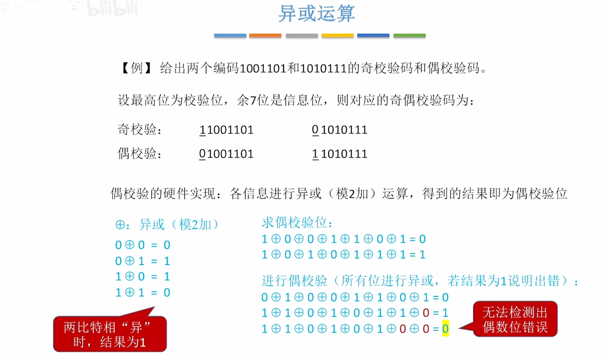
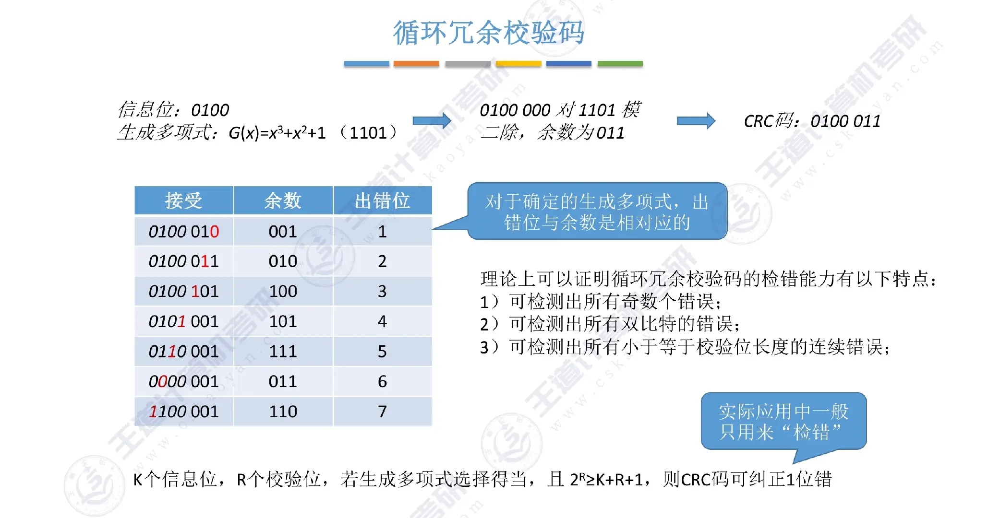

# 差错控制

[数据链路层](数据链路层的功能.md)在传输过程中可能因噪声导致**位错**（帧内某些比特翻转）。差错控制的任务是**发现**这些错误，必要时**纠正**或触发**重传**。

按处理方式，差错控制分为两类：

| 类型 | 编码方式 | 发现错误后 | 典型方法 |
|:---:|:---|:---|:---|
| 检错 | 检错编码 | 丢弃帧，请求重传 | 奇偶校验、CRC |
| 纠错 | 纠错编码 | 接收方直接纠正 | 海明码 |

!!! tip
    408 中 **差错控制（位错）≠ 可靠传输（帧错）**：前者管"帧里比特对不对"，后者管"帧有没有丢/重/乱"，详见 [流量控制与可靠传输机制](流量控制与可靠传输机制.md)。

---

## 检错编码

检错编码只需让接收方**判断有无错误**，出错后通常**丢弃并重传**，不需要定位错在哪一位。

### 奇偶校验码

!!! example
    

    奇偶校验利用**异或运算**（模 2 加，记作 $\oplus$）生成/检验校验位：

    - $0 \oplus 0 = 0$，$0 \oplus 1 = 1$，$1 \oplus 0 = 1$，$1 \oplus 1 = 0$

    **校验位规则**（设最高位为校验位）：

    | 类型 | 规则 | 例：信息位 `1001101`（4 个 1） |
    |:---:|:---|:---|
    | 奇校验 | 全体比特中 1 的个数为**奇数** | 校验位 = 1 → `1 1001101` |
    | 偶校验 | 全体比特中 1 的个数为**偶数** | 校验位 = 0 → `0 1001101` |

    偶校验位的生成：对所有信息位做异或，结果即为偶校验位。例：$1 \oplus 0 \oplus 0 \oplus 1 \oplus 1 \oplus 0 \oplus 1 = 0$。

    **接收方检验**：对收到的全部比特（含校验位）做异或。结果为 **1** → 检测到错误；结果为 **0** → 未检测到错误。

    在实际场景中，**偶校验**的运用比奇校验更加广泛。

!!! warning
    奇偶校验码**只能检测出奇数位错**，不能检测出偶数位错（两个比特同时翻转，1 的个数奇偶性不变）；且**无纠错能力**。

### CRC 循环冗余校验码

CRC（Cyclic Redundancy Check）是数据链路层**最常用**的检错方法，以太网帧尾 FCS 字段即采用 CRC-32。

#### 基本思想

把比特串看作多项式系数（高位对应高次项），用**生成多项式** $G(x)$ 做**模 2 除法**，余数作为**冗余码（FCS）**附加在数据后面。接收方用同样的 $G(x)$ 去除，余数为 0 则认为无错。

#### CRC 码的构造

设 $G(x)$ 的阶数为 $r$（即冗余码位数为 $r$），信息位对应多项式为 $M(x)$：

1. 在 $M(x)$ 末尾**附加 $r$ 个 0**（相当于乘以 $x^r$），得到 $M(x) \cdot x^r$

2. 用 $G(x)$ 对 $M(x) \cdot x^r$ 做**模 2 除法**，得到余数 $R(x)$

3. 发送的帧 = 原信息位 + $R(x)$（共 $r$ 位冗余码）

!!! tip "模 2 除法"
    模 2 运算中，加法和减法都等价于**异或**（$\oplus$）。除法过程与二进制除法类似，但每一步的减法都用异或代替：

    - 被除数最高位为 1 时，商对应位为 1，用除数异或上去

    - 被除数最高位为 0 时，商对应位为 0，下移一位

    - 重复直到余数位数小于除数位数

!!! example "CRC 构造示例"
    设信息位 `1101`（$M(x) = x^3 + x^2 + 1$），生成多项式 `1011`（$G(x) = x^3 + x + 1$，阶数 $r = 3$）。

    1. 附加 3 个 0 → `1101000`

    2. 模 2 除法：

        ```
        1101000 ÷ 1011
        ─────────────
        1011          → 商 = 101，余数 = 101
        ─────
         1110
         1011
         ────
          101  ← 余数 R(x)
        ```

    3. 发送帧 = `1101` + `101` = **`1101101`**

#### CRC 码的校验

接收方收到帧后，用同样的生成多项式 $G(x)$ 对整个帧（信息位 + FCS）做模 2 除法：

- 余数为 **0** → 认为无差错

- 余数**非 0** → 认为有差错，**丢弃该帧**

!!! tip
    手算 CRC 时，构造和校验用的都是**模 2 除法**，关键工具是**异或运算**。计算时先确认 $G(x)$ 的阶数 $r$，再决定补几个 0。

#### CRC 码的检错与纠错能力



设 $G(x)$ 的阶数为 $r$，则：

| 错误类型 | 检错能力 |
|:---|:---|
| 任意**奇数个**比特错 | **全部**能检出 |
| 长度为 $\leq r$ 的**突发错** | **全部**能检出 |
| 长度为 $r + 1$ 的突发错 | 检出的概率为 $1 - 2^{-r}$ |
| 长度 $> r + 1$ 的突发错 | 检出的概率为 $1 - 2^{-r}$ |

---

## 纠错编码

纠错编码不仅能让接收方**发现**错误，还能**定位并纠正**错误位，无需重传。408 重点掌握**海明码**的基本原理。

### 海明码

海明码（Hamming Code）是一种典型的**线性分组纠错码**，通过增加冗余校验位，使接收方能纠正**有限个**比特错误。

#### 码距

**码距**（Hamming Distance，也称最小汉明距离 $d_{\min}$）指任意两个合法码字之间，对应位**不同**的比特数的最小值。

码距决定纠错/检错能力：

| 最小码距 $d_{\min}$ | 能力 |
|:---:|:---|
| $\geq 2$ | 可**检测** 1 位错 |
| $\geq 3$ | 可**纠正** 1 位错，或**检测** 2 位错 |
| $\geq 5$ | 可**纠正** 2 位错，或**检测** 4 位错 |
| $\geq 2t + 1$ | 可**纠正** $t$ 位错 |

!!! tip
    408 常考口诀：**"纠 $t$ 需 $2t+1$，检 $t$ 需 $t+1$"**（码距层面）。海明码 $d_{\min} = 3$，所以能纠 1 位错。

#### 海明码的编码过程

以 **(7, 4) 海明码** 为例：7 位码字中，4 位为信息位，3 位为校验位。

**校验位位置**：放在编号为 $2^i$ 的位置（即第 1、2、4 位），其余位置放信息位。

```
位编号：  1   2   3   4   5   6   7
        P1  P2  D1  P4  D2  D3  D4
        ↑   ↑       ↑
      2^0 2^1     2^2
```

**各校验位的覆盖范围**：$P_i$ 负责检查所有编号二进制表示中第 $i$ 位为 1 的位置。

| 校验位 | 覆盖的位编号 | 覆盖的位 |
|:---:|:---:|:---|
| $P_1$（第 1 位） | 1, 3, 5, 7 | $P_1, D_1, D_2, D_4$ |
| $P_2$（第 2 位） | 2, 3, 6, 7 | $P_2, D_1, D_3, D_4$ |
| $P_4$（第 4 位） | 4, 5, 6, 7 | $P_4, D_2, D_3, D_4$ |

**编码步骤**（设 4 位信息为 $D_1 D_2 D_3 D_4$）：

1. 按上表填入信息位

2. 每个校验位 = 其覆盖范围内所有位的**偶校验**（异或结果为 0）

!!! example "海明码编码示例"
    设信息位 $D_1 D_2 D_3 D_4 = 1\ 0\ 1\ 1$。

    ```
    位编号：  1   2   3   4   5   6   7
            P1  P2  1   P4  0   1   1
    ```

    - $P_1 = D_1 \oplus D_2 \oplus D_4 = 1 \oplus 0 \oplus 1 = 0$

    - $P_2 = D_1 \oplus D_3 \oplus D_4 = 1 \oplus 1 \oplus 1 = 1$

    - $P_4 = D_2 \oplus D_3 \oplus D_4 = 0 \oplus 1 \oplus 1 = 0$

    最终码字：**`0 1 1 0 0 1 1`**

**接收方纠错**：对 $P_1, P_2, P_4$ 分别做偶校验，得到纠错码 $S_1 S_2 S_4$：

- $S_1 S_2 S_4 = 000$ → 无错

- $S_1 S_2 S_4 \neq 000$ → 将 $S_1 S_2 S_4$ 看作二进制数，其值即为**出错位的编号**，翻转该位即可纠正

---

!!! abstract
    - **奇偶校验**只能检奇数位错；**CRC** 检错能力强得多，是链路层主流方案

    - CRC 的模 2 除法中，加减法都是**异或**，没有借位/进位

    - CRC 是**检错**不是**纠错**——出错后丢弃，不是纠正

    - 海明码 $d_{\min} = 3$：纠 1 位错 / 检 2 位错，校验位放在 $2^i$ 位置

    - 纠错码开销大、实现复杂，实际链路层多用 **CRC 检错 + 重传**，而非海明码纠错

    - [UDP 校验和](UDP.md#UDP校验) 也是检错机制，但属于传输层，检验范围含伪首部
