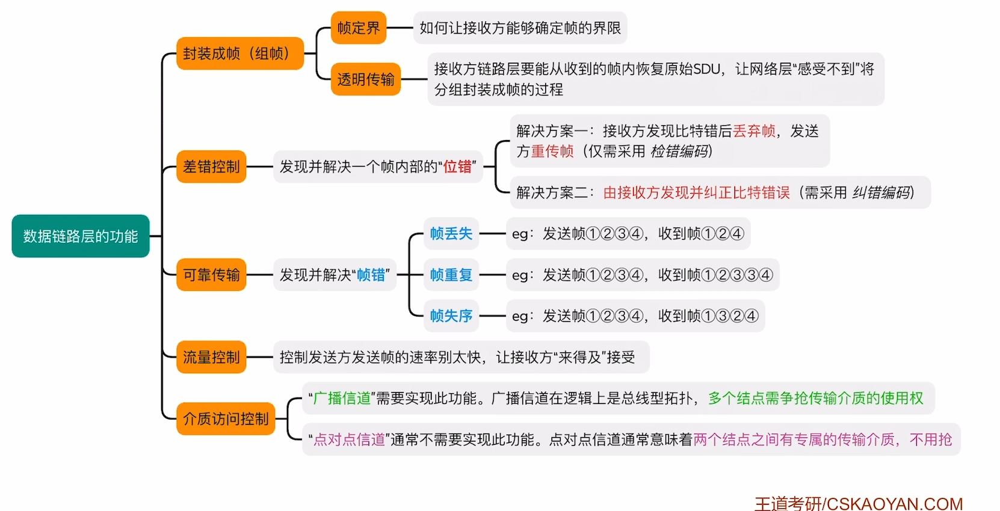
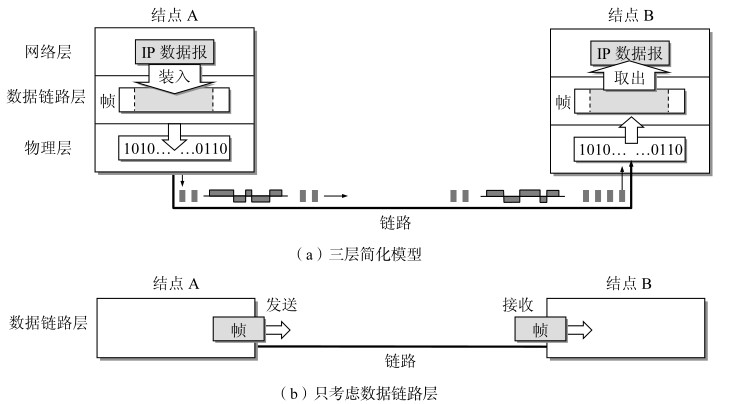

# 数据链路层的功能

数据链路层的主要任务是**让帧在一条链路上或一个网络中正确传输**。它向上为[网络层](网络层的功能.md)提供逻辑通信，向下使用[物理层](通信基础.md)提供的比特流服务。

从功能上看，数据链路层需要解决的核心问题可以概括为：

- **封装成帧**：把网络层分组装入帧，并加上帧首/帧尾

- **透明传输**：接收方能从帧中正确恢复原始数据，网络层"感觉不到"组帧过程

- **差错控制**：发现并处理传输中的错误

- 封装成帧

!!! tip "相邻结点"
    **数据链路层只负责一跳（相邻结点）之间的传输**，跨网络的路由选择属于网络层。

---

## 数据链路层使用的信道

数据链路层使用的信道主要有以下两种：

- **点对点信道**：两个结点之间有专属传输介质，通信双方独占链路，通常不需要[介质访问控制](介质访问控制.md)

- **广播信道**：多个结点共享同一传输介质，逻辑上多为总线型拓扑，需要协调"谁先发送"，即介质访问控制

| 信道类型 | 典型场景 | 是否需要 MAC |
|:---:|:---:|:---:|
| 点对点 | 拨号上网、路由器间专线 | 否 |
| 广播 | 以太网、无线局域网 | 是 |

---

## 点对点信道的基本概念

- **物理链路（链路）**：由物理介质及连接两结点的通信设备组成，是**实际存在**的传输线路

- **逻辑链路（数据链路）**：在物理链路之上，加上数据链路层协议后形成的、**逻辑上无差错**的传输通道

- **帧（Frame）**：数据链路层的传输单位。网络层分组（如 IP 数据报）加上帧首、帧尾后构成一帧

!!! tip
    教材常说"链路 = 物理链路，数据链路 = 逻辑链路"。做题时看到"在数据链路上传输"，指的是加了协议、能按帧收发的逻辑通道。

---

## 链路管理

链路管理主要针对**点对点信道**中数据链路的**建立、维持与释放**（面向连接的数据链路层协议，如 HDLC）。

- **建立链路**：通信前先协商链路参数、同步双方状态

- **维持链路**：通信过程中保持连接可用，必要时进行链路状态检测

- **释放链路**：通信结束后有序断开，释放相关资源

!!! tip
    知道"点对点 + 面向连接协议可能需要链路管理"即可。以太网等广播信道通常是无连接的，不涉及显式链路建立。

---

## 封装成帧与透明传输

> [组帧](组帧.md)

### 封装成帧

把网络层递交下来的分组，加上**帧首（Header）**和**帧尾（Trailer）**，构成数据链路层可独立传输的**帧**。

- **帧定界**：让接收方能够确定一帧从哪里开始、到哪里结束（定界符、字符计数、字节填充等，见组帧笔记）

### 透明传输

无论上层数据中出现什么比特模式（包括与定界符相同的比特串），接收方链路层都能正确识别帧边界并**完整恢复**原始 SDU，使网络层"感受不到"组帧过程。

---

## 流量控制

流量控制（Flow Control）用于**协调相邻结点之间的发送速率**，防止发送方发得太快、接收方来不及处理而导致帧丢失。

- **作用范围**：相邻结点之间（一跳），不是端到端

- **典型手段**：滑动窗口等（详见 [流量控制与可靠传输机制](流量控制与可靠传输机制.md)）

!!! tip
    区分两个"流控"：

    - **数据链路层流量控制**：相邻结点之间，防止接收结点缓冲区溢出

    - **传输层流量控制**（如 TCP 窗口）：端到端，防止接收进程来不及读

---

## 差错控制

详见 [差错控制](差错控制.md)。408 中需要区分两类"错"：

### 位错（Bit Error）

指**单个帧内部**某些比特因噪声等原因发生翻转。

- **方案一（检错重传）**：接收方发现比特错后**丢弃帧**，通知发送方**重传**——只需**检错编码**（如 CRC）

- **方案二（纠错）**：接收方直接**纠正**比特错误——需要**纠错编码**（如海明码，了解即可）

### 帧错（Frame Error）

指帧级别的传输异常，包括：

- **帧丢失**：发送 ①②③④，收到 ①②④

- **帧重复**：发送 ①②③④，收到 ①②③③④

- **帧失序**：发送 ①②③④，收到 ①③②④

处理帧错需要**可靠传输**机制（确认、重传、序号等），详见 [流量控制与可靠传输机制](流量控制与可靠传输机制.md)。

!!! tip "408高频易错点"
    - **差错控制**（位错）≠ **可靠传输**（帧错）：前者管"帧里比特对不对"，后者管"帧有没有丢/重/乱"

    - 数据链路层差错控制只针对**相邻结点**；跨网络的可靠传输通常由 TCP 完成

    - 广播信道还需要 [介质访问控制](介质访问控制.md)，点对点信道通常不需要

---

## 功能总览

| 功能 | 解决的问题 | 详细笔记 |
|:---:|:---|:---|
| 封装成帧 | 比特流 → 有边界的帧 | [组帧](组帧.md) |
| 透明传输 | 任意数据都能正确组帧/解帧 | [组帧](组帧.md) |
| 差错控制 | 帧内位错 | [差错控制](差错控制.md) |
| 可靠传输 | 帧丢失/重复/失序 | [流量控制与可靠传输机制](流量控制与可靠传输机制.md) |
| 流量控制 | 发送过快导致接收方溢出 | [流量控制与可靠传输机制](流量控制与可靠传输机制.md) |
| 介质访问控制 | 广播信道多结点争用介质 | [介质访问控制](介质访问控制.md) |
