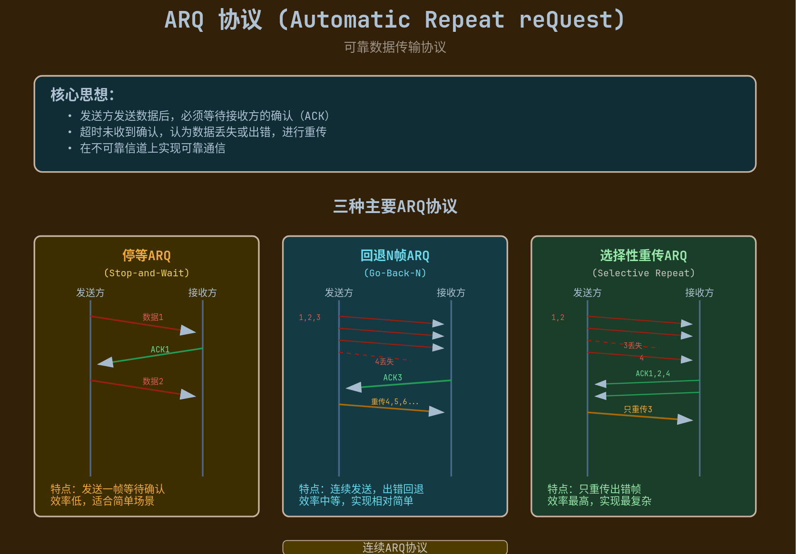

# 流量控制与可靠传输机制

> [流量控制 - 数据链路层 - 计算机网络 | 计算机考研杂货铺](https://csgraduates.com/computer_network/datalink/flow_control/)

数据链路层关注**相邻结点（一跳）**之间的传输：在这一跳内既要避免把接收方压垮（流量控制），也要在出现**帧丢失/重复/失序**时让链路层具备可靠传输能力（ARQ）。这篇笔记默认讨论的是**链路层**（以“帧”为单位）的机制。

!!! tip "与传输层的关系"

    - 链路层：相邻结点之间的流控与可靠（帧为单位）

    - 传输层：端到端的差错检测/可靠/流控（报文段/字节流为单位），见 [传输层提供的服务-差错检测](传输层提供的服务.md#差错检测)、[TCP-滑动窗口](TCP.md#滑动窗口)、[TCP流量控制](TCP.md#TCP流量控制)

!!! tip
    TCP 的可靠传输也使用滑动窗口与重传，但它是**端到端**的，并且还受[拥塞控制约束](TCP.md#TCP拥塞控制)。[UDP](UDP.md) 只有差错检测，[出错直接丢弃](传输层提供的服务.md#差错检测)。

---

## 流量控制与滑动窗口机制

### 停止-等待流量控制基本原理

停止-等待（Stop-and-Wait）是最简单的流控：

- **发送方**：每次只允许发送 **1 帧**；发送后必须等待确认（ACK）才能继续

- **接收方**：收到正确帧就回 ACK；若出错（如 CRC 不通过）则丢弃（通常不回 ACK）

- **超时**：发送方等待 ACK 超时则重传该帧

为解决“ACK 丢失/重复帧”问题，停止-等待通常配合**1 比特序号（0/1）**：发送方交替发送序号 0、1 的帧；接收方按序号丢弃重复帧，并重复发送对应 ACK。

!!! tip
    停止-等待既是流控协议，也构成最基础的可靠传输（ARQ）思想：**确认 + 超时重传**。

### 滑动窗口流量控制基本原理

滑动窗口把“一次只能发 1 帧”推广为“窗口内可连续发多帧”。

- **发送窗口**：允许发送方在未被确认前，最多有 \(W_T\) 帧处于“在途”（已发送未确认）

- **接收窗口**：允许接收方接收/缓存的序号范围，大小为 \(W_R\)

窗口沿着序号空间向前移动：当确认到来（或按协议规则推进），窗口右移，释放已确认的序号空间。

!!! tip
    滑动窗口的两个核心收益：

    - **流量控制**：限制在途数据量，避免接收方缓存溢出

    - **提高利用率**：允许连续发送，减少等待 RTT 的空闲时间（见后面的信道利用率分析）

!!! tip "滑动窗口协议的窗口大小的关系"
    设序号字段为 \(k\) 比特，则序号空间大小为 \(2^k\)。为避免新旧帧/ACK 混淆，窗口大小必须受限：

    - **停止-等待（S-W）**：只需 1 比特序号即可（0/1 交替），窗口固定为 1

    - **后退 N 帧（GBN）**：发送窗口 \(W_T \le 2^k - 1\)，接收窗口 \(W_R = 1\)

    - **选择重传（SR）**：必须保证发送窗口与接收窗口不重叠，通常取 \(W_T \le 2^{k-1}\)，且 \(W_R \le 2^{k-1}\)

    408 常见问法：“SR 为什么要求窗口不超过 \(2^{k-1}\)？”——因为序号回绕后，新帧可能落入旧窗口，导致二义性。

---

## 可靠传输机制

可靠传输要解决的“帧错”包括：[帧丢失、帧重复、帧失序](数据链路层的功能.md#帧错Frame-Error)）。典型实现是 ARQ（Automatic Repeat reQuest）：确认 + 重传。

### 单帧滑动窗口与停止-等待协议（S-W）

停止-等待可以看作“单帧滑动窗口”：\(W_T = 1\)。

需要解决的典型问题：

- **帧丢失**：发送方超时重传

- **ACK 丢失**：发送方超时重传，接收方用序号识别重复帧并丢弃

- **帧重复**：接收方用序号丢弃重复帧，并重发 ACK

### 多帧滑动窗口与后退 N 帧协议（GBN）

GBN（Go-Back-N）是连续 ARQ 的一种：发送方窗口内可连续发送多帧。

- **发送窗口**：\(W_T > 1\)

- **接收窗口**：\(W_R = 1\)（接收方只按序接收；失序帧直接丢弃）

- **确认方式**：常用**累积确认**（ACK \(n\) 表示序号小于 \(n\) 的帧都已正确收到）

- **重传策略**：若某帧超时，则从该帧开始，把其后已发送但未确认的帧**全部重传**（“后退 N 帧”）

!!! tip
    TCP 的确认默认是**累积确认**，不使用 SACK 时经常表现为“类似 GBN”的连续[重传](TCP.md#重传)[^1]。

### 多帧滑动窗口与选择重传协议（SR）

SR（Selective Repeat）允许接收方**缓存失序帧**并对每个正确收到的帧分别确认，从而减少不必要的重传。

- **接收窗口**：\(W_R > 1\)，可接收并缓存窗口内的失序帧

- **确认方式**：对每个正确帧做**选择确认**（选择性 ACK）

- **重传策略**：只重传真正丢失/出错的帧

代价：接收方缓存与逻辑更复杂，且窗口大小受序号空间限制更严格（见前面的窗口关系）。

!!! tip
    TCP 的 **SACK**（选择确认）选项允许接收方告知已收到的不连续数据块，从而让发送方更精准重传缺失段。

---

## 信道利用率的分析

### 停止-等待协议的信道利用率

设：

- \(T_t\)：发送一帧的发送时延（帧长/发送速率）

- \(T_p\)：单程传播时延

忽略 ACK 发送时间与处理时延（或把它们合并进常数项），一次“发送-确认”周期近似为 \(T_t + 2T_p\)。信道利用率：

\[
U_{SW} \approx \frac{T_t}{T_t + 2T_p}
\]

令 \(a = \frac{T_p}{T_t}\)，则：

\[
U_{SW} \approx \frac{1}{1 + 2a}
\]

### 连续 ARQ 的信道利用率

连续 ARQ（滑动窗口）允许一次发出 \(W_T\) 帧再等待确认。忽略差错与重传时：

\[
U \approx \min\left(1, \frac{W_T}{1 + 2a}\right)
\]

- 当 \(W_T \ge 1 + 2a\) 时，发送方可以把“管道”填满，利用率接近 1

- 当 \(W_T\) 较小时，利用率随窗口线性提升

!!! tip
    做题常见套路：先算 \(a = T_p/T_t\)，再判断窗口是否足够大（是否满足 \(W_T \ge 1 + 2a\)）。

[^1]: [TCP-滑动窗口](TCP.md#滑动窗口)