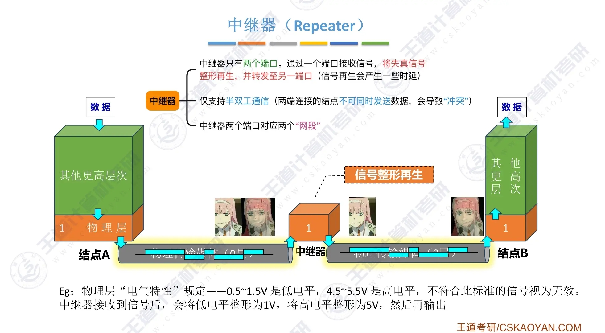
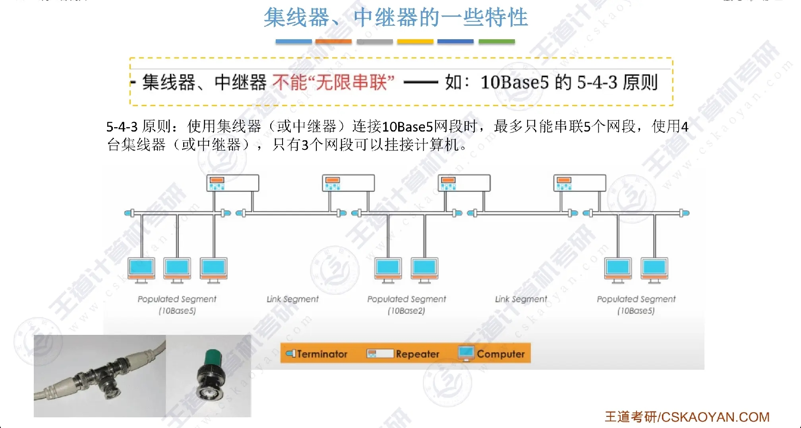
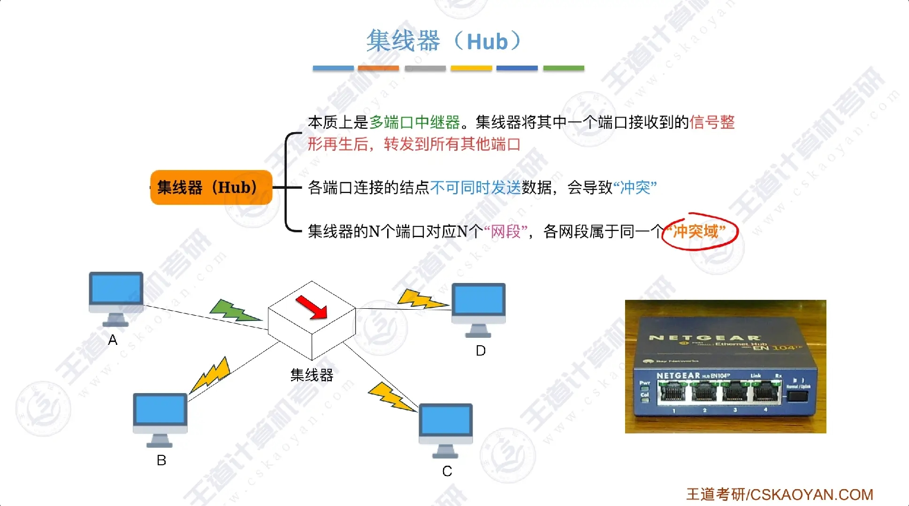
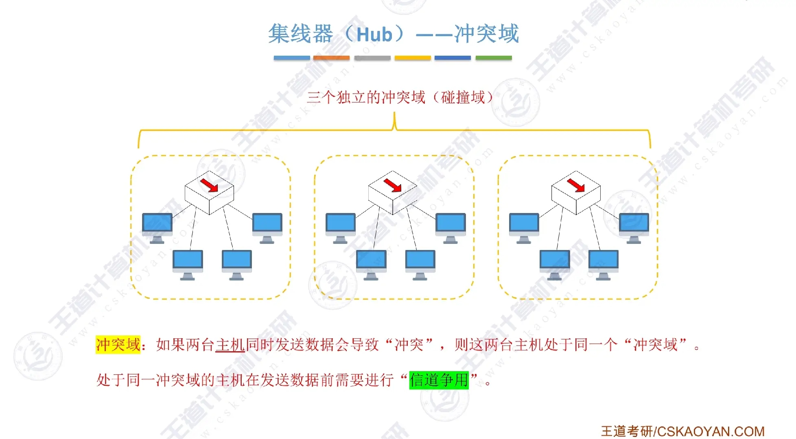
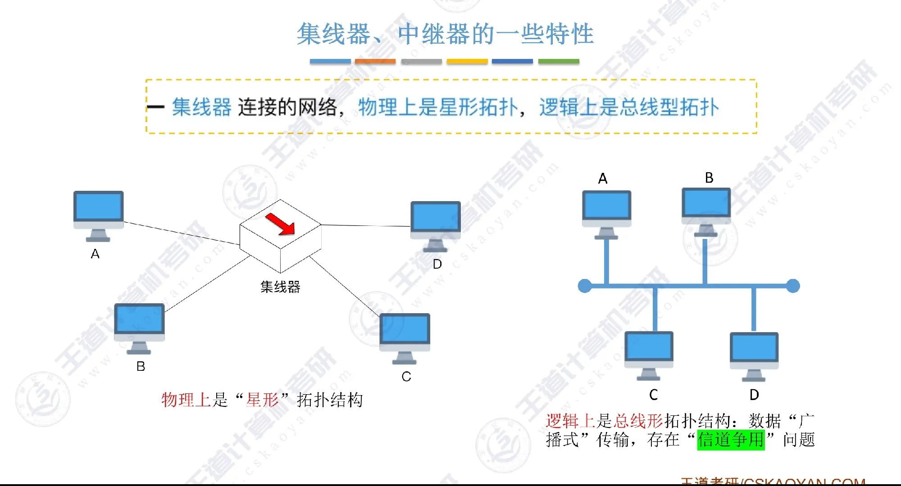
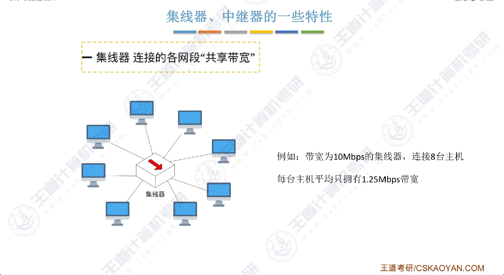

# 物理层设备

物理层设备只负责**信号的放大、整形与转发**，不识别帧、不查地址。

## 中继器

工作在物理层，连接两个网段，对接收到的信号进行**再生/放大**以延长传输距离。

- 两端仍属于**同一个冲突域**和**同一个广播域**

- 只能连接**同一协议**的网段（如都是以太网）

- 半双工，不能隔离冲突

!!! note "5-4-3 规则"
    

    传统以太网中，最多 5 个网段、4 个中继器、其中 3 个网段可挂主机。现代交换式网络已基本不适用。

## 集线器

工作在物理层，可看作**多端口的中继器**。收到某端口信号后，**广播到其余所有端口**。

- 整个集线器是一个冲突域，也是一个广播域

!!! info "冲突域"
    

- 半双工，同一时刻只能有一个端口发送

- 不识别 MAC 地址，不做任何过滤

!!! tip
    *集线器不能隔离冲突域和广播域*。

### 集线器的一些特性

除了在中继器5-4-3规则中提到的**不能无限串联**的特性，集线器还有其他的一些特性：

- 集线器连接的网络，物理上是星形拓扑，逻辑上是总线型拓扑

    

- 集线器连接的各网段“共享带宽”

    
