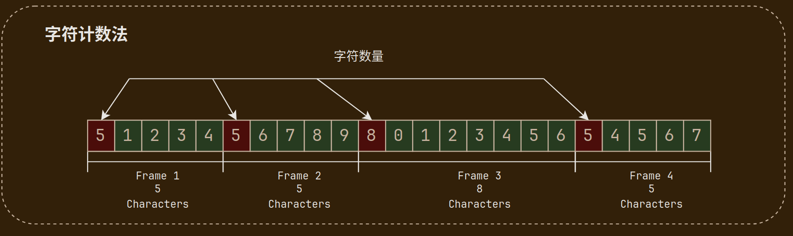
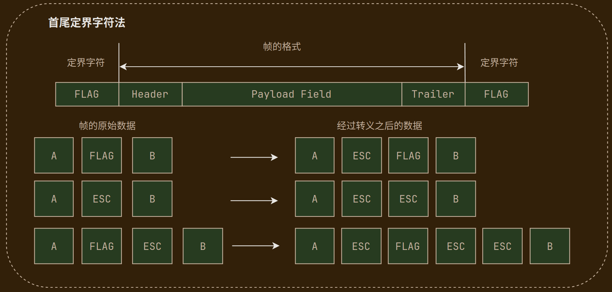
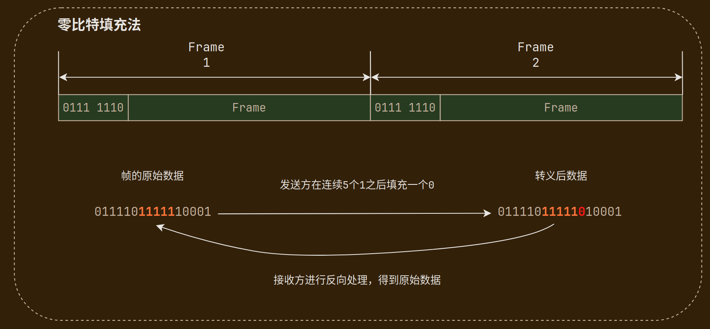
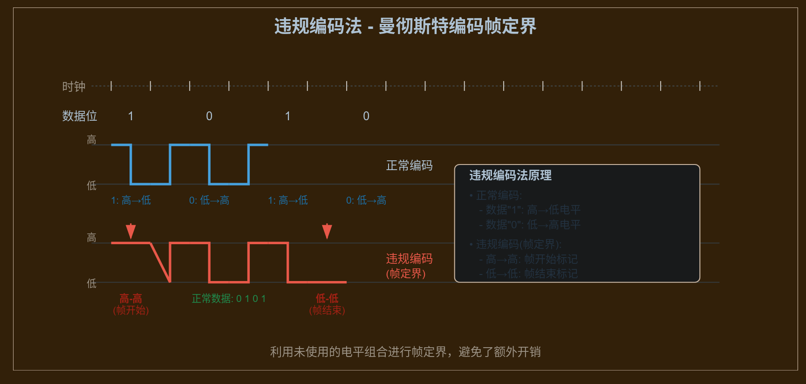

# 组帧

> [组帧 - 数据链路层 - 计算机网络 | 计算机考研杂货铺](https://csgraduates.com/computer_network/datalink/framing/)

[数据链路层](数据链路层的功能.md)向上递交/接收的是**帧**，向下经物理层传输的是**比特流**。组帧（封装成帧）就是把网络层分组加上帧首、帧尾，变成可独立传输的帧。

## 主要问题

发送方依据一定的规则将网络层递交的分组进行**组帧（封装成帧）**，加上**帧首（Header）**和**帧尾（Trailer）**，构成数据链路层可独立传输的**帧**。

组帧的过程需要解决两个主要问题：

- **帧定界**：物理层传来的是连续比特流，本身没有"帧"的边界。帧定界要解决的是——**接收方如何确定一帧从哪里开始、到哪里结束**（通常通过在帧首/帧尾加入定界符，或用字符计数、字节填充、零比特填充等规则划分边界）

- **透明传输**：上层数据里可能出现任意比特模式，甚至与定界符相同。透明传输要求接收方链路层能**不受这些特殊比特干扰**，正确识别帧边界并完整恢复原始 SDU，使网络层"感觉不到"数据曾被封装成帧

---

## 组帧方法

408 常考四种组帧方法，核心区别：**用什么标记帧边界**，以及**数据与定界符冲突时怎么办**。

| 方法 | 定界方式 | 面向 | 典型协议/场景 |
|:---:|:---|:---:|:---|
| 字符计数法 | 首字段记录帧长 | 字符 | 早期协议 |
| 字节填充法 | 首尾定界符 + 转义 | 字符 | HDLC、PPP |
| 零比特填充法 | 特殊比特模式 + 填 0 | 比特 | HDLC |
| 违规编码法 | 物理层"非法"编码 | 比特 | 令牌环（802.5） |

### 字符计数法

**原理**：在帧的首部用一个**计数字段**标明本帧包含的字符数（含计数字段本身）。接收方读到计数值 $N$，再连续读取 $N$ 个字符，即为一帧。

**优点**：实现简单，无需定界符，天然支持透明传输。

**缺点**：计数字段一旦传输出错，接收方会**永久失去同步**——后续所有帧的边界都会错位，且无法自动恢复。

!!! warning
    字符计数法**缺乏恢复能力**，一个比特错可能导致"雪崩式"帧边界错乱。

### 字节填充法

也称**字符填充法**或**首尾定界符法**。帧格式：`FLAG | 首部 | 数据 | 尾部 | FLAG`，其中 `FLAG` 为定界符。

**原理**：用特殊控制字符 `FLAG` 标记帧的首尾。若数据中出现了与 `FLAG` 或转义字符 `ESC` 相同的字节，发送方在它们前面插入 `ESC`；接收方遇到 `ESC` 则去掉它，并将下一字节当作普通数据。

| 原始数据 | 填充后 |
|:---:|:---|
| A \| FLAG \| B | A \| ESC \| FLAG \| B |
| A \| ESC \| B | A \| ESC \| ESC \| B |
| A \| FLAG \| ESC \| B | A \| ESC \| FLAG \| ESC \| ESC \| B |

字节填充法是面向**字符/字节**的组帧，是 HDLC、PPP 等协议的基础思路。

### 零比特填充法

也称**比特填充法**，面向**比特流**的组帧，HDLC 采用此法。

**原理**：

- **定界符**：`01111110`（首尾各一个 0，中间连续 6 个 1）

- **发送方规则**：扫描数据部分，每出现**连续 5 个 1**，就在其后**插入一个 0**

- **接收方规则**：每见到**连续 5 个 1 后跟一个 0**，就**删掉这个 0**，还原原始数据

!!! example
    原始数据 `0111101111110001` → 填充后 `01111011111010001`（连续 5 个 1 后插入 0）。

定界符 `01111110` 含 6 个连续 1，而数据中最多只有 5 个连续 1，因此数据部分不会"误触"定界符。

### 违规编码法

**原理**：不额外插入填充比特，而是利用物理层编码中**本不该出现**的信号模式作为帧定界符。以**曼彻斯特编码**为例：

- **正常数据编码**：`1` → 高→低跳变；`0` → 低→高跳变（每个比特周期内必有跳变）

- **违规编码（定界符）**：`高→高` 表示帧开始；`低→低` 表示帧结束

由于正常数据比特不会出现"整个周期无跳变"的情况，接收方看到高-高或低-低就知道遇到了帧边界。

**优点**：**无额外比特开销**，效率高。

**缺点**：依赖特定的物理层编码方式，通用性不如填充法。典型应用：IEEE 802.5 令牌环。

---

!!! abstract
    - **字节填充**面向字符，**零比特填充**面向比特流——别混用规则（字符填充插 `ESC`，比特填充插 `0`）

    - 字符计数法**不能**保证透明传输的鲁棒性——计数错则全线崩溃

    - 零比特填充的定界符是 `01111110`（6 个 1），填充规则是"5 个 1 后插 0"——**5 和 6 不要记反**

    - 违规编码法的定界符在**物理层编码**层面实现，不属于数据链路层的比特/字符填充

    - PPP 协议组帧用**字节填充**（标志字段 `0x7E`），HDLC 同时支持字节填充和零比特填充
