# 计算机网络体系结构与参考模型

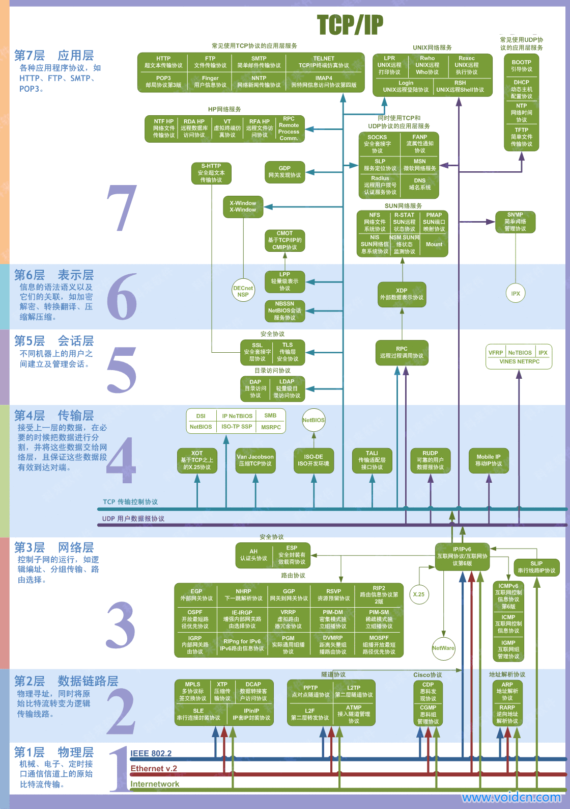

## 计算机网络分层结构

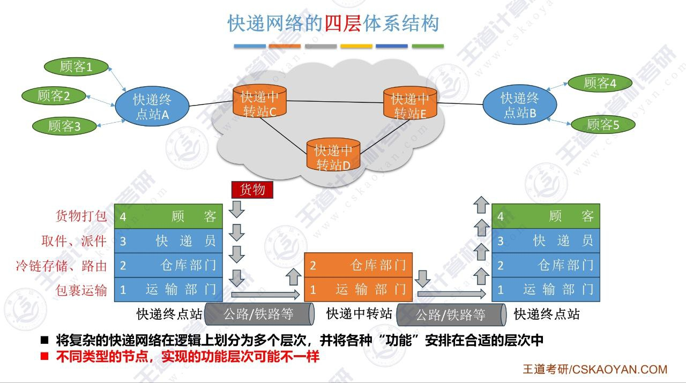

### 分层的基本原则

1. 每层都实现一种相对独立的功能，降低大系统的复杂度

2. 各层之间的接口自然清晰，易于理解，相互交流尽可能少

3. 各层功能的精确定义独立于具体的实现方法，可以采用最合适的技术来实现

4. 保持下层对上层的独立性，上层只能通过接口**单向**使用下层提供的服务

5. 整个分层结构应当能促进标准化工作

!!! info
    - **实体**是指任何可发送或接收信息的硬件或软件进程，通常是特定模块的软件模块。在网络分层结构中，第 $n$ 层的活动元素通常称为**第 $n$ 层实体**。

    - 不同机器上的相同层称为**对等层**，同一层的实体称为**对等实体**。
    
    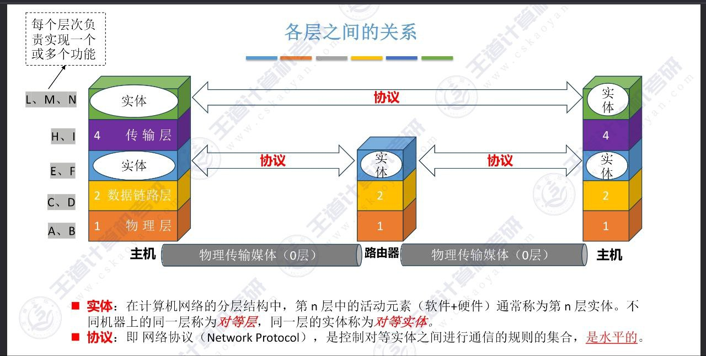

    - 第 $n$ 层向第 $n + 1$ 层提供**服务**（包括在其以下的各层提供的服务），第 $n$ 层的实体称为**服务提供者**，第 $n + 1$ 层的实体称为**服务用户**，后者通过**接口**向前者请求服务。

    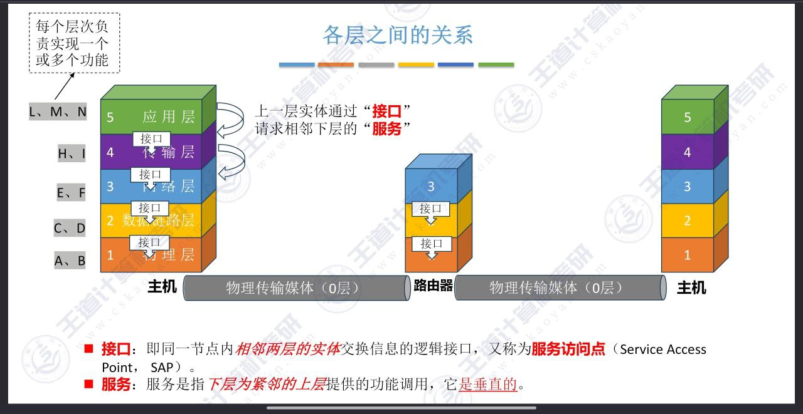

### 协议数据单元、服务数据单元和协议控制单元

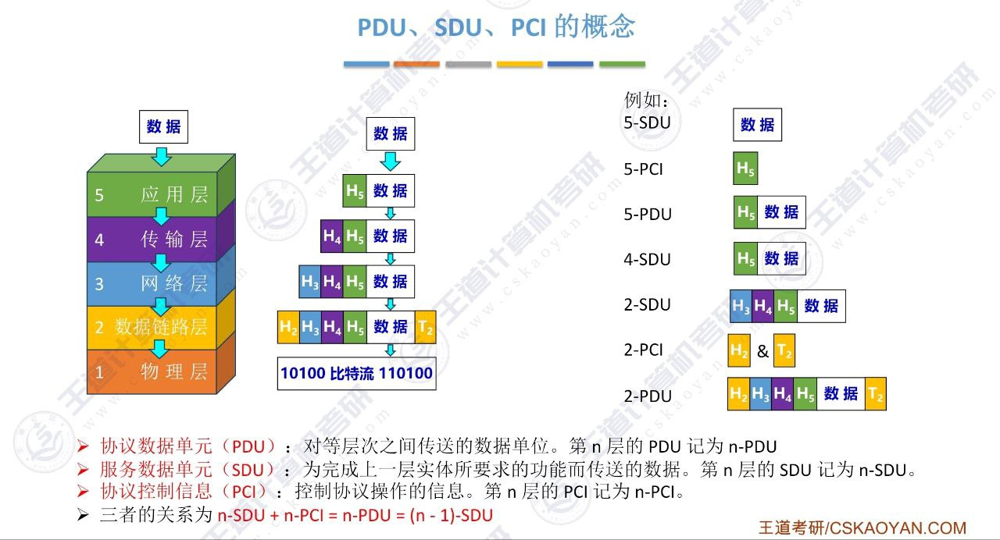

## 相关概念

在分析数据传输的过程时，可以从**水平视角**和**垂直视角**两个角度进行理解。

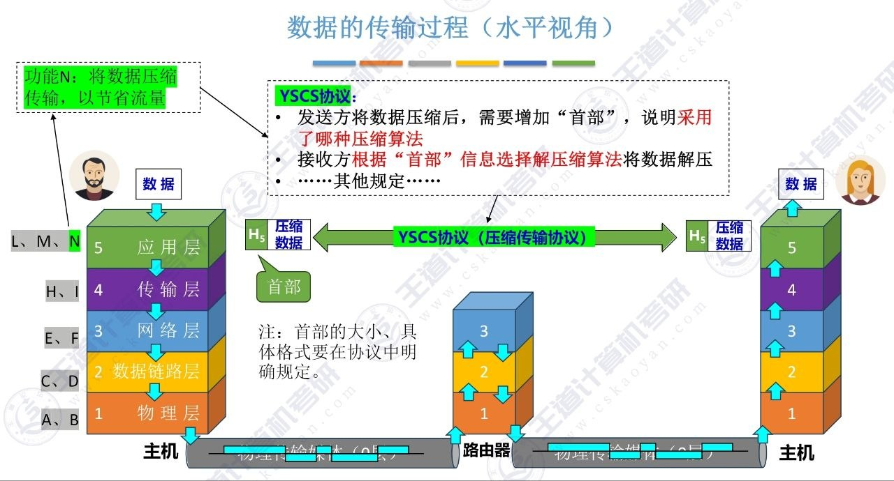

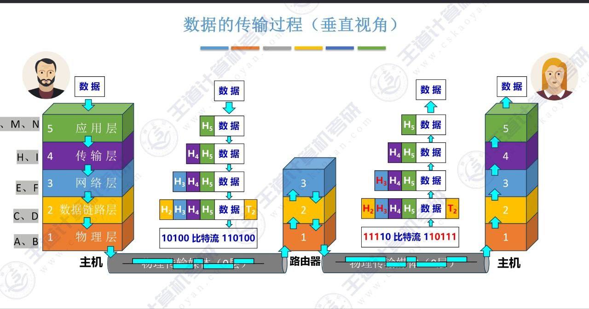

### 协议

这里的协议指**网络协议**（*Network Protocol*），是控制对等实体之间通信的规则的集合，可简单理解为通信计算机双方事先约定的一种通信规则、通信标准，是**水平的**。

#### 协议三要素

1. **语法**: 数据与控制信息的格式。如协议控制信息（首部）部分占几个字节、每个字节的含义、协议的数据部分最多有多少字节等。

2. **语义**: 需要发出何种控制信息、完成何种动作以及做出何种响应。例如，协议需要明确规定发送方发完数据后，接收方是否需要“应答”、如何“应答”等。

3. **同步**（或**时序**）: 执行各种操作的条件、时序关系等，即事件顺序的详细说明。例如，发送方每发送完一组数据后，等待接收方发出确认，在收到确认后再发送下一组数据。

### 接口

在[分层的基本原则](#分层的基本原则)中已经有所提及，即**同一节点内相邻两层实体交换信息的逻辑接口**，又称为**服务访问点**（*Service Access Point*，SAP）。

### 服务

服务指**下层为紧邻的上层**提供的功能调用，是**垂直的**。

## ISO/OSI参考模型和TCP/IP模型

### ISO/OSI参考模型

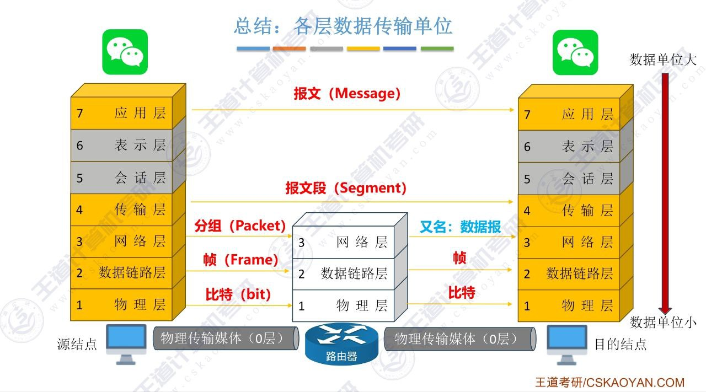

国际标准化组织（*International Organization for Standardization*，ISO）于1984年提出**开放系统互连参考模型**（*Open Systems Interconnection Reference Model*，OSI/RM），即ISO/OSI参考模型。

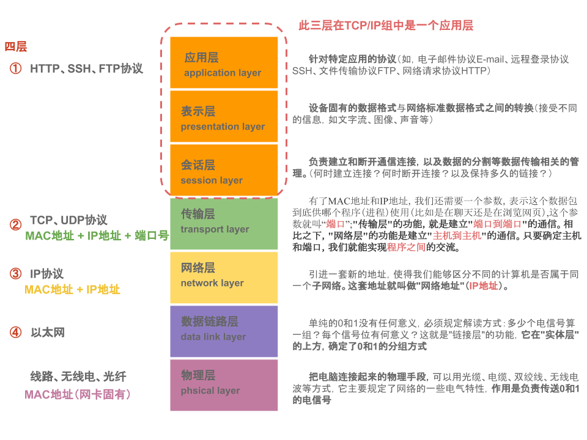

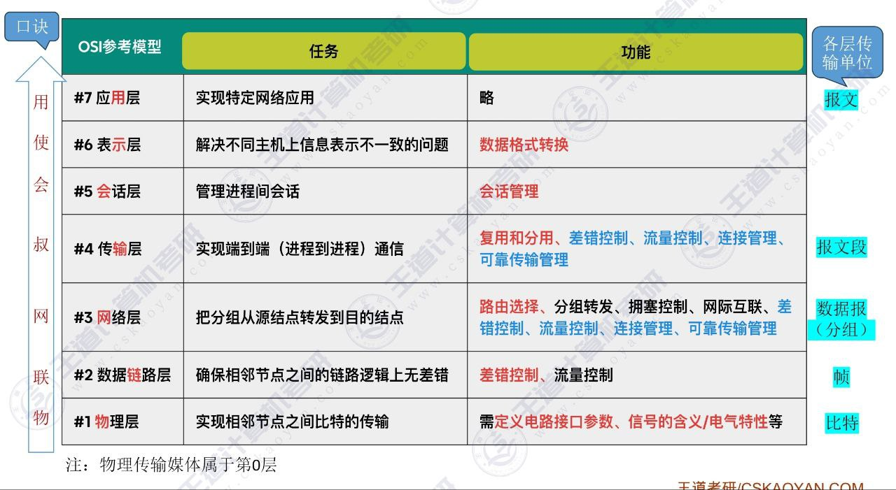

#### 物理层

负责相邻节点之间**比特的传输**。

- 需定义电路参数接口

- 需定义传输信号的含义、电气特征

!!! tip "物理层之下"
    传输信息用的**物理介质**（双绞线、光纤等）并不在物理层之内，通常认为它们在物理层之下，称作**第零层**。

    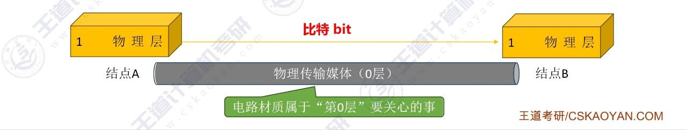

#### 数据链路层

确保相邻节点之间的链路**逻辑上无差错**。包含以下功能:

- **差错控制**: 检错+纠错；或检错+丢弃+重传

- **流量控制**: 协调两个结点的速率

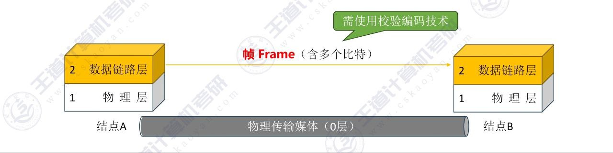

#### 网络层

**把“分组”从源结点转发到目的结点。包含以下功能:

- **路由选择**: 构造并维护*路由表*，决定分组转发的最佳路径

- **分组转发**: 将分组葱合适反而端口转发出去

- **拥塞控制**: 发现网络拥塞，并采取措施缓解

- **网际互联**: 实现异构网络互联

- **其他功能**（以“分组”为单位）: 差错控制、流量控制、建立连接与释放（确保分组有序、不重复到达）、可靠传输管理（接受方返回分组确认信息）

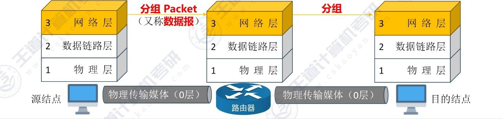

#### 传输层

实现**端到端通信**（即进程到进程的通信，这里的“端”指端口）。包含以下功能:

- **复用和分用**: 发送端几个高层实体复用一条底层连接，接收端再进行分用还原

- **其他功能**（以“报文段”为单位）: 差错控制、流量控制、建立连接与释放（确保分组有序、不重复到达）、可靠传输管理（接受方返回分组确认信息）

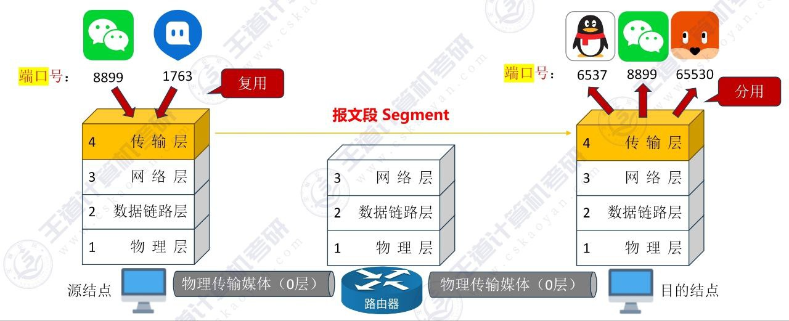

#### 会话层-应用层

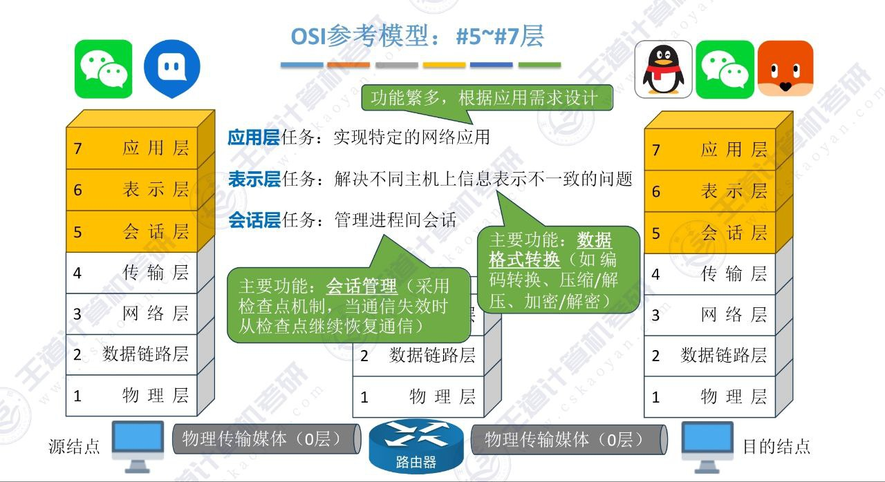

### TCP/IP模型

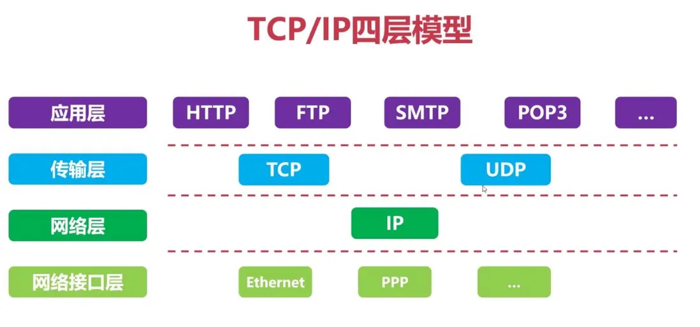

目前最广泛使用的网络分层体系结构，事实上的国际标准。

#### 网络接口层

类似ISO/OSI参考模型的[物理层](#物理层)和[数据链路层](#数据链路层)。

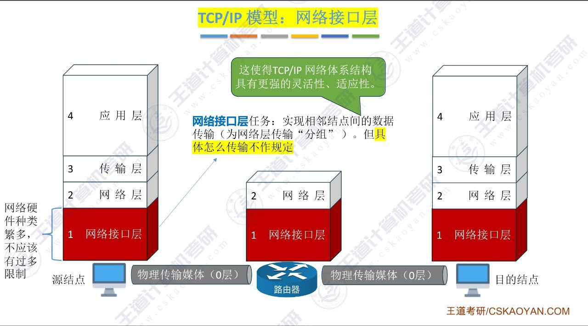

#### 网际层

TCP/IP模型中最关键的一层，功能与OSI参考模型中的[网络层](#网络层)类似。网际层中仅提供无连接不可靠的IP，数据传输的单位是**IP数据报**。

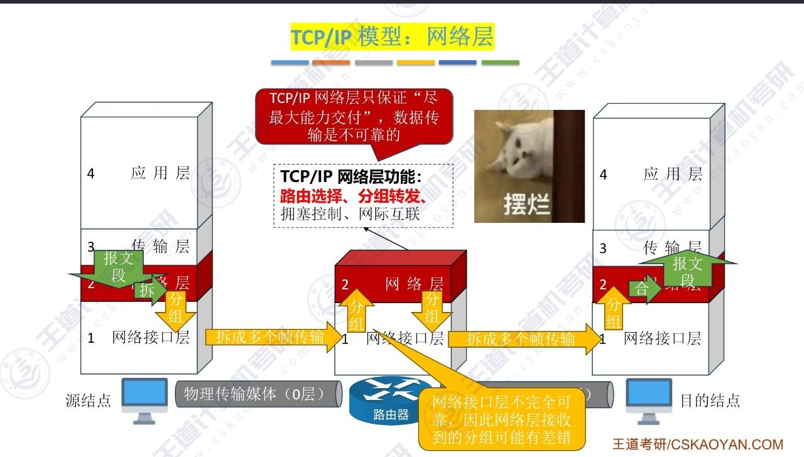

#### 传输层

同样与OSI参考模型中的[传输层](#传输层)类似，即使得发送端与接收端主机上的对等实体进行对话。传输层包含以下两种协议:

- **传输控制协议**（*Transmission Control Protocol*，TCP）: 提供可靠的、面向连接的通信服务，传输前必须先建立连接。数据传输的单位是**报文段**。

- **用户数据报协议**（*User Datagram Protocol*，UDP）: 提供不可靠的、无连接的通信服务，传输前不需要建立连接。数据传输的单位是**用户数据报**。

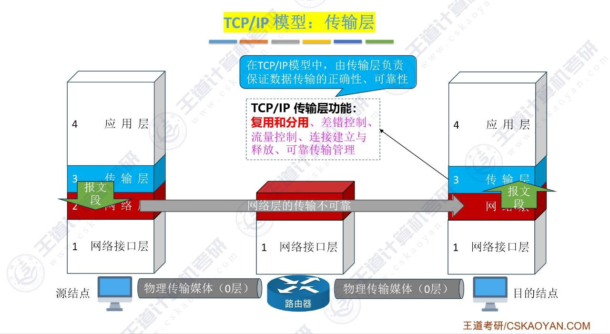

#### 应用层

应用层包含所有的高层协议。

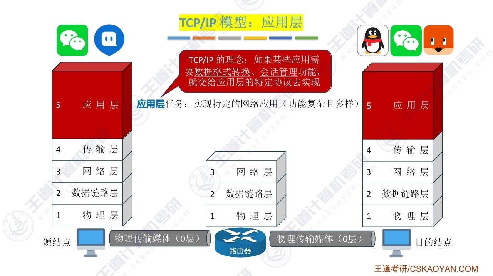

### 二者比较

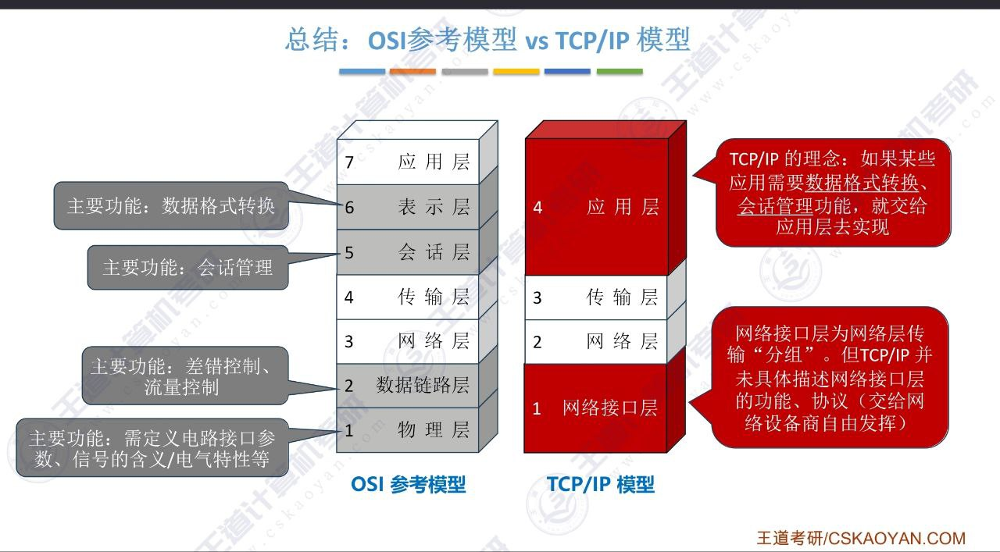

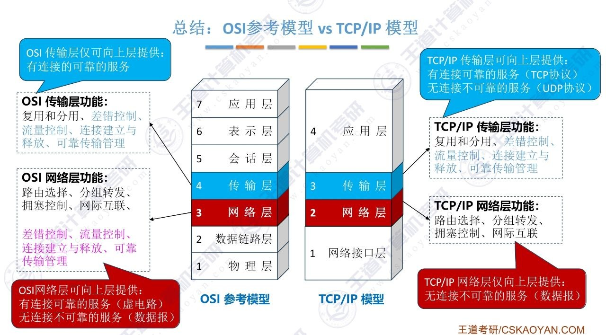
