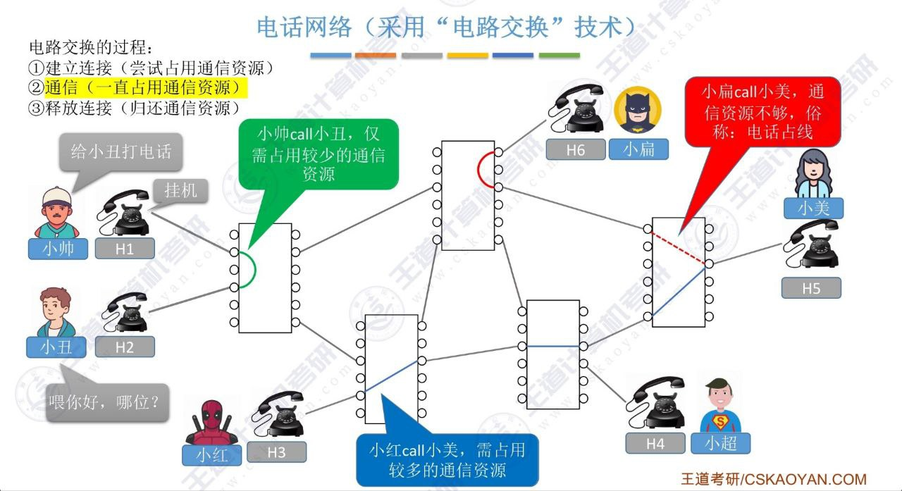
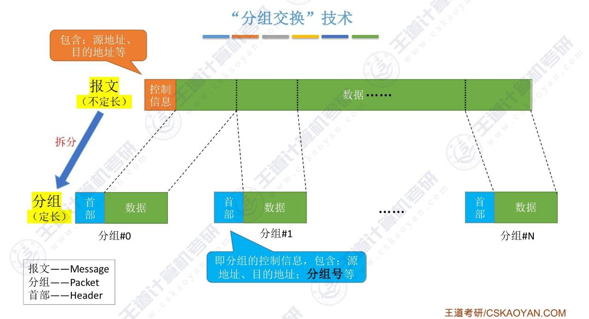
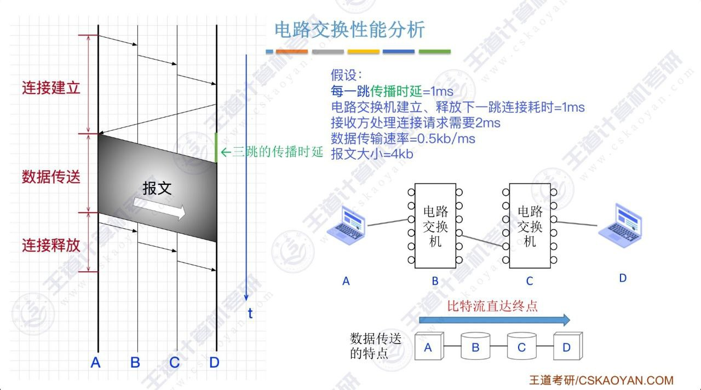
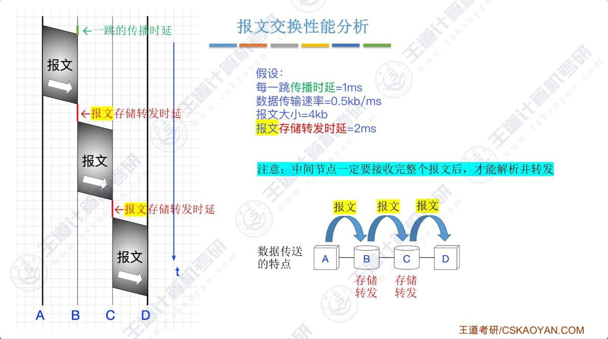
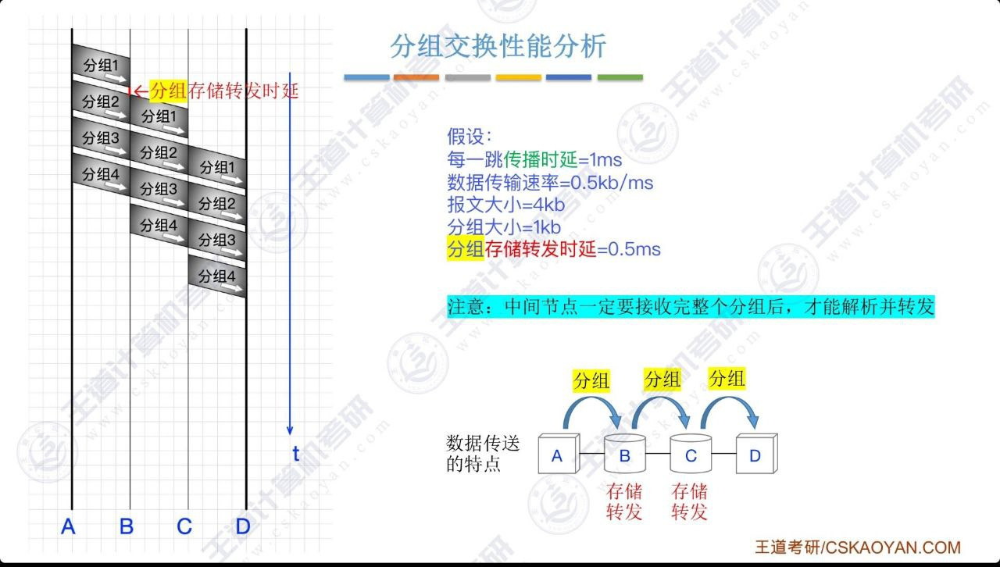
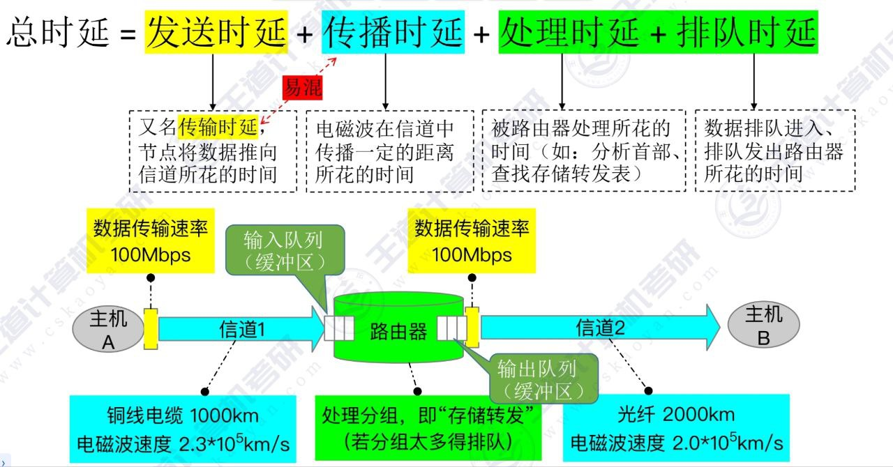
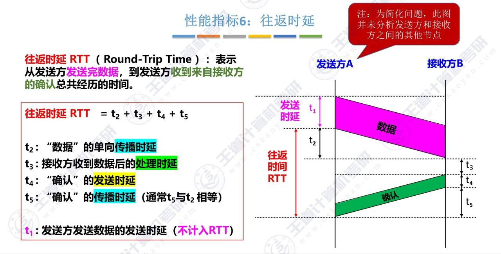

# 计算机网络概述

## 计算机网络的概念

## 计算机网络的组成

## 计算机网络的功能

## 数据交换类型

数据交换主要有两种方式:

- **电路交换**: 在数据传输过程中，通信双方在物理层进行物理连接，形成一条专用的通路，数据在传输过程中不会与其他数据混淆。

- **存储转发交换**:

    - **报文交换**: 将完整的报文先传送到相邻节点，全部存储下来后查找转发表，转发到下一个节点。

    - **分组交换**: 将一个报文分成若干个分组，每个分组独立进行转发。

### 电路交换

#### 电路交换的三个阶段

- 建立连接: 尝试建立通信双方连接的通路。

- 通信: 通信双方进行数据传输，**传输过程中始终独占通信资源**。

- 释放连接: 通信双方断开连接。

#### 电话网络

#### 电路交换的优缺点

- 优点

    - 通信两端始终占用专用的物理链路，数据直达，传输效率高

- 缺点

    - 建立/释放连接，需要额外的时间开销

    - 线路被通信双方独占，利用率低

    - 线路分配的灵活性差

    - 交换节点不支持“差错控制”（无法发现传输过程中发生的数据错误）

!!! tip
    - 电路交换适用于低频次、大量的数据传输场景

    - 计算机间的数据传输往往是“突发式”的，往往会高频次、少量地传输数据

### 存储转发交换

存储转发的思想: **把传送的数据单元先存储进中间节点，再根据目标地址转发至下一节点**。

#### 报文交换

交换的单位是源信息报文的**整体**（整个报文）。

##### 报文交换的优缺点

- 优点

    - **通信前网络无需为通信双方预先建立一条专用的通信线路**，不存在连接建立时延，使不同地点的计算机能够“即连即用”

    - 数据以“报文”为单位被交换节点间“存储转发”，通信线路可以灵活分配

    - 在通信时间内，两个用户无需独占一整条物理链路，线路利用率高

    - 交换节点支持“差错控制”（通过校验技术）

- 缺点

    - 报文不定长，不方便存储转发管理

    - 长报文的存储转发时间开销大、缓存开销大

    - 长报文容易出错，需要进行重传，代价高

#### 分组交换

将报文拆成若干**定长**的分组（包），每个分组（包）独立进行转发，到达目的地后再将分组（包）按序重组。

##### 分组交换的优缺点

- 优点

    - 继承了报文交换的优点

    - 相比较报文交换，改进了如下问题

        - 分组定长，便于存储转发管理

        - 分组的存储转发时间开销小、缓存开销小

        - 分组不易出错，重传代价小

- 缺点

    - 相比较报文交换，控制信息占比增加

    - 相比较电路交换，依然存在存储转发时延

    - 报文被拆分为多个分组，传输过程中可能出现失序、丢失等问题，增加处理的复杂度

### 性能分析与对比

|   | 电路交换 | 报文交换 | 分组交换 |
|:----------:|:----------:|:----------:|:----------:|
| 完成传输所需时间 | 最少（排除建立/释放连接的时间） | 最长 | 较少 |
| 存储转发延时 | 无 | 较高 | 较低 |
| 通信前是否需要建立连接 | 是 | 否 | 否 |
| 缓存开销 | 无 | 高 | 低 |
| 是否支持差错控制 | 否 | 是 | 是 |
| 报文数据是否有序到达 | 是 | 是 | 否 |
| 是否需要额外的控制信息 | 否 | 是 | 是（控制信息占比最大）|
| 线路分配灵活性 | 不灵活 | 灵活 | 非常灵活 |
| 链路利用率 | 低 | 高 | 非常高 |

## 计算机网络的分类

### 按分布范围分类

### 按传输技术分类

### 按拓扑结构分类

### 按使用者分类

### 按传输介质分类

## 计算机网络的性能指标

常用的性能指标有:

- **速率**（*Speed*）: 指连接到网络上的节点在数字信道上传送数据的速率，也称**数据传输速率**、**数据率**或**比特率**，单位为 $b/s$（bps, 比特/秒）。

    $$
    1 Gbps = 10^3 Mbps = 10^6 kbps = 10^9 bps
    $$

    $$
    1 B/s = 8 b/s
    $$

- **带宽**（*Bandwidth*）: 在通信原理中，带宽表示通信线路允许通过的信号频率范围，单位是赫兹。但在计算机网络中，其表示网络的的通信线路所能传送数据的能力，是数字信道所能传送的“最高数据传输速率”的同义语，即**某个信道所能传送的最高速率**，单位为比特/秒（$b/s$）。

    !!! info "信道（Channel）"
        传送信息的通道（信道 $\not =$ 通信线路），*一条通信线路在逻辑上往往对应一条发送信道和一条接收信道*。在办理带宽服务时，通常会在带宽指标中标注*上行带宽*与*下行带宽*，分别对应发送信道和接收信道的最高速率。

    节点间通信实际能达到的最高速率由带宽和节点性能共同限制，*服从木桶原理*。

- **吞吐量**（*Throughput*）: 表示单位时间内通过某个网络（或信道、接口）的实际数据量，单位为比特/秒（$b/s$）。

- **时延**（*Delay*）: 指数据从网络（网络元素）的一端传送到另一端所需的总时间，有四部分组成:

    - **发送时延**: 主机或路由器发送数据帧所需的时间。也称**传输时延**。

        $$
        发送延时 = \frac{数据帧大小（b）}{发送速率（b/s）}
        $$

    - **传播时延**: 电磁波在信道中传播一定距离所需的时间，即一个比特从链路的一端传送到另一端所需的时间。

        $$
        传播延时 = \frac{信道长度（m）}{电磁波在信道上的传播速率（m/s）}
        $$

    - **处理时延**: 主机或路由器处理数据帧所需的时间。

    - **排队时延**: 数据帧排队进入、排队发出路由器所需的时间。

    

- **延时带宽积**: 一条链路中已从发送端发出但尚未到达接收端的最大数据量。

    

    $$
    延时带宽积 = 传播时延 \times 带宽
    $$

    延时带宽积可用于设计最短帧长。

- **往返时间**（**RTT**, Round Trip Time）: 表示从发送端发送数据开始，到发送端收到接收端的确认（接收端收到数据后立即发送确认），总共经历的时间。

    

- **信道利用率**: 表示单位时间内信道实际被使用的时间占整个信道时间的比率。

    $$
    信道利用率 = \frac{信道实际被使用的时间（有数据通过的时间）}{信道总时间（有数据通过的时间 + 无数据通过的时间）}
    $$
