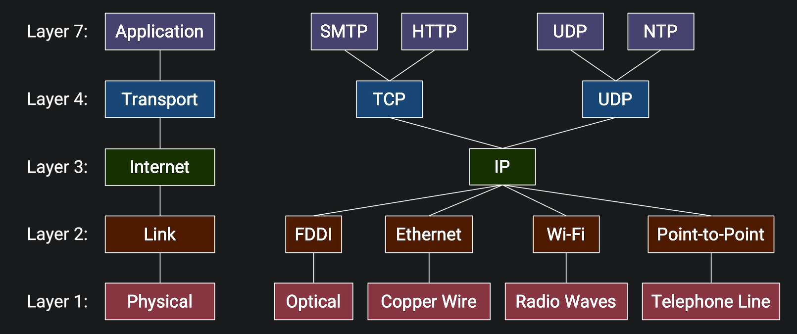
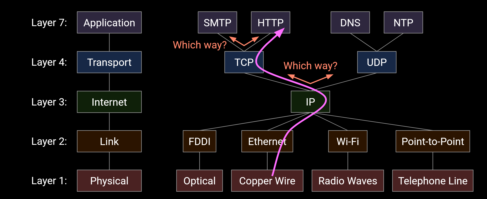
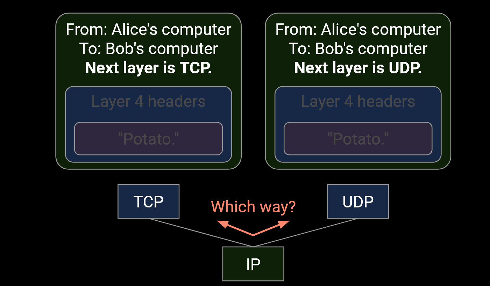
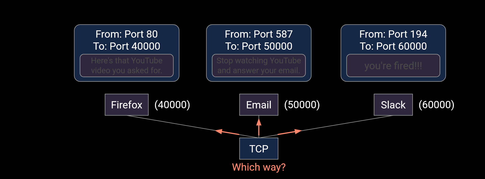
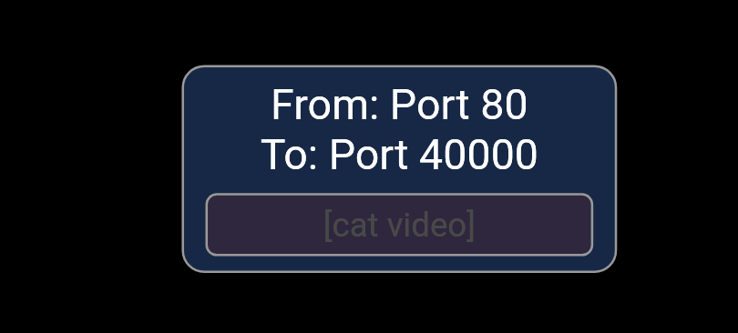
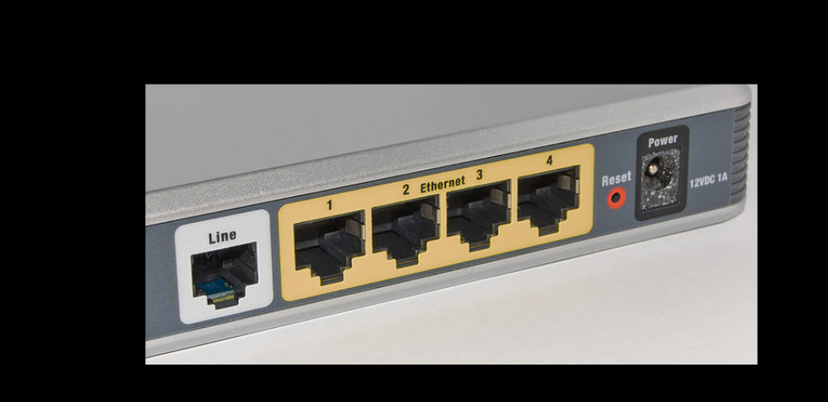
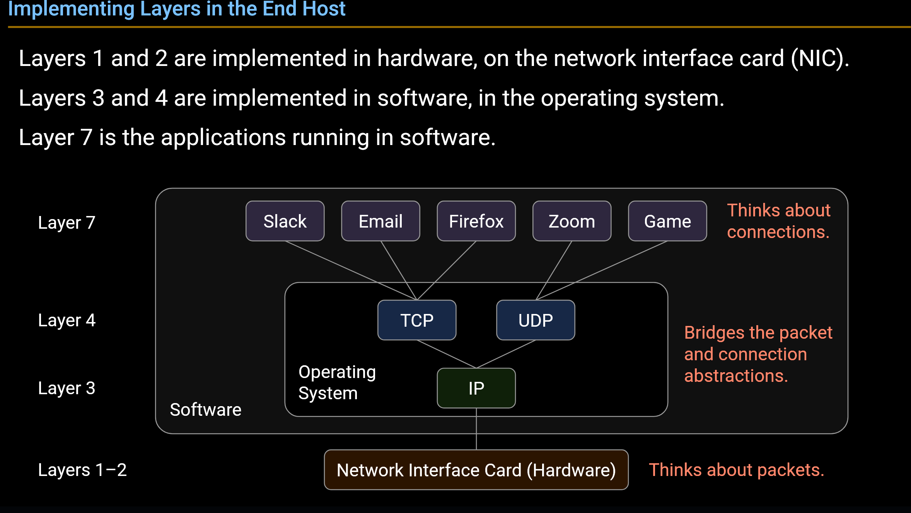
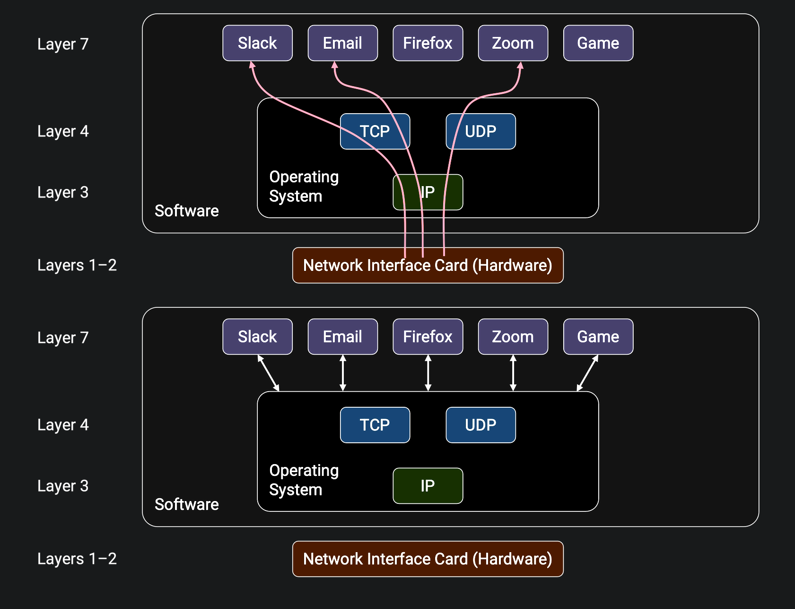
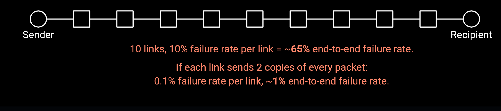

# Design Principles

## Narraw Waist Model

This diagram shows the different components of a network architecture, notice there’s only one protocol at Layer 3. This is the “*narrow waist*” that enables Internet connectivity. 

## Demultiplexing

Think about that when a router receive a packet, how dose it know which protocol to use to process the packet?

The answer can be found in the related header of the packet, which we have discussed in [Multiple Headers](Layers%20of%20the%20Internet.md#Multiple-Headers) section.

This process is called *demultiplexing* (**解复用**).

Demultiplexing can not only use for choosing the protocol to process the packet (works on **L4 - Transport Layer**, we discussed above), but also for choosing the *port* to running some service, which works in **L7 - Application Layer**.

!!! warning "Logical Port vs Physical Port"
    - **Logical Port**: A number identifying an application. Exists in software.

        

    - **Physical port**: The hole you plug a cable into. Exists in hardware.

        

!!! note "socket[^1]"
    The term *socket* (**套接字**) refers to an [OS mechanism](../../OperatingSystem/408/进程的描述与控制.md#套接字) for connecting an application to the networking stack in the OS. When an application opens a socket, that socket is associated with a logical port number. When the OS receives a packet, it uses the port number to direct that packet to the associated socket.

In general, demultiplexing helps the operating system pass packets to the correct application, based on the [Layers Abstraction](Layers%20of%20the%20Internet.md#Layers-of-the-Internet) we've discussed previously.

## End-to-End Principle

In previous discussion, we konw that routers implement L1-L3 only, and end hosts implement Layer 4 (reliability).

Why do we choose this design? The *end-to-end principle* (**端到端原则**) will help us answer these questions.

The end-to-end principle guides the debate about what functionality the network does and doesn’t implement. 

Think about the two designs in the textbook:

> [End-to-End Principle - Network Architecture | CS168 Textbook](https://textbook.cs168.io/intro/architecture.html#end-to-end-principle)

- Solution 1: The end host (Bob) had to trust the network for correctness.

    If the reliability code in the network is buggy, there's nothing Bob can do.

- Solution 2: Bob only had to rely on himself for correctness.

    If the reliability code is buggy, Bob has the power to fix it.

The end-to-end principle is not an unbreakable rule:

- Could implement reliability in the network as a performance optimization.

- Must be done in addition to end-to-end checks, for correctness.

- Need for this must be evaluated on a case-by-case basis.

!!! example "When links are very lossy"
    - Links sending duplicate packets can improve performance for end hosts.

    - Sending duplicate packets is purely for performance, not correctness.
    
    

[^1]: [Demultiplexing - Network Architecture | CS168 Textbook](https://textbook.cs168.io/intro/architecture.html#demultiplexing)