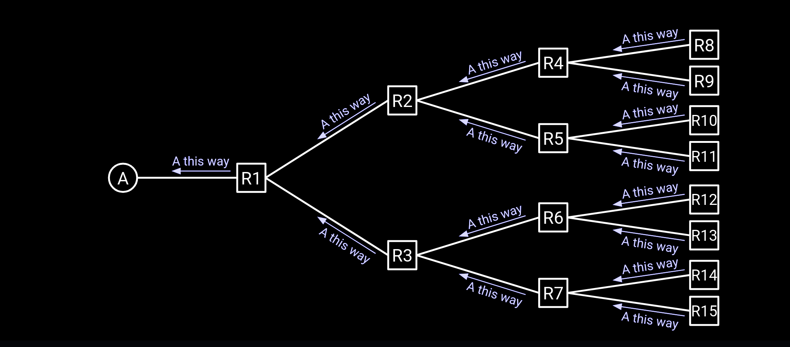
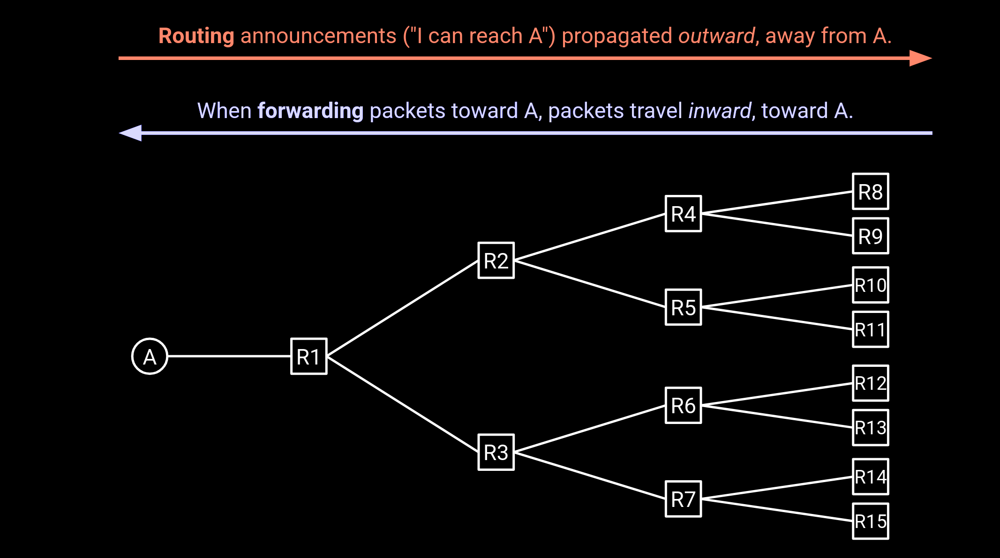

# Distance-Vector Protocols

> [Distance-Vector Protocols | CS168 Textbook](https://textbook.cs168.io/routing/distance-vector.html)

## Algorithm Sketch

To simply, Distance-Vector Protocols can be summarized as: *if you hear about a path to a destination, tell all your neighbors* for each router.

