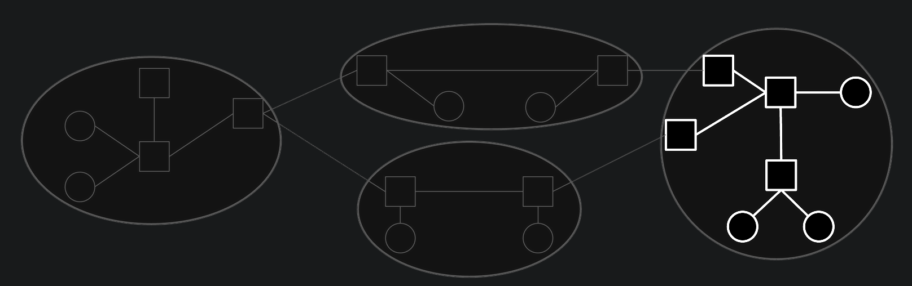
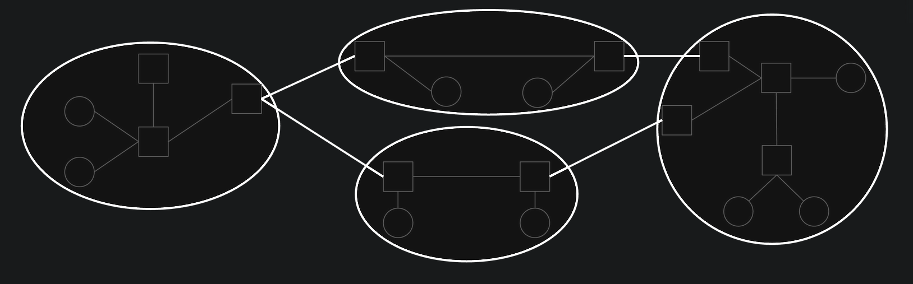

# Introduction to Routing

## What's Routing?

To simply, *routing is the process of finding the best path for a packet to travel from the source to the destination*.

##  Inter-Domain and Intra-Domain Routing[^1]

Because of the scale of the Internet, we can not build a model of the Internet that includes every single machine in the world, and design a single giant routing protocol that will allow us to send packets anywhere in the world.

Consider the fact of the Internet, which is *a collection of many different networks*, in other words, *the Internet consists of many local networks*.

Each local network implements its own routing protocol that specifies how to send packets within just that local network based on there own structure and requirements.

With the network of networks model, we can let individual local networks choose a routing strategy for packets within their network. Each operator can choose the protocol that works best for them.

The protocols for routing packets within a local network are called *intra-domain routing protocols*(域内路由协议), or *interior gateway protocols*(**IGPs**, 内部网关协议). Real-world examples include **OSPF**(*Open Shortest Path First*, 开放最短路径优先) and **IS-IS**(*Intermediate System to Intermediate System*, 中间系统到中间系统).

By contrast, protocols for routing packets across different networks are called *inter-domain routing protocols*(域间路由协议), or *exterior gateway protocols*(**EGPs**, 外部网关协议).

In order to support sending packets across different local networks, every network needs to agree to use the same protocol for routing packets between each other. If different networks used different inter-domain protocols, there’s no guarantee that that the entire Internet could be connected in a consistent way. What if one operator only implemented Protocol X, and another operator only implemented Protocol Y? It’s not clear how these two local networks would be able to exchange messages.

Because every network must agree to use the same inter-domain protocol, there is *only one protocol implemented at scale on the Internet*, namely **BGP**(*Border Gateway Protocol*, 边界网关协议).

!!! tip
    This model of interior and exterior gateway protocols is convenient for intuition, but in practice, there is not always a clear distinction between them. For example, BGP is sometimes also used inside a local network, in addition to between different networks.

Regardless of whether a protocol is deployed internally within a network, or externally between all networks, *we can additionally classify the routing protocol by looking at what the underlying algorithm is doing*.

In particular, we’ll study *distance-vector protocols*(**DVP**, 距离向量协议), *link-state protocols*(**LSP**, 链路状态协议), and *path-vector protocols*(**PVP**, 路径向量协议).

[^1]: [Inter-Domain and Intra-Domain Routing - Introduction to Routing | CS168 Textbook](https://textbook.cs168.io/routing/intro.html#inter-domain-and-intra-domain-routing)