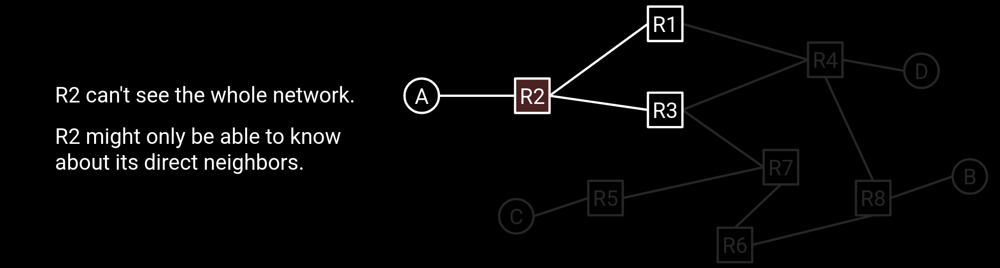

# Introduction to Routing

## Define the Routing Problem

### What's Routing?

To simply, *routing is the process of finding the best path for a packet to travel from the source to the destination*.

### Modeling The Network

#### End Hosts and Routers

There are two types of machine in network:

- *End hosts*: the machines that *send* and *receive* packets.

- *Routers*: the machines that *forward* intermediate packets.

#### Graph

We can model the network as a graph, where the nodes are the end hosts and routers, and the edges are the links between them.

#### Packets

Packets are the basic of data sending across the network. It consists with two sections:

- *Header*: Contains the metadata of the packet(e.g. source address, destination address, etc.).

- *Payload*: Contains the actual data.

### Some Points in Routing

- Network topologies(also consider as a graph) is *constantly changing*.

    - Hosts can be added or removed from the network.

    - Links can fail or be added.

    **It means that our network needs to be rubost to cope with the changes.**

- Routers don't have a global view of the network.

    

    - If there's a fail in link, routers can't notice automatically.

- Routing protocols have to be *distributed*.

    - There's no central mastermind computing the answer.

    - Each router computes its own part of the answer.

    - *Routers must coordinate with each other in the protocol*.

- Links are [best-effort](https://en.wikipedia.org/wiki/Best-effort_delivery). Packets could get dropped.

## Routing Protocols

### Inter-Domain and Intra-Domain Routing[^1]

Consider the fact of the Internet, which is *a collection of many different networks*, in other words, *the Internet consists of many local networks*.

Because of the scale of the Internet, does not have a single giant routing protocol that can be used to route packets anywhere in the world.

With the network of networks model, we can let individual local networks choose a routing strategy for packets within their network. Each operator can choose the protocol that works best for them.

- *Intra-domain routing protocols*(*域内路由协议*) compute routes within a *single network*.

    

    - Sometimes called *Interior Gateway Protocols* (**IGPs**, 内部网关协议).

    - Each network can choose their own intra-domain protocol based on their needs: Networks differ in size(geographic, number of hosts), *Capacity*(bandwidth, latency), *Support*(money, staff), etc.

- *Inter-domain routing protocols*(*域间路由协议*) compute routes between networks.

    

    - Sometimes called *Exterior Gateway Protocols* (**EGPs**, 外部网关协议).

    - *Everybody has to agree on the same protocol*.

    - The Internet has used BGP since the 1990s.

### Routing Protocols Classifying

- Classifying routing protocols by where they operate:

    - Let individual networks choose how to route inside their network -> *Intra-domain*

    - Have all networks agree on how to route between each other -> *Inter-domain*

    !!! tip
        This model of interior and exterior gateway protocols is convenient for intuition, but in practice, there is not always a clear distinction between them. For example, BGP is sometimes also used inside a local network, in addition to between different networks.

- classify routing protocols by how they operate:

    - *Distance-vector protocols* (**DVP**, 距离向量协议)

    - *Path-vector protocols* (**PVP**, 路径向量协议) (An extension to the distance-vector idea)

    - *Link-state protocols* (**LSP**, 链路状态协议)

[^1]: [Inter-Domain and Intra-Domain Routing - Introduction to Routing | CS168 Textbook](https://textbook.cs168.io/routing/intro.html#inter-domain-and-intra-domain-routing)